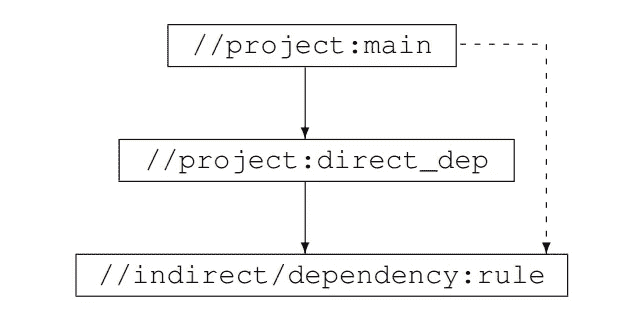

# 文章评论:搜索构建债务体验在谷歌管理技术债务

> 原文：<https://blog.devgenius.io/article-review-searching-for-build-debt-experiences-managing-technical-debt-at-google-7851014563ab?source=collection_archive---------12----------------------->

由 [Unsplash](https://unsplash.com?utm_source=medium&utm_medium=referral) 上的[absolute vision](https://unsplash.com/es/@freegraphictoday?utm_source=medium&utm_medium=referral)拍摄

# 介绍

谷歌是世界上最成功的公司之一，它的成功部分是基于它如何很好地利用其资源。在这篇文章评论中，我们将看到“搜索构建债务:在谷歌管理技术债务的经验”一文，作者在文中对他们在谷歌管理技术债务(更具体地说是构建债务)的研究中获得的经验、实践和教训进行了深入分析。我们将讨论这篇文章的发现和意义，以及它对其他组织的意义。

# 什么是技术债？

技术债务是开发软件时与走捷径相关的成本。当开发人员急于满足最后期限时，或者当他们为了在短期内节省时间而做出可能导致长期问题的决策时，这些债务就会积累起来。作者指出，技术债务是“跨组织的普遍挑战”，并且是软件开发过程中的“必要之恶”。

# 什么是构建债务？

在 Google 构建软件的规范被封装在构建文件中。构建文件定义代码模块(在库或二进制级别)，列出模块使用的源文件和依赖库，并包括有关构建项目的附加元数据。它们是手动维护的，这意味着随着时间的推移，这些文件可能会偏离构建、测试和执行软件的实际依赖关系。这些构建文件会导致一些其他问题，我们将进一步讨论这些问题。

# 谷歌“举债”的方法

1.  自动化。只要有可能，修复必须是自动化的
2.  让做正确的事情变得容易。分析编辑、浏览或代码审查过程中的变化，以防止某些类型的债务
3.  让做错事变得困难。《出埃及记》防止人们获得不为他人所用的依赖。在编译过程中建立更严格的检查，使它们成为编译时错误

该团队在谷歌没有任何软件或库。所以他们的解决方案是独立于领域的。

# 依赖债务

我们这里有 3 个主要关键词:

1.  过度声明的依赖项。这些是您不需要或不使用的依赖项。
2.  未充分利用的依赖关系。这些是你很少用的。
3.  未声明的依赖项。您正在使用其他依赖项来使用这些依赖项。

让我们再多看看第三个。所以，你的项目名是 A，它依赖于 B and B，依赖于 C。你使用的是 C 中的一个类，但你是从项目 b 中导入的

总有一天，项目 B 要依赖项目 C，你的项目就建不起来了！这使得你的项目更加脆弱。

目标依赖关系

# 解决抚养债务

首先，我们需要开始寻找声明不足的依赖项，并将它们添加为直接依赖项。在本文中，作者使用 javac 编译器通过获取加载类的类路径找到了这些依赖关系。

第二，我们将找到在第一步之后更容易找到的未使用的依赖项。

最后，我们需要找到并消除未被充分利用的依赖项，但是我们不能自动做到这一点，因为一般来说，解决方案是将目标库划分成更小的库。为了解决这个问题，作者创造了一个叫做 Clipper 的工具。

# 快速帆船

Clipper 是一个依赖重构助手。它查看依赖关系图，并建议可能成为良好清理候选对象的特定依赖关系。它使用一种排序算法来决定哪种依赖关系比其他的更容易。这些因素是:

1.  目标定义的符号数量:在目标系统或代码库中定义的符号(例如，变量、函数、类)越多，重构它所需的工作就越多。
2.  目标的依赖关系的传递闭包中的累积符号数:这是指由目标的依赖关系定义的符号数，以及那些依赖关系的依赖关系，等等。传递闭包中的符号越多，重构工作就可能越复杂。
3.  符号的利用:如果目标及其依赖项定义的符号在代码库中被大量使用，那么在不破坏系统的情况下重构它们可能会更加困难。
4.  依赖关系接近度或深度:这是指目标和它的依赖关系之间的“跳”或中间依赖关系的数量。跳跃点越多，重构工作可能就越复杂。
5.  依赖关系互连性或密度:这是指导致依赖关系的路径总数。如果有许多路径通向一个依赖项，那么在不影响系统其余部分的情况下重构依赖项可能会更加困难。

# 僵尸目标

谷歌代码中的一些项目可以被放弃，被遗忘。但即使是这些项目，每个人都可以使用。当这些项目被活动的项目使用时，大多数时候工程师不得不修复无人维护的项目中的错误。为了找到这些僵尸目标，谷歌使用一个系统来寻找:

1.  上次成功构建此目标是什么时候
2.  上一次有人试图建立这个目标是什么时候

如果一个目标在至少 90 天内构建失败，它将被声明为死亡，并从代码库中删除。

# 能见度债务

当您可以查看所有其他项目并将它们用作依赖项时，您可以依赖于一个尚未准备好共享或不打算与其他人共享的项目。如果一个项目依赖于你的项目，你不打破他们那边的东西，你是不会知道的。为了解决这个问题，团队决定将所有新项目的默认可见性设为私有，将所有旧项目的可见性设为“遗留公共”。如果一个团队想要使用另一个团队的代码，他们需要讨论并就 API 是否准备好共享以及在什么条件下共享达成一致。

这在谷歌内部引起了很大的轰动！“这不是谷歌的风格，”他们说。“这将导致大量代码重复，”他们说。“这将导致大范围的建筑损坏，”他们说。但这些都没有发生，他们以最小的戏剧性改变了能见度系统。

有趣的事实:尽管有新的默认设置，但近一半的新文件开始时是公开可见的，这提醒了谷歌对开放的态度。

> *经验教训:任何变革总是会遭到某些人的反对，在一个大型组织中，重要的是要有一个独立的团队，该团队有权根据全球成本效益分析做出决策。*
> 
> *—作者*

# 死旗

你知道，当你从终端使用 CLI 应用程序时，你使用的选项？当您想要使您的库更加可定制、测试某些东西或进行实验时，您可以添加一些标志。这会导致死代码被添加到库中，这些选项会保护它。有些标志可以删除，有些可以用常量替换。作者组织了一个修复日，工程师们从代码库中移除了 2300 个标志。结果，272，000 行代码也被删除了！

# 结论

构建债务降低了工程师生产率，导致构建速度变慢，项目更加脆弱，以及维护损坏的库。它还增加了构建、运行和测试项目的成本。

文章的最后建议是:

1.  由于许多工程师反对解决技术债务，因为这可能会降低他们的速度或导致代码重复，因此优先考虑和管理它不能总是留给单个团队。
2.  随着代码库规模的增加，从技术债务中恢复的成本会非线性增加。因此，尽早关注这些债务并投资于工具、政策和流程是至关重要的，这些工具、政策和流程使组织意识到债务，并使其易于作为每个工程师的常规工作流程的一部分不断偿还/避免债务。

# 参考

原文：<https://research.google/pubs/pub37755/>