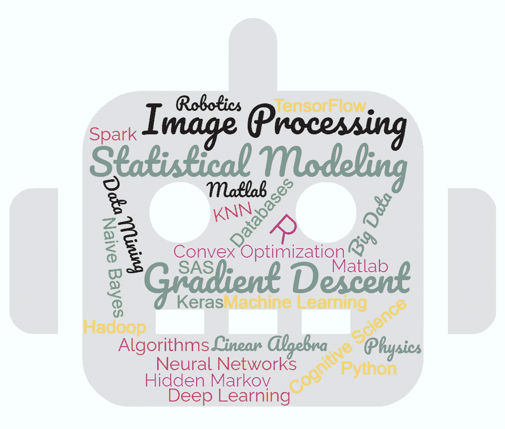
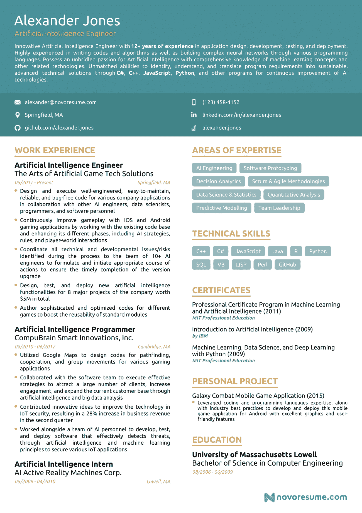
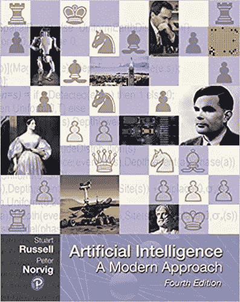
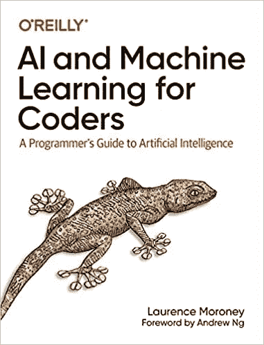
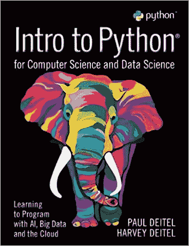
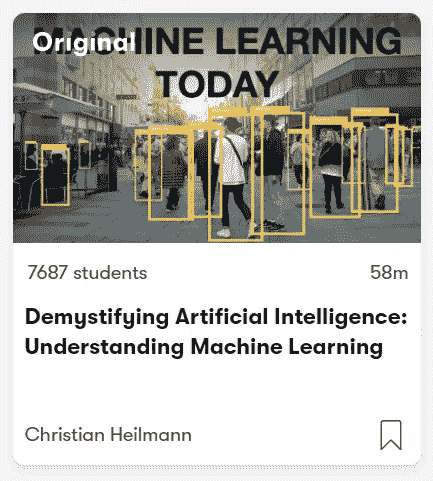
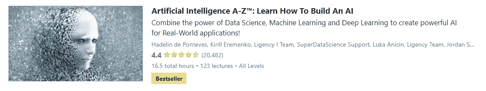

# 人工智能(AI)开发者职业道路

> 原文：<https://blog.devgenius.io/artificial-intelligence-ai-developer-career-path-e5e60eb85f9c?source=collection_archive---------7----------------------->

## 我将带你了解成为一名人工智能开发者所需要知道的一切。

人工智能(AI)开发者职业道路

# 谁是 AI 开发者？

人工智能工程师构建、测试和部署人工智能模型，并维护底层人工智能基础设施。人工智能程序员帮助开发可用于机器人、人工智能程序或其他人工智能应用程序的操作软件。他们可能与电气工程师或机器人工程师和其他人密切合作，以生产利用人工智能的系统。自动化、机器人以及复杂计算机软件和程序的使用是人工智能(AI)职业的特征。有意从事该领域工作的候选人需要基于数学、技术、逻辑和工程观点的特定教育。

人工智能是一个非常通用的术语，它与许多其他领域有着密切的关系。以下是一些与人工智能专业知识相关的工作:

*   **数据科学家**负责通过利用机器学习和预测分析来收集、分析和解释大型复杂数据集。他们还在开发能够收集和清理数据以进行分析的算法方面发挥着至关重要的作用。
*   **商业智能开发人员**通常负责设计、建模和维护高度可访问的基于云的数据平台中的复杂数据。
*   **机器学习工程师**严重依赖**解析大量数据并从这些数据中学习的算法**，而不是传统意义上的编程——也就是说，不依赖于一系列步骤，而是从输入机器学习算法的数据中学习。
*   **大数据工程师**和架构师在开发生态系统方面发挥着至关重要的作用，这种生态系统能够使业务系统相互通信并整理数据
*   **自然语言处理(NLP)工程师**专注于提高人类和计算机/机器交流的能力。目标是改善机器响应人类声音或命令的方式。
*   **图像处理工程师**尝试开发算法，让机器和机器人可以分析他们看到的东西，并做出相应的反应。

# 你可以在招聘网站上使用一些关键词来找到相关的工作

*   人工智能(AI)开发人员/工程师/专家
*   机器学习(ML)开发人员/工程师/专家
*   数据科学家
*   NLP 工程师
*   数据挖掘专家
*   大数据开发者
*   机器人工程师
*   神经网络专家
*   元宇宙专家
*   AR/VR 开发者
*   深度学习工程师
*   统计员+AI 开发者
*   软件分析师和开发人员
*   算法专家

# 公司对人工智能开发人员的常见任务和期望

*   测试和部署模型
*   基于 ML/AI 模型开发最小可行产品
*   利用 ML/AI 模型实现流程自动化
*   机器学习算法的研究改进
*   数据挖掘
*   模式识别/匹配
*   为特定领域的任务(图像识别、物体检测、生物信息学、自动驾驶汽车等)训练基于机器学习的软件
*   建立和管理我们的人工智能开发和生产基础设施。
*   将人工智能模型部署到生产中。
*   将机器学习模型转换成应用程序接口(API ),以便其他应用程序可以使用
*   设计/测试/部署人工智能相关软件
*   创建和部署人工智能算法
*   为数据科学构建基础设施
*   分析/可视化数据

# 成为人工智能开发者所需的技能视频。

## 基础

*   编程；编排
*   数据库
*   统计数字
*   数学(代数、微积分等。)
*   物理学
*   算法
*   数据结构

## 先进的

*   贝叶斯网络或图形建模，包括神经网络
*   机器人学
*   机器学习模型(线性回归、KNN、朴素贝叶斯、支持向量机、
*   深度学习算法(卷积神经网络、递归神经网络、生成对抗网络等。)
*   数据挖掘
*   自然语言处理
*   神经网络
*   认知科学理论
*   高级算法(梯度下降，凸优化，拉格朗日，二次规划，偏微分方程，求和等。)
*   线性代数和概率
*   人工智能模型——如隐马尔可夫模型、朴素贝叶斯、高斯混合模型和线性判别分析

## 推荐技能

*   基于统计的编程语言，如 Python、R、SAS 或 MatLab。
*   人工智能建模平台，如 Keras、TensorFlow 或 Theano。
*   大数据工具和框架，如 Apache Spark、Hadoop、Cassandra 和 MongoDB。

# 推荐认证

*   [牛津人工智能认证](https://oxford-onlineprogrammes.getsmarter.com/presentations/lp/oxford-artificial-intelligence-programme/?cid=15279691605&utm_contentid=562092832768&ef_id=c:562092832768_d:c_n:g_ti:kwd-377715717023_p:_k:ai%20certificate_m:p_a:132808167754&gclid=CjwKCAjwxOCRBhA8EiwA0X8hi0Ts0tCGauOo6g4xayXNdD2msge-7LiPodp-GDOAl1TYI4WcsPGjJRoCYIUQAvD_BwE&gclsrc=aw.ds)
*   [微软认证:Azure AI 工程师助理](https://docs.microsoft.com/en-us/learn/certifications/azure-ai-engineer/?tab=tab-learning-paths)
*   [AWS 认证机器学习—专业](https://aws.amazon.com/certification/certified-machine-learning-specialty/)

# AI 开发人员简历示例

简历摘自[novoresume.com](https://novoresume.com/career-blog/artificial-intelligence-engineer-resume)

# 推荐书籍

## #1 —人工智能:现代方法(人工智能中的皮尔逊系列)

> 期待已久的*人工智能修订版:现代方法*探索了人工智能(AI)领域的全部广度和深度。第四版为读者带来了最新技术的最新动态，以更统一的方式介绍了概念，并提供了机器学习，深度学习，转移学习，多智能体系统，机器人，自然语言处理，因果关系，概率编程，隐私，公平和安全人工智能的新的或扩展的覆盖范围。

## # 2——程序员的人工智能和机器学习:人工智能程序员指南

> 如果你想从程序员转向人工智能专家，这是一个理想的起点。基于劳伦斯·莫罗尼极其成功的人工智能课程，这本介绍性的书提供了一种实践的、代码优先的方法来帮助你在学习关键主题时建立信心。您将了解如何实现机器学习中最常见的场景，如计算机视觉、自然语言处理(NLP)以及 web、移动、云和嵌入式运行时的序列建模。大多数关于机器学习的书籍都是从数量惊人的高等数学开始的。本指南建立在让您直接使用代码的实践经验的基础上。

## # 3——计算机科学和数据科学 Python 简介:学习用人工智能、大数据和云编程

> Deitels 的*计算机科学和数据科学 Python 入门:学习用人工智能、大数据和云编程*提供了一种独特的讲授入门 Python 编程的方法，适合计算机科学和数据科学的观众。提供最新的主题和应用的报道，这本书配有广泛的传统补充以及 Jupyter 笔记本补充。真实世界的数据集和人工智能技术使学生能够从事对商业、工业、政府和学术界产生影响的项目。数百个示例、练习、项目(eep)和实现案例研究为学生提供了一个引人入胜、富有挑战性和娱乐性的 Python 编程和动手数据科学介绍。

# 推荐课程

[**#1 —揭秘人工智能:理解机器学习(Skillshare)**](https://www.skillshare.com/classes/Demystifying-Artificial-Intelligence-Understanding-Machine-Learning/949463693?via=search-layout-grid)

> 从我们如何使用它到它在未来的发展方向，你将了解机器如何处理我们的数据，发现模式，并使我们的生活变得更加轻松。通过关注机器学习如何为人类界面提供动力并简化我们与技术的交互，课程为开发人员、设计人员和好奇者提供了工具和提示。

[**# 2—AI For every one(Coursera)**](https://www.coursera.org/learn/ai-for-everyone)

> 在本课程中，您将学习:—常见人工智能术语背后的含义，包括神经网络、机器学习、深度学习和数据科学——人工智能实际上可以做什么——不能做什么——如何发现将人工智能应用于您自己组织中的问题的机会——构建机器学习和数据科学项目是什么感觉——如何与人工智能团队合作并在您的公司中建立人工智能战略——如何引导围绕人工智能的道德和社会讨论？

[**# 3——人工智能 A-Z:学习如何构建一个 AI (Udemy)**](https://www.udemy.com/course/artificial-intelligence-az/)

你会学到什么？构建人工智能，了解人工智能背后的理论，制造虚拟自动驾驶汽车，制造人工智能来击败游戏，用人工智能解决现实世界的问题，掌握最先进的人工智能模型，Q 学习，深度 Q 学习，深度卷积 Q 学习，A3C

# 其他有用的资源

🤖 [Python 论坛](https://www.python.org/community/forums/)

🦄 [R 论坛](https://r-dir.com/community/forums.html)

🐉[科技日报 AI 新闻](https://www.sciencedaily.com/news/computers_math/artificial_intelligence/)

如果 *你喜欢这个内容并且觉得很慷慨，请考虑通过向我的 ETH 钱包捐款来支持我:*

***0x 1779 c 21 f 79d 3 f1 e 63960990818 b5 BF 03 e 89 CBF Fe***

如果 *以后有兴趣看我的类似帖子，请考虑与我的* [***推荐链接***](https://ehsan-yazdanparast.medium.com/membership) *一起加入 medium。如果你注册使用我的链接，我会赚一小笔佣金，你可以无限制地访问所有媒体作者的内容。这样你就在平台上支持我和你其他喜欢的作家了。谢了。*

 [## 移动开发人员职业道路

### 我将带你了解成为一名移动开发者所需要知道的一切。

medium.com](https://medium.com/geekculture/mobile-developer-career-path-ed9f0620998a)  [## 数据科学家职业道路

### 我将带您了解成为数据科学家所需的所有知识。

medium.com](https://medium.com/geekculture/data-scientist-career-path-d49fb0f266a9)