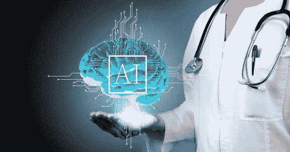

# 医疗保健中的人工智能在癌症康复中发挥着至关重要的作用

> 原文：<https://blog.devgenius.io/artificial-intelligence-in-healthcare-plays-a-vital-role-in-rehabilitating-cancer-d7284b49988?source=collection_archive---------10----------------------->

**人工智能和医疗保健**

[**【艾】**](https://prisma.ai/wireless-and-contactless-solutions.html) 从卑微的出身到现在已经走过了很长的路。随着人工智能系统和机器学习的高级发展，该技术更重要的医疗应用正在出现。据 Cloud wedge 报道，加州大学洛杉矶分校研究人员最近开发的人工智能系统 Focal Net 可以帮助放射科医生和肿瘤专家诊断前列腺癌。

根据英国癌症研究杂志，2018 年全球诊断出超过 1700 万例癌症病例。同一项研究表明，到 2040 年，每年将有 2750 万新的癌症病例被诊断出来。

尽管这些最近的统计数据似乎令人沮丧，但如果我们比较诊断和治疗数据，患者的结果与几十年前相比有了显著改善——在 20 世纪 70 年代，不到四分之一的癌症患者存活下来。 [**AI**](https://prisma.ai/wireless-and-contactless-solutions.html) 是那个进程的一部分。

**AI 是如何工作的？**

神经网络是人工智能的最基本形式。 [**机器学习**](https://prisma.ai/index.html) 是人工智能的一个分支，专注于教会机器更好地迭代完成任务。通过开发可以帮助系统自动确定哪里是对的哪里是错的算法，系统理论上可以在短时间内学习几代人的数据。尽管这项技术在理论上是可靠的，并且使用了可以识别行为和模式的复杂算法，但人工智能 [**技术**](https://prisma.ai/prisma-solutions.html) 直到最近才能够提供人类般的洞察力和决心，使其在医疗领域取得成功。

[**艾在癌症康复中起着至关重要的作用**](https://www.cancer.gov/research/areas/diagnosis/artificial-intelligence)

《自然》杂志报道称，纽约基因组中心依靠一种独特的软件来筛查患者的胶质母细胞瘤——这是一种由 IBM 开发的人工智能系统，名为 Watson。沃森在 2011 年因其在电视游戏节目中的出色表现而成名，但人工智能现在正被用于辅助诊断领域。然而，该系统仍然需要更多的数据来训练，以适当地发挥作用，到目前为止，人工智能还不能教会自己什么是正确的，什么是错误的。IBM 的 Watson 的目标是能够阅读患者文件，然后访问所需的相关信息，以给出最准确的诊断和治疗计划。
**像人一样学习** 虽然它有能力理解语言的含义，并可以通过机器学习自行发展，但在作为有效的助手引入现实世界之前，沃森还有一段路要走。但即使在今天，人工智能也在人类的帮助下，在一些专门的医疗任务中显示出了潜力。根据西北大学最近的一项研究，AI 在癌症筛查方面可以胜过放射科医生，特别是在肺癌患者中。结果显示，使用人工智能将误报率降低了 11%。医疗领域可能离拥有自己训练有素的人工智能来提供正确的诊断不远了。这完全取决于人工智能技术进步的速度，以及它能多快学会像人类医生一样进行诊断。