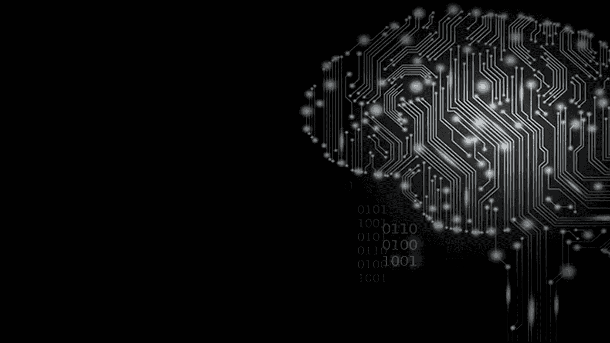

# 人工智能不是编程，是数学

> 原文：<https://blog.devgenius.io/artificial-intelligence-is-not-programming-its-mathematics-b64faf6f7ab8?source=collection_archive---------5----------------------->

***人工智能模型也是这么说的。***

在计算机科学家关注这个话题之前，人工智能只被少数数学家关注。随着时间的推移，一群计算机科学家接管了这项技术，如今，通过编程，这项技术变得非常强大。因此，许多工程师涌入这个领域，它成为工程师的工作。所以，除了计算机科学家和工程师，很多人都回避这个领域。我们来深入探讨一下为什么 AI 完全基于数学的细节。

## 像区块链和其他技术一样，人工智能是研究的结果

数学家们总是在寻找创造新理论的机会。因此，许多多产的数学家在不同的领域表现出色，为我们的现代社会做出了贡献。但是一位俄罗斯数学家通过统计学的深远发展为人工智能铺平了道路。他叫安德烈·马尔科夫。虽然有许多关于动物行为和决策的问题，但 Markov 已经发现了各种模型，如果技术变得真正先进，就可以使用这些模型。因此，马尔可夫模型已经被用于几乎所有的人工智能领域。并且需要学习这些技术背后的数学，才能完全理解这项技术。

## 这些需要在电脑上创建的模型呢？这是工程师的工作吗？

你需要编程来为人工智能建立和实现所有这些统计模型。但是，这里有一个调整:这些模型必须被理解为对正在发生的事情有意义的输入？否则，模型只能被解释为代码，工程师无法获得任何结果。简而言之，数学概念应该是已知的，以产生有意义的输出。

## 我是如何设法认识到人工智能是数学的？

我上了几堂统计学课才意识到这是事实。尤其是我的教授帮助我理解了这些现代技术的背后是什么。艾也不例外。这一刻我意识到我无法逃避任何与数学有关的事情。尽管我在学习，热情还是跟着我。因此，我进一步研究了统计学、数学以及这些学科背后的所有编程概念。

最后，我意识到在技术方面需要像瑞士军刀一样。统计数据仍然帮助我认识到这在编程中是可能的。所以，我设法帮助了我想学习数据科学工具的朋友。尽管如此，它们包括人工智能算法。我告诉他，我们需要大量的统计学课程来理解这些原理。所以，我们在不同的科目上互相帮助，帮助我们成长。

*人工智能是否以数学为基础？人工智能是否包含数学、统计、编程之外的其他东西？在下面的评论区分享你的想法和经历。*