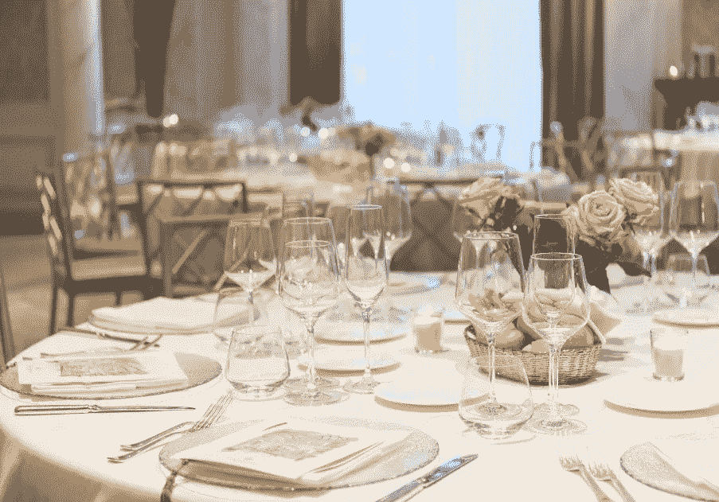
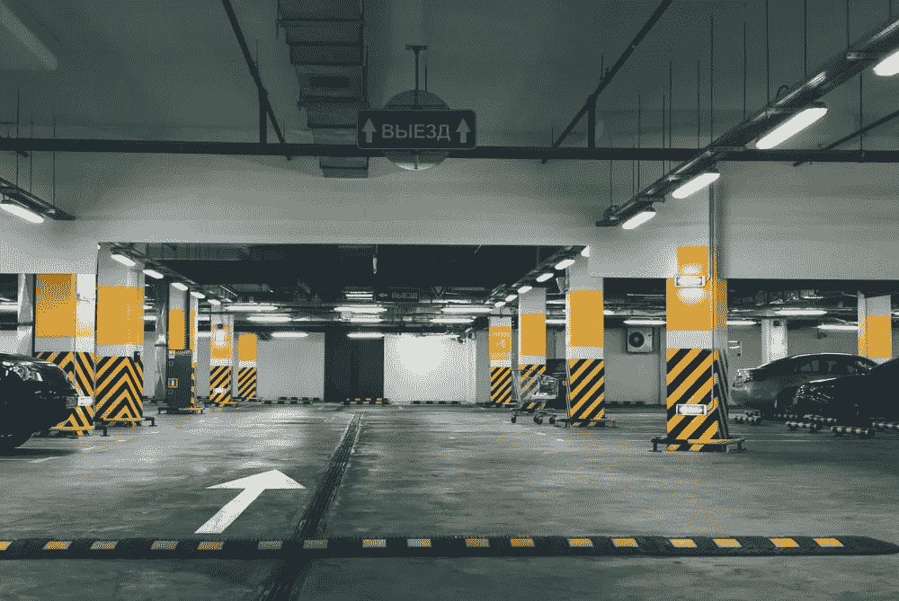
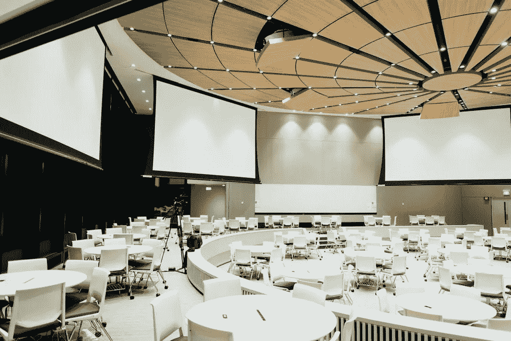

# 人工智能让事件变得更好

> 原文：<https://blog.devgenius.io/artificial-intelligence-makes-events-better-82c622d4badb?source=collection_archive---------20----------------------->

# **当事情变得有趣时**

曾经，活动是大群人聚会的一种方式，无论是为了一些研讨会，还是一些有趣的活动，如动漫展、展览等。活动是一种聚会的方式。然而，最近的疫情，暂时禁止公众集会，以及当今世界快速增长的需求并没有帮助事情，因为活动管理行业作为一个整体正在努力跟上，也增加了活动的吸引力。

**用人工智能给事件添加生命**

在人工智能的帮助下，事件可以重新活跃起来。人工智能就是这样一种工具，它可以为任何过时的东西添加新的生命，并大大增加其吸引力。因为赛事需要更好的管理以及对其管理流程进行一些急需的改进。 [Prisma AI](https://prisma.ai/) 提出了赛事解决方案，可以帮助缓解赛事面临的问题:

**智能管理**

热温度探测器和智能前台可以帮助管理活动中的参观者，自动检查他们的温度，并报告任何异常情况。此外，智能前台有助于无接触援助以及必要的消毒协议的执行。

**智能停车管理系统**

一个强大的自动停车系统，处理任何事件的参与者所面临的最恼人的问题之一；停车。与会者长途跋涉数小时，结果却没有停车位和其他类似的麻烦。该系统消除了所有与会者的共同不满，并使寻找停车位的过程成为一项琐碎的任务。

**身体行为分析&监视**

身体行为分析引擎能够识别任何人的动作，并报告任何可疑个人的任何高度可疑的行为。这是一种适当的安全措施，可以防范房屋内的任何可疑人员。

# 人工智能事件的未来

随着人工智能的应用，整个事件在未来有很大的发展空间。有许多方法可以改进事件的功能和过程。有许多可能性来增强事件，使它们达到当前水平，并帮助它们所需的过程。在人工智能的帮助下，事件的管理可以成为一项相当琐碎的任务。

