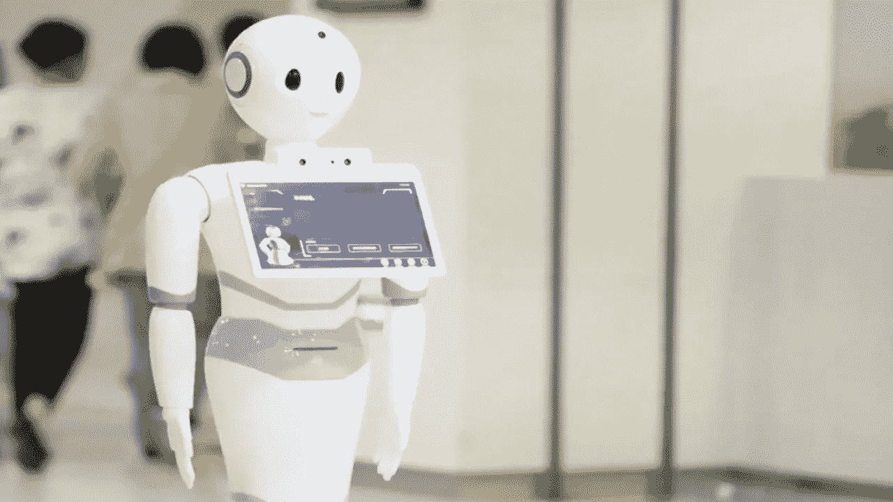
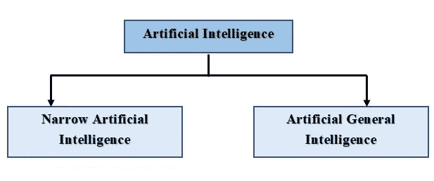

# 人工智能和技术

> 原文：<https://blog.devgenius.io/artificial-intelligence-technologies-ab560086c89f?source=collection_archive---------20----------------------->

在我们研究与人工智能相关的技术之前，让我们了解一下人工智能(AI)的含义及其起源。

> ***“人工智能可以定义为机器对人类智能的刺激，使其像人类一样行动和思考。”***

因此，人工智能可以被描述为使计算机、机器人或任何设备能够像人类一样智能地思考和行动的方法。这是一项关于人脑如何工作、思考、学习、决策等的研究。人工智能旨在将这些机器提高到人类的水平，涉及人类知识相关的功能，如上述思维、推理和决策能力。

> ***“人类的智能是由推理、学习、解决问题、语言智能和感知构成的。”***

推理是从一个事件中得出推论的过程。学习可以被定义为对以前发生的问题有一个解决方案的过程。可以用试错法来做。问题解决可以被定义为选择一个行动来达成解决方案的过程。感知是对环境的理解。语言智能是一种语言能力。开发 AI 的目的就是将这些机器发展到能够凭借上述思维、推理和决策能力，自行执行一项行为的水平。因此，这些由人工智能组成的机器可以用来做人类必须做的事情。

“人工智能”一词最早出现在 20 世纪 50 年代末。这发生在 1956 年约翰·麦卡锡和他的团队对人工智能的研究上。1958 年，麦卡锡开发了一种人工智能编程语言，到 1963 年，麦卡锡拥有了一个实验室，用于研究人工智能。到了 1990 年，各国在开发人工智能技术上的投入更多。从那时起，有了许多突破性的发现，人工智能技术已经大踏步发展到现在的状态。

人工智能主要可以分为两大类，分别是**狭义人工智能**(弱 AI)和**人工广义智能**。(强 AI)现在，我们来看看那些。

狭义人工智能是对人类智能的模拟，同时在有限的环境水平上操作，如仅执行单一任务。自动驾驶汽车、垃圾邮件过滤器和面部识别工具是狭义人工智能的一些例子，也称为“弱人工智能”。

人工通用智能也被称为“强 AI”。它是利用机器人等能够自主行动的机器来解决问题。这是人工智能更高级的范畴。世界正随着技术的发展从狭义人工智能走向人工广义智能。

人工智能由各种技术的集合组成。这些人工智能技术中的每一种都用于完成或执行特定的任务，这些任务因不同的用途和目的而彼此不同。让我们来看看它们。

## 1.语音识别

语音识别是用于识别口语中的单词或短语并将其转换为机器可读语言的技术。随着智能手机的使用，这项技术目前非常普遍。苹果 Siri 是人工智能中使用语音识别技术的一个常见例子。

## 2.机器学习

机器学习是用于向机器提供智能能力的技术。这包括思考、推理和自主学习。这是人工智能使用的主要技术之一。目前，机器学习通常用于基于企业的应用程序，如谷歌、亚马逊和易贝。机器学习是人工智能中最重要的技术之一。

## 3.文本分析和自然语言处理

自然语言处理是人工智能中使用的一种技术，用于帮助机器理解人类语言并对其进行操作。这项技术目前也普遍用于基于企业的应用程序，如谷歌、亚马逊和易贝。这项技术用于安全系统和欺诈检测。此外，随着智能手机的使用越来越多，自然语言处理在移动应用中的使用越来越频繁。

## 4.神经网络

神经网络是一种用于人工智能的技术，它复制了人脑的工作方式。它允许机器像人类一样从经验中学习。这项技术通常用于自动车辆和欺诈检测活动。神经网络是人工智能中的另一项重要技术。

## 5.深度学习

深度学习是机器学习的一部分。它复制了人类获取知识的方式。深度学习主要用于决策和识别模式的数据分析和统计计算。深度学习是人工智能中的另一项主要技术，在现代世界中经常使用。图像识别是深度学习技术的一部分。深度学习目前主要用于模式识别。

## 6.计算机视觉

计算机视觉是用于训练机器分析和识别数字图像和视频中的对象的技术。脸书上使用的面部识别功能是使用计算机视觉技术的一个例子。计算机视觉也是人工智能下的一项技术，对未来的现代世界变得非常重要。

## 7.虚拟代理

虚拟代理是一种程序或计算机代理，具有与人类有效交互和通信的能力。这项技术目前普遍用于企业网站和使用聊天机器人的应用程序中。这些聊天机器人用于与客户互动，并有效地沟通以解决问题。

## 8.人工智能优化的硬件

人工智能优化的硬件是现代世界最大的趋势之一。随着技术的发展，设备已经被构造和开发为使用人工智能来更好和有效地执行特定任务。人工智能优化的硅芯片就是使用这种技术的一个例子。这项技术通常用于计算机硬件，以提高计算机的性能。英特尔、谷歌和英伟达是一些使用人工智能优化硬件技术的现代公司。

观看以下视频了解更多关于这个话题的信息。

你对此有什么想法？如果你有任何问题或其他事实，请在下面评论。敬请关注下一篇文章。

*业务查询，可以在这里* ***找我* [***。***](https://linktr.ee/Chamod_Kavishka)**