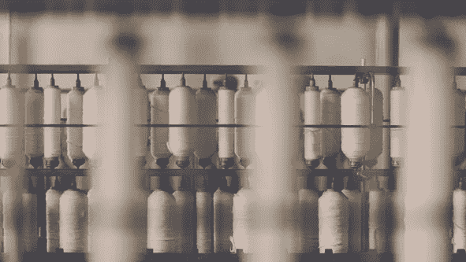

# 人工智能如何改变纺织行业

> 原文：<https://blog.devgenius.io/artificial-intelligence-transforming-textiles-f67c730336f8?source=collection_archive---------5----------------------->

# **AI 纺织行业的新需求**

传统的纺织工业已经服务了很多年。从古至今，纺织工业一直负责提供织物、纤维和成品服装，例如我们今天穿的现代化服装，以及其他许多东西。然而，传统系统现在已经落后了，纺织行业的现代需求和期望，如对健身追踪器和可穿戴技术、智能面料和智能服装等产品的需求，都无法与过时的技术相匹配或满足。

因此，对高质量产品日益增长的需求导致自动化和人工智能成为现代化和升级所必需的。正如大多数今天已经升级的传统系统一样，人工智能是改进的关键技术。

# 人工智能在纺织工业中的应用

纺织行业可以利用自动化和人工智能来降低劳动力和制造成本，并根据客户的需求交付产品。人工智能和物联网(IoT)等新技术的兴起可以改变和升级曾经是劳动密集型的纺织行业。在大多数纺织工业中，现在已经有了计算机化的机器，大规模生产特定的设计比人工生产效率高得多。

人工智能可以实时访问运营信息的记录，以提供可以提高运营效率的见解。其他一些提高行业和制造过程生活质量的应用包括纺织品生产中的故障检测、图案检查和配色。

由于人工智能在纺织行业的应用，另一个新的可能性是智能服装或“智能服装”，它们使用 IOT 和电子传感器，从而通过利用这些技术提供更舒适的健康体验。[人工神经网络(ANN)](https://prisma.ai/) 技术使得在编织和针织等模型中发现缺陷变得更加容易。

机器学习也使得更客观地对面料进行分级并产生更一致的结果成为可能。人工智能受益于细纤维、实心纤维和人造短纤维的长度，这些长度是使用人工神经网络精确确定的。

# **纺织品的未来**

随着新技术、创新和快速变化的不断涌入，纺织技术的未来将会发生巨大的变化。纺织业就是这样一个行业，在这个行业中，各种各样的技术可以被应用于先进的工艺，并提供全新的服装、织物和纤维品种。

