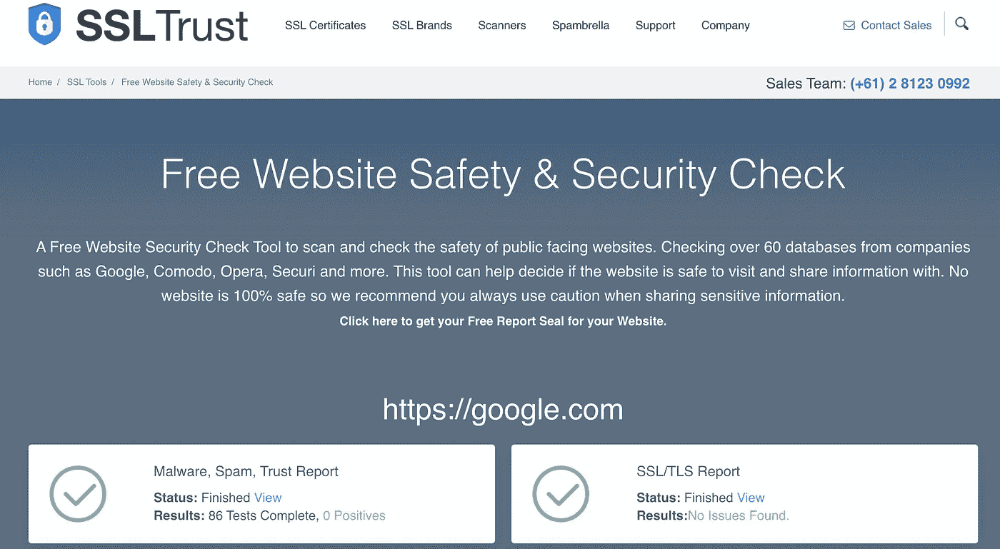
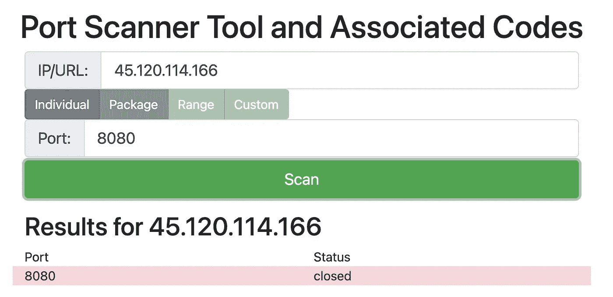
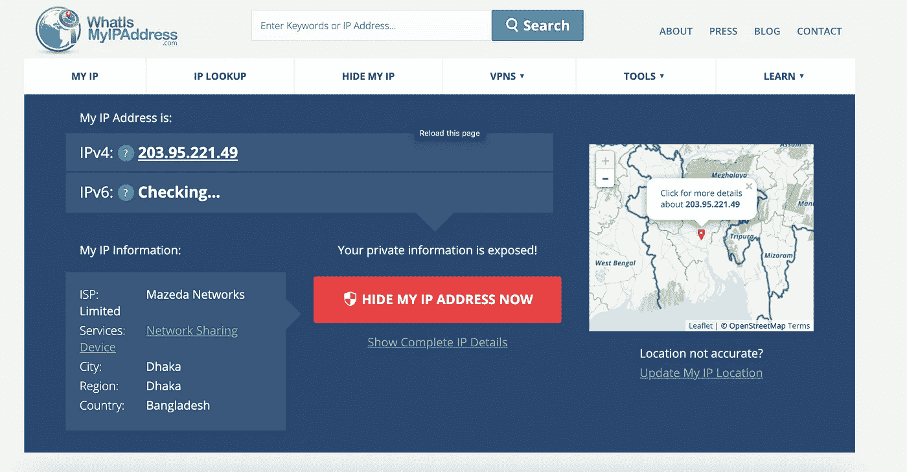
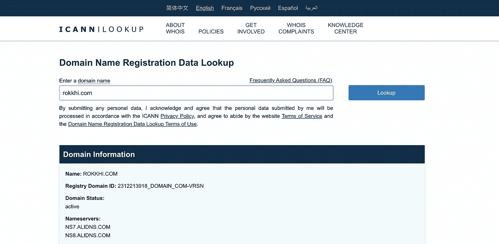
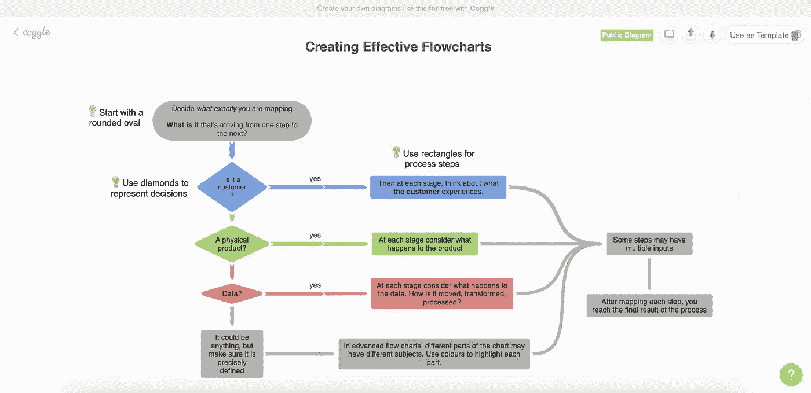
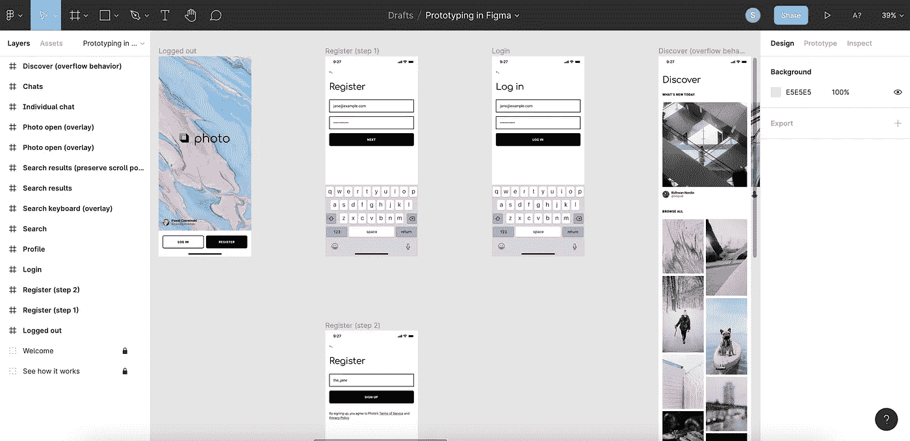
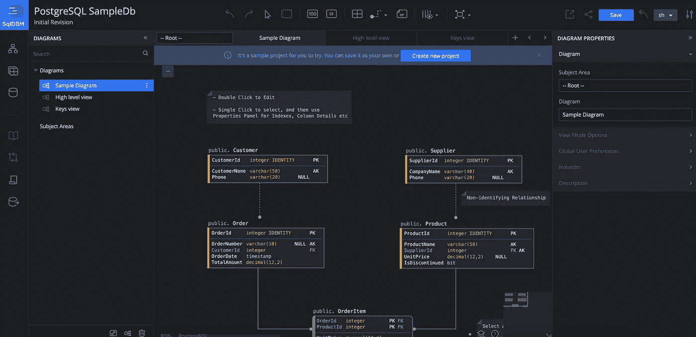
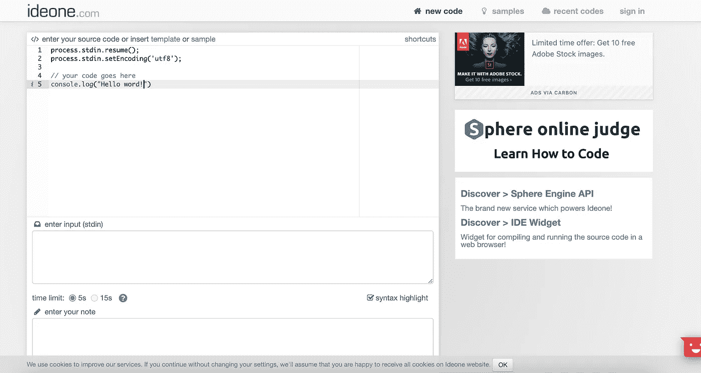
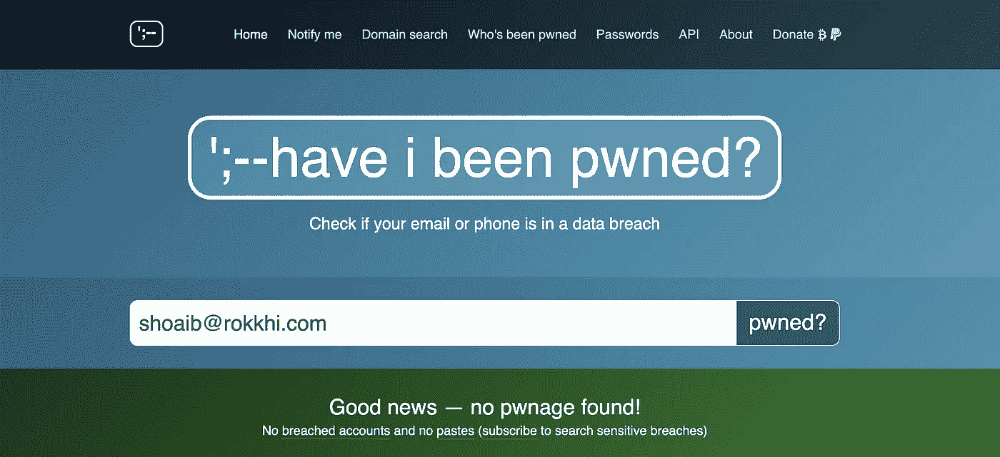

# 作为一个技术人员，你会感谢我的这些网站

> 原文：<https://blog.devgenius.io/as-a-tech-guy-you-will-thank-me-for-these-websites-be09e86ebcef?source=collection_archive---------0----------------------->

## 更聪明而不是更努力地工作

## 每天我们都做一些技术上的事情，我们可以完全移交给这些网站

作为一名技术人员，我会定期获取一些任务。有些任务我们可以用几种方法来解决。在这些情况下，许多工具、开源程序、编码或任何东西都会有所帮助。

> 更聪明地工作，而不是更努力


[活动发起人](https://unsplash.com/@campaign_creators?utm_source=medium&utm_medium=referral)在 [Unsplash](https://unsplash.com?utm_source=medium&utm_medium=referral) 上的照片

但是我相信我上面提到的一件事。如果有一种简单的方法，那么我不会用另一种方法自己去做。在这里，我将提到一些我在日常生活中使用的网站，并跳过我的麻烦。

# 网站安全和安保检查

用于扫描和检查网站安全性的安全检查工具。我们需要检查恶意软件、垃圾邮件和维护网站的信任报告。许多工具或命令行都可以用来做这件事，但这是最简单的方法。可以在这里生成 SSL/TLS 报告。

> 该网站有助于确定访问和共享信息的网站是否安全。

```
Link: [https://www.ssltrust.com.au/ssl-tools/website-security-check](https://www.ssltrust.com.au/ssl-tools/website-security-check)
```



SSL 信任

# 开放端口扫描仪

在你的本地机器上托管一些东西并发布到互联网上，然后你需要检查你的端口是否打开。如果端口是打开的，那么你就可以继续了。可以通过命令行检查开放端口，但这是最简单的工具，不需要任何技术知识。

## 我们通常需要跟进的端口

*   21 —文件传输协议(FTP)
*   22 —安全文件传输协议(SFTP)
*   25 —简单邮件传输协议(SMTP)
*   80 —超文本传输协议(HTTP)
*   110 —邮局协议 v3 (POP3)
*   143 —互联网消息访问协议(IMAP)
*   443 —基于 TLS/SSL 的超文本传输协议(HTTPS)
*   993 —基于 TLS/SSL 的互联网消息访问协议(IMAPS)
*   3306 — MySQL 数据库系统

```
Link: [https://www.whatismyip.com/port-scanner/](https://www.whatismyip.com/port-scanner/)
```



开放端口扫描

# 找到我的真实 IP 地址

有时候你需要知道你自己的网络真实 IP 地址。你自己很难找到这一点。ISP 可以帮你找到你的 IP 地址。别担心，这里有一个网络工具可以显示你的 IP 地址。只要上网，你就会找到你连接的网络的 IP 地址。

```
Link: [https://whatismyipaddress.com/](https://whatismyipaddress.com/)
```



我的 IP 是什么

# 域名注册名称查找

域名查找有时是需要的，而且几乎不可能自己找到。这里有一个网站可以帮助你做到这一点。只要输入你的网址，然后回车就行了。你会找到全部信息。

```
Link: [https://lookup.icann.org/](https://lookup.icann.org/)
```



检查

# 思维导图

这是一件复杂的事情。有时用流程图、图表或任何其他东西都不合适，但用“coggle”是可能的。这是一个思维导图应用程序，也适用于像文档树这样的结构化文档。Coggle 是谷歌开发的工具。

## 用例

*   做笔记
*   规划
*   会议管理
*   思维导图
*   想法分享

```
Link: [https://coggle.it/](https://coggle.it/)
```



Coggle

# 界面设计

这是复杂的，需要一些工具，如 Adobe XD 或其他工具。但有时我们需要在另一台电脑上做这种设计，这就很麻烦了。作为一名开发人员，我们有时需要它，保持安装这样的工具也是一种麻烦。更简单的方法是使用像 Figma 这样的在线界面设计工具。Figma 是一个原型工具。只需访问网站，开始构建您的设计并在线保存即可。

## Figma 作为设计工具的力量

*   熟悉的界面，易于采用
*   在协作工作时，可以选择作为其他成员查看
*   与 slack 的团队协作在这里是一个优势

```
Link: [https://www.figma.com/](https://www.figma.com/)
```



菲格玛

# 开发数据库和数据仓库，无需编写任何代码

数据库设计是开发人员的常规需求。不需要为数据库设计保留已安装的工具。只要去网站，开始建立你的数据库。

## 支持的数据库类型

*   SQL server
*   关系型数据库
*   一种数据库系统

这里的另一个主要功能是在协作中使用术语。开发人员可以通过这个平台远程处理单个项目

```
Link: [https://sqldbm.com/](https://sqldbm.com/)
```



SqlDB

# 在线编译任何语言

有一个网站可以帮助你。不需要任何工具或安装编译器和编辑器。只要去网站选择你的语言。仅此而已。现在，您可以用任何编程语言编译代码了。Ideone 能够编译 60 多种编程语言。

```
Link: [https://ideone.com/](https://ideone.com/)
```



IDEone

# 代码片段共享

作为程序员，我们最需要的就是在线分享代码。通过电子邮件、社交媒体或其他平台共享代码并不简单，也不兼容。通过 git 共享代码也是一件麻烦事。最好的方法是抓住要点。“gist”是 GitHub 的一个片段共享工具。下面是一个例子。

> **Gist** 是一种与他人分享代码和片段的方式。每个 gist 都是独立的 git 库，这是可分叉和可用的。

```
Link: [https://gist.github.com/](https://gist.github.com/)
```

**这里有一个例子。**

# 我曾经被 pwn 过吗？

另一个经常使用的有用网站。不仅仅是程序员。检查你的电子邮件或电话是否有数据泄露。只需输入您的电话号码或电子邮件地址，然后按回车键。

```
Link: [https://haveibeenpwned.com/](https://haveibeenpwned.com/)
```



# 结论

这是我以前发表的一篇文章，可能也有帮助。

[](https://betterprogramming.pub/10-tricky-javascript-snippets-for-programming-interviews-1f1ae4a67878) [## 编程面试的 10 个棘手的 JavaScript 片段

### 为想要的工作做好准备

better 编程. pub](https://betterprogramming.pub/10-tricky-javascript-snippets-for-programming-interviews-1f1ae4a67878) [](https://betterprogramming.pub/12-conventions-for-writing-clean-code-e16c51e3939a) [## 编写干净代码的 12 个约定

### 你的同龄人以后会感谢你的

better 编程. pub](https://betterprogramming.pub/12-conventions-for-writing-clean-code-e16c51e3939a) 

在这篇文章中，我试图涵盖所有与开发相关的人的潜在网站。希望这篇文章对你的日常使用有所帮助。如果我错过了什么，不要忘记提及，我会继续更新这篇文章，并包括所有内容。

祝你愉快。🙂