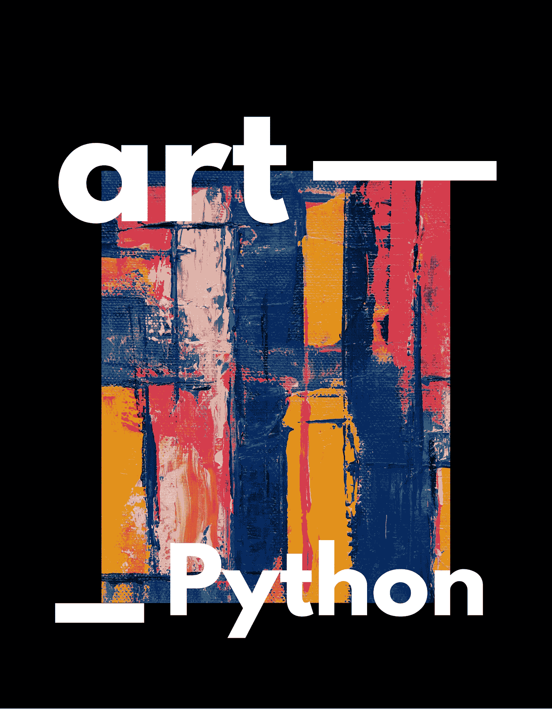
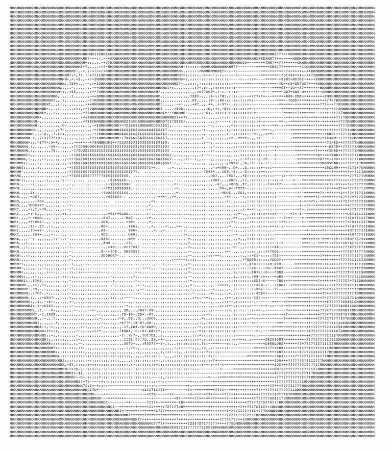
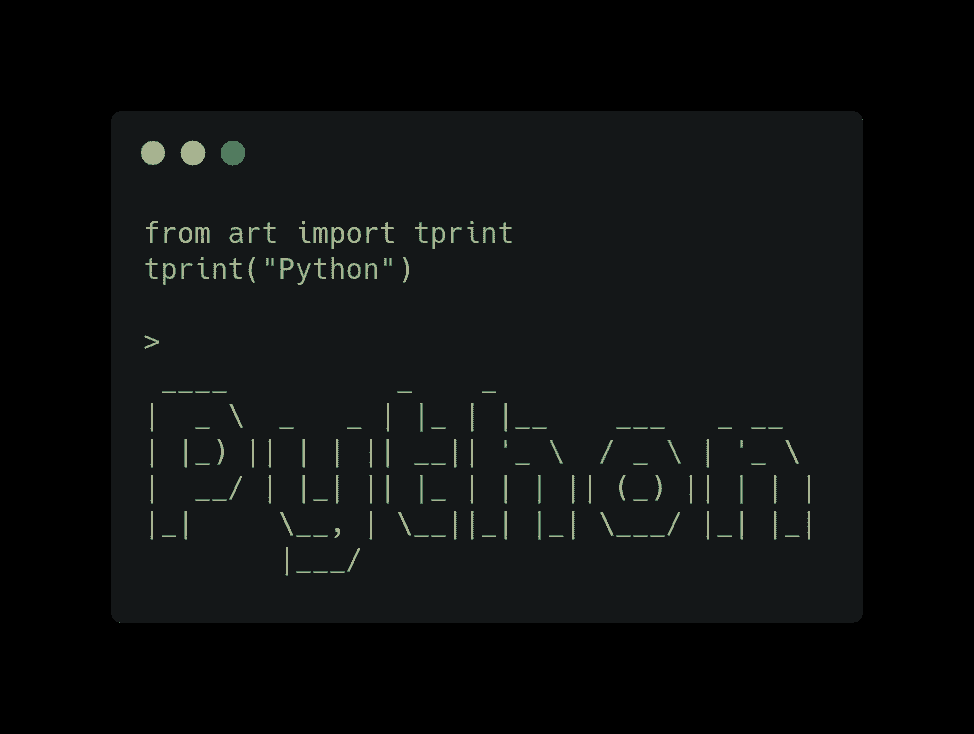

# Python 的 ASCII 艺术库

> 原文：<https://blog.devgenius.io/ascii-art-library-for-python-b37b45ed72fd?source=collection_archive---------8----------------------->

用人物绘画和写作本来可以是这个故事的另一个名字，但是让我们从技术的角度来拆分当前的标题。

ASCII 代表美国信息交换标准代码，可以用下图表示。

维基百科标识的 ASCII 艺术。

通过使用 [art](https://pypi.org/project/art/) Python 的库，我们可以生成 ASCII 艺术，并通过尝试不同的功能获得乐趣。让我们从使用引用文本打印的 tprint()函数开始。

尝试用不同的消息修改下面的代码，并测试这个库是如何工作的。

使用艺术 Python 库。

“你好，世界！”应该是一个好的起点😃

编码快乐！🐍