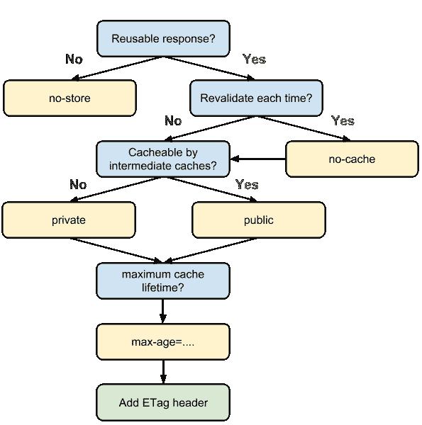
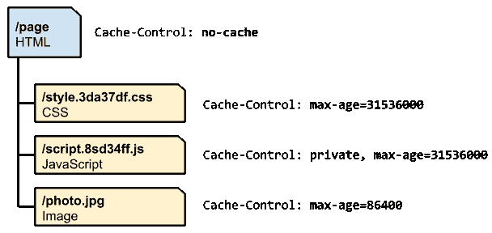
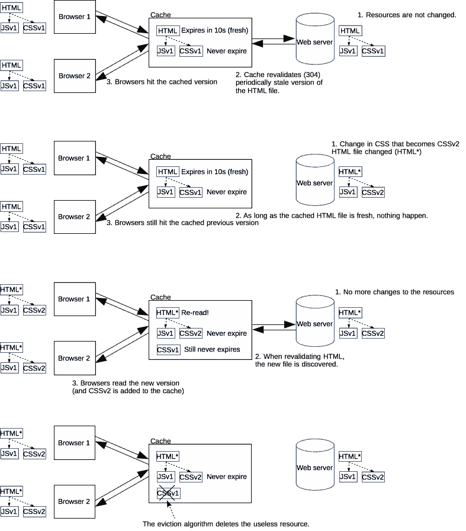

# 询问 HTTP 缓存的基本知识

> 原文：<https://blog.devgenius.io/asking-to-know-basic-about-http-cache-9c151a932709?source=collection_archive---------36----------------------->

(图片来自互联网)

> ***最快的 HTTP 请求是没有发出的请求。*** ***_ 未知***

今天，我们通过一些问题来了解一下 **HTTP 缓存——最快 HTTP 请求的关键**

# 什么是缓存？

> *缓存是一种技术，它存储给定资源的副本，并在 MDN 请求时返回给定资源*

# 什么是缓存概念？​

基本缓存概念

# 什么是 HTTP 缓存？

HTTP 缓存是缓存应用于 HTTP 协议(HTTP/1.1，HTTP/1.2)的方式

# 我们为什么要缓存？

因为我们都喜欢快速网站，缓存是提高性能的英雄

# HTTP 缓存中的基本缓存机制是什么？

基本的缓存机制确保每个服务器响应提供正确的 **HTTP 头指令(Cache-Control)** 来指示浏览器何时缓存响应以及缓存多长时间

# HTTP 缓存有几种？

有 3 种 HTTP 缓存:

♠没有缓存

♠共享缓存

♠本地(私有)缓存

# 有多少种高速缓存请求指令？​

有许多种高速缓存请求指令。基于使用，有 2 组使用它们“由客户端在 HTTP 请求中使用”和“由服务器在 HTTP 响应中使用”

**使用两个组**:无缓存、无存储、最大年龄、无转换

**客户端— HTTP 请求**:最大陈旧、最小新鲜、仅在缓存时

**服务器端— HTTP 响应:**公共、私有、必须重新验证、代理重新验证、x 管理

下图向我们展示了选择请求指令的方法:

# 如何两全其美:客户端缓存和快速更新？​

最佳实践是对 html 文件不缓存，对 css、js 文件使用唯一的 URL

请查看客户端缓存和按需更新如何:

# HTTP 缓存处理的“高超三重奏”是什么？​

**ETag** + **缓存控制** + **唯一 URL**帮助我们提供最好的服务:

过期时间长久

控制可缓存响应的位置

按需更新

# 如何定义目标应该使用特定的缓存？​

(例如:桌面用户缓存不应应用于移动用户)

我们可以根据不同的请求头(**变**)定义不同的内容，如***cookie、语言、用户代理***

# 缓存策略怎么样？

没有最好的缓存策略，这取决于您的应用程序(需求、流量、数据……)您必须定义和配置您的预源设置和您的“缓存层次结构”

在处理缓存时，有一些提示和检查列表:

使用一致的 URL

确保服务器提供验证令牌(ETag)

确定哪个资源应该缓存中介

确定每个资源的缓存寿命

确定缓存层次结构

通过单独的资源最大限度地减少流失

我们只是绕过一些关于 HTTP 缓存的基本问题。如果你对此有更多的问题，请发表评论

一些参考链接:

–[【Google Dev Doc】HTTP 缓存](https://developers.google.com/web/fundamentals/performance/optimizing-content-efficiency/http-caching)

–[【MDN web docs】HTTP 缓存](https://developer.mozilla.org/en-US/docs/Web/HTTP/Caching)