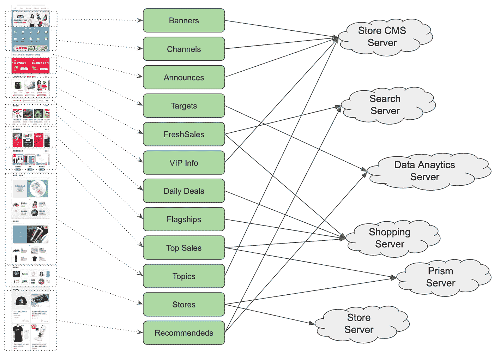
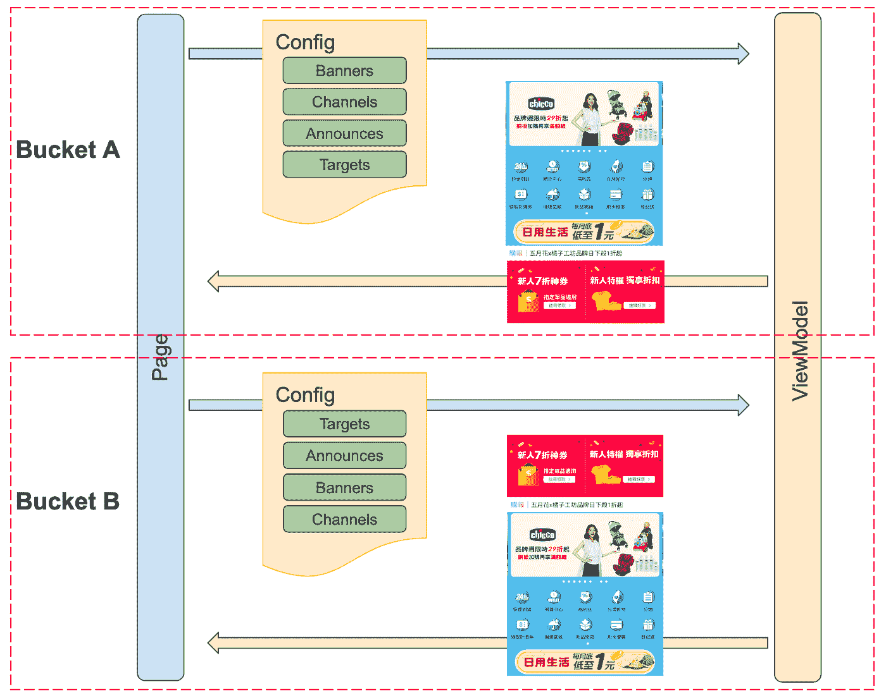
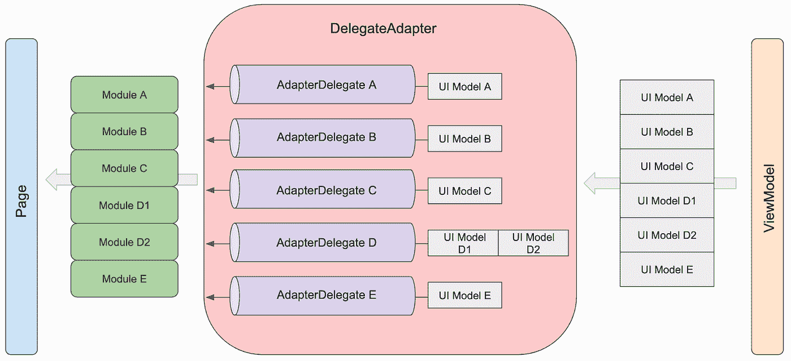
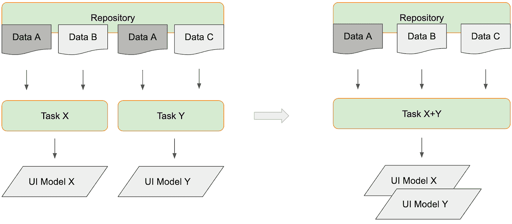
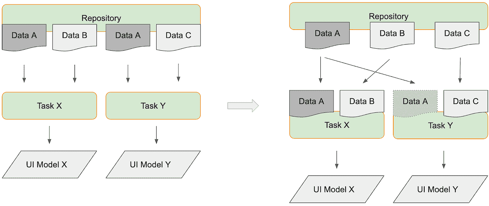
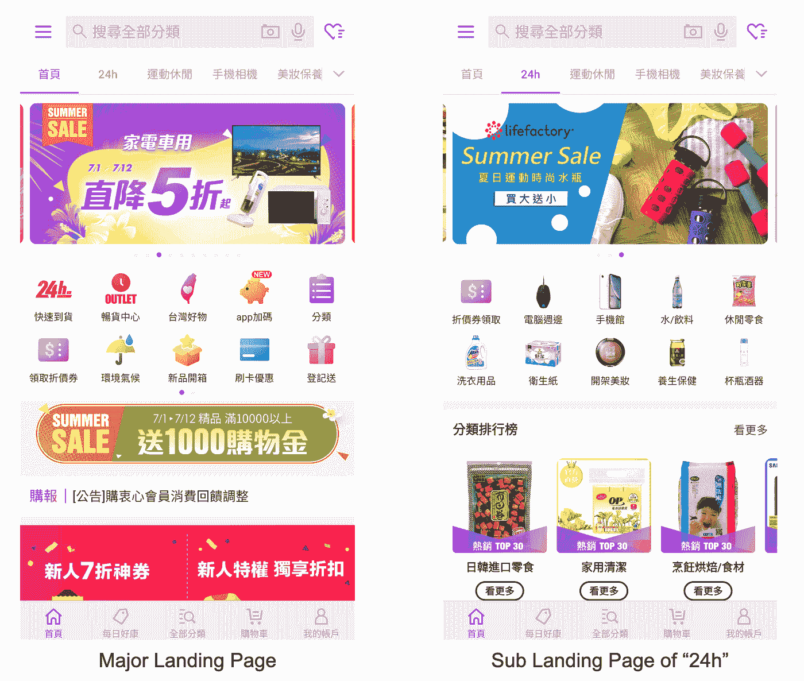

# 将多个源组合到单个滚动视图中，具有更好的性能和预定义的用户界面顺序

> 原文：<https://blog.devgenius.io/assemble-multi-sources-into-single-scrollview-with-better-performance-and-predefined-ui-order-5202aa57a83f?source=collection_archive---------15----------------------->

## 一页上各种模块的架构

> 感谢我的同事，和的帮助，重构了我们的项目并准备了分享文章。购物应用的登录页面充满了各种模块，这些模块来自不同的 API。本文介绍了这种架构如何工作，以及如何提高性能和可重用性。

# 介绍

购物应用的登录页面充满了各种模块，这些模块来自不同的 API。将这些回复的组件组装到一个页面中需要时间来等待所有这些 API 响应。也许 app 可能会查询第一个 API，显示依赖的模块，请求下一个 API 并显示，一个接一个。

我们提出了一种架构，使得登陆页面最初查询所有 API，当每个 API 响应时，直接显示相应的模块。这些模块将按照预先定义的顺序显示，例如，*横幅*总是在顶部，然后是*频道*模块，而*推荐*模块每次都在底部。

此外，使用这种架构，对这些模块进行重新排序、删除不推荐使用的模块以及添加新模块要简单得多。此外，我们可以非常方便地在其他页面中重用这些组件。

# 体系结构

页面将根据它希望的模块将需求设置到配置中，包括它们的显示顺序。在 ViewModel 接收到配置之后，它生成相关的任务并并行请求数据。当任何任务完成时，它会将 UI 模型传递回 ViewModel，ViewModel 会根据配置设置对所有收到的 UI 模型进行排序，然后将排序后的 UI 模型交给 DelegateAdapter。DalegateAdapter 中有许多 AdapterDelegates。每个 AdapterDelegate 将处理一种 UI 模型，并把它变成页面需要呈现的模块。

## 页

页面通常负责显示模块和处理 UI 事件。Page 初始化 Config、ViewModel 和 DelegationAdapter，将它需要的模块和模块的顺序注册到 Config 中，并将 Config 传递给 ViewModel。然后 Page 通知 ViewModel 执行任务并从 DelegationAdapter 更新 UI。

## 配置

Config 正在记录所需的模块和显示顺序。当被传递到 ViewModel 时，ViewModel 将根据配置文件中声明的模块创建任务来获取数据。

在这个体系结构中，单独分离配置是必不可少的。通过修改配置，很容易对模块进行重新排序或重组流，而无需对页面进行大量更改或考虑 API 响应的返回顺序。

## 视图模型

ViewModel 是这个架构中的数据处理中心。最初，它根据 Config 中所需的模块创建相应的任务。ViewModel 还维护一个集合来保存当前的 UI 模型。当从任务接收任何 UI 模型时，集合将根据配置中定义的显示顺序聚合当前 UI 模型和新 UI 模型。

ViewModel 从 Page 接收 UI 事件，并执行任务以并行获取 UI 模型。当它从任务中获取 UI 模型时，集合将汇总这些模型。最后，ViewModel 将 UI 模型的有序列表传递给 DelegationAdapter 以更新模块。

## 委派适配器

DelegationAdapter 是页面和视图模型之间的桥梁。它观察来自 ViewModel 的 UI 模型流，并将相应的模块输出到页面，页面更新 UI。本质上，DelegationAdapter 是一个调度程序，它将 UI 模型转发给相应的 AdapterDelegate。

当 ViewModel 发出 UI 模型的有序列表时，DelegationAdapter 会将每个 UI 模型分派给 AdapterDelegate。该适配器委托处理 UI 模型类型上的铰链。之后，AdapterDelegate 将处理 UI 模型并将其转换为模块。

## AdapterDelegate

佩奇需要的模块有很多种。为了避免单个处理程序过于复杂，我们将复杂性分成不同的 AdapterDelegates。一个 AdapterDelegate 只负责一种类型的模块。它接收 UI 模型，膨胀模块布局，并绑定 UI 模型来处理模块的 UI 表示。

通过解耦的好处，应用程序不仅可以在登录页面上使用每个 AdapterDelegate，还可以在其他页面上使用。它通过可重用的 AdapterDelegates 避免了样板代码，并确保相同的模块在不同的页面上具有相同的外观。

## 工作

Task 执行异步操作从存储库中获取数据，并在后台线程中将其转换为相应的 UI 模型。然后将 UI 模型转移到 ViewModel 中。这些任务应该是独立且不相关的。如果多个任务使用相同的数据，或者任务需要另一个任务的数据，应用程序应该通过以下建议来优化这些任务:

1.)将那些任务转换成单个任务，查询所有必要的数据，共同转换成多个 UI 模型。

2.)储存库层(或网络层，例如 OKHTTP 或 AFNetworking)将缓存复制的数据，以便在查询相同的数据时没有额外的网络连接。

## 用户界面模型

每种 UI 模型对应于页面上的一种模块类型。UI 模型保留了 AdapterDelegate 创建或更新模块所需的所有信息和字段。UI 模型来自 Task，通过 DelegationAdapter 到达 AdapterDelegate。

使用 UI 模型代替 API 数据模型还有另一个好处，即可重用性。例如，一个模块存在于多个页面上，但是该模块需要的数据来自每个页面上的不同来源。通过将不同的 API 数据转换为同一个 UI 模型，我们可以重用 AdapterDelegate，并在需要调整模块的 UI 时最小化需要修改的代码量。

# 优势

## 轻松的 A/B 测试和动态调整

如果我们想要对不同顺序的模块进行 A/B 测试，我们只需要根据存储桶创建两个单独的配置对象。那么流将在不同的桶中不同地呈现。

由于我们分离了显示顺序和 API 响应序列，我们可以轻松地将显示逻辑从应用程序提取到远程配置，以便 PM 可以根据业务需求动态地更改模块的顺序。这将给予项目经理和销售人员更大的灵活性来制定商业策略，并在与供应商谈判时拥有更大的权力。

## 更好的性能

在这种架构中，我们可以并行调用多个 API，从而显著减少呈现整个流的等待时间。登陆页的冷启动时间在改善，给用户带来了更好的体验。

## 可重用性改进

此外，AdapterDelegates 可以在我们想要显示同一个模块的任何地方重用。有了它的好处，我们不需要维护重复的代码，可以通过模块封装 UI 显示逻辑。

# 成就

主登陆页面显示所有模块，包括*横幅*、*频道*、*公告*、*目标*等。其他子登陆页面丢弃*宣布*、*目标*，以及部分模块。在我们的架构中，我们可以注销子登陆页面不需要的模块。

再比如，购物 app 在两个不同的页面显示*推荐*模块，我们可以使用同一个 AdapterDelegate，只需要在两个页面的配置中注册这个模块。然后，推荐模块将出现在这些页面上。

# 参考

[1]委托适配器
https://github.com/sockeqwe/AdapterDelegates