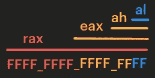
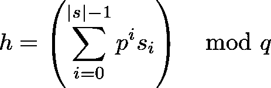
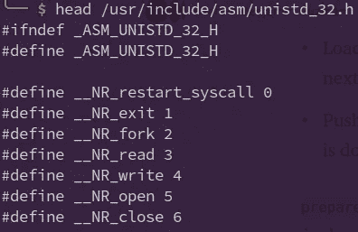
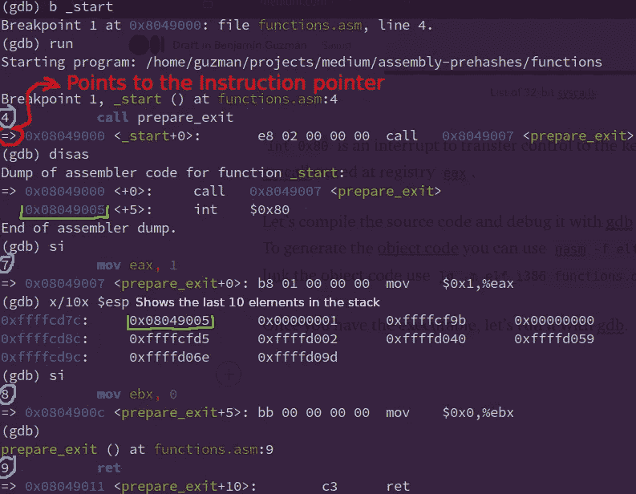
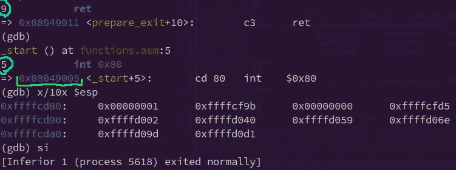
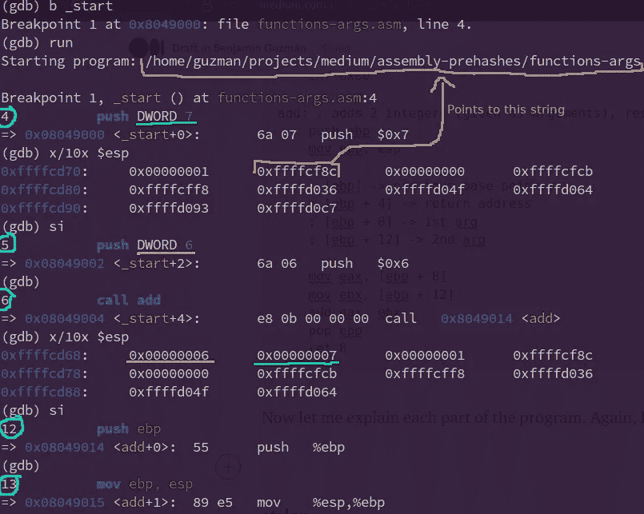
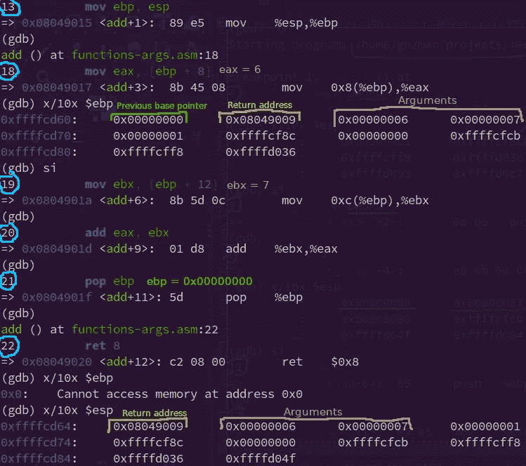
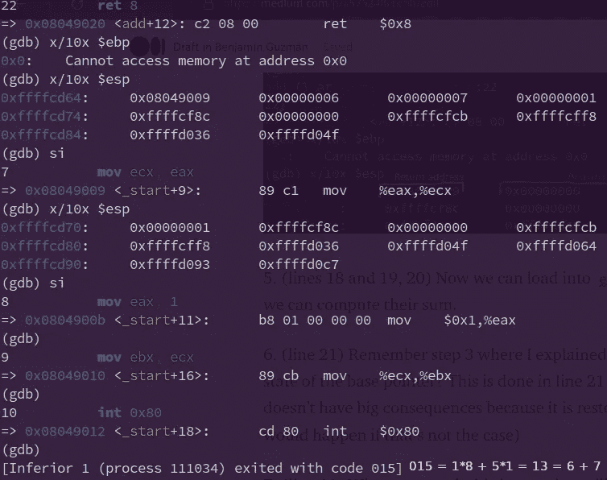

# 按示例汇编:计算字符串哈希。第 1 部分:功能

> 原文：<https://blog.devgenius.io/assembly-by-example-compute-string-hash-part-1-functions-a575240cbc5b?source=collection_archive---------9----------------------->

在这一系列的文章中，我们将讨论如何用汇编语言编写一个有趣、简单且有教育意义的程序来计算字符串散列。

为了让您对我们将要构建的内容有一个大致的了解，下面是测试汇编和 Java 中生成的哈希是否相等的代码。

正如您可能已经猜到的，我们将生成`hashes`二进制文件(第 6 行)。

假设您有一些编程经验，并知道一点点汇编。如果你不知道，这些是关键概念:

*   **寄存器**是 CPU 内部的内存存储位置。`rax`是 64 位注册表，`eax`是`rax`的下半部分(32 位)，`ah`是`eax`的下半部分(16 位)，`al`是`ah`的下半部分(8 位)。



*   **注释**前面有分号`;`
*   汇编不是一种结构化语言，因此不存在函数、循环等。但是有**指令**。你可以在这里找到最常见的[的综合列表](https://en.wikibooks.org/wiki/X86_Assembly/Control_Flow)。
*   **堆栈向下**增长，即地址`0x0f`更靠近堆栈顶部，而`0xff`更靠近底部。
*   **基址指针**是一个指针，其值作为访问堆栈帧数据的参考。一般来说，低于它的值是局部变量，高于它的值是函数参数。
*   **堆栈指针**是指向堆栈顶部的指针。
*   **指令指针**保存指向下一条要执行的指令的指针。

汇编总结结束，我们进入编码！

# 积木

我们将使用与 [Java](https://docs.oracle.com/en/java/javase/11/docs/api/java.base/java/lang/String.html#hashCode()) 相同的字符串散列定义，定义如下


当然，你可以改变这个函数。实际上，这将是一件有趣的事情，因为更正式的哈希函数应该是这样的



其中 p 和 q 是质数。在 Java 的情况下，由于性能原因，不考虑模运算，为了方便起见，使用 31。

抛开这个不谈，我们似乎需要编写两个辅助函数:`strlen`来计算字符串长度|s|，以及`pow31`来计算 31 的非负整数次幂(这实际上是不需要的，但是我们将在后面的[中使用](/assembly-by-example-compute-string-hash-part-2-loops-ba39de0ff6d6))。这两个功能都将在本文的第二部分中进行编码。现在，让我解释一下“函数”在汇编中是如何工作的。

# 装配中的功能

## 没有参数的函数

汇编不是一种结构化语言，它本身没有“函数”。然而，我们可以用跳转和汇编语言的其他特性来“模拟”一个函数。例如:

在这里，`call prepare_exit`将:

*   将`prepare_exit`的地址加载到 IP(指令指针)中，这样它就是执行的下一条指令(这被称为*跳转*)
*   `prepare_exit` 完成后，将下一条要执行的指令压入堆栈，即加载`int 0x80`的地址

`prepare_exit`将*退出*系统调用的“id”加载到`eax`中，该系统调用将退出状态代码作为单个参数接收，该代码存储在`ebx`中，等于 0。然后，`ret`将栈顶的值(也就是指令`int 0x80`的地址)弹出，加载到 IP。

您可以在`/usr/include/asm/unistd*.h`中看到可用的系统调用列表。例如:



32 位系统调用列表

`int 0x80`是一个中断，用于将控制转移到内核，以执行存储在注册表`eax`中的 syscall。

为了更好的理解，让我们用 [gdb](https://www.sourceware.org/gdb/) 调试代码。(要构建二进制代码，使用`nasm -f elf32 -g functions.asm`生成[目标代码](https://en.wikipedia.org/wiki/Object_code)并将`ld -m elf_i386 functions.o -o functions`链接到[目标代码](https://www.geeksforgeeks.org/linker/))



我知道，一开始可能看起来很吓人，但别担心，我会解释发生了什么。

1.  (第 4 行)IP 设置为 0x08049000，即`call prepare_exit`的地址。
2.  (第 7 行)一旦 0x08049000 处的指令被执行，就会发生两件事:首先，IP 被设置为`prepare_exit`中第一条指令的地址。第二，地址 0x08049005(绿色)被推到堆栈顶部，这被称为**返回地址**，是函数结束后应该执行的地址。
3.  (第 8 行)执行 0x08049007 处的指令，并且`eax`注册表的值为 1。
4.  (第 9 行)执行 0x0804900c 处的指令，并且`ebx`注册表的值为 0。



然后，在`ret`被执行后(第 5 行),栈顶被弹出，该值(0x08049005)被加载到 IP 中。

最后，执行 0x08049005 处的指令，进程正常退出。

## 带参数的函数

现在让我们看看带参数的函数是如何工作的。有两种主要的方法可以将参数传递给函数:

1.  通过在调用函数之前设置寄存器。我们已经这样做了，还记得`ebx`是退出状态代码吗？这是退出系统调用的参数。这种方式是最简单的，通常用于系统调用。
2.  将它们推到堆栈中。我们将详细讨论这一点。

让我们举下面的例子

现在让我来解释程序的每一部分。同样，我将通过使用 gdb 来这样做。



1.  (第 4 行和第 5 行)堆栈是“空的”。或者我们可以这样认为，因为我们没有向它推送任何东西，但它实际上并不为空，因为它包含了命令收到的参数数量和参数本身(在[第 3 部分](/assembly-by-example-compute-string-hash-part-3-cli-args-and-external-functions-c3b533e99cdd)我们将详细讨论这一点)。
2.  (第 6 行)堆栈现在有两个 int 参数(6 和 7)。
3.  (第 12 行)将当前的基址指针(在*之前的*堆栈框架中使用)保存到堆栈中，因为我们将对其进行修改，但我们需要在`add`功能完成后恢复它。否则，调用函数中可能会发生不好的事情🔥(参见附录 B)。
4.  (第 13 行)当前基址指针在*前一个*堆栈框架中使用，在当前堆栈框架中没有用，所以我们把与堆栈指针相同的地址装入其中。这样，我们可以很容易地访问局部变量和参数。我们可以通过将堆栈指针而不是基指针作为引用来做同样的事情，但是这并不常见，并且在使用局部变量时可能会变得复杂(因为在这种情况下，`ebp != esp`和`esp`可能会改变，而`ebp`不会)。



5.(第 18、19 和 20 行)将参数加载到`eax`和`ebx`中，这样我们就可以计算它们的总和(我们不能直接对`[ebp+12]`和`[ebp+8]`求和，需要寄存器)。

6.(第 21 行)还记得我在第 3 步解释过恢复基指针状态的重要性吗？这是在第 21 行完成的(在这种情况下，不这样做不会有很大的后果，因为它被恢复到 0x0，但是想想如果不是这样会发生什么。参见附录 B)

7.(第 22 行)执行时，该指令弹出返回地址并存储在 IP 中，然后从堆栈中弹出对应于函数参数的 8 个字节。这样，堆栈将像开始时一样结束



退出代码 015(八进制)相当于 13(十进制)

## 带参数和局部变量的函数

使用数据寄存器非常快，但因为它们(通常)限于 4 个寄存器(eax、ebx、ecx、edx ),我们不能同时存储超过 4 个不同的值。我们可以通过使用堆栈或堆内存来克服这个限制。

使用堆内存需要使用像 [sbrk](https://man7.org/linux/man-pages/man2/sbrk.2.html) 这样的系统调用，但是在这篇文章中我们不打算看一看。还有另一个存储变量的部分叫做 [bss](https://en.wikipedia.org/wiki/.bss) ，但是使用它没有使用局部变量有趣。所以，我忽略它，现在我将讨论如何在堆栈中存储局部变量，因为这很容易做到，因为它是一个固定大小的内存，内核在开始执行程序时会保留它。

让我们举下面的例子

如您所见，使用局部变量并不复杂。本质上，它可以归结为三个步骤:

1.  为变量“保留”堆栈内存。`sub esp, 8`“保留”8 个字节的内存，每个局部变量 4 个字节。“Reserves”在引号之间，因为记住堆栈内存有固定的大小，所以我们不能实际分配或保留内存。我们可以说这是一个“合乎逻辑”的保留。
2.  使用局部变量。
3.  完成后，将堆栈指针重置为基指针。这样就忽略了局部变量。需要注意的是，它们不会被删除，仍然可以访问。

第一部分到此结束。我们已经介绍了理解第 2 部分[所需的基础知识，在第 2 部分](/assembly-by-example-compute-string-hash-part-2-loops-ba39de0ff6d6)中，我们将编写助手函数来计算字符串散列。

一如既往，如果你认为有什么地方错了或者有什么地方可以改进，请告诉我。

## 附录 A:我的 gdb 配置

我个人对 gdb ( `~/.gdbinit`)的配置其实挺简单的。

```
set debuginfod enabled off
set disassemble-next-line on
```

在所有前面的图像中，字节都是以大端格式显示的。然而，有时以小尾顺序显示它们会很方便。为此，您可以使用下面的代码行。

```
set endian little
```

## 附录 B:如果先前的基指针没有被恢复会发生什么？

如前所述，坏事🔥如果函数结束后没有恢复基指针，可能会发生这种情况。举下面的例子

如果您执行它，您将看到我们没有得到预期的输出(并且可能更糟)。


我会让你发现为什么我们会有这种行为。

*注*:你想想看，你可以根据需要多次解引用`ebp`，直到它有空值(0x0)，从而得到一个函数的**栈迹**，因为`ebp`指向的值始终是`ebp`的前一个值。