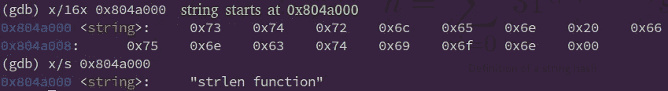
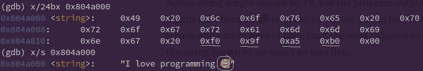
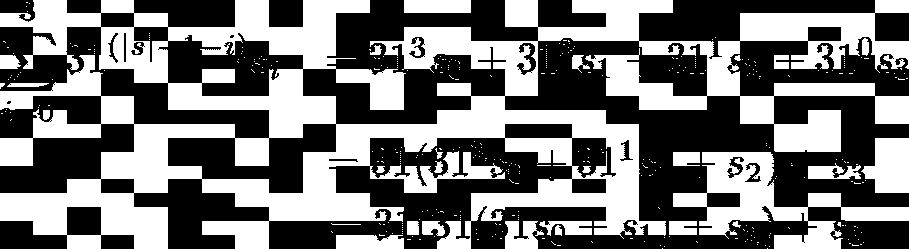
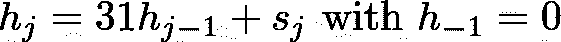
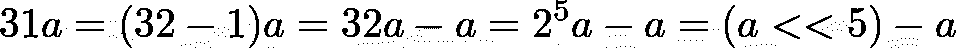
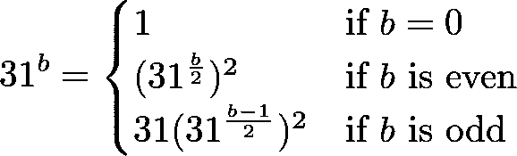

# 按示例汇编:计算字符串哈希。第 2 部分:循环

> 原文：<https://blog.devgenius.io/assembly-by-example-compute-string-hash-part-2-loops-ba39de0ff6d6?source=collection_archive---------6----------------------->

如果你还没有读过第一部分，我强烈建议你去读一读，因为在第二部分中，假设你已经知道那里解释了什么。

请记住，我们的目标是计算由以下等式给出的字符串散列。


字符串哈希的定义

您可能还记得第 1 部分中的内容，我们需要编写两个助手函数:strlen 和 pow31。第一个非常简单，而第二个更复杂，但正如我们稍后将看到的，实际上根本不需要它。这两个函数都需要循环，所以我们将从理解汇编中的循环开始。

我们还没有看到如何读取 cli 参数或将数字输出到 stdout，因此我将通过做两件事来尽可能保持示例的简单性:

1.  因为对于大多数例子来说，结果是一个无符号整数，所以输出结果作为程序的退出状态代码似乎很方便。当然，这不是一个好的做法，而且存在的问题是，退出状态代码由一个字节表示，所以我们不能输出大于 255 的数字。
2.  我们将使用硬编码的测试用例。同样，这不是一个好的实践，但是为了简单起见，让我们保持这种方式。

请记住，您可以通过使用`echo $?`打印可执行文件的状态代码来检查结果

# 装配循环

与结构化语言相反，汇编语言没有控制结构，比如 for、while、do-while 循环。我们有的是跳跃。

在看一些例子之前，重要的是要知道`for`和`for-each`循环只是 while 循环的[语法糖](https://en.wikipedia.org/wiki/Syntactic_sugar)，所有你可以用`for`循环做的事情都可以用`while`循环来完成。这对于理解汇编中的循环是必不可少的，所以在继续之前你真的需要理解我的意思。

## n 以内的自然数之和

为了计算 n 以内的自然数之和，我们可以使用高斯公式


但是，因为我们想了解循环在汇编中是如何工作的，所以我们不打算使用它。相反，我们将使用一个“while”循环。

让我们通过检查下面的例子来学习。

我认为理解这个程序是如何工作的有点简单。不过，让我解释一些我们在第 1 部分中没有看到的东西。

`loop:`是循环中第一条指令的标签。

`cmp eax, ebx`通过减法比较两个寄存器，然后修改标志寄存器。我们感兴趣的标志注册表是 ZF(零标志)注册表，如果两个寄存器相等(a-b = 0 当且仅当 a = b)，则该注册表被设置为 1。

`je end` (je: jump if equal)是一个*条件跳转*，如果 ZF = 1(由前面的操作设置，在这种情况下是比较)，则跳转到`end`标签。`jz end`(零跳)也可以。

`jmp loop`是一个*无条件跳转*，跳转到`loop`标签。

回想一下*跳转*意味着将一个地址加载到 IP(指令指针)中，这样它就会在下一个被执行。

# 字符长度（stringlength）

假设一个字符串是空终止的(以 0x0 结束)，我们可以用下面的代码得到它的长度

代码非常简单。可能需要解释的唯一一行是这一行`cmp BYTE [string + eax], 0x0`。

首先，`string`是指向字符串第一个字符的指针。这和你在 c 中声明一个`char*`很像，让我们在 gdb 中看看。



如果我们讨论的是 ASCII 编码(每个字符 1 个字节)，那么`[string + i]`处的字节(其中`i`是一个整数)就是字符串中的第 I 个字符。当然，如果我们采用其他编码方式，每个字符超过 1 个字节，代码就会失败。例如:



实际的字符串长度是 21，但是我们的程序说字符串长度是 23，因为🥰是以 4 个字节存储的。修复这个“bug”需要比实际计算字符串长度多得多的代码行，所以我们不会深入讨论。

现在，应该很清楚`cmp BYTE [string + eax], 0x0`检查字符串中的第 I 个字节(字符)是否是空字符。指定操作大小很重要，否则我们会得到一个错误`operation size not specified`,因为想想看，编译器怎么知道你想要比较一个字节？

如果我们不指定操作的大小，操作是相当不明确的，因为比较多于 1 个字节是完全合理的。例如，如果我们想比较 UTF-8 字符。

假设我们在寻找这个角色🤘也存储在 4 个字节中，然后用`cmp DWORD [string], "` ✌️ `"`或`cmp DWORD [string], 0x98a49ff0`进行比较。你可能认为十六进制值`0x98a49ff0`，给了编译器一个关于操作大小的提示，但这并不完全正确。然而，如果我们将立即值`0x98a49ff0`移动到一个注册表中，比如说`eax`，我们不再需要指定大小操作，因为编译器已经知道`eax`是一个 32 位注册表，因此这意味着操作大小是`DWORD`。

如果您仍然有疑问，下面的 C 代码是汇编代码的翻译，可能会有所帮助。

# pow31

Java 工程师在选择散列函数时非常聪明，因为它有以下优化:

*   助手功能`pow31`其实不需要。对长度为 4 的字符串进行以下扩展:



一般情况可以定义如下



其中 h sub j 是从索引 0 处的 char 到索引 j 处的 char(包括 0 和 j)的字符串的哈希。

更清楚地说，我们可以用下面的伪代码计算字符串的散列。

```
h := 0
for i = 0; i < |s|; i++ {
  h = 31 * h + s[i]
}
```

*   31 真的是个不错的选择。这就是为什么。



将整数 *a 乘以 31* 的优化

我们将在第 3 部分中使用这些优化，所以请去看看吧。

尽管我们已经看到`pow31`函数实际上是不需要的，但我现在将忽略这些数学技巧并编写代码。毕竟这一系列帖子的目的是通过实例来学习汇编。

## 天真的实现

如你所见，代码非常简单。我觉得不需要解释。翻译成 C 代码将非常类似于以下内容

如果您运行该程序，它可能会说退出状态代码是 193，因为请记住，退出状态代码仅限于一个字节，961 = 0b1111000001 的最后一个字节是 0b11000001 = 193。

## 高效实现 O(log(n))

现在让我们为非负整数指数实现[二进制取幂算法](https://cp-algorithms.com/algebra/binary-exp.html)。它基本上陈述了以下内容



你首先想到的可能是递归。但是，正如您可能已经知道的那样，这不如迭代解决方案有效。我推荐你阅读[这一](https://cp-algorithms.com/algebra/binary-exp.html)页面中披露的迭代解决方案。这里我来解释一下，翻译成汇编语言。

**解释**

我将通过一个例子来解释这个算法。假设我们要计算 31。11 = 0b1011 的二进制表示告诉了我们一切。

**迭代 1** 。假设`result = 1`、`b = 11 = 0b1011`、`a = 31`

1.  31 = 31⁸ 31 31 = `a^8 * a^2 * a`(这些因子来自 b 的二进制表示，11 = 8 + 2 + 1)。我们还没有计算 31⁸ 31 = 31 ⁰，所以让我们把那个操作留为*挂起*并设置`result *= a`。换句话说，如果`b`的 LSB 开启，我们将总结果乘以`a`，并将剩余的操作作为*挂起*。
2.  将辅助变量`a = a * a`平方。该辅助变量将存储上一步*待处理操作*的部分结果。我们需要平方这个变量，因为在接下来的步骤中，我们将指数除以 2，我们需要对此进行补偿。为了更清楚地理解这一点，分析一下如果我们跳过这一步会发生什么。
3.  将`b = 11`向右移动一位。`b >> 1 = 0b1011 >> 1 = 0b0101 = 5`。我们现在可以用`b`、`result`和`a`来写我们的总结果，因为 31 =(31)***(31)⁵****)。*未决操作通知为*斜体*粗体**粗体**。

**迭代 2** 。至此`result = 31`、`b = 5 = 0b0101`、`a = 31^2`

1.  待定运算是(31 )⁵ = (31 )⁴ (31 ) = `a^4 * a`。因为`b = 5`是奇数，我们设置`result *= a`并离开(31 )⁴为*待定*)。
2.  方形辅助变量`a = a * a = (31*31) * (31*31)`。
3.  将`b = 5`向右移动一位。`b >> 1 = 0b0101 >> 1 = 0b0010 = 2`。现在 31 =(31)***(31)⁵***=(31)[(31)***(31)⁴***)。

**迭代 3** 。到现在为止`result = 31*31*31`、`b = 2 = 0b0010`、`a = 31^4`

1.  待定操作为(31 )⁴ = (31⁴) = `a^2`。因为`b = 2`是偶数，我们对`result`什么都不做，而把(31⁴)留为*待定*。
2.  方形辅助变量`a = a * a = [(31*31) * (31*31)] * [(31*31) * (31*31)]`。
3.  将`b = 2`向右移动一位。`b >> 1 = 0b0010 >> 1 = 0b0001 = 1`。现在 31 =(31)***(31)⁵***=(31)[(31)***(31)⁴***]=(31)[(31)***(31⁴)***。

**迭代 4** 。至此`result = 31*31*31`、`b = 1 = 0b0001`、`a = 31^8`

1.  待定操作是(31⁴) = `a`。因为`b = 1`是奇数，我们设置`result *= a`并且不进行操作，作为*等待*。
2.  方形辅助变量`a = a * a`(这样做没有用，因为没有未完成的操作)
3.  将`b = 1`向右移动一位。`b >> 1 = 0b0001 >> 1 = 0b0000 = 0`。现在 31 =(31)(31)⁵=(31)[(31)(31)⁴]=(31)[(31)(31⁴)]。

到目前为止，没有未完成的操作，`result = 31^11`和`b = 0`，所以我们完成了👏。

现在我们已经理解了算法，让我们看看汇编代码。

我认为代码很简单，可能看起来复杂的是算法，但我希望前面的解释能帮助你清楚地理解它。尽管如此，我还是要解释一下这段代码的一些特殊之处。

*   如果运算结果为`0`，则`and`和`shr`(右移)都设置 ZF(零标志)。这就是为什么我们可以在执行完那些操作后立即使用`jz`(如果为零则跳转)和`jnz`(如果不为零则跳转)。
*   堆栈内存用于存储一个临时变量(第 19 行和第 22 行)。
*   现在不要担心`printf`和`fflush`函数，我们将在[第三部分](/assembly-by-example-compute-string-hash-part-3-cli-args-and-external-functions-c3b533e99cdd)中学习如何使用它们。使用它们是因为结果是一个很大的数字，不能用一个字节来表示，所以使用退出状态代码作为输出不是很有用。

等效的 C 代码应该是

# 结论

第二部分到此结束。我们已经讲述了循环在汇编中是如何工作的，现在我们已经准备好学习 cli 参数和外部函数，这也是我们将在[第三部分](/assembly-by-example-compute-string-hash-part-3-cli-args-and-external-functions-c3b533e99cdd)中检查的内容。

一如既往，如果你认为有什么地方错了或者有什么地方可以改进，请告诉我。

# 附录 A

对于那些好奇的人，这是 pow 算法的递归版本。