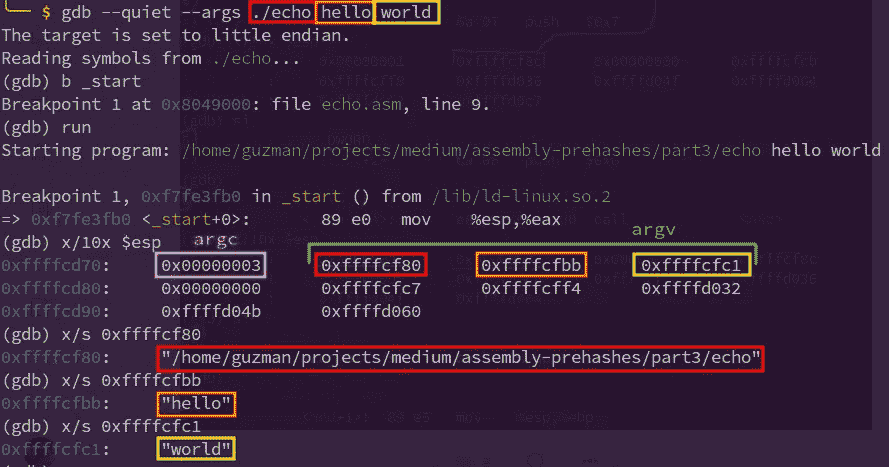
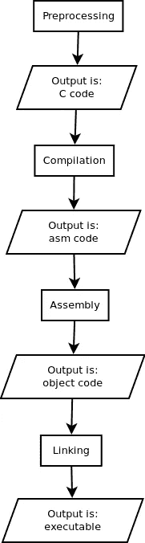
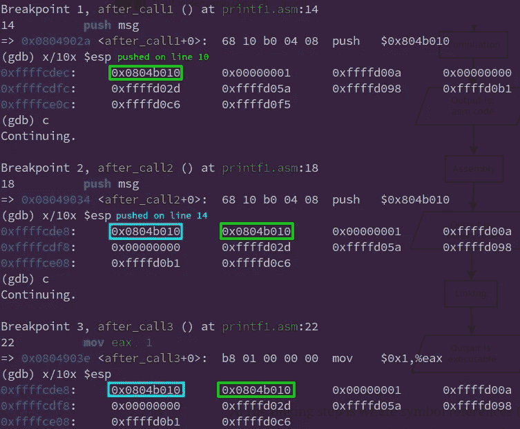
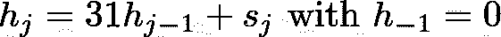
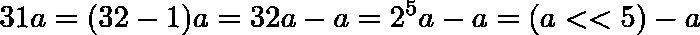
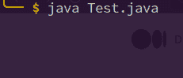
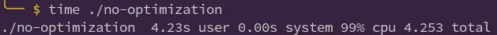
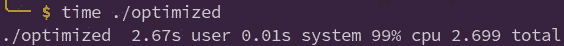

# 按示例汇编:计算字符串哈希。第 3 部分:CLI 参数和外部函数

> 原文：<https://blog.devgenius.io/assembly-by-example-compute-string-hash-part-3-cli-args-and-external-functions-c3b533e99cdd?source=collection_archive---------20----------------------->

这是“通过示例组装:计算字符串散列”系列的最后一部分，所以我建议您阅读[第 1 部分](/assembly-by-example-compute-string-hash-part-1-functions-a575240cbc5b)和[第 2 部分](/assembly-by-example-compute-string-hash-part-2-loops-ba39de0ff6d6)，以防您没有阅读过。

在这里，我们将看到如何使用 CLI 参数和外部函数，以及这如何帮助我们最终编写程序来计算字符串哈希。所以，继续读下去。

# CLI 参数

读取 CLI 参数非常类似于读取函数参数，因为内核会自动将它们存储在堆栈内存中。让我们检查一个程序的堆栈内存来更好地理解这一点。



如您所见，前 4 个字节对应于收到的参数数量。在 C 语言中，这通常存储在一个名为`argc`(参数计数)的变量中，从现在开始，我将使用这个名称来表示接收到的参数的数量。

与前 4 个字节相邻的是指向参数的`argc`指针，以可执行文件的名称或路径开始。在 C 语言中，这些通常存储在一个名为`argv`(参数值)的变量中。

很好。我觉得这里没什么新鲜的。

为了得到一些实践和增强理解，下面你会发现一个非常基础的 GNU [echo](https://www.gnu.org/software/coreutils/manual/html_node/echo-invocation.html) 程序版本。它利用了我们到目前为止所看到的东西，所以我希望你在理解它时没有任何困难。

以下是一些有助于理解代码的有用注释:

*   仅当`argc > 2`时，代码首先将由空格分隔的`argc — 1`参数写入 stdout(这是在`loop`标签内完成的)，然后仅当`argc > 1`时，将最后一个参数后跟一个换行符写入 stdout(这是在`end`标签后完成的)。
*   该代码大量使用了 syscall 代码为 4 的 [write](https://man7.org/linux/man-pages/man2/write.2.html) syscall。
*   有时在调用一个函数来恢复一个状态之前，可能会使用两次`PUSH`(第 34 和 35 行)。`[PUSHAD](https://en.m.wikibooks.org/wiki/X86_Assembly/Other_Instructions)`和`[POPAD](https://en.m.wikibooks.org/wiki/X86_Assembly/Other_Instructions)`通常用于保存和恢复寄存器值。
*   为了访问第 I 个参数，我们使用了`[ebp + 4 + eax]` ( `eax`可以替换为其他数据注册表)，其中`eax = 4 * i`是因为每个 arg 地址占用 4 个字节。需要偏移量 4，因为从`ebp`开始的前 4 个字节对应于`argc`，因此自变量列表从`[ebp + 4]`开始。

如果有帮助的话，下面是等价的 C 代码:

# 外部功能

在之前的文章中，我们提到如果我们可以使用 glibc 或其他 C 库的 strlen 这样的帮助函数，事情会变得更简单。我们现在来看看如何去做。

## 使用 libc 的 printf

为了使用外部函数，我们必须首先声明它是外部的，否则编译器会显示类似`symbol 'printf' is not defined`的错误。这非常类似于在 C 源文件中包含某些头文件(例如`stdio.h`)来访问其他目标代码文件中的函数。

让我们看看如何使用`printf`函数在汇编中打印“Hello world”。代码如下:

稍后我会解释为什么需要第 11 行(`add esp, 4`)。现在让我们回顾一下 C 源文件的“编译”过程。它由四个基本步骤组成:预处理、编译、汇编和链接。



在链接步骤中，其地址在编译时未知的符号引用(例如`printf`)被正确的替换。

因为我们的源代码是一个汇编文件，所以我们已经在第三步了，我们在[第 1 部分](/assembly-by-example-compute-string-hash-part-1-functions-a575240cbc5b)中看到`nasm -f elf32 source.asm`会将源代码编译成目标代码，而`ld -m elf_i386 functions.o -o functions`会进行链接。

正如 may 猜测的那样，现在我们需要在链接阶段做一些额外的事情，以便访问`printf`外部函数。如果我们使用`ld`来进行链接，该命令将如下所示:

```
ld -m elf_i386 printf.o -dynamic-linker /lib/ld-linux.so.2 /usr/lib/crti.o -o printf -lc
```

其中:

*   `-lc`链接通常存储在 [/lib/libc.so.6](https://www.man7.org/linux/man-pages/man7/libc.7.html) 中的实际 libc
*   `-dynamic-linker /lib/ld-linux.so.2 /usr/lib/crti.o`链接 [ld-linux.so.2](https://www.programmerall.com/article/4550137629/) (用于搜索和加载库)和 [crti.o](https://blogs.oracle.com/solaris/post/new-crt-objects-or-what-are-crt-objects) (用于启动和运行程序)。详细解释为什么需要这些目标文件是一个高级话题，超出了本文的范围。

如果你不想处理这些“罕见的”(高级的)目标文件，用 gcc 链接可能更容易:

```
gcc -m32 -nostartfiles printf.o -o printf -lc
```

其中:

*   `[-lc](https://gcc.gnu.org/onlinedocs/gcc/Link-Options.html)`链接通常存储在 [/lib/libc.so.6](https://www.man7.org/linux/man-pages/man7/libc.7.html) 中的实际 libc
*   `-m32`安排堆栈帧、可写数据和常量全部 32 位对齐。
*   `-nostartfiles`告诉编译器不要链接包含`_start`符号的 [crt1.o](https://en.wikipedia.org/wiki/Crt0) ，它被用作 C 程序的入口点。在我们的例子中，如果包含了它，我们会有一个碰撞，因为我们已经定义了它。

如果我们现在用`nasm -f elf32 -g printf.asm && gcc -m32 -nostartfiles printf.o -o printf -lc && ./printf`编译、链接和运行程序，我们应该看到“Hello world”被写到 stdout。

不错！现在让我解释一下为什么需要第 11 行(`add esp, 4`):这仅仅是因为`printf`和其他函数不从堆栈中弹出接收到的参数，也就是说，不使用指令`ret n`，其中`n`是函数参数占用的总字节数。通过执行下面的代码并检查堆栈内存，您可以看到这一点。

堆栈存储器的检查:



正如您所看到的，在第一次和第二次调用之后，被推入堆栈的参数仍然存在，然而由于`ret 4`(第 30 行)，它在第三次调用之后被自动移除

因此，你可能已经注意到，**不从堆栈**中弹出可能是危险的，而**可能导致堆栈溢出**。试试下面的例子。

## 使用 libc 函数重写 echo 示例程序

根据我们目前所学的知识，我们可以通过使用 libc 函数重写本文开头所示的 echo 示例程序。这很简单:

注意，在这种情况下，在调用`printf`之后使用`add esp, 8`，因为我们正在推送两个大小为 DWORD 的参数，它们是字符串格式和 cli 参数。

## 刷新缓冲区的需要

让我们运行下面的 Java 代码来测试 GNU echo 程序，我们的 echo 程序使用 syscalls，我们的 echo 程序使用 libc 函数，我们的 echo 程序使用没有`fflush`的 libc 函数(前面代码的第 60–62 行)。

显示冲洗重要性的代码。忽略它可以被简化的事实

我们期望执行的结果如下。

```
GNU echo
asm echo with direct calls to kernel
asm echo with libc functions (without fflush)
asm echo with libc functions
```

然而这些都是实际结果。

```
GNU echo
asm echo with direct calls to kernel
asm echo with glibc functions
```

😱`asm echo with libc functions (without fflush)`不见了！这是因为文本保存在缓冲区中，只有当缓冲区被刷新时才被打印出来。因此，我们需要在退出之前**刷新缓冲区。**

尽管看起来使用外部函数弊大于利，但这是不正确的，原因有几个。例如:

*   这些功能(通常)都经过了良好的测试，可以投入生产
*   在`printf`的情况下，缓冲比直接写入设备更有效
*   他们做其他事情是为了确保性能、安全性、一致性…

因此，人们肯定**更喜欢使用 libc 函数**。在这一系列的文章中，我没有怎么使用它们，因为我想让我们对组装有更深入的了解。

# 计算字符串哈希

终于！我们现在准备写程序来计算一个字符串散列。

回想一下，哈希由以下等式给出。


在[第 2 部分](/assembly-by-example-compute-string-hash-part-2-loops-ba39de0ff6d6)中，我们看到



其中 h sub j 是从索引 0 处的 char 到索引 j 处的 char(包括 0 和 j)的字符串的哈希。

因此，计算字符串哈希的伪代码是

```
h := 0
for i = 0; i < |s|; i++ {
  h = 31 * h + s[i]
}
```

为此，我们可以应用以下优化



左移和减法比简单乘法更有效(参见附录 A)

有了所有这些分析和我们目前对汇编的了解，编写代码应该是非常简单的。

## 测试

现在，我们可以执行下面的代码来手动验证我们的汇编代码是否按预期工作。

或者我们可以进行压力测试。



压力测试执行输出

# 结论

至此，我们结束了这一系列的职位。我希望你学到了新的有趣的东西。一如既往，如果你认为有什么地方错了或者有什么地方可以改进，请告诉我。我喜欢你的反馈。

# 附录 A: mul 与优化

让我们看看我们使用的优化是否在速度或性能上给了我们实际的改进。

## 使用`mul`

当执行程序时，我们得到如下结果



## 使用优化

当执行程序时，我们得到如下结果



正如您所看到的，通过逐位运算和减法执行乘法`31 * a`比通过简单的乘法更有效。这是因为，一般来说，左移位和减法，按位来说，是线性或常数时间运算，而乘法是准二次运算。当然，也有高效的乘法算法，如[的](https://en.wikipedia.org/wiki/F%C3%BCrer%27s_algorithm)或[的](https://en.wikipedia.org/wiki/Karatsuba_algorithm)算法，但左移和减法在这种情况下仍然更有效。