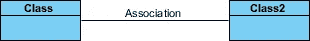
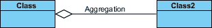
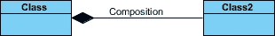
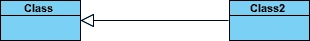
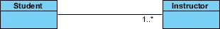
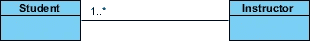
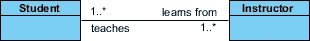
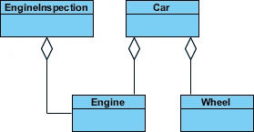
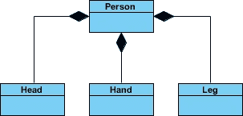
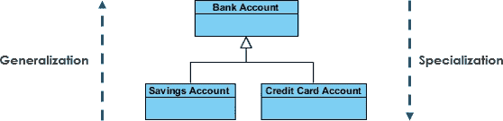

# 关联:聚合:组合模式(带 UML)

> 原文：<https://blog.devgenius.io/association-aggregation-composition-pattern-w-uml-5c68956fd689?source=collection_archive---------6----------------------->

故事涵盖差异和共性

从一个更简单的相关例子开始，让我们找出这些对象的类别之间的差异和相似之处:
**宠物**，**狗**，**尾巴/腿**，**主人**。

以下是可观察到的关系:

> **联想-** 主人爱宠物，主人喂宠物；作为回报，宠物取悦并爱主人
> 
> **聚合/合成-** 尾巴或腿是狗&猫类对象的一部分。
> 
> **继承/泛化——**猫是——宠物，狗是——宠物

## UML 摘要:

下图显示了不同类型的关联连接器符号。我们将一个一个地检查。

联合

聚合

作文

归纳

如果一个模型中的两个类需要相互通信，那么它们之间一定有联系。这种连接可以用 UML 中的关联连接器来表示。

关联可以由这些类之间的线*和指示导航方向的箭头*来表示。如果两边都有箭头或者两边都没有箭头，这种关联称为双向关联。

我们可以通过向表示关联的行添加多重性修饰来表示关联的多重性/基数。以下示例表明一名学生有一个或多个教师:

每个学生可以与许多教师相关联

每个教师有一个或多个学生

使用角色名称的关联中的对象行为

最让工程师困惑的问题是，“关联、聚合和合成之间的区别是什么”？

# 聚合与组合和关联

**聚合**和**合成**是关联的子集，意味着它们是关联的**特例。在聚合和组合中，一个类的对象“拥有”另一个类的对象。但是有一个微妙的区别:**

*   **聚合**意味着一种关系，其中*关联的类可以独立于*促进者而存在。例如，部门(辅导员)和员工(相关人员)。删除部门，员工仍然存在。
*   **组合**暗示了一种关系，在这种关系中，关联的模型不能独立于促进者而存在。
    例如，房屋(主持人)和房间(相关人员)。如果与房子分开，房间就不存在了。

## 聚合:

需要注意的是，*聚合链接并没有以任何方式声明类 A 拥有类 B，也没有声明这两者之间存在父子关系*(当父类删除了它的所有子类时，所有子类都会被删除)。其实恰恰相反！聚合链接通常用于强调一点，即**类 A 实例不是类 B 实例**的唯一容器，因为事实上同一个类 B 实例有另一个容器。该信息可以表示如下:

## 构成:

我们应该更具体地使用组合链接，在这种情况下，除了类 A 和类 B 之间的部分关系之外，这两者之间还有很强的生命周期依赖性，这意味着当类 A 被删除时，类 B 也随之被删除。下面是描述这一事实的 UML 符号。

## 结论

总而言之，关联是一个非常通用的术语，用来表示一个类何时使用了另一个类提供的功能。如果一个父类对象拥有另一个子类对象，而这个子类对象没有父类对象就不能有意义地存在，我们就说这是一个组合。如果可以，那就叫聚合。

# 一般化和专门化

## **一般化**

顾名思义，它是一种将相似的对象类组合成一个更通用的类的机制。概括识别一组实体之间的共性——共性可能是属性、行为或两者都有。换句话说，一个超类拥有最通用的属性、操作/职责以及与子类共享的关系。一个子类可能有更专业的属性和操作。

## **专业化**

这是一般化的反向过程，即从现有类创建新的子类。

例如，银行帐户有两种类型—储蓄帐户和信用卡帐户。SavingsAccount 和 CreditCardAccount 继承了 accountNumber、accountBalance 等公共/通用属性。从一个银行账户。然而，他们也有自己的专业属性，如未结算的付款等。

以下是一般化和专门化的 UML 表示:

一般化和专门化

# 概括和继承

最后，概括和继承之间的模糊性。

**一般化**是一个术语，我们用它来表示在 UML 中将公共属性抽象成一个基类。 **UML** 图的**一般化**关联也被称为**继承**。当我们在编程语言中实现泛化时，很多人通常称之为继承。概括地说，概括是通过继承过程实现的目标。所以在一天结束时，他们指的是同一个事实。术语的不同取决于它被表达的上下文。