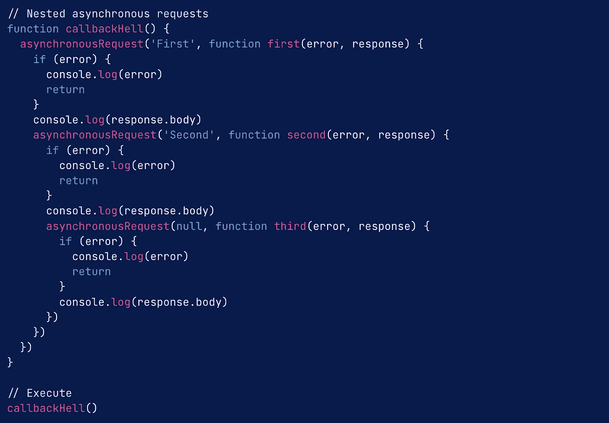
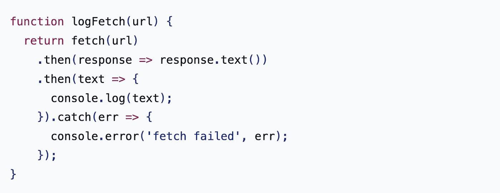
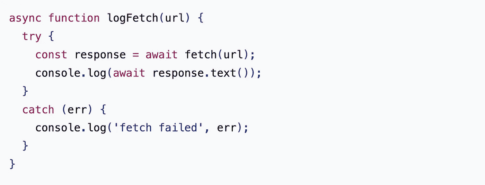

# 异步/等待:回到未来

> 原文：<https://blog.devgenius.io/async-await-back-to-the-future-2a4575afc964?source=collection_archive---------9----------------------->

Async/Await 是 JavaScript 的一个相对较新且辛辣(高级)的概念，它是在 2017 年作为 ECMAScript 2017 JavaScript edition 的一部分添加的。但是它到底是什么，它与以前处理异步 JavaScript 的方法有什么不同？这是一个高层次的概述，底部有指向更深层资源的链接！

## 首先，让我们澄清一些事情:

术语。对于新程序员来说，学习新概念(如 async/await)最困难的部分之一是理解这些词实际上指的是什么。例如，async/await 通常简称为“async”——当我第一次开始学习异步编程时，我错误地认为“async”= = =“async”。事实并非如此。异步是一个通用术语，指的是 JavaScript 或其他语言如何执行代码；“async”是 2017 年在原生 JavaScript 中添加的特定关键字，为我们提供了新的功能。

理解其他几个术语很重要:

***Promises:****Promises 指的是一个预期值，在我们的代码运行时，这个值可能已经返回，也可能还没有返回。承诺可以有四种不同的状态:*

*   履行:我们的承诺已经有了回报
*   拒绝:我们的承诺没有得到回报
*   待定:承诺仍处于待定状态，即尚未履行或拒绝
*   已解决:承诺已履行或被拒绝

***回调函数:****JavaScript 中的函数是“一级”(也就是说，你可以在原来的(“高阶”)函数内调用其他函数)——你在高阶函数内调用的函数是“回调”函数。在 JavaScript 增加承诺之前，回调函数是 JavaScript 处理异步(非 ASYNC)功能的唯一方法。*

***异步与同步:*** *JavaScript 设置为同步读取代码。这意味着 JavaScript 喜欢一次读取一段代码，执行它，然后继续读取下一段代码。这很好，但通常我们更喜欢 JavaScript 同时处理多个任务，多任务。*

*   对我来说最有意义的例子来自安基特·辛格。想象一家餐馆。在异步代码中，服务员来到您的桌子前，接受您的订单，将其发送到厨房开始烹饪，然后到其他桌子接受他们的订单，并与厨房一起排队用餐。在同步代码中，服务员来到你的桌子前，接受你的订单，将其传递到厨房，然后等待厨师完成你的烹饪，将它带给你，然后前往下一张桌子接受他们的订单——显然，以这种方式运营的餐厅会毫无理由地效率低下，并且可能不会持续很长时间。

## 有道理。这怎么是新的？？

*所以，JavaScript 中的异步功能并不新鲜。它已经存在了很长时间，但它变得越来越高效、有效和易于消化。*

**最初**，当程序员想要同时运行多个函数时，他们不得不完全依赖回调函数(如果你还记得的话，更多函数中的函数)。这种方法工作正常，但是它有一些意想不到的后果:

*   当我们在另一个函数中调用一个函数时，那个函数变成了嵌套的。当回调函数返回值时，如果我们想对它做一些额外的事情，我们必须调用第二个(然后可能是第三个、第四个、第十个)嵌套回调函数。当我们开始使用 JavaScript 从 API 中提取数据时，这变得尤为重要——我们对数据挖掘得越深，我们的 origin 函数就变得越强大。
*   这不仅对于人类来说非常难以阅读和理解，而且还会产生范围和错误处理问题。很难确定错误源自哪里，如果我们想要重用从函数中间返回的一些数据，我们也无法做到，因为新的原始函数无法看到数据所在的第一个原始函数的深度。这种风格创造了通常所说的“回调地狱”或“末日金字塔”。见下面的例子叶 olde 回调金字塔下面(blegh！):

注意:这个例子是我从 Digital Ocean 借来的，它有一篇关于这个主题的[优秀的深度文章](https://www.digitalocean.com/community/tutorials/understanding-the-event-loop-callbacks-promises-and-async-await-in-javascript)

**然后，在 2012 年，** promise 功能被引入 JavaScript。这很棒，有几个原因:

*   承诺可以被链接——这允许我们缩短和扁平化我们的异步代码，用。then()链接功能。
*   此外。then()链接功能迫使我们的异步代码顺序运行。第一个。然后()返回一个承诺值*(不是结果值)*，即我们的第二个。然后()可以对*采取并执行一个额外的操作，而不用嵌套。*这看起来更加清晰易懂，更重要的是解决了我们之前的范围问题。

> 好的，但是我认为我们正在尝试异步地做事情，为什么我现在想要它们顺序地执行呢？因为我们不希望代码中的所有内容都随意运行。有些函数在运行之前依赖于另一个函数的结果，所以我们需要它们按顺序运行，但是在它们运行的同时，我们可能在那个函数之外还有其他操作在继续！
> 
> 举个例子:如果你在等待网页的一部分加载，你不希望整个网页在等待加载内容的过程中被冻结，你仍然希望能够像平常一样在网页上移动。

*   最后，它还允许我们使用一个。catch()来查找错误，而不是您在上例中看到的许多“if (error)”表达式。

查看使用 promises 和 chaining 从 API 和 console.log()中检索数据的示例，如下所示:

这个例子借用了[的 web.dev](https://web.dev/async-functions/)

干净多了。即使我们有 3 个回调函数，就像我们在第一个例子中看到的那样，与这里的 2 个相比，这也非常容易读写。

**然后在 2017 年，**我们将 async/await 添加到 JavaScript 中。看看上面的例子，用 async/await 编写:

还借用了 [web.dev](http://---  Async/Await: Back to the Future  ---  Async/Await is a relatively new and spicy (advanced) concept to JavaScript that was added in 2017 as part of ECMAScript 2017 JavaScript edition. But what is it really, and how different is it from the methods for handling asynchronous JavaScript that came before? This is intended to be a high-level brief on the concept geared towards junior programmers to provide a foundational understanding, with links to deeper resources at the bottom! First, let's set a few things straight: Terminology. For new programmers, one of the hardest components of learning new concepts like async/await is understanding what theses words actually refer to. For example, async/await is often referred to in short-hand as "async" - when I first began learning about asynchronous programming, I made the mistake of assuming that "asynchronous" === "async". This is not the case. Asynchronous is a general term referring to how JavaScript (or other languages) goes about executing your code; "async" is a specific keyword added to native JavaScript in 2017 that gives us new functionality.  A few other terms that will be important to understand: Promises: Promises refers to an anticipated value that may or may not yet have returned at the time our code is running. A promise can be in one of 4 different states: Fulfilled: Our promise has returned a value Rejected: Our promise has failed to return the value Pending: Promise is still pending i.e. not fulfilled or rejected yet Settled: Promise has either fulfilled or rejected  Callback functions: Functions in JavaScript are "first-class" (aka, you can call other functions within the original ("higher order") function) - the function(s) that you call within the higher order function is the "callback" function. Prior to the addition of promises to JavaScript, callback functions were the only method JavaScript had for handling asynchronous (NOT ASYNC) functionality. Asynchronous vs. Synchronous: JavaScript is set up to read code synchronously. This means JavaScript likes to read one piece of code at a time, execute it, and then move on to reading the next piece of code. That's nice, but often we prefer JavaScript to juggle multiple tasks simultaneously, multi-tasking.  The example of this that made the most sense to me comes from Ankit Singh. Imagine a restaurant. In asynchronous code, the waiter comes to your table, takes your order, sends it to the kitchen to get started cooking, and then goes on to other tables to take their orders and queue their meals with the kitchen. In synchronous code, the waiter comes to your table, takes your order, passes it to the kitchen, and then hangs out waiting for the chef to finish cooking your meal, brings it to you, before heading over to the next table to take their order - obviously a restaurant that operated this way would be incredibly inefficient for no reason and would likely not last long.   That makes sense. How is this new?? So, asynchronous functionality in JavaScript isn't new. It has been around for a long time, but it has become more and more efficient, effective, and digestible. A little history on its evolution: Initially, when programmers wanted to run multiple functions in conjunction with one another, they had to rely solely on callback functions (functions within more functions, if you recall). This worked okay, but it had some unintended consequences: When we called a function within another function, that function became nested. When that callback function returned a value, if we wanted to do something additional with it, we had to call a second (and perhaps then a third, fourth, tenth) nested callback function. This became especially relevant as we began to use JavaScript to pull data down from APIs - the deeper we drilled into the data, the chonkier our origin function became.  Not only is this super difficult for humans to read and follow, but it also created scope and error handling issues where it was difficult to pinpoint where an error originated, and if we wanted to re-use some of the data returns from the middle of the function, we were unable to because a new origin function couldn't see into the depths of the first one where the data lived. This style creates what is commonly referred to as "callback hell" or the "pyramid of doom". See an example below of ye olde callback pyramid below (blegh!):  Note: I borrowed this example from Digital Ocean, which has an excellent in-depth write-up on this topicThen, in 2012, promise functionality was introduced to JavaScript. This was great for a couple of reasons: Promises can be chained - This allowed us to shorten and flatten our asynchronous code, reducing our callback functions with the .then() chaining capability. Additionally, the .then() chaining capability, forced our asynchronous code to run sequentially. The first .then() returns a promise value (not a result value), that our second .then() can take and perform an additional operation on, without nesting. This looks cleaner and more understandable, and more importantly resolves our scope issues from before.  Okay, but I thought we were trying to do things asynchronously, why would I now want them to execute sequentially? Because we don't always want everything in our code running willy nilly. Some functions rely on the result of another function before they can run, so we need them to operate sequentially, but while they're doing that we may have other operations that going on outside of that function that can continue!  An example: if you're waiting on part of a webpage to load, you don't want the whole thing to freeze while it waits for the loaded content, you still want to be able to move around the page like normal.  Lastly, it also allows us to use one .catch() to lookout for errors instead of the many "if (error)" expressions you saw in the example above.  Check out the example of using promises and chaining to retrieve data from an API and console.log() it, below: This example borrowed from web.devWay cleaner! Even if we had 3 callback functions like we saw in the first example, versus 2 here, this is insanely easier to read and to write.  And then in 2017, we come to the addition of async/await to JavaScript. Check out the same example as above, written with async/await:)

它变得更干净了！这到底是怎么回事？

这是同一个函数，但是我们已经能够抛弃回调函数并减少代码所需的行数。

从功能上来说，这段代码与我们的承诺和链接版本没有什么不同。我们在函数前面看到的“async”关键字的作用是让 JavaScript 知道这个函数将是异步的。这现在是 JavaScript 的一项固有功能。

我们现在还可以在我们的异步函数*中使用关键字“await”(注意，你不能全局使用“await”，只能在异步函数中使用，至少现在是这样)*来告诉 JavaScript 我们需要这个函数完成，然后才能继续下一段代码*。Await 本质上取代了。然后()，减少了之前冗长的承诺返回指令。它掩盖了我们的功能是返回和消费承诺，使它看起来更像一个同步的结构，更容易被人类阅读和理解，同时仍然在幕后执行那些相同的操作。*

*此外，我们现在可以在函数中使用 try()和 catch()来代替。然后()和 catch()来处理函数中任何潜在的错误。*

## *总之:*

*这里的要点是，在 Promises 彻底改变了程序员在 JavaScript 这样的语言中处理异步功能的方式之后，async/await 已经重复了这一改进，并使异步功能在 JavaScript 中变得自然。*

*它更易于阅读、理解和编写——使代码更加简洁，更易于调试，并具有更易访问的功能。*

*如果您想更深入地了解承诺和异步的机制，请查看下面的一些资源！*

# *推荐读物*

***数字海洋** — [*理解 JavaScript 中的事件循环、回调、承诺和异步/等待(教程)*](https://www.digitalocean.com/community/tutorials/understanding-the-event-loop-callbacks-promises-and-async-await-in-javascript)*

***Mozilla 开发者网** — [*如何使用承诺*](https://developer.mozilla.org/en-US/docs/Learn/JavaScript/Asynchronous/Promises) 和 [*使用承诺*](https://developer.mozilla.org/en-US/docs/Web/JavaScript/Guide/Using_promises)*

***develop intelligence**—[*Async/Await 从何而来，为何使用？*](https://www.developintelligence.com/blog/2017/06/asyncawait-come-use/)*

***web . dev**—[*JavaScript Promises:简介*](https://web.dev/promises/) 和 [*异步函数:友好地许下诺言*](https://web.dev/async-functions/)*

***dev . to**—[*JavaScript Async/Await 优于 Plain Promises 的 7 个理由(教程)*](https://dev.to/gafi/7-reasons-to-always-use-async-await-over-plain-promises-tutorial-4ej9?ref=hackernoon.com)*

***loginradius** — [*回调 vs 承诺 vs 异步等待*](https://www.loginradius.com/blog/engineering/callback-vs-promises-vs-async-await/)*