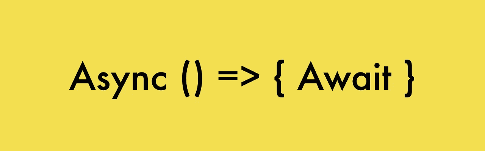

# NodeJS 中的异步/等待

> 原文：<https://blog.devgenius.io/async-await-in-nodejs-644c6f55b19?source=collection_archive---------12----------------------->



在这篇文章中，我们将学习如何用 async/await 简化基于回调或承诺的 NodeJS 应用程序。如果你想阅读 NodeJS 中的承诺，那么请阅读我之前的帖子[这里](https://krp-ajay.medium.com/promise-in-nodejs-d8db90fcdd48)。

## **NodeJS 中的异步函数是什么？**

异步函数本身在 NodeJS 中可用，并且用 Async 关键字声明。Async 总是返回一个承诺，即使你没有明确地写他们这样做。另外，await 关键字目前只在异步函数中可用— **它不能在全局作用域**中使用。

异步/等待的好处是什么

1.  它允许我们在异步函数中使用 await 关键字。如果没有 async 关键字，等待它被视为错误
2.  它允许异步函数返回承诺

Promise/async/await/Normal JS 函数示例以下三个函数 a、b、c 都是相同的

```
/**
 * @returns {Promise<string>}
 */
function a() {
    return Promise.resolve('a');
}
async function b() {
    return Promise.resolve('b');
}

async function c() {
    return 'c';
}
console.log(a());
console.log(b());
console.log(c());
```

## **异步/等待之间的差异&承诺**

作为承诺，我们必须写信。然后用回调函数，但在异步等待中，我们可以简单地摆脱。然后函数(。然后被 await 替换)。

```
let run = async () => {
    // Promise version of code
    read('../dir/file1.txt')
        .then(data => {
        console.log(data.toString());
    }).catch(err => {
        console.log(err)
    })

    // Async/Await version
    const data = await read('../dir/file1.txt');
    console.log(data.toString());

    // Async-Await version of reading multiple files
    const [data1, data2, data3] = await Promise.all([
        read('../dir/file1.txt'),
        read('../dir/file2.txt'),
        read('../dir/file3.txt')
    ])

    console.log(data1.toString());
    console.log(data2.toString());
    console.log(data3.toString());
}

run()
```

当我们使用 async/await 时，我们很少需要。然后，因为 await 处理等待我们。

## 异步等待中的错误处理

如果承诺正常解析，那么 wait promise 返回结果。但是在拒绝的情况下，它抛出错误，就像在那一行有一个 throw 语句一样。下面的代码片段和

```
async function getData() {
  return Promise.reject(new Error("New Error!"));
}
```

这些代码片段是相同

```
async function getData() {
  return new Error("New Error!");
}
```

我们可以使用 try 来捕捉这个错误..接球，和普通投掷的方式一样。如果出现错误，控件将跳转到 catch 块。

```
async function getData() {

  try {
    let response = await fetch('http://someurl');
  } catch (err) {
    // Error!
    alert(err); 
  }
}

getData();
```

如果我们不去尝试..catch，那么调用异步函数 f()生成的承诺将被拒绝。我们可以追加。接住来处理它:

```
async function getData() {
  let response = await fetch('http://someurl');
}

// getData() becomes a rejected promise
getData().catch(alert); // Error!
```

如果我们忘记添加。捕捉那里，然后我们得到一个未处理的承诺错误(在控制台中可见)。我们可以使用全局 unhandledrejection 事件处理程序来捕捉这样的错误。

这就是我在 async/await 上要分享的全部内容。如果你有更多的观点要分享，请在下面评论。它将帮助我和其他人获得更多关于 async/await 的知识。感谢阅读。请关注支持和更多这样的内容。

你喜欢这篇文章吗？如果有，通过 [**订阅获取更多类似内容解码，我们的 YouTube 频道**](https://www.youtube.com/channel/UCvEB7wXUEXGFE9lCx0USR3Q) **！**

注:更多精彩内容还可登陆 [https://ajaykrp.me](https://ajaykrp.me/) 。请检查一下。