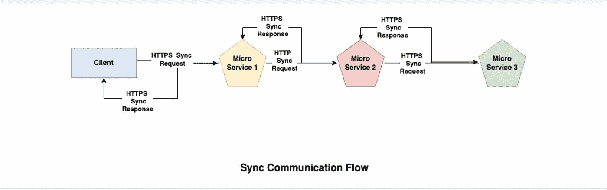
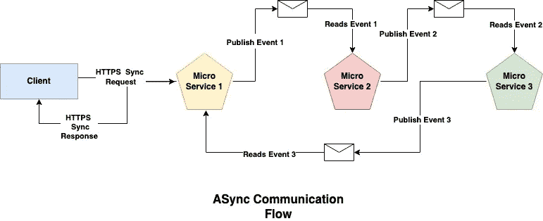

# 异步通信 101

> 原文：<https://blog.devgenius.io/async-communication-101-b04d5c95333a?source=collection_archive---------6----------------------->

这篇博客是我们从零开始讨论**云**概念的系列文章的一部分，面向的是入门知识有限的读者。这篇文章属于*中级*系列，因为它涉及到构建异步通信和相关的基本概念。

云系列中的一些早期博客如下:

[**负载均衡 101**](/load-balancing-101-8251350c033f)[**缓存 101**](/caching-101-634ef4f8ed1b)[**数据库 101**](/database-101-13d593ec4078)

# 什么是异步通信？

异步是业务应用程序的两个不同组件之间的通信模式，不需要实时交互。原则上，发送方根据客户动作在队列/主题中丢弃消息，接收方根据设置的 [***TTL(生存时间)***](https://en.wikipedia.org/wiki/Time_to_live) 和交付语义读取相同的内容，以继续业务流。

与使用 [***REST API 的***](https://en.wikipedia.org/wiki/Representational_state_transfer) 构建的传统同步模式不同，在传统同步模式中，端到端 API 响应是分布式架构中所有组件可用性的一个因素，异步系统可以独立扩展，以满足高端 ***(每秒事务数)*** 需求。然而，同时它的主要缺点是消息传递的可靠性和再次重放数据的需要。因此，现代体系结构倾向于遵循一种混合模型，使用异步和同步模式来满足可伸缩体系结构的端到端非功能性需求。

# 异步与同步通信流

## 顺序流程

1.  客户端根据业务流程调用*微服务 1* 作为 **HTTPS GET/POST** 请求。
2.  *微服务 1* 内部调用*微服务 2* 来获取关于业务功能的信息，作为 **HTTPS GET/POST** 请求。
3.  *微服务 2* 内部调用*微服务 3* 来获取关于业务功能的信息，作为 **HTTPS GET/POST** 请求。
4.  一旦*微服务 3* 发回响应，同样由*微服务 2* 和*微服务 1* 依次链接回客户端。

总往返时间是第 1 步、第 2 步、第 3 步、第 4 步针对端到端 API 延迟所用的时间。

## 顺序流程

1.  客户端根据业务流程调用*微服务 1* 作为 **HTTPS GET/POST** 请求。
2.  *微服务 1* 在消息总线中发布一个*事件 1* 来交付客户载荷。
3.  *微服务 2* 读取*事件 1* 并在消息总线中发布一个*事件 2* 来交付修改后的净荷。
4.  *微服务 3* 读取*事件 2* 并在消息总线中发布一个*事件 3* 以将确认传递回*微服务 1* 。

总的往返时间是第 1 步和第 2 步所用的时间，以及客户机得到确认的时间。

# 异步通信术语表

## 制片人/出版商

生成消息并在消息传递基础结构中排队的客户端。

## 消费者/订户

接收消息并在消息传递基础结构中将其出队的客户端。

## 主题

主题是消息基础设施中的逻辑分类，用于组织给定业务需求的消息。一个或多个订阅者可以阅读来自单个主题的消息。

## 长队

与主题类似，队列充当发布者/订阅者的消息存储库，主要区别在于它主要服务于一个订阅者，而不是主题广播用例中的多个订阅者。

# 例子

以便在本地系统上使用 docker 运行轻量级消息代理系统的示例 Docker 应用程序。

 [## docker-images/images/Kafka at main Amit 894/docker-images

### 回购是为了学习码头工人。通过在 GitHub 上创建帐户，为 amit894/docker-images 开发做出贡献。

github.com](https://github.com/amit894/docker-images/tree/main/images/kafka) 

# 摘要

异步通信已经成为公共云或私有云上分布式和可扩展部署的重要组成部分。根据定制应用的需要，基于队列或主题的消息平台都可以用在端到端功能架构中。其中比较流行的有以下几个——[**AWS Messaging**](https://aws.amazon.com/messaging/)、 [**Azure Messaging**](https://azure.microsoft.com/en-us/solutions/messaging-services/) 和 [**GCP Messaging。**](https://spring.io/guides/gs/messaging-gcp-pubsub/)

*如需反馈，请留言至****Amit[dot]894[at]Gmail[dot]com****或联系 https://about.me/amit_raj*[*的任何一个链接。*](https://about.me/amit_raj)