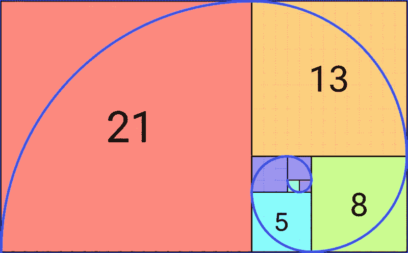

# Rust 中的异步递归函数

> 原文：<https://blog.devgenius.io/async-recursive-functions-in-rust-dce0a1134fed?source=collection_archive---------8----------------------->

不能在 Rust out of the box 中创建递归异步函数是非常令人困惑的。但是也有解决方案，我喜欢在本文中讨论。



[https://en.wikipedia.org/wiki/Fibonacci_number](https://en.wikipedia.org/wiki/Fibonacci_number)

最近，有人问我递归函数是如何工作的，我举了一个众所周知的例子:递归生成斐波那契数。

如果你已经理解了这个理论并且有了一些创建函数的经验，那么它的实现是非常容易的。

以下是我的解决方案:

```
fn fibo(n: u64) -> u64 {
    match n {
        0 => 0,
        1 => 1,
        _ => fibo(n - 1) + fibo(n - 2),
    }
}

fn calculate_sync(n: u64) {
    println!("The fibonacci number of n = {} is {}.", n, fibo(n));
}

fn main() {
    calculate_sync(10);
}
```

(对于 Rust 初学者，我在这里不深入研究模式匹配功能。但是您可以通过 if 语句模拟模式匹配。读作*如果零，那么零，等等。*)

对我在低挂水果上的成功充满信心，我有信心以异步方式重写这个问题。

但是:“电脑说不行”，我现在如履薄冰。

# 现在递归的方法

如您所见，使其异步的逻辑结论是直截了当的:

```
async fn async_fibo(n: u64) -> u64 {
    match n {
        0 => 0,
        1 => 1,
        _ => async_fibo(n - 1).await + async_fibo(n - 2).await,
    }
}
```

但是这产生了一个错误:

```
error[E0733]: recursion in an `async fn` requires boxing
  --> src/main.rs:10:32
   |
10 | async fn async_fibo(n: u64) -> u64 {
   |                                ^^^ recursive `async fn`
   |
   = note: a recursive `async fn` must be rewritten to return a boxed `dyn Future`
   = note: consider using the `async_recursion` crate: https://crates.io/crates/async_recursion

For more information about this error, try `rustc --explain E0733`.
error: could not compile `fibonacci` due to previous error
```

这是因为 async 关键字将函数定义移动到一个 future 定义中，而这个 future 是一个 trait 对象，具有动态大小。这是由编译器在内部完成的，对于初学者来说，*异步 fn* 总是*或者别的什么*令人困惑。(Rust 充满了所有这些类型的快捷键和语法糖。)因此，不能开箱即用，需要使其静态化。正如错误消息所暗示的，您必须将它包装到一个 [Box](https://doc.rust-lang.org/std/boxed/struct.Box.html) 中，因为 Box 容器是固定大小的[智能指针](https://medium.com/@romeo-disca/smart-pointers-in-rust-158046006f15)并且在函数签名中只允许固定大小的构造。

那么，下一步该怎么办呢？摆弄这种定义是一个兔子洞。幸运的是，有相当好的解决方案。

# 期货箱

期货创造给了你处理这个问题的功能。

以下是如何操作的链接:

 [## Rust 中的异步编程

### 在内部，async fn 创建一个状态机类型，包含每个等待的子未来。

rust-lang.github.io](https://rust-lang.github.io/async-book/07_workarounds/04_recursion.html) 

把它重新组织成我们的斐波那契问题，我们必须导入这个箱子来让它工作。

现在解决方案看起来是这样的:

```
/// https://rust-lang.github.io/async-book/07_workarounds/04_recursion.html
use futures::future::{BoxFuture, FutureExt};
fn async_fibo(n: u64) -> BoxFuture<'static, u64> {
    async move {
        match n {
            0 => 0,
            1 => 1,
            _ => async_fibo(n - 1).await + async_fibo(n - 2).await,
        }
    }.boxed()
}
```

不用说，你还需要导入一个像 [tokio](https://tokio.rs/) 这样的异步运行时作为依赖。

```
#[tokio::main]
async fn main() {
    let n = 10;
   println!("The fibonacci number of n = {} is {}.", n, async_fibo(n).await);
}
```

但这变得更容易了。

# 异步递归箱

有了这个机箱，我们就不需要像 futures 机箱那样给我们的应用程序提供太多额外的代码，我们可以保持我们直观的、从上面第一次尝试的方法。

```
use async_recursion::async_recursion;
#[async_recursion]
async fn async_fibo(n: u64) -> u64 {
    match n {
        0 => 0,
        1 => 1,
        _ => async_fibo(n - 1).await + async_fibo(n - 2).await,
    }
}
```

也就是说，对于这个异步函数递归问题，我们有最好的解决方案。

# 结论

当编译器弹出一个初学者无法理解的神秘消息时，这个问题空间给了我们如何处理这种不愉快的编程体验的见解。

最好的方法是一直谷歌它，因为其他人可能已经提出了你的问题的解决方案并记录下来。

别忘了在短暂休息后，带着全新的思维去接近谷歌。挫折是学习一门新编程语言的主要原因，尤其是 Rust。

到回购:[https://github.com/rusticus-io/async-recursion](https://github.com/rusticus-io/async-recursion)