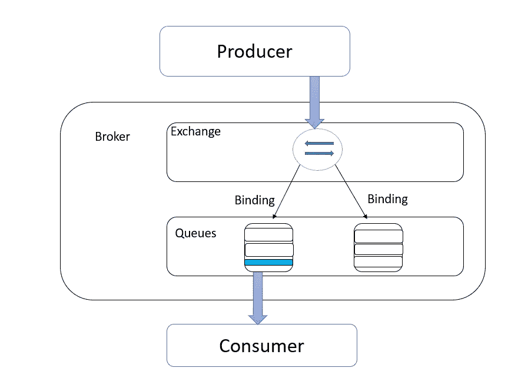
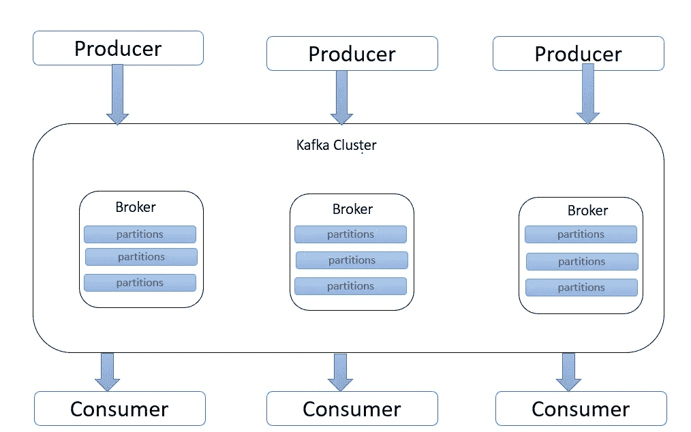

# 带消息传递的异步 Rest 服务

> 原文：<https://blog.devgenius.io/async-rest-services-with-messaging-5036723432fb?source=collection_archive---------5----------------------->

*   如今，我们比以往任何时候都更加依赖数据来完成工作。应用程序、服务、软件、移动设备和其他元素结合在一起，形成了影响我们生活大部分领域的 web 服务。
*   因此，为了处理彼此之间的数据流，程序员使用消息代理和类似的工具来交换信息和进行通信。
*   消息代理是让应用程序、服务和系统进行通信和交换信息的软件模块。

> 消息代理通过在正式的消息传递协议之间转换消息来实现这一点，使相互依赖的服务能够直接相互通信。

**为什么我们需要信息传递系统？**

*   基本上，我们使用消息系统**可靠地将消息从发送者的设备转移到接收者的设备**。消息传递的好处包括:远程通信。消息传递让我们能够分离应用程序来通信和传输数据。

**什么是异步和同步程序？**

*   同步程序:使用阻塞调用的程序。为了在调用过程中不冻结，它必须有两个或更多的线程(这就是为什么它被称为同步的——线程是同步运行的)。
*   异步程序:使用非阻塞调用的程序。它可以只有一个线程，但仍然保持交互。
*   异步描述两个或多个事件/对象之间的关系，这些事件/对象在同一系统内交互，但不以预定的时间间隔发生，并且不一定依赖于彼此的存在才能发挥作用。
*   但是我们大部分时间用来做微服务的协议是 HTTP，它是同步协议。所以只要你使用 HTTP 实现微服务，这就变成了同步。
*   Kafka 和 RabbitMQ 是两个最受欢迎的消息代理**,它们在生产者和消费者之间传递消息。**

# **RabbitMQ:**

兔子 q

*   RabbitMQ 使用独特的有界数据流。消息由生产者创建和发送，由消费者接收。这个代理最适合处理交易数据，比如订单形成和下单，以及用户请求。RabbitMQ 向用户发送消息。这些消息一经处理，将从队列中删除。

> RabbitMQ 的好处是能够灵活地路由消息。基于直接或正则表达式的路由允许消息连接特定的队列，而无需额外的代码。

**RabbitMQ 消息代理由以下部分组成**。

1.  发送消息的生产者-用户应用程序
2.  exchange-将邮件推入队列。示例交换类型有*直接、主题、标题和扇出。*
3.  队列——每个交换都包含缓冲区或类似缓冲区的东西来存储消息。
4.  接收消息的消费者用户应用程序

在 RabbitMQ 中，调度在某些情况下不能正常工作。

*   默认情况下，RabbitMQ 会将每条消息按顺序发送给下一个消费者。这样每个消费者都会得到相同数量的消息。这种分发消息的方式称为循环调度。
*   考虑一个有两个工人的情况，这些进来的工作将在这两个工人之间平均分配。所以假设一个接一个的工作负荷重，一个接一个的工作负荷轻，那么可能有一个工作人员一直处于工作负荷重的状态，而另一个可能处于自由状态。
    一个工人会一直重复忙碌，而另一个几乎什么也不做。
*   就像 RabbitMQ 不知道任何关于它的事情，仍然会均衡地发送消息。它不关心消费者的未确认消息的数量。它只是冲动地将每第 n 条消息分派给第 n 个消费者。
*   因此，可能会有这样的事件，一个可能空闲，而另一个可能堆积消息。

> 所以为了避免这种情况，RabbitMQ 有一个名为**的属性——公平调度**。它有一个特性叫做预取。此预取值用于指定同时发送多少条消息。所以它一直等到消息处理结束。在这种情况下，当其他用户处于空闲状态时，一个用户可能不会堆积这些消息。
> 
> 因此，在这个消息处理过程中，可能会出现另一种可能性。

*   由于某些原因，在消息处理过程中，消费者可能会有一些损失，正在处理的消息可能不完整，那么数据将会丢失。为了确保数据不丢失，RabbitMQ 使用被称为 **ACK** 的消息确定。
*   所以这里 will consumer 从 RabbitMQ 收到一条消息并处理它，它反馈给 RabbitMQ，RabbitMQ 在收到反馈后从队列中删除这条消息。所以它会覆盖这个有损属性。

现在让我们看看卡夫卡是如何做到这一点的。

# **卡夫卡:**

*   在卡夫卡那里，我们有一个主题，所以这个信息的发表将会指向这个主题。
*   不像 RabbitMQ 中使用的循环技术，Kafka 使用消费者群体来避免我们上面讨论的问题。消费者群体是一组消费者，他们合作消费来自某些主题的数据。所有主题的划分在组中的消费者之间进行。

    **想到一个题目名叫销售。**

> 所以我们有一些隔板。同一销售主题的 P-0、P-1、P-2。当我们向 Kafka broker 发布消息时，它会遵循一种算法。
> 该算法使用一个密钥，且它用我们拥有分区的数量来修改这个密钥。因此，它采用该值进行处理，并根据该值划分分区。因此，相同的客户消息总是传递到相同的分区。(如果我们使用客户编号作为关键字)。

*   所以在卡夫卡那里，这种秩序只存在于划分中，而不存在于主题中。
*   因此，我们可以让消费者，我们可以让他们听每一个部分。所以，使这一组消费者是同一个组，然后消息将在同一个消费者组内传递。但是有一个限制。

> 如果我们有 3 个参与者，如果我们的消费者组有 4 个消费者，其中一个将是空闲的，因为它受限于我们拥有的分区数量。
> 消费者组中的消费者数量应小于或等于我们拥有的分区数量。

> 所以以上讨论的观点是我们可以用 Kafka 和 RabbitMQ 做同样的工作，但重点是我们不一定要 Kafka 这样做。显然 rabbitMQ 的特性就足够了。但是可能会有一些处理/一些事件，我们可能需要卡夫卡来做。

## 理解卡夫卡的消费补偿:

*   消费者偏移量是一种跟踪 Kafka 主题接收消息的顺序的方法。它会一直保存，直到消息被发送给消费者，所以过一会儿消费者回来时，卡夫卡知道从哪里恢复发送过程。