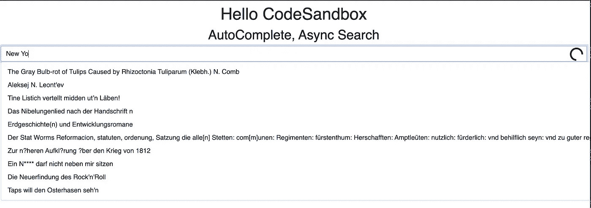
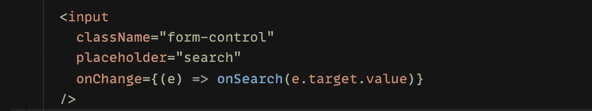
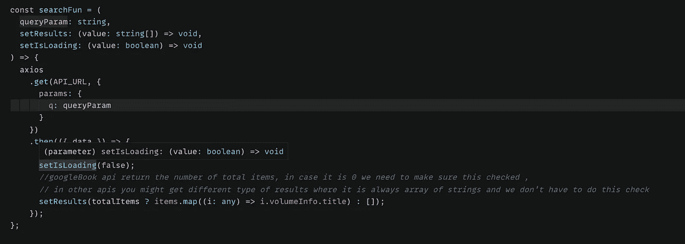
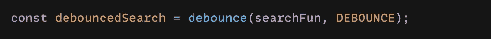
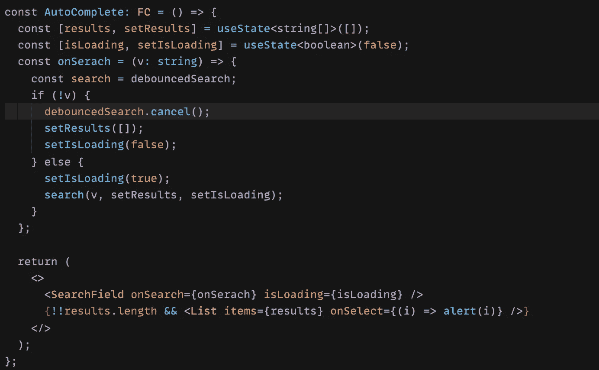

# 带 React、axios 和 lodash 去抖的异步自动完成搜索。

> 原文：<https://blog.devgenius.io/asynchronous-autocomplete-search-with-react-axios-and-lodash-debounce-b59e57be5b3b?source=collection_archive---------2----------------------->

试图展示如何使用 _ 去抖 API 调用。react 中的去抖和 axios。

**挑战**

基本上，我们希望使用去抖来限制网络调用，这样我们就不会在每次击键时从 API 端点获取选项列表，而是每 500 毫秒获取一次。

**如何建造这个**

这里我不会详细介绍 UI，但我会留下沙盒和示例回购的链接。

输入字段可以不受控制，我们只希望输入值是我们的搜索查询。因此，输入字段可以保持不受控制，需要 onChange 来触发我们的搜索功能。

> 请注意，我不会在这里显示任何 UI/UX 实现，您会在完整的代码示例中找到所有借助 bootstrap 实现的内容。

如你所见，onSearch 函数接受一个字符串，这将是我们的搜索查询。但是该功能应该仅在一定时间后触发搜索，即去抖搜索。以下是如何做到这一点:

首先，我们需要一个执行 API 调用的搜索函数，而且这个函数还可以设置结果状态，也可以设置加载状态，所以它将带三个参数，**search query、setResult 函数和 setLoading 函数。**

> 我使用 axios 来管理这一点，但您不必这样做，您可以使用本机 fetch api 或任何其他库

然后我们需要去抖这个功能，我们可以简单地使用 lodash 去抖

关键是要明白，去抖是一个函数，它接受一个函数，**不是作为回调**和等待时间，并且不调用或执行该函数，而是返回一个可以被调用的函数。
[https://lodash.com/docs/4.17.15#debounce](https://lodash.com/docs/4.17.15#debounce)

> **注意:前两个函数可以存在于组件之外，这样更好，因为我们不想每次组件状态改变时都启动它们**

现在我们已经为 onSearch 函数做好了一切准备，让我们看看它在我们的组件中会是什么样子:

以下是回购的链接，您可以在这里看到完整的示例:

 [## GitHub-nassif 7/Autocomplete-async-search:使用 CodeSandbox 创建

### 用 CodeSandbox 创建，我得到了这个挑战，以建立一个异步自动完成搜索组件。我不得不使用…

github.com](https://github.com/nassif7/Autocomplete-async-search) 

这不是一个展示 lodash 去抖的例子，而是展示如何在 react 组件中有效地使用去抖。
我看到许多使用 useEffect 或受控输入字段的例子，我觉得这有问题，我不喜欢在这样的用例中使用效果挂钩，而且将不真正依赖于组件状态的代码放在组件之外似乎也很重要。

最后，我希望你觉得这很容易阅读，这是我的第一篇文章，希望我可以分享更多。

*快乐编码*