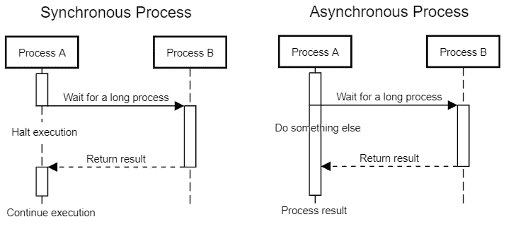
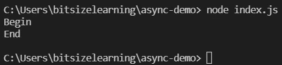
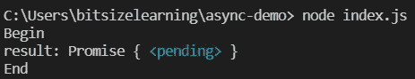
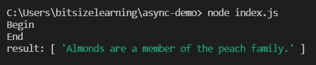
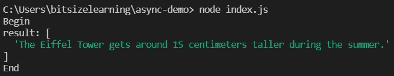
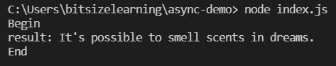
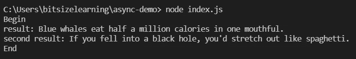
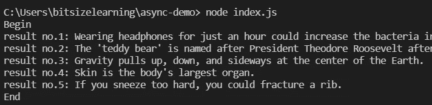
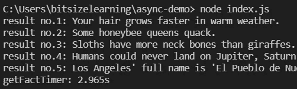
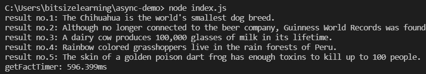

# 异步 Javascript 实用解释

> 原文：<https://blog.devgenius.io/asynchronous-javascript-practical-explanation-c9613f97f2ca?source=collection_archive---------2----------------------->


java 描述语言

你可能听说过 Javascript 天生就是异步的。那么，什么是异步呢？我们如何在 Javascript 代码中实现或利用它呢？我会尽量用 Javascript 解释异步。这是一个**中级**主题，我希望读者对 Javascript 或一般编程有一个基本的了解。

## 同步与异步

我将只从实用的角度解释同步( **sync** )和异步( **async** )。在同步过程中，我们一次做一个任务**。我们只做下一个任务，直到前一个任务完成，即使这个任务只是一个等待的任务。在异步过程中，如果我们遇到不需要我们全神贯注的长任务，我们不是等待任务完成，而是先做其他事情。如果长任务完成了，我们得到它的结果并处理它。**

**想象一下，如果你有以下任务:**烧水**，**扫地**，**洗碗**，**泡茶**。在同步过程中，我们打开暖气把水烧开，等几分钟让水烧开，然后关火，扫地，洗碗，然后沏茶。然而，在异步过程中，我们打开暖气烧水，然后立即扫地，洗碗，只有当水烧开时，我们才关掉暖气，然后泡茶。请看下图，以便更容易理解。**

****

**同步与异步流程**

**大多数时候，我们程序中的代码是以同步的方式运行的。常见的例子有数学/字符串运算、变量声明/赋值、解析或转换对象、编码等等。我们经常遇到的异步进程是 I/O 操作，如**查询数据库**、 **HTTP 请求**和**读取文件**。**

# **让我们开始编码吧！**

**在这个故事中，我将使用 [NodeJS](https://nodejs.org/) 运行 Javascript 作为示例。然而，所解释的异步概念也可以在浏览器中运行的 Javascript 代码中实现。你可以在这里安装 NodeJS [如果你还没有的话。](https://nodejs.org/en/download/)**

**我们将把 **HTTP 请求**作为异步流程示例。HTTP 请求是我前面提到的长时间等待任务的一个例子。我不会像其他教程一样使用设置超时或睡眠功能，因为它根本不实用，我们不会在实际应用中使用它们。**

**创建一个名为 **async-demo** 的新文件夹，并在其中创建名为 **index.js** 的文件。我们将使用 [**axios**](https://www.npmjs.com/package/axios) 包来处理 HTTP 请求。让我们用 npm 安装它。打开 async-demo 文件夹中的终端或命令提示符，键入以下命令。**

```
npm install axios
```

**让我们从我发现的一个[公共 api](https://aakhilv.notion.site/aakhilv/api-aakhilv-me-a57b3dc3e4e2449ba4dcce5ddee1c684) 中获得一些有趣的事实。**

## **索引. js**

```
const axios = require('axios');function main() {
  console.log('Begin');
  const result = axios.get('[https://api.aakhilv.me/fun/facts'](https://api.aakhilv.me/fun/facts'));
  console.log('End');
}main();
```

**在这里，我们有一个主要功能。我们在主函数的开头和结尾使用 console.log 编写 Begin 和 End。在这之间，我们使用 axios.get 向 [fun fact 公共 api](https://api.aakhilv.me/fun/facts) 发出 HTTP 请求。让我们用 **node index.js** 命令运行它。**

****

**这里没什么特别的。你可能会注意到在我们的节目结束前有一点延迟。这是 HTTP 请求所需的时间。让我们试着记录结果**

```
function main() {
  console.log('Begin');
  const result = axios.get('[https://api.aakhilv.me/fun/facts'](https://api.aakhilv.me/fun/facts'));
  console.log('result:', result);
  console.log('End');
}
```

****

**现在，我们看到的不是 HTTP 请求结果，而是一些奇怪的东西。**承诺{ <待定> }** 。这是什么？Javascript 中的一个 [**承诺**](https://developer.mozilla.org/en-US/docs/Web/JavaScript/Reference/Global_Objects/Promise) 是一个尚未兑现的值。该值应该由长时间等待的任务(即 HTTP 请求)返回。然而，我们没有等待 HTTP 请求，而是立即记录结果。这种行为称为**非阻塞**函数调用。**

> **Javascript 中的一个**异步函数**是一个长时间等待的任务，它返回一个**承诺**。**

**那么我们实际上如何记录 HTTP 请求结果呢？我们可以使用 **then** 语法编写一个**回调**函数，在 axios.get 中的 HTTP 请求之后运行。**

```
function main() {
  console.log('Begin');
  const url = '[https://api.aakhilv.me/fun/facts'](https://api.aakhilv.me/fun/facts');
  axios.get(url).then(function (result) {
    console.log('result:', result.data);
  });
  console.log('End');
}
```

****

**现在我们已经记录了结果。但是等等！你注意到什么奇怪的事情了吗？如果您查看输出，Begin 和 End 在结果之前首先被记录。这是个 bug 吗？**不，不是**。你还记得异步过程的解释吗？我们的程序没有等待 axios.get 结果，而是先转移到下一个任务，即记录“End”。那么，在记录 HTTP 请求结果之后，我们如何记录 End 呢？简单，我们把它放在回调函数里面。**

```
function main() {
  console.log('Begin');
  const url = '[https://api.aakhilv.me/fun/facts'](https://api.aakhilv.me/fun/facts');
  axios.get(url).then(function (result) {
    console.log('result:', result.data);
    console.log('End');
  });
}
```

****

**现在它如我们所愿地工作了。暂时如此。在实际的生产应用程序中，我们会将 HTTP 请求包装在某个函数中(在我们的主函数之外)。在函数内部，我们会做一些操作，或者只是解析或转换 HTTP 响应。在前面的输出中，我们注意到 HTTP 请求的结果在数组中，所以我们只需要结果的第一个元素。让我们重写代码，并将 HTTP 请求包装在一个 **getFact** 函数中。**

```
function getFact() {
  const url = '[https://api.aakhilv.me/fun/facts'](https://api.aakhilv.me/fun/facts');
  return axios.get(url).then(function (result) {
    return result.data[0];
  });
}function main() {
  console.log('Begin');
  getFact().then(function (result) {
    console.log('result:', result);
    console.log('End');
  });
}
```

****

**这就是现实生活中的应用程序代码的样子。**或者是？**让我们提高复杂度。比方说，如果我们想让**得到两个**有趣的事实，而不是一个。我们该怎么办？我们将在第一个 getFact 的回调函数中再次调用 getFact。它看起来会像这样。**

```
function main() {
  console.log('Begin');
  getFact().then(function (result) {
    console.log('result:', result);
    getFact().then(function (secondResult) {
      console.log('second result:', secondResult);
      console.log('End');
    });
  });
}
```

****

**这应该行得通。然而，你注意到我们的代码变得越来越乱了吗？在真实的场景中，我们会有更多的异步流程。比方说，如果我们想得到五个有趣的事实，我们的代码会变得非常快。**

```
function main() {
  console.log('Begin');
  getFact().then(function (result) {
    console.log('result:', result);
    getFact().then(function (secondResult) {
      console.log('second result:', secondResult);
      getFact().then(function (thirdResult) {
        console.log('third result:', thirdResult);
        getFact().then(function (fourthResult) {
          console.log('fourth result:', fourthResult);
          getFact().then(function (fifthResult) {
            console.log('fifth result:', fifthResult);
            console.log('End');
          });
        });
      });
    });
  });
}
```

**不要担心！对这个问题有一个更好的解决方法。**

# **异步/等待**

**异步和等待语法来拯救！带有 **async** 关键字的函数将**将其任何返回值转换为**承诺**。显然，具有异步语法的函数在 Javascript 中被称为**异步函数**。**wait**语法让我们暂停执行并获得异步函数的结果。注意 **await 语法只能在异步函数**中使用。例如，让我们重写 getFact 函数。****

```
async function getFact() {
  const url = '[https://api.aakhilv.me/fun/facts'](https://api.aakhilv.me/fun/facts');
  const result = await axios.get(url);
  return result.data[0];
}
```

**我们所做的只是在 function 关键字前面添加 async 关键字，并使用 await 关键字将 HTTP 请求结果存储在一个变量中，而不是使用讨厌的回调函数语法。即使我们不显式返回一个承诺， **result.data[0]** 也会转换成一个承诺作为这个函数的返回值。现在，让我们重写我们的主函数。为了简单起见，让我们先做两个有趣的事实。**

```
async function main() {
  console.log('Begin');
  const result = await getFact();
  console.log('result:', result);
  const secondResult = await getFact();
  console.log('second result:', secondResult);
  console.log('End');
}
```

**我们还为 getFact 函数调用使用了 await 语法，而不是嵌套回调。请注意，我们需要用 async 关键字更改 main 函数，因为我们使用的是 await 语法。现在，这个程序应该仍然工作。**

**现在，让我们回到五个有趣的事实。这次使用 for 循环。**

```
async function main() {
  console.log('Begin');
  for (let i = 1; i <= 5; i++) {
    const result = await getFact();
    console.log(`result no.${i}:`, result);
  }
  console.log('End');
}
```

****

**应该能正常工作吧？但似乎效率不高。你注意到我们的程序已经运行了相当长的时间了吗？事实上，让我们计算一下执行的时间。我们将用 console.time 替换开始和结束日志记录。**

```
async function main() {
  console.time('getFactTimer');
  for (let i = 1; i <= 5; i++) {
    const result = await getFact();
    console.log(`result no.${i}:`, result);
  }
  console.timeEnd('getFactTimer');
}
```

****

**我们可以看到总的执行时间是 2.965 秒。根据您的网络速度，结果可能会有所不同。这个结果可以改进。让我们来谈谈我们刚刚做的异步函数调用。我们实现的是:**在每个循环中，做 HTTP 请求并等待结果并记录**。你明白效率低下吗？**

**我们知道，每个 HTTP 请求都是一个长时间等待的任务。我们不是在 HTTP 请求后立即执行下一个任务，而是等待每个 HTTP 请求完成并获得结果。这基本上是一个同步的过程！是的，即使在 async/await 语法之后，我们最终还是编码了一个同步程序。事实上，没有经验的程序员可能会在现实世界中犯这种错误。**

# **承诺。所有**

**我们如何解决前面例子中的低效问题？在每个 HTTP 请求之后，我们应该立即继续下一个 HTTP 请求，并且最终我们希望得到所有的结果。Javascript 为我们提供了完成这项任务的合适功能。**

**首先，我们需要在一个数组中收集从 getFact 函数调用返回的所有承诺，然后我们使用 **Promise.all** 语法返回一个解析为一个值数组的承诺。因此，我们不是等待每个 getFact 结果，而是同时等待所有结果。让我们将主函数重写如下。**

```
async function main() {
  console.time('getFactTimer');
  const promises = [];
  for (let i = 0; i < 5; i++) {
    promises.push(getFact());
  }
  const results = await Promise.all(promises);
  for (let i = 0; i < 5; i++) {
    console.log(`result no.${i + 1}:`, results[i]);
  }
  console.timeEnd('getFactTimer');
}
```

****

**我们可以看到执行时间显著减少到 600 毫秒左右。这大约是原来执行时间的 1/5。请注意，每次程序运行的结果可能仍然不同。这种 Promise.all 方法在实际生产应用程序中很常见。有时，我们需要对数据库进行多次查询，并同时进行 HTTP 请求。**

**目前就这些。我觉得足以覆盖大部分实际的真实应用场景。更多参考，请查看 mozilla 开发者[文档](https://developer.mozilla.org/en-US/docs/Learn/JavaScript/Asynchronous)。**

**如果你遇到任何问题，你可以在我的 Github 库 [**这里**](https://github.com/bitsizelearning/async-demo/blob/main/index.js) 交叉检查完整的代码。**

**如果我遗漏了什么或者有任何错误的解释，请不要犹豫回答这个故事。 **CMIIW** 。**

**如果你喜欢这个教程，请留下一些掌声来帮助频道成长:)**