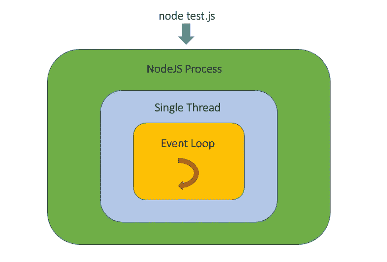
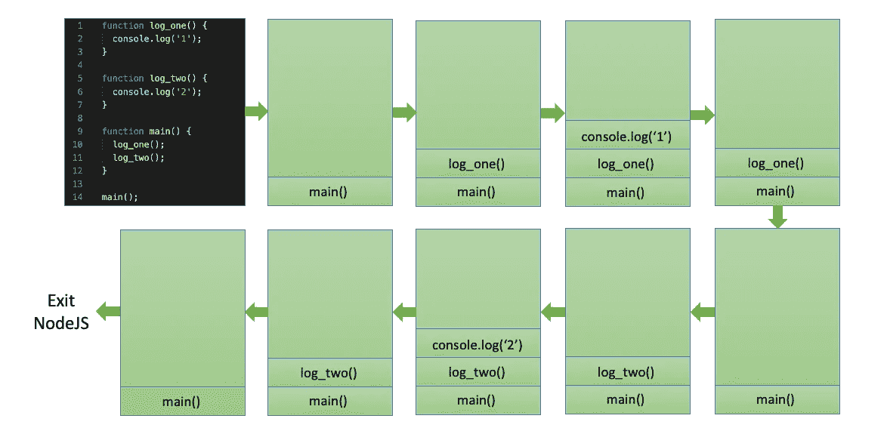
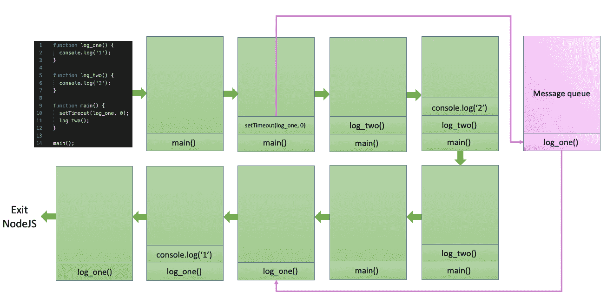
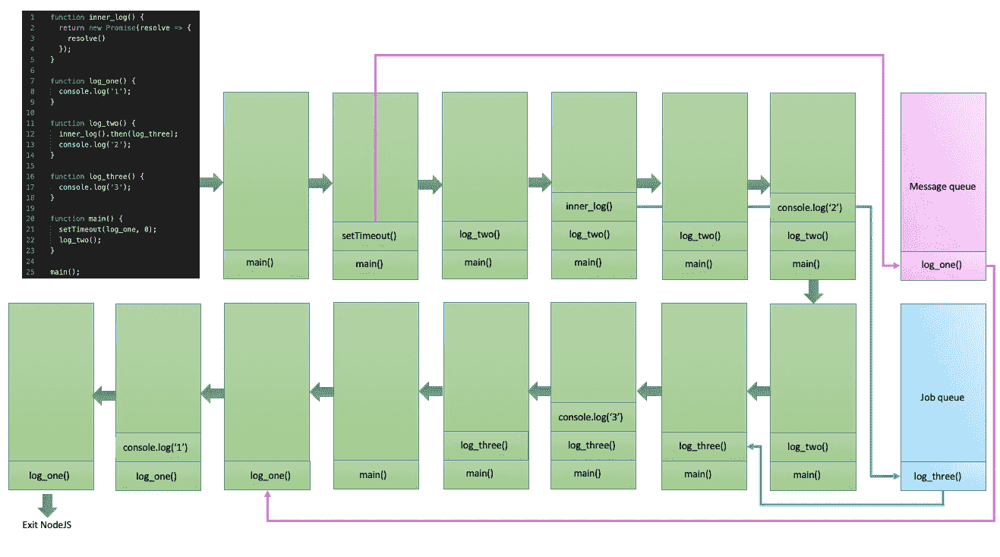

# 幕后的异步节点

> 原文：<https://blog.devgenius.io/asynchronous-nodejs-under-the-hood-e0658bdb7037?source=collection_archive---------7----------------------->

[克莱班克斯](https://unsplash.com/@claybanks?utm_source=medium&utm_medium=referral)在 [Unsplash](https://unsplash.com?utm_source=medium&utm_medium=referral) 拍摄的照片

# 介绍

> NodeJS 是后端的 Javascript 运行时。它是**单线程**、**异步、事件驱动、**的，旨在支持可扩展的网络应用。

多好的陈述啊。😅你可能会对自己说，你以前已经见过很多次了，也许不是用那些确切的话，但足够相似，让你想知道也许真正了解那里发生了什么是重要的。

我第一次读到 NodeJS 时，一个问题困扰着我，“如果它是单线程的，我们如何用它构建可伸缩的应用程序？”。答案是 NodeJS 可以与非阻塞 I/O 异步**，这大概是这项技术如此成功的最重要原因！解释这一点的概念是 NodeJS **事件循环**，本文的目的是真正揭开这一概念的神秘面纱。**

*先说明一下。本文的目的是解释 NodeJS 中的异步特性是如何工作的。所以假设观众至少知道如何使用这些功能。不过，如果需要复习的话，这里有一个不错的* [*参考*](https://www.geeksforgeeks.org/asynchronous-patterns-in-node-js/) *。*

# NodeJS 是单线程的

当我们尝试使用 node 和一个类似于`node test.js`的命令运行一些 JavaScript 代码时，一个操作系统进程被启动，这就是节点环境。在这个环境中，产生了一个线程，它同步运行我们所有的代码。一次只能发生一件事。

这听起来像是一个主要的限制，但实际上这是一种福气。大多数其他语言都允许并发性，但这很难管理，调试起来可能是一场噩梦。因为 NodeJS 是单线程的，所以我们从来不用担心并发问题，只需要注意如何编写代码，避免任何可能阻塞线程的事情。

你会问，我们如何编写非阻塞代码？为此，我们需要首先理解事件循环及其与堆栈和各种队列系统的交互，这些队列系统也驻留在 NodeJS 环境中。

# NodeJS 事件循环

当节点环境由单线程启动时，事件循环在该线程内建立。事件循环的实际实现很复杂，但是您可以想象它只是一个 while 循环，一次运行一行代码。

图 1\. NodeJS 环境

任何执行时间过长的代码都会阻塞事件循环，这可能会导致程序挂起。然而，当我们利用 NodeJS 的异步特性时，我们可以将某些操作推迟到稍后阶段运行，这通常会使我们的程序更高效。让我们来理解事件循环中促进异步特性的各种活动部分。

## 堆

对于事件循环的每一次迭代，它都在不断检查**调用栈**来运行需要执行的函数。这没什么特别的，调用栈是一个后进先出(LIFO)栈，类似于其他编程语言中的栈。在下面的图 2 中，我们可以看到一个调用栈如何在 NodeJS 中工作的简单演示。

图 2\. NodeJS 调用堆栈

我们可以通过将某些函数作为回调传递给其他函数来推迟它们的执行。这些回调不会立即放入堆栈，而是在调用堆栈清空后执行。为了理解这里发生的事情，我们需要看看 Node 如何运行某些重型内置函数以及幕后的队列系统。

## 信息排队

值得注意的是，尽管 Node 是单线程的，但内置函数如`setTimeout`和其他 I/O 原语(如`fs`模块)在后台运行在它们自己的线程上。这样做是为了让繁重的工作实际上发生在其他地方，而不是单个节点线程。回调函数通常在更密集的内置函数运行完毕后执行。这些回调函数放在**消息队列**中。

当事件循环运行时，它首先执行调用堆栈上的任何函数调用。一旦调用堆栈为空，它就开始逐个对消息队列运行函数调用。在图 3 中，下面是使用`setTimeout`的消息队列的演示。

图 3 .带有消息队列的 NodeJS 设置超时

## 作业队列

除了消息队列之外，自 ES6/ES2015 以来，**作业队列**已就位，由 Promises 和 async/await 使用。与消息队列不同，当承诺在当前函数执行结束之前解析时，回调逻辑将在当前函数调用之后立即执行。这意味着放在作业队列上的回调将尽快执行，而不会推迟到调用堆栈为空之后。下面图 4 中的代码示例演示了调用堆栈和消息队列以及作业队列之间的交互。

图 4 .带有消息队列和作业队列的 NodeJS 异步特性

# 结论

在本文中，我们讨论了促进 NodeJS 中异步特性的基本构建块，这实际上是这项技术的本质。

理解这些概念是很重要的，尤其是如果你想用 NodeJS 编写更高级的应用程序。编写非阻塞代码的能力以及知道何时何地使用异步特性使我们能够编写健壮的、可伸缩的程序。这当然是我花时间去理解这些概念的原因。

我希望这篇文章能揭示 NodeJS 的本质，甚至帮助你写出更好的代码。如果你对 NodeJS 的“螺母和螺栓”有什么要分享的，请告诉我。留在评论里吧。下次见！😁