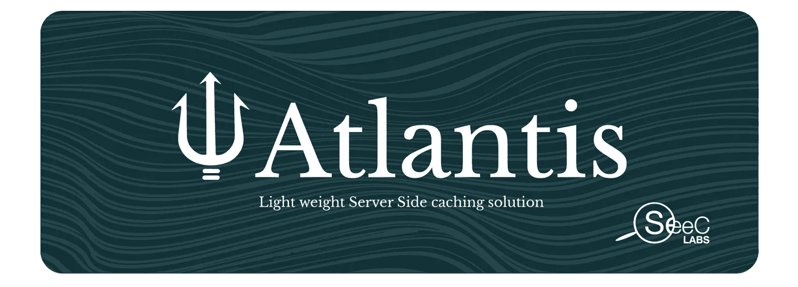
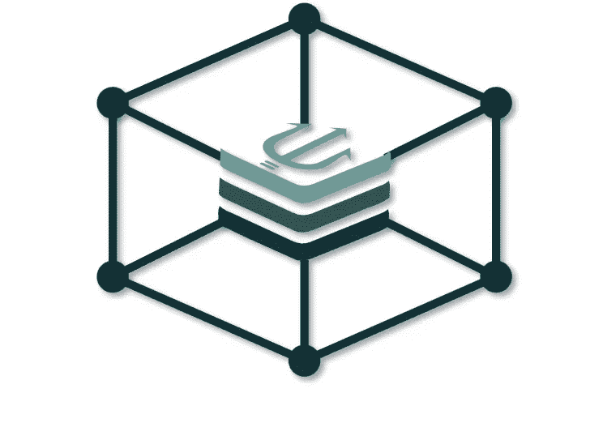
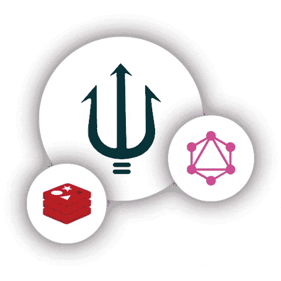
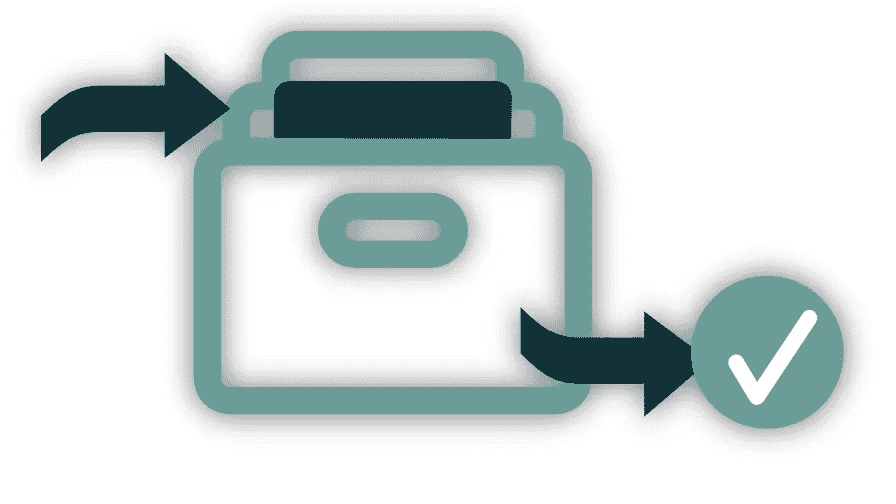
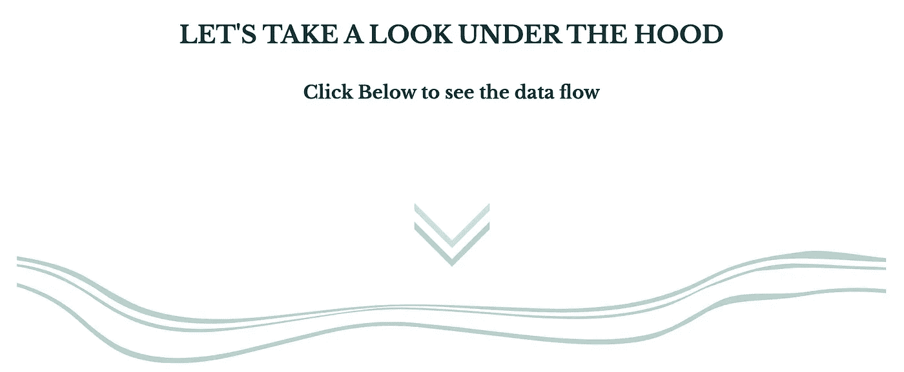
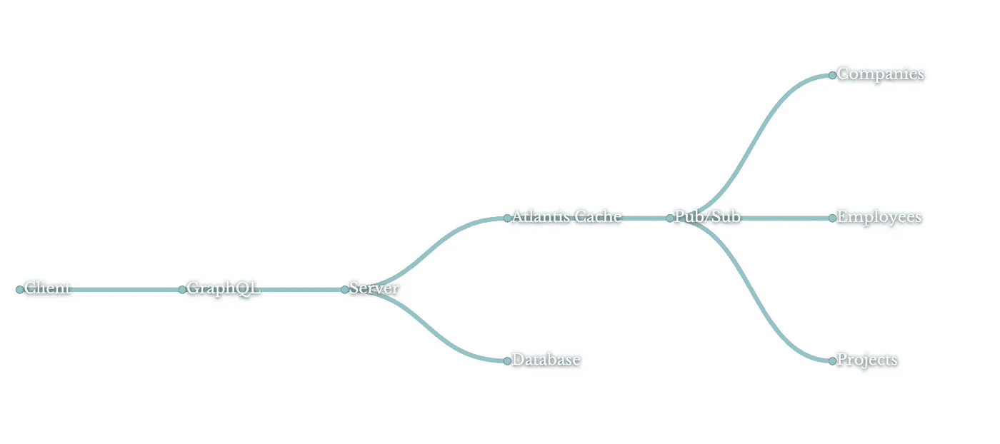
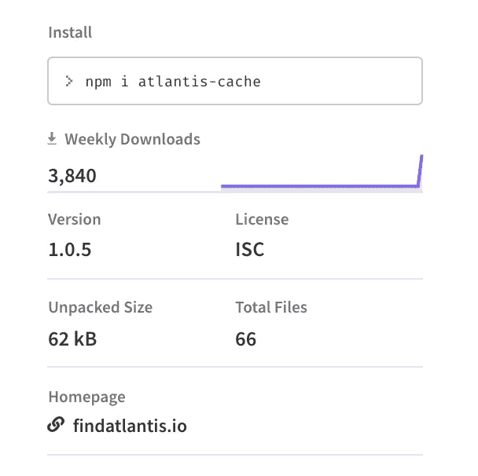
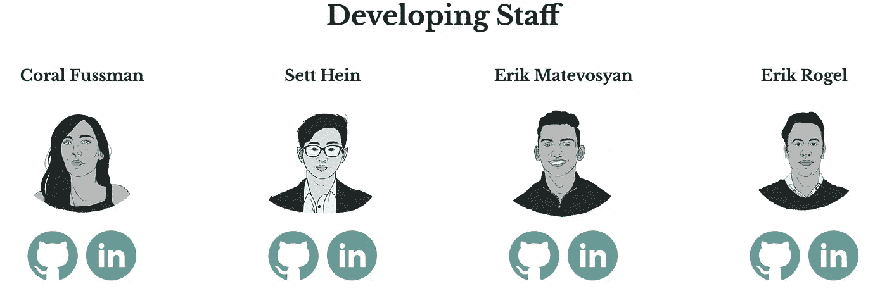

# 亚特兰蒂斯

> 原文：<https://blog.devgenius.io/atlantis-47639b78d34d?source=collection_archive---------4----------------------->

头号轻量级缓存库



# **我们正在解决的问题**

RESTful 架构的行业标准多年来一直依赖于请求/响应周期。随着时间的推移，这被证明是可靠的，但效率低下。标准化的 RESTful 路由造成了数据总是被过度提取的情况。

输入 GraphQL。一种新的方式来准确地指定您希望从数据库中接收到的内容。GraphQL 是一种数据库无关的查询语言，用于查询您的 API。这意味着它可以用于关系数据库或 noSQL 数据库，没有问题！GraphQL 请求消除了所有的 CRUD 路径，留给您一个干净的端点。

现在的问题在于缓存。请求/响应架构内置了缓存，因为 CRUD 方法是标准化的，并且易于更新。GraphQL 没有这种现成的奢侈，因为对 API 的查询变得非常具体。不可否认，缓存是一个非常有价值的工具，所以随着 GraphQL 的日益流行，开发人员开始着手解决这个问题。

# 解决办法

## Atlantis 是一个轻量级的库，它解决了存储和维护深度嵌套的 GraphQL 查询的问题。



这确保了当数据库发生变化时，客户端总是接收到最相关的数据。

# 节省时间

## Atlantis 利用 Redis 的“内存中”快速查找时间来快速提供缓存的 graphQL 响应，而不管其大小或结构如何。



Redis 与发布/订阅体系结构的集成还允许随着需求的增长进行扩展，并且您需要更多的缓存空间或备份缓存工作线程。

# 节省空间



# 智能地从现有的缓存嵌套中提取与先前查询完全相似的新查询，而不是创建新的键/值条目



# 如何开始



好了，现在我们有了自己的解决方案，让我们来看一下简单安装吧！

__________________________

在一个快速的 [npm 安装](https://www.npmjs.com/package/atlantis-cache)之后，要求将亚特兰蒂斯安装到你的后台，如下图所示。

亚特兰蒂斯的唯一要求是 Redis 和一个模式。
就是这样！

__________________________

后端代码:

```
import express, { Application } from 'express';import redis from 'redis';const schema = require('./schema/schema');const { atlantis } = require('atlantis-cache');const redisClient = redis.createClient({host: 'localhost',port: 6379,});const app: Application = express();app.use(express.json());app.use('/atlantis', atlantis(redisClient, schema), async (req, res) => {return res.status(202).json({ data: res.locals.graphQLResponse });});
```

在安装 Redis 并设置您的模式之后，传递 redisClient 和 schema 作为仅有的两个必需参数。这种简单性是我们产品的核心。毫不夸张地说，“即插即用”和你的好去！

亲自体验亚特兰蒂斯的力量吧！访问我们的网站 [findatlantis.io](http://findatlantis.io/) 观看演示，了解您潜在的速度提升！

## **投稿**

在 SeeC Labs，Atlantis 背后的开发者希望听到任何反馈，并且一直在寻找充满激情的开发者来为影响日常体验的产品做出贡献。如果您想要贡献或合作，请随时查看我们的 [GitHub](https://github.com/oslabs-beta/Atlantis) 并联系我们！

如果您对实施有任何疑问，我们强烈建议您这样做！



# **SeeC 实验室**

**珊瑚大惊小怪**——[GitHub](https://github.com/coralfussman)/[LinkedIn](https://www.linkedin.com/in/coral-fussman-21721538/)

**Sett Hein**—[GitHub](https://github.com/settnaing199)/[LinkedIn](https://www.linkedin.com/in/sett-hein/)

**埃里克·马特沃辛**——[GitHub](https://github.com/erik-matevosyan)/[LinkedIn](https://www.linkedin.com/in/erik-matevosyan/)

埃里克·罗杰尔——[GitHub](https://github.com/erikjrogel)/[LinkedIn](https://www.linkedin.com/in/erikjrogel/)