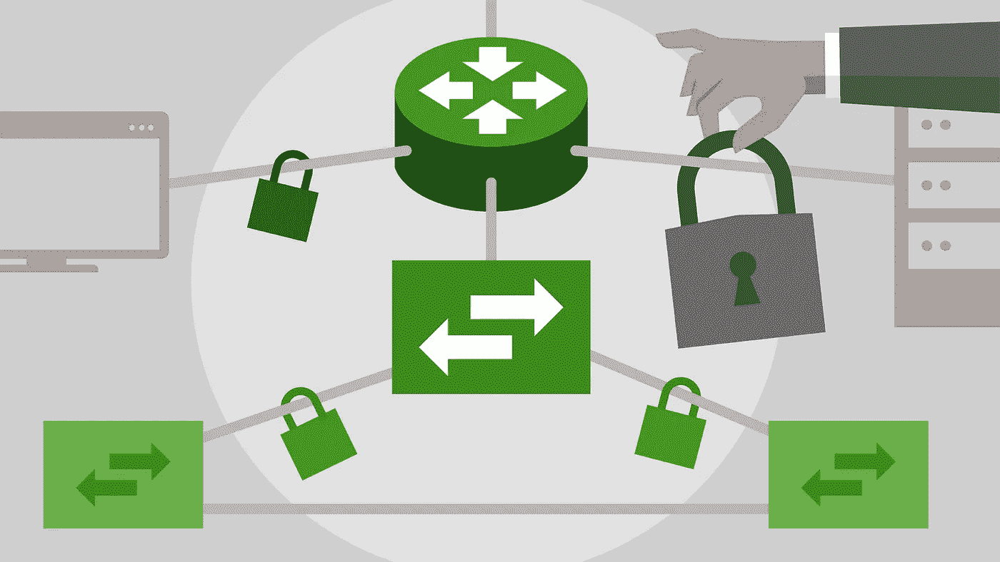
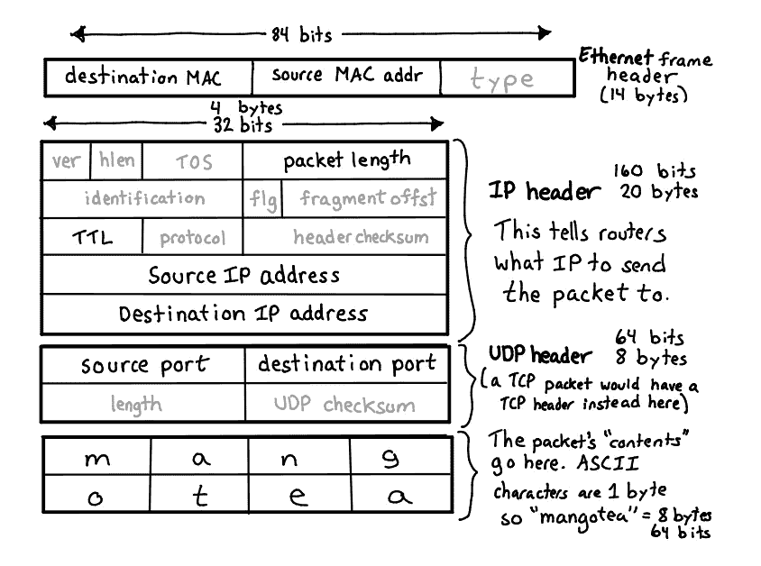
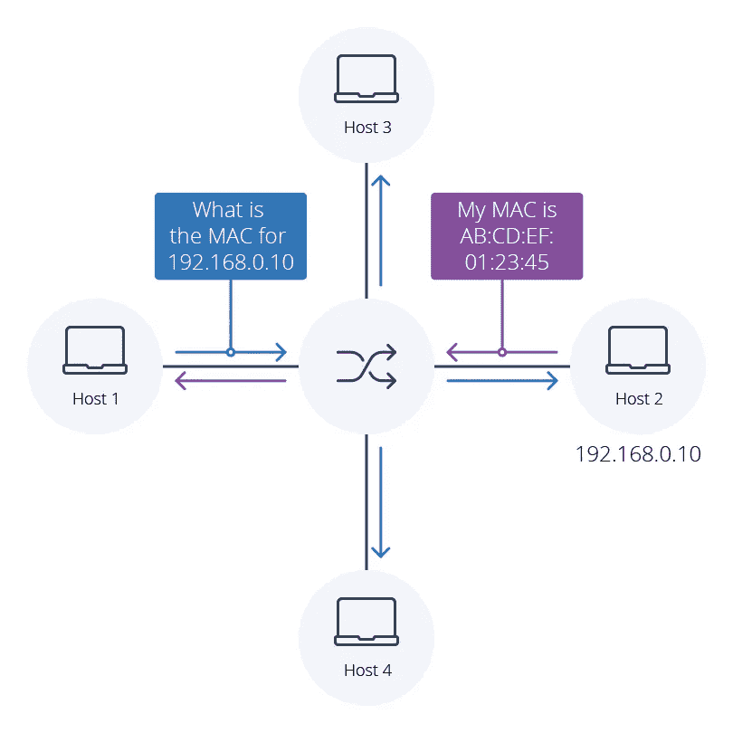
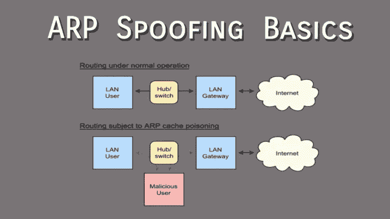

# 攻击 ARP 表:对 Bug 赏金猎人和渗透测试人员的基本网络攻击

> 原文：<https://blog.devgenius.io/attacking-arp-learn-networking-by-breaking-stuff-for-bug-bounty-hunters-penetration-testers-and-73d33d30fbef?source=collection_archive---------7----------------------->

来源:华为

# 介绍

让我们从一点事实开始吧:走上这条学习道路的大多数学生都会同意渗透测试的网络方面是乏味和完全单调的。你必须学习基础知识，这是不可避免的。然而，我希望像这样的帖子可以让它变得更容易忍受，甚至有时更有趣。

也就是说，在本文中，我们将了解互联网究竟是如何传输数据的，以及我们如何利用公开可用且易于使用的工具来利用这种传输方法。我还将确保包含更多资源，您可以按照自己的进度自由探索。

我随时准备回答你的任何问题，不管你认为这有多“愚蠢”。请留言，我会尽快回复你。

我们开始吧！

# 小包裹

整个互联网旨在促进信息以近乎瞬时的速度传递。这些信息，不管有多复杂，都被分解成*包*。

就是这样。

很多很多的包…

资料来源:朱莉娅·埃文斯

这些数据包非常复杂和无聊。因此，为了本文的目的，我们现在只关注必要的字段:

*   目的地 MAC 地址——目的地*媒体访问控制*地址，通常称为 MAC 地址，是发送数据包的*网络接口卡*的物理地址。我在这里做了区分，因为一台机器可以有多个物理和虚拟的 MAC 地址。请记住，最终，MAC 地址真正重要的是在*直接连接的网络上找到一台机器。*换句话说，您的路由器使用 MAC 地址将流量路由到您的本地网络。

> 注:所有“直连网络”指的都是本地网络。

*   源 MAC 地址—创建并发送相关数据包的网络接口卡的地址。
*   目标 IP 地址—32(IP v4)或 128 (IPv6)位数，代表数据包要发往的计算机网络。到达该网络后，路由器会使用 MAC 目的 MAC 地址发送数据包。
*   源 IP 地址—创建并发送数据包的机器的 IP 地址。

> 深入探讨:IANA(互联网号码分配机构)负责将互联网资源授权给五个 RIR(地区互联网注册管理机构)，每个机构负责一个地理区域。地区互联网注册管理机构进一步将这些资源委托给 lir(本地互联网注册管理机构)，lir 通常被称为互联网服务提供商，后者随后将这些资源分配给企业和个人。更多信息可在 [rfc7020](https://datatracker.ietf.org/doc/html/rfc7020) 中找到。

# ARP 和 ARP 表

**地址解析协议(ARP)** 是使网络通信能够到达网络上特定设备的底层协议。当只知道主机 IP 地址或 MAC 地址，但不知道两者时，ARP 确保数据包到达正确的地址。

来源:Auvik 网络

它通过在网络中的各种主机上保存数字记录来实现这一点，该记录列出了 IP 地址和 MAC 地址的当前映射。实际的数据结构通常被称为 ARP 表或 ARP 缓存。

ARP 表被填充的过程本质上容易受到一种叫做 **ARP 中毒的简单攻击。**

# ARP 中毒方法

我非常相信学习做某事的基本方法，而不是把某人限制在一系列难以理解的命令中。因此，我将让您了解当前可用的工具，并允许您通过不使用命令来限制您，从而潜在地提出实现最终目标的替代方法。

资料来源:Amar Shekhar

1.  **接入** —首先，你需要网络接入。它不一定是物理的，但是您需要通过直接访问机器上的外壳来访问网络。
2.  **情报—** 一旦您获得了访问权限，您就需要关于您正在攻击的网络的信息。尽可能多的收集信息。你永远不会有足够的智慧。相信我。这是一个如此重要的话题，以至于我甚至不敢尝试在这个要点中给你一个你需要的总结。我给你的方法是我遵循的方法:首先运行你的快速工具以获得工作模型，并获得足够的信息以开始收集更多关于端点的信息，在手动枚举时开始手动枚举那些端点，在手动枚举时开始运行你的较慢的强力&模糊化工作流。明白速度=噪音。
3.  **ARP 中毒第一阶段—** 开始广播 ARP 消息或等待请求传输。您的目标是用您的 IP 地址填充与网络上的目标/受害者机器相对应的 ARP 缓存条目。通过这样做，你将欺骗那些机器相信你是路由器。**工具:** dsniff、wireshark、ettercap、Arpspoof、Driftnet 等
4.  **连锁攻击**——此时，你需要记住你的目标。无论这是一个 pentest 的外壳还是一个 bug bounty，你的目标在你的方法论中必须是至高无上的。如果您的网页测试和网络钓鱼在范围内，您可以坐下来监控某些机器正在访问哪些网站，以便您可以为您的社会工程和鱼叉式网络钓鱼活动建立一个档案。如果你追逐奖金，那么就采取相应的行动，并获得报酬！如果你的目标是放松和收集包裹，那么做你的事情。工具: Wireshark、ettercap、MITM 代理、urlsniff 等…
5.  清理**——这一阶段至关重要。如果您在完成开窗后没有正确地在 ARP 表中填入有效值，所有中毒的机器都将无法访问互联网。最糟糕的情况是你在网络上失去了立足之地，并引起了 IT 团队的怀疑。因此，正确运行您的工具。出去，放下你的工具。Arpspoof 是会自动清理的工具之一。**
6.  **流程数据** —超出了本文的范围，但我要说数据提供了新的、通常意想不到的见解。

> **短暂的插曲……**
> 
> *在我们结束这篇文章之前，我想做一件我从未做过的事情，告诉你一个叫做*[*Sync*](https://www.sync.com/?_m=3kl)*的云存储提供商。他们为云存储提供了惊人的计划。比如价格无与伦比的无限云存储。如果你在生活中的某个时刻，存储是你个人项目或业务的关注点，那么请查看下面的附属链接，它帮助我制作更高质量的内容，并帮助你花更多的时间开发，而不是讨价还价寻找最好的云存储提供商。使用下面我的会员链接查看一个惊人的交易:*
> 
> [同步—云存储完成正确](https://www.sync.com/?_m=3kl)

**结论**

ARP 欺骗很好地介绍了网络背后的一些更好的机制和协议，我们需要访问这些机制和协议才能获得报酬。你必须学会这些东西，现在是最好的时机。但是记住，你不必现在就全部学会。如果你能在几周内全部学会，你会更有力量，但大多数人做不到。就是太无聊了。

# **请阅读下面:**

C 内容创作/机会——我自己和数字越狱可用于商业内容创作请求。我们很乐意帮助您以合理的价格制作高质量的内容。请在这里给我留言，我会尽快回复。

> *非会员注意:我不想撒谎，Medium 是一个了不起的平台，为各行各业提供了丰富的信息，所以请花点时间订阅吧。它帮助内容创作者，最重要的是帮助你。*

来源:

[https://datatracker.ietf.org/doc/html/rfc826](https://datatracker.ietf.org/doc/html/rfc826)

 [## ARP 中毒:是什么&如何防止 ARP 欺骗攻击

### ARP 中毒是一种网络攻击，它滥用广泛使用的地址解析协议(ARP)中的弱点来…

www.varonis.com](https://www.varonis.com/blog/arp-poisoning) 

[https://en.wikipedia.org/wiki/Address_Resolution_Protocol](https://en.wikipedia.org/wiki/Address_Resolution_Protocol)