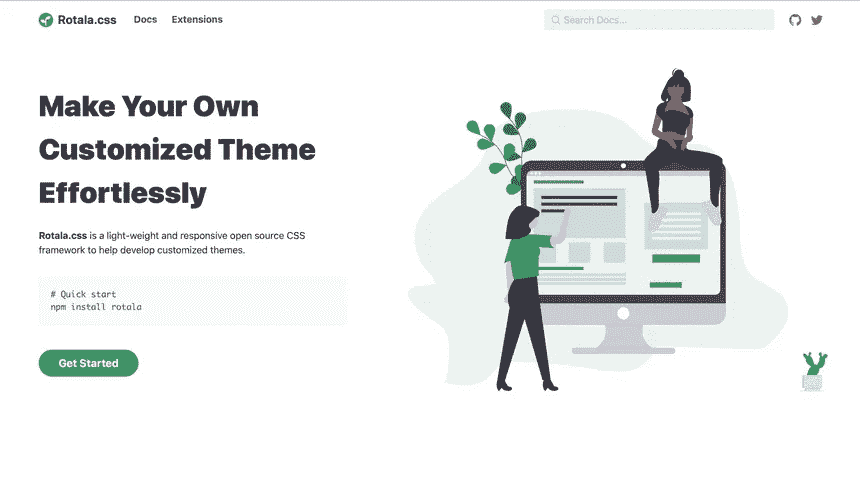
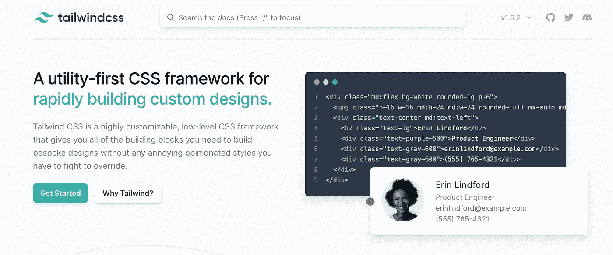
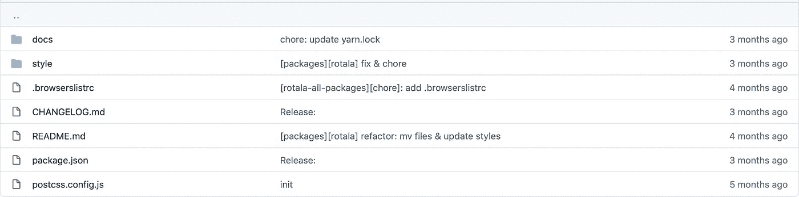
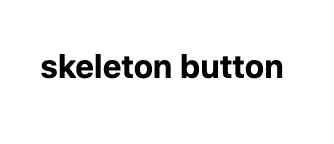
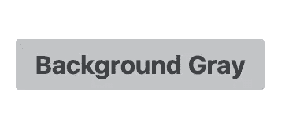

# 尝试创建 CSS 框架

> 原文：<https://blog.devgenius.io/attempting-to-create-a-css-framework-eafbb0099013?source=collection_archive---------14----------------------->



2019 年，我创建了一个 CSS 框架，命名为 [Rotala.css](https://rotalacss.com/?ref=pitayan) 。经过一番重构和修改，我终于在 2020 年发布了“玩具”框架。但它仍处于原型阶段，因为我认为我的解决方案还不够优雅。

访问[Pitayan.com](https://pitayan.com/posts/css-framework-attempt/?ref=medium)阅读原文。

# [开头](https://pitayan.com/posts/css-framework-attempt/#the-beginning)

我构建这个框架的原因很简单:

> *我自己想要一个 css 框架*

我知道从零开始建造它会花费我很多时间。因此，我希望借助其他一些强大的工具来创建这样的框架，以加快我的开发速度。

起初，我开始用`SASS`做原型。它是一个工具，允许你结合许多独特的语法，这样你就可以像编程一样体验用 CSS 设计。

```
@mixin button-icon {
  margin: 0 2px;
}.button {
  padding: 2px; @include button-icon;
}
```

坦率地说，我从其他著名的框架如`Bootstrap` & `Bulma` & `Spectre` & `Miligram`那里学到了很多好的技术。我从他们那里借鉴了一些好的设计，尤其是从`Spectre.css`(通过模仿别人来重新发明轮子并不可耻)。

# [翻拍尝试](https://pitayan.com/posts/css-framework-attempt/#a-remake-attempt)

CSS 从来都不是我的专长。所以我并不期望从我最初的原型中得到什么好处。我第一次做的东西都是 frigile 和“copy-cat”。框架中没有“我创造的它”。

即使这只是一次没有经验的尝试，我怎么能承担如此糟糕的结果呢？

毫无疑问，我重新开始了。

> 这次，我会做一个很棒的。伟大到足以让我微笑。

一个幸运的机会，我看到了一个视频，讲述了一个不同的 CSS 框架`Tailwind.css`，它让一切都变得更好。也许是时候尝试一下了。



允许你用他们的“特定”样式类来构建你自己的框架。我很喜欢这样的解决方案，因为它是 HTML 模板样式的原始用法。

```
<button class="mx-4 p-2 text-gray-600 bg-gray-300">button</button>
```

`Tailwind.css`中的一切都被分割得足够小，以至于将这些类写入元素就像将积木放在一起一样。

然而，我的 [Rotala.css](https://rotalacss.com/?ref=pitayan) 将输出样式表而不是模板。所以“必须”弄清楚如何让它在构建时吐出一些文件。

研究证明我的担心是多余的。`Tailwind.css`中的所有样式都可以像`SASS`一样通过适当的配置编译成一个小的`css`文件。

```
/* Base */
@import "tailwindcss/base";
@import "./base.pcss";/* Components */
@import "tailwindcss/components";
@import "./components.pcss";
```

用`postcss-cli`使编译变得简单

```
$ postcss docs/main.pcss -o docs/assets/css/rotala.css
...
```

正如你从 build 命令中看到的，我完全抛弃了`SASS`，迁移到了`Postcss`。`SASS`没有什么不好，但我只是希望我的框架只使用一种技术，以避免一些复杂性。

# [构建源文件夹](https://pitayan.com/posts/css-framework-attempt/#construct-the-source-folder)



随着一切一次又一次地重新开始，我终于找到了一种模式来保持我的代码库处于良好的状态。

源文件夹结构如下所示:

```
rotala/
  docs/
  style/
  CHANGELOG.md
  README.md
  package.json
  postcss.config.js
```

`docs/`文件夹是用来保存静态文件的，这些文件可以帮助演示输出。这也是 Github 页面的另一种设置，可以很容易地帮助发布静态页面，而不需要额外的 route 参数。

```
docs/
  assets/
  base/
  components/
  index.html
  main.pcss
```

`style/`包含所有的源样式。一开始，我做了大约 20 个组件，因为我相信它们对于构建一个现代网站的基础部分是非常必要的。那些风格在很大程度上基于`Spectre.css`和`Bulma`(我是那些框架的粉丝)。

```
style/
  base/
  components/
    Accordion/
    Typography/
    Badge/
    Breadcrumb/
    Tooltip/
    Button/
    Checkbox/
    Divider/
    Drawer/
    Table Group/
    Form Group/
    Input/
    Tab/
    Avatar/
    Link/
    Menu/
    Modal/
    Notification/
    Pagination/
    Popover/
    Radio/
    Select/
  base.pcss
  components.pcss
  main.pcss
  prefix.pcss
```

# [有所作为](https://pitayan.com/posts/css-framework-attempt/#making-difference)

当你读到这一行时，你可能会问:

> 既然你抄袭了其他框架的许多设计，这和他们有什么不同？

我也有同样的问题。我的意图是创建我自己的 CSS 框架。复制别人的作品闻起来不像是“创造自己”的精神。这意味着这个小框架将永远是我的玩具，对其他开发人员没有任何价值。

事实上，我也希望其他人能从我的成果中受益。但是我已经厌倦了从头再来。有没有一个简单的方法，通过添加一些点睛之笔，让已死的项目起死回生？

让“与众不同”真的很难，尤其是当你没有任何好的灵感的时候。

如果我后退一步，思考一下对`Tailwind.css`的利弊，我有可能基于`Tailwind.css`的遗产和它的“缺点”建立一个新特性吗？我认为答案是肯定的。

```
<div class="md:flex bg-white rounded-lg p-6">
  
  <div class="text-center md:text-left">
    <h2 class="text-lg">Erin Lindford</h2>
    <div class="text-purple-500">Customer Support</div>
    <div class="text-gray-600">erinlindford@example.com</div>
    <div class="text-gray-600">(555) 765-4321</div>
  </div>
</div>
```

赞成者`Tailwind.css`:

*   非固执己见的风格
*   低级实用程序类别
*   设计是可定制的
*   插件系统
*   基于`Postcss`生态系统

反对意见`Tailwind.css`:

*   模板可能变得过于“拥挤”
*   文件太大，需要在构建时清除
*   实用程序的语义更少

即使`Tailwind.css`有一些不好的方面，我认为它们很容易被`Pros`压倒。所以在我的框架中，我需要想出处理那些`Cons`的计划。

不得不说第二个和第三个`Cons`已经是`Tailwind.css`的“未来”的一部分，我无法摆脱。但是第一个“拥挤的模板”似乎很容易平衡。感谢`Tailwind.css`的强大功能，我也可以这样写我的风格:

```
.container {
  @apply bg-white rounded-lg p-6; @screen md {
    @apply flex;
  }
}
```

我相信吹的用法看起来更好，不是吗？

```
<div class="container">
  ...
</div>
```

如果我希望稍微改变一下`container`，我也可以直接使用“模板样式”来装饰它。

```
<div class="container font-bold mx-2">
  ...
</div>
```

我清楚地知道，我不是第一个这样想的人，但至少这可以成为我的框架在其他框架中脱颖而出的一个很好的特性。

# [核心功能](https://pitayan.com/posts/css-framework-attempt/#the-core-feature)

因为我希望我的框架有所不同，所以我想出了这样的核心特性来完成。

*   “无设计”和“可扩展”组件

首先，`Tailwind.css`是“无设计”。它将样式的完全控制权交给了美国开发者。我将遵循这一点，并确保我所有的组件只是骨架，包含非常初级的风格。“基本样式”的意思是，如果需要，组件将有字体、文本大小、颜色、背景颜色、填充边距等等。

```
.button {
  @apply appearance-none;
  @apply select-none;
  @apply align-middle;
  @apply font-medium;
  @apply text-center;
  @apply text-base;
  @apply no-underline;
  @apply leading-normal;
  @apply whitespace-no-wrap;
  @apply inline-block;
  @apply cursor-pointer;
  @apply rounded-sm;
  @apply py-1 px-3;
}
```

这样，只需添加要替代的新样式，就可以将所有组件修改为所需的形状。它遵循了我们应该如何处理 CSS 样式的原始实践。

假设我们正在设计“骨架按钮”的样式:

由此可知:



对此:



```
<button class="button text-gray-700 bg-gray-300 hover:bg-gray-500 transition-colors duration-150">
  Background Gray
</button>
```

简而言之:

> *Class + Utilities =您的时尚组件*

在模板中可能看起来太拥挤了。因此，更好的使用方法可能是延长当前的`class`来代替。

```
.button {
  @apply text-gray-700;
  @apply bg-gray-300;
  @apply transition-colors
  @apply duration-150; &:hover {
    @apply bg-gray-500;
  }
}
```

# [结论](https://pitayan.com/posts/css-framework-attempt/#conclusions)

其余的任务将是实现所有其他组件，我希望在框架中。创建它们所花的时间比以前少了，因为我定义了如何使用“骨架”组件作为核心特性。

现在有了建立一个网站的所有基本要素。你正在阅读的博客页面实际上利用了 [Rotala.css](https://rotalacss.com/?ref=pitayan) 框架。仍然有很多缺点，但在我看来，从零开始创造我不擅长的东西是一种成就。

无论如何，我会继续开发这个框架。我很感激你也对我的小工作感兴趣。请随时给我发邮件，告诉我你对 [Rotala.css](https://rotalacss.com/?ref=pitayan) 的看法。欢迎任何公关或问题！

关于如何使用 [Rotala.css](https://rotalacss.com/?ref=pitayan) ，点击下面的链接参考文档。

[https://rotalacss.com](https://rotalacss.com/?ref=pitayan)

原本在[Pitayan.com](https://pitayan.com/posts/css-framework-attempt/?ref=medium)

https://pitayan.com/posts/css-framework-attempt/

[](https://pitayan.com/posts/css-framework-attempt/?ref=medium) [## 试图创建一个 CSS 框架

### 2019 年，我创建了一个 CSS 框架，命名为 Rotala.css，经过一些重构和修改，我终于…

pitayan.com](https://pitayan.com/posts/css-framework-attempt/?ref=medium)