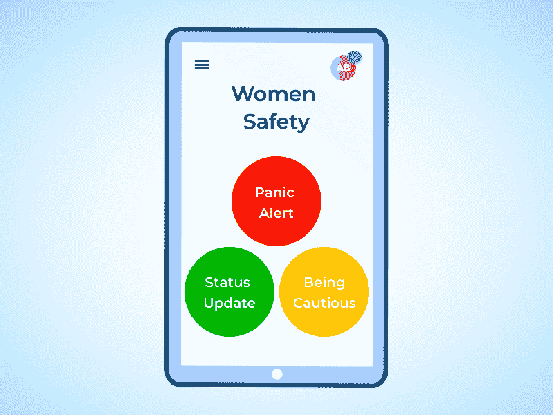
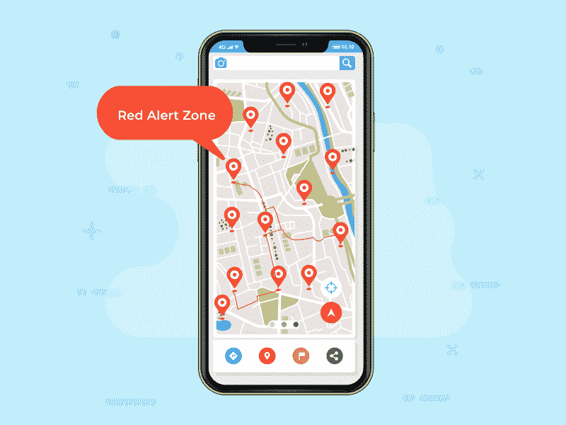
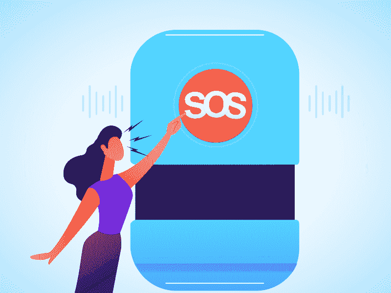

# 各位请注意！女性安全应用开发的 6 个想法

> 原文：<https://blog.devgenius.io/attention-folks-6-ideas-for-women-safety-app-development-ddfc440d00db?source=collection_archive---------2----------------------->

“科技已经把人类带到了火星。让我们看看它能做些什么来保护我们的安全。”

一方面，在当今世界，女性积极参与几乎每一个行业。另一方面，他们在走出家门时也感到不安全。世界范围内针对女性的犯罪越来越多，这在人们心中埋下了深深的恐惧。

61%的女性经常采取措施避免在日常生活中受到性骚扰 

很遗憾地说，技术还没有先进到足以改变性骚扰者的心态，尽管它已经找到了一种方法，让你远离落入那些人手中。

如果你正计划 [**雇佣手机应用开发者**](https://www.pixelcrayons.com/hire-mobile-app-developers) 来开发一款女性安全应用，这里有一些你可以做的事情。 **6 款女性安全应用**可供选择。

# 6 个女性安全应用创意。

*   **红色、黄色、绿色。给危险等级指定颜色。**

在此功能中，有根据用户的危险或安全级别预先分类的消息。

简单地说，绿色标志着这个人安全到达了她要去的地方。**黄色**会通知她的 SOS 她怀疑有人或在她所在的地方感到不安全。

**红色**是最高级别的危险，发出恐慌警报，通知她的 SOS 联系人她遇到了麻烦。

您还可以将红色按钮的信息连接到警察急救室，以便最近的警察局可以采取必要的行动。

您可以添加的另一个功能是将颜色代码与按下电源按钮的次数联系起来。这意味着**两次**快速按下表示**绿色，**表示安全， **3** 表示**黄色，**大于三次将为**红色**。

为此，你可以联系印度顶级软件开发公司****，他们会相应地实施你的想法**。******

*   ****即使在出租车里也感到安全。****

****在这项功能中，该应用程序将直接连接到警察控制室和用户的 SOS 联系人列表。如果用户在出租车里感到不安全，她可以立即将出租车号码发送到 SOS，她的位置将被追踪到。****

****在这方面可以做的另一个修改是启动一个出租车服务应用程序，像优步只针对女性。****

****德里警方和优步最近推出了一款名为 **Himmat Plus 的应用。**在这款应用中，出租车司机将获得一个二维码，一旦乘客使用该应用扫描该二维码，他们就可以访问司机和车辆的完整信息。在紧急情况下，他们也可以直接向警方报告他们的旅程。****

****这种应用程序最需要发挥作用的部分是其定位精度，因为车辆正在移动。****

*   ******使用热图标出安全和不安全区域。******

********

****城市热图是基于该城市犯罪记录的特征。它还适用于颜色代码，其中“**红色**的阴影越深，表示危险程度越高。可以添加到该热图中的一个小修改是添加各种基于犯罪的热图。****

****一个名为“ **Safetipin** ”的女性安全应用程序使用类似的热图功能来帮助保护用户的安全。这个应用程序的功能非常先进，甚至可以标记没有路灯的街道或你附近的荒芜地区，以免你陷入危险。****

****这些功能对于一款女性安全 app 来说是必不可少的；因此，与专家 [**移动应用程序开发公司**](https://www.pixelcrayons.com/mobile-app-development/) 取得联系对于您的业务是必要的。****

*   ******摇动并激活功能。******

****女性安全手机应用程序的这一功能是发送 SOS 警报的快捷方式。一旦用户安装并注册，这个应用程序可以随时激活，只需摇动手机。****

****可以添加到这种震动中并激活一种女性安全应用的其他功能是，在震动手机上，手机的摄像头也会激活并开始自动向用户的 SOS 联系人发送图片、音频剪辑甚至视频。****

****这个功能最好的部分是它节省时间，我们都知道在紧急情况下分秒必争。如果需要，你可以在印度雇佣软件工程师来激活功能。****

*   ******语音激活。******

********

****语音识别技术已经取得了长足的进步。因此，对于顶级安卓应用开发公司****来说，在 SOS 应用中加入语音激活将是小菜一碟。********

****它是如何工作的？****

****该应用程序将变得足够智能，能够识别用户声音中的恐慌。这背后的算法将足够智能，在听到类似“**救命**、“**救我**”等词语时发出警报。****

****对此可以做的修改是添加多种语言。这是因为每当一个人处于恐慌的情况下，她/他更有可能用母语大喊大叫。****

*   ******直播流至 SOS 联系人。******

****在恐慌或紧急情况下，如果应用程序用户的位置，整个场景的实时流也是对他们的 SOS 联系人进行的，那么它可以帮助他们了解与处于危险中的人发生的事件的每个细节。****

****可以在 SOS 联系人的移动电话中强制激活该流，以避免紧急帮助中的任何延迟。****

# ****没有网络也能工作！女性安全应用最佳实践。****

****在大多数紧急情况下，用户不能访问互联网或打开它，或等待信号；这就是为什么实现这个功能是必要的，以使应用程序更有用。****

****基于同样的原因，市场上最有效的女性安全应用是**“我感到安全。”它之所以在市场上占有一席之地，是因为它在没有互联网的情况下也能工作。是啊！没有互联网数据/WiFi 也能工作。[雇佣移动应用开发者](https://www.codersdaddy.com/hire-developer-engineer-programmer/mobile-app)如果你在这方面需要任何帮助。******

****该应用程序具有以下功能:****

# ****主要特点:****

*   ******一次性注册**要求必要的详细信息并增加紧急联系人。****
*   ****在后台运行，可通过按下电源按钮**五次来激活。******
*   ****它每 30 秒向你的 SOS 联系人发送一次 GPS 定位信息。****
*   ****也会通知警察控制室。****
*   ******“我感到安全”紧急求助热线**也可以在紧急情况下帮助用户。****
*   ******作品 24*7******
*   ****免费提供。****

# ****独特的功能:****

*   ****该应用程序不需要任何互联网连接。****
*   ****它甚至不需要在你的手机中安装 sim 卡，因为它在没有手机信号的情况下也能工作。****
*   ****实时更新。****
*   ****适用于所有带 GPS 定位器的智能手机。****

# ****总结一下。****

****虽然如前所述，技术仍然无法改变人们对女性及其安全权利的看法，但它可以在一定程度上帮助她们保持安全。市场上有许多女性安全应用程序，但它们缺少这样或那样的东西。****

****因此，在您的手机应用程序中添加上述功能将有助于您开发出一款在各方面都独一无二且有用的女性安全解决方案。你可以联系印度的一家软件开发公司，帮助这个世界成为一个对女性来说更安全的地方。****

****我先谢谢你了。****