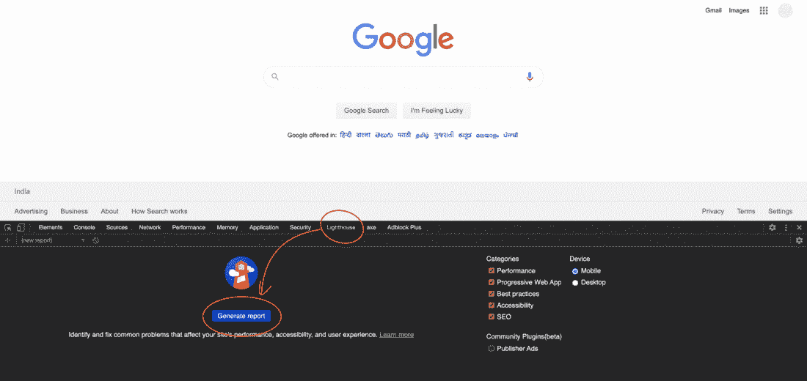
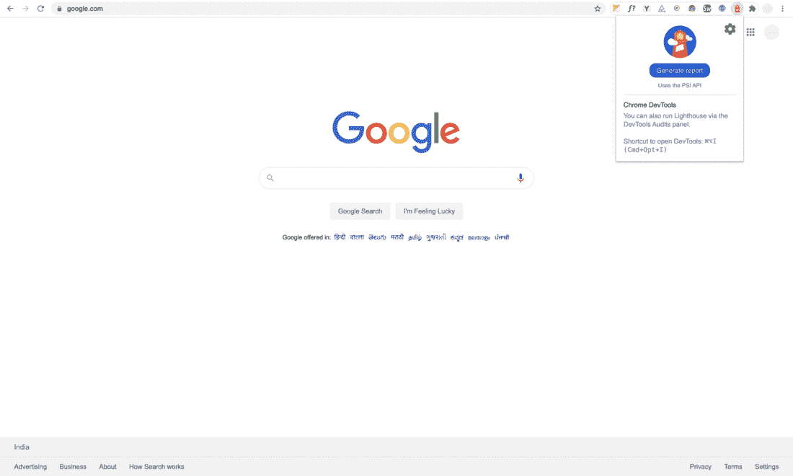
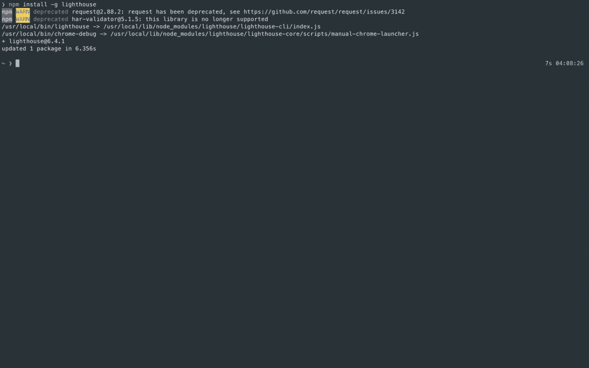
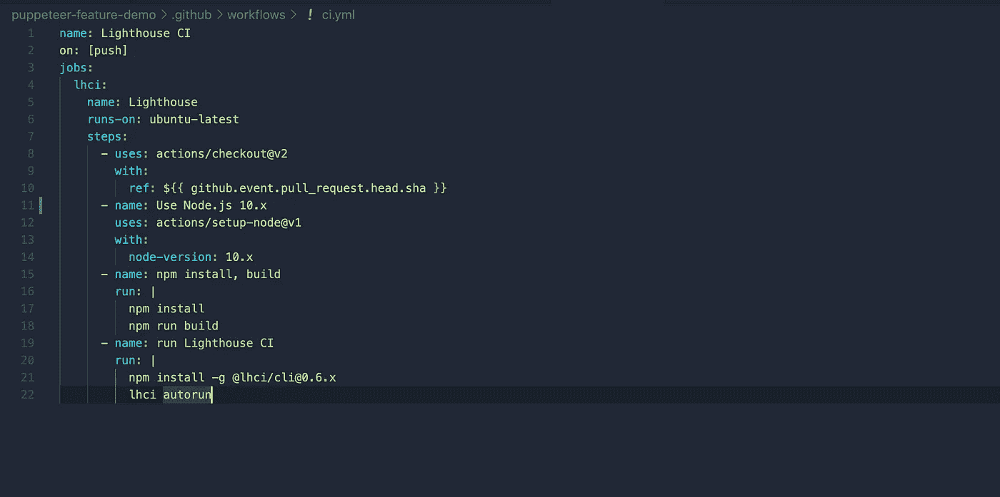

# 使用 Lighthouse 审计 WebApp 的质量保证检查点！

> 原文：<https://blog.devgenius.io/auditing-with-lighthouse-quality-assurance-checkpoint-for-webapp-9a41de8bd511?source=collection_archive---------2----------------------->

花一分钟了解性能、可访问性、最佳实践、SEO、PWA 指标。


Lighthouse 是一款[开源](https://github.com/GoogleChrome/lighthouse)，用于审计和提高网页质量和性能的自动化工具。

这是一个受欢迎的选择，因为它的多功能性和衡量不同指标的能力，如最佳实践、SEO 搜索引擎优化等...

在开始讨论如何使用 Lighthouse 之前，这里的基本问题是:

# 为什么是灯塔？

*   关注网站的网络标准。
*   Lighthouse 不仅提供指标，还生成一个可操作的报告，涉及特定的 DOM 元素、CSS 选择器或基础设施设置。
*   与等待项目完成不同，lighthouse 有助于在早期阶段进行审计，并且可以提前解决令人担忧的问题。
*   Lighthouse 可以在使用其他性能工具(如 Gatling、JMeter、BlazeMeter 等)开始广泛的性能测试之前使用。

.

# 运行灯塔

*   在 Chrome DevTools 中
*   作为 Chrome 的扩展
*   通过灯塔 CLI

**注意:**要预装 Chrome 浏览器。

[](https://www.google.com/chrome/) [## 谷歌浏览器-从谷歌下载快速、安全的浏览器

### 下载 Chrome 下载后按照说明安装。适用于 Windows 10/8.1/8/7 32 位。对于 Windows…

www.google.com](https://www.google.com/chrome/) 

## 从 Chrome DevTools 运行 Lighthouse

内置以来最简单的一个。

*   只需在浏览器中打开 Chrome DevTools(快捷键:F12)。
*   点击生成报告。仅此而已！你的工作完成了。等待审核完成，报告将在几秒钟内生成。



Chrome DevTools 中的灯塔

## 审计时实际发生了什么？

针对站点运行将模拟移动设备，降低连接速度以确保如果有人在移动设备上查看站点，性能数字与真实世界相符。并在此期间重新加载页面以检查站点是否脱机工作。然后将运行性能审核和可访问性审核。

最后，将生成报告，该报告基本上显示了根据反馈改进情况得出的分数。

.

## 将 Lighthouse 作为 Chrome 扩展运行

但首先，为 lighthouse 安装 chrome 扩展

[](https://chrome.google.com/webstore/detail/lighthouse/blipmdconlkpinefehnmjammfjpmpbjk) [## 灯塔

### Lighthouse 是一个开源的自动化工具，用于提高 web 应用程序的性能、质量和正确性…

chrome.google.com](https://chrome.google.com/webstore/detail/lighthouse/blipmdconlkpinefehnmjammfjpmpbjk) 

*   转到需要审计的网页。
*   点击**灯塔**图标。应该在 Chrome 地址栏旁边。如果没有，打开 Chrome 的主菜单，在菜单顶部访问。点击后，灯塔菜单展开。

**注意:**选择所需的审计指标。此外，还要选择可以运行 audit 的平台(桌面或移动)。

*   点击生成报告。将打开一个新选项卡，等待审核完成，几秒钟后将生成报告。



灯塔镀铬扩展

.

# 灯塔 CLI

通过允许通过命令行或编程方式运行审计，它提供了更多的灵活性和高级用途。

**注意:**节点和 npm 需要预装。

**步骤 1:** 打开终端，使用下面的命令在本地机器上全局安装 lighthouse。

```
npm install -g lighthouse
```

**步骤 2:** 安装后，通过指定 URL 运行以下命令

```
lighthouse <url>
```

或者，也可以使用以下命令指定 audit more:

```
lighthouse <url> --emulated-form-factor="desktop" --view
```

其他参数可以通过使用以下命令来查看:

```
lighthouse --help
```

等待审计完成。并在浏览器中打开审核报告的链接。



灯塔 CLI

**注意:** Lighthouse 可以生成 JSON 或 HTML 格式的报告。使用`--output=json`标志运行 Lighthouse 会生成一个 JSON 转储。

```
lighthouse [https://www.google.com](https://www.google.com) --output=json --output-path=./Desktop/audit.json
```

.

## 还有一种方法…

# 将 Lighthouse 与基于 Cypress JS 的框架相集成

可以使用 Lighthouse 插件在 e2e 测试中生成审计-

[](https://github.com/mfrachet/cypress-audit) [## MFR achet/cypress-审计

### 我们有机会能够使用强大的工具来自动化和防止不同类型的倒退…

github.com](https://github.com/mfrachet/cypress-audit) 

***注:****Jest 和 Puppeteer 也有插件。*

# GITHUB 操作

Lighthouse 也可以被添加为推送提交的安全网。下面的代码片段可以添加到 workflow.yml 文件中。



# 分数的计算

[](https://web.dev/performance-scoring/) [## 灯塔绩效评分

### Lighthouse 如何计算您的总体绩效得分一般来说，只有指标对您的 Lighthouse 有贡献…

网络开发](https://web.dev/performance-scoring/) 

# 参考

*   **文档链接:**[https://developers . Google . com/web/tools/light house # integrate](https://developers.google.com/web/tools/lighthouse#integrate)
*   **Github 链接:**【https://github.com/GoogleChrome/lighthouse 
*   **灯塔插件链接:**参考‘相关项目’章节-[https://github.com/GoogleChrome/lighthouse#plugins](https://github.com/GoogleChrome/lighthouse#plugins)

.

# 感谢阅读！