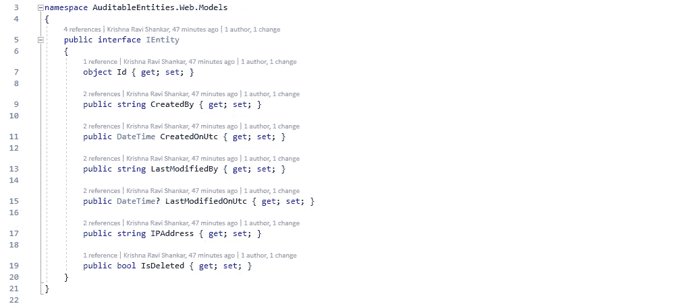

# 用实体框架审计你的 C#模型

> 原文：<https://blog.devgenius.io/auditing-your-c-models-with-entity-framework-9ab05d6c81e9?source=collection_archive---------5----------------------->



当处理数据时，我的客户或顾客经常问我，“谁修改了那个记录？”。我总是向我的所有实体(模型/表)添加一些审计信息，以了解谁添加或更改了一条数据以及最后一次更改是什么时候。

让我们首先创建一个名为 IEntity 的接口，它要求我的可审计实体需要有以下字段:

*   Id —这是我的主键。我倾向于将主键放在基本实体中，因为所有的实体都会有一个主键(即使是多对多的关系对象，但是一定要在 DbContext 中定义您的组合键)。按照惯例，实体框架将名为 Id 或 <type name="">Id 的属性识别为实体的主键。</type>
*   created by——一个类型为 *string* 的属性，它定义了谁创建了这个记录。
*   CreatedOnUtc —一个类型为 *DateTime* 的属性，它定义了该记录的创建时间。
*   LastModifiedBy —一个类型为 *string* 的属性，它定义了谁最后更新了这个记录。
*   LastModifiedOnUtc —可空类型的属性 *DateTime？*定义该记录上次更新的时间。
*   IP Address——一个类型为 *string* 的属性，存储当前用户的 IP 地址，尽管对我来说这处于道德灰色地带。我只想在这里展示这在技术上是如何实现的。
*   IsDeleted —类型为 *bool* 的属性，用于在您的实体上启用软删除。如果您的业务案例不需要此属性，您可以省略它。

```
public interface IEntity
{
    object Id { get; set; }
    public string CreatedBy { get; set; }
    public DateTime CreatedOnUtc { get; set; }
    public string LastModifiedBy { get; set; }
    public DateTime? LastModifiedOnUtc { get; set; }
    public string IPAddress { get; set; }
    public bool IsDeleted { get; set; }
}
```

然后创建一个实现 IEntity 的 BaseEntity 类。基本实体被标记为抽象类，因为您永远不需要实例化它。它只是作为实际实体的基类。

```
public abstract class BaseEntity<T> : IEntity
{
    [Required]
    public T Id { get; set; }

    object IEntity.Id
    {
        get { return Id; }
        set { }
    }

    [Required]
    public string CreatedBy { get; set; }

    [Required]
    public DateTime CreatedOnUtc { get; set; }

    public string LastModifiedBy { get; set; }

    public DateTime? LastModifiedOnUtc { get; set; }

    public string IPAddress { get; set; }

    public bool IsDeleted { get; set; }
}
```

注意这里的泛型类型 T。想法是让每个实体定义它需要什么类型的主键，即 GUID、int 等。为简单起见，您可以跳过泛型类型，使用您选择的任何类型。

不用说，所有日期都使用 UTC。

在实现 IEntity 时，让您的实体(或需要审计信息的实体)从 BaseEntity <t>继承。这确保了您的实体总是需要您的审计信息属性。</t>

```
public class Book : BaseEntity<int>, IEntity
{
    [Required]
    public string Title { get; set; }

    [Required]
    public string ISBN { get; set; }

    public int Pages { get; set; }
}
```

你就快到了。到目前为止，您已经建立了包含审计属性的模型。现在让我们使用实体框架的 ChangeTracker 在每次保存时设置这些属性。为此，我们在应用程序的 DbContext 中覆盖 SaveChangesAsync 方法。

```
public class ApplicationDbContext : DbContext
{
    private const string appUser = "SampleApplication";
    private readonly IHttpContextAccessor _httpContextAccessor;

    public ApplicationDbContext(DbContextOptions<ApplicationDbContext> options, IHttpContextAccessor httpContextAccessor = null) : base(options)
    {
        if (httpContextAccessor != null)
        {
            _httpContextAccessor = httpContextAccessor;
        }
    }

    public DbSet<Book> Books { get; set; }

    public override async Task<int> SaveChangesAsync(CancellationToken cancellationToken = default)
    {
        AddAuditInfo();

        return await base.SaveChangesAsync(cancellationToken);
    }

    private void AddAuditInfo()
    {
        var entities = ChangeTracker.Entries<IEntity>().Where(e => e.State == EntityState.Added || e.State == EntityState.Modified);

        var utcNow = DateTime.UtcNow;
        var user = _httpContextAccessor?.HttpContext?.User?.Identity?.Name ?? appUser;
        var ipAddress = _httpContextAccessor?.HttpContext?.Connection?.RemoteIpAddress?.ToString();

        foreach (var entity in entities)
        {
            if (entity.State == EntityState.Added)
            {
                entity.Entity.CreatedOnUtc = utcNow;
                entity.Entity.CreatedBy = user;
            }

            if (entity.State == EntityState.Modified)
            {
                entity.Entity.LastModifiedOnUtc = utcNow;
                entity.Entity.LastModifiedBy = user;
            }

            entity.Entity.IPAddress = ipAddress;
        }
    }
}
```

在这里，我们为那些被添加/创建的实体设置 CreatedOnUtc 和 CreatedBy 的值，并且为那些被更新的实体设置 LastModifiedOnUtc 和 LastModifiedBy 的值。

最后，确保在 Startup.cs 中配置 HttpContextAccessor，以便该服务可以作为依赖项注入到 DbContext 中。

```
public void ConfigureServices(IServiceCollection services)
{
    services.AddHttpContextAccessor();
}
```

这样你就有希望有一个简单而优雅的解决方案来审计你的模型。当您创建或更新实体时，审计信息将被添加并保存到数据库中。

完整的源代码可以在我的 Github 上找到。