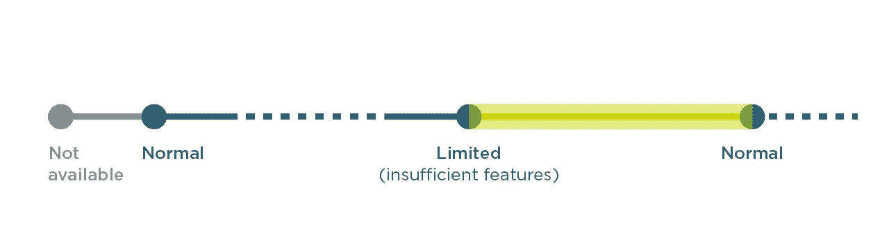
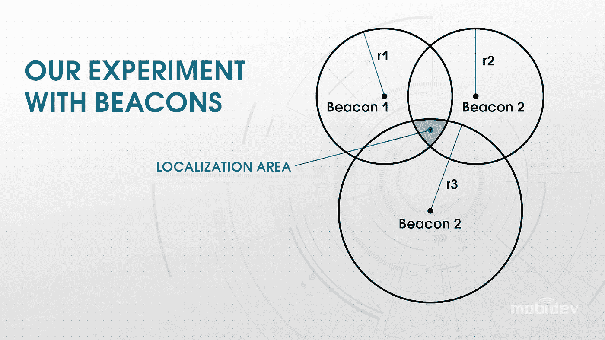
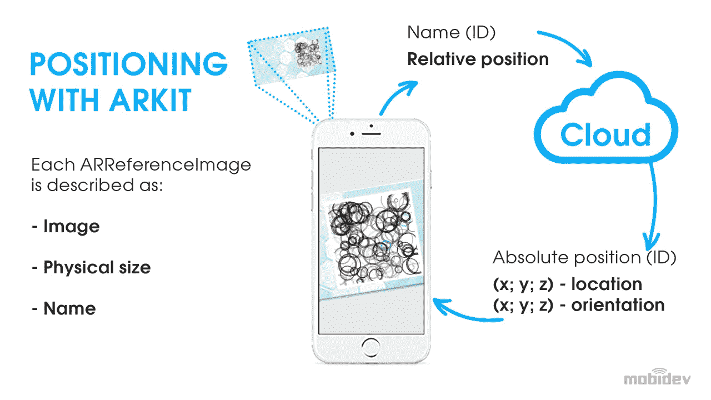
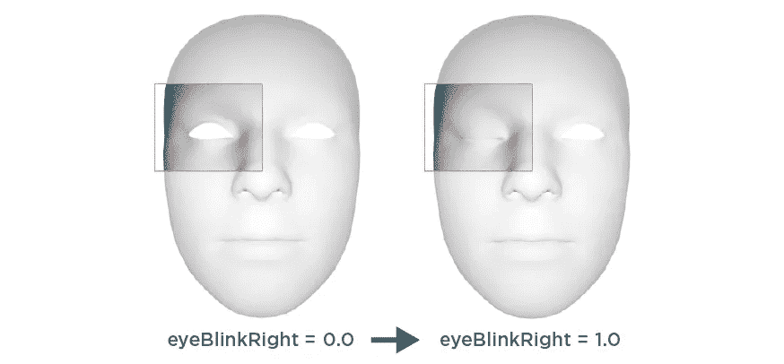
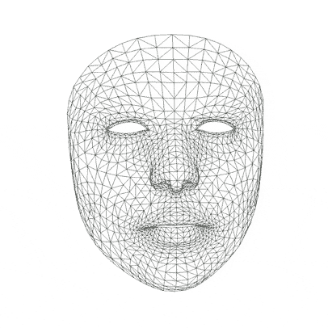

# iOS 应用中的增强现实:ARKit 开发指南

> 原文：<https://blog.devgenius.io/augmented-reality-in-ios-apps-arkit-development-guide-1ab2f7f096d6?source=collection_archive---------8----------------------->

在所有的[增强现实平台](https://mobidev.biz/blog/augmented-reality-development-guide)中，ARKit 在受欢迎程度和性能方面遥遥领先。苹果紧密的生态系统，标准化的硬件，以及 ARKit 对增强现实应用的高性能，使其非常适合 AR 开发者。选择使用原生 iOS 框架制作应用程序释放了更高级 AR 产品的潜力。

凭借在构建 AR 驱动的应用程序方面的丰富经验，我们创建了 ARKit 开发指南，它将帮助您填补对 ARKit 项目细节理解的一些空白。

# ARKit 功能可在 iOS 上提供身临其境的体验

ARKit 最重要的方面是，它是唯一一个释放 iPhone 和 iPad 硬件的全部潜力以实现增强现实体验的框架。ARKit 必须提供的一些最伟大的功能是对象和场景识别、网格化、地理跟踪、面部跟踪等等。

ARKit 经常被拿来和它的 Android 竞争对手 ARCore 比较。就像 ARKit 一样，ARCore 可以充分利用 Android 设备的潜力来实现增强现实。然而，Android 设备远比苹果多样化，有各种不同的规格和性能水平。这使得 ARKit 的性能更加可预测和一致。

如果你只是针对 iOS，或者如果你特别希望利用苹果设备的全部功能来获得 AR 体验，ARKit 是一条不错的道路。此外，如果你打算为 iOS 和 Android 创建两个原生应用，我们建议从 iOS 开发开始，因为它为开发者提供了比 Android 更方便的工具，这意味着一个检查你想法可行性的高性价比选择。而且，它覆盖了更多的潜在用户。

# 如何用 ARKit 创建增强现实

iOS 设备上的增强现实体验是通过三个步骤完成的:跟踪、场景理解和渲染。AR 应用需要来自相机、加速度计和陀螺仪等传感器的输入。然后，必须对这些数据进行处理，以确定摄像机在现实世界中的运动。一旦完成，3D 虚拟物体可以被渲染在真实世界图像之上并显示给用户。

更高级的 AR 应用程序使用深度传感器来了解场景的布局。这允许更好的比例感，甚至可以支持像遮挡这样的功能，即真实世界中的对象存在于 AR 中的虚拟对象之前。

然而，对于大多数 AR 应用来说，最好的环境是纹理清晰、光线充足的区域。平面最适合视觉里程计，静态场景最适合运动里程计。当环境不满足这些条件时，ARKit 向用户提供跟踪状态的信息。三种可能的状态是:不可用、正常和受限。

ARKit 除了简单地在平面上显示物体之外，还有很多功能。例如，ARKit 5 支持垂直表面、图像识别和放置在地理空间中的对象。为了了解 ARKit 的功能，让我们来看看几个用例，它们可以帮助您的企业开辟一条创新的成功之路，并通过 ARKit 开发垄断市场。

# 案例研究#1:室外和室内增强现实导航

GPS 是户外导航之王。然而，在室内以及被地形和高楼阻挡时，它的精确度会下降。然而，不断发展的技术，如蓝牙信标、无线 RTT 和超宽带正在填补这个空白。增强现实导航可以帮助用户使用 GPS 和其他技术在屏幕上以虚拟元素的形式绘制现实世界的方向。

有了替代定位技术支持的 AR 室内导航，在购物中心、会议中心和机场航站楼导航会变得更加容易。它还可以用于商店和配送中心的业务环境中，以帮助员工找到他们需要的物品和包裹。

# 使用创新技术进行室内定位

如果 GPS 不可用，蓝牙、Wi-Fi RTT 和 UWB 等替代定位技术可以帮助设备获取其精确位置。之后，ARKit 和渲染引擎会处理剩下的事情。

在这种情况下，经常讨论的解决方案是物联网信标网络，但我们的研究表明，信标用于精确 AR 导航的能力非常有限。在我们的实验中，信标导航精度为 3-5 米，这对于 2D 导航来说是可以的，但 AR 需要更高的精度，最好达到 1 米，甚至更高。

这种方法面临各种挑战。信标网络必须小心定位，以避免干扰和阻碍。例如，UWB 信号不能穿过墙壁、人和植物。此外，它可能很贵，而且只在某些情况下有用。

鉴于信标不允许我们创建精确的室内 AR 导航，让我们看看其他可以帮助我们实现这一目标的选项。

# 图像识别和机器视觉

提供精确室内定位的另一种方法是使用视觉标记作为参照系。这类似于 ARKit 定位锚，它在 Look Around 数据库中搜索匹配的图像，以找到设备的地理位置。然而，我们没有搜索苹果地图数据库，而是创建了我们自己的视觉标记数据库。这些可以是 QR 码或任何表面上的任何其他类型的独特代码。扫描时，这些标记将位置元数据传送给设备。

通过从标记获得的 3D 坐标，移动设备可以启动 AR 导航体验，以帮助用户找到穿过建筑物的路。这消除了对昂贵的物联网信标网络的需求。唯一需要的维护将是确保标记物是干净的和无障碍的。

# 用增强现实渲染路径:遮挡的重要性

在屏幕上绘制内容很容易。让它与现实世界无缝融合要困难得多。对于室内导航，如果屏幕上绘制的线在转弯时被墙或门遮挡(阻挡),那么它会更有帮助。如果没有遮挡，用户可能会对屏幕上的方向感到困惑。

一些解决方案包括简单地在屏幕上画一个箭头，而不是一条实线。然而，这并不方便。另一个选择是减少渲染距离。这可以防止线被画得太远，并且更容易避免必须考虑遮挡。

在我们的案例研究中，我们决定采用不同的方法，创建一个非常低多边形的 3D 建筑模型。这使我们能够通过使用用户的相机将模型与真实世界重叠，并允许我们更好地支持遮挡。它需要更多的时间和精力来开发，但它通过 ARKit 提供了更身临其境、更易于理解的室内导航体验。我们认为这是 AR 室内导航最具成本效益的选择之一，不会牺牲质量。

**查看我们下面的 ARKit 导航演示，了解 AR 室内导航的实际应用！**

# 使用 ARKIT 进行户外 AR 导航的位置锚

室外 AR 导航通常比室内导航更容易实现，因为有更可靠的技术可用，如 GPS。然而，基于图像识别的 VPS(视觉定位系统)系统可以使导航更加精确。这使得为 AR 体验显示虚拟对象变得容易得多，如屏幕上的方向。

不过这种方法也有一些缺点。例如，农村地区可能有街景图像，但没有足够的人工特征(如高楼)作为参考。这意味着更难在屏幕上提供方向。数据库中没有任何图像的区域将使该方法无用。由于这些限制，基于图像的定位仅在更多的城市区域有用。

位置锚允许开发者在地理空间中“锁定”虚拟对象。用户首先从图像识别中获得他们的位置，然后就可以在他们的屏幕上看到这些虚拟对象。然而，这些城市地区也有一些不足之处。Apple Look Around 图像数据尚未在所有城市提供。一个潜在的替代方案可能是信标或 GPS 网络。信标网络对于较小规模的室外环境会有用得多。例如，可以通过在工厂区域散布信标来找到正确的车间。

# 案例研究#2: AR 测量工具

由于用于提供增强现实的强大传感器，无需拿出卷尺就可以对环境进行精确测量。这导致了苹果公司 RoomPlan 框架的开发，该框架使用 iPhone 或 iPad 激光雷达扫描仪来创建建筑物内部的 3D 平面图。这包括房间尺寸，甚至可以识别家具的类型。

我们为俄勒冈州的一个客户做了一个类似的项目，创建了 [AR 家居装修应用](https://mobidev.biz/case-studies/ar-solution-for-home-renovation)。这使得用户可以改变墙壁的颜色，添加新的家具和其他物品。然而，在某些情况下，用户可能希望在同一表面上使用多种材料。这需要做更多的工作。我们选择开发一个带有图形数据结构的自定义算法，以使它按预期工作。这允许用户将任何表面划分成任意数量的区域，并为每个区域选择不同的材料。

即使在这种情况下，我们创建了一个定制的解决方案，今天发布的 RoomPlan 也可以用于类似的项目，使开发人员更容易使用。RoomPlan 使开发人员能够高效地以 USD 或 USDZ 文件格式输出房间扫描。这些包括房间尺寸和房间包含的对象。这些文件格式可以导入到其他软件中进行进一步的处理和开发。房间扫描速度极快，允许用户在几秒钟内创建房间扫描。

# 案例研究#3:基于人脸的增强现实

ARKit 相对于 ARCore 的一个主要优势是硬件兼容性和稳定性。自 iPhone X 以来，iPhone 的 TrueDepth 相机已经能够在基于面部的 AR 中提供一致的质量。就像其他类型的 AR 一样，这涉及到跟踪，场景理解和渲染。

ARKit 处理数据以产生跟踪数据、面网格和混合形状。追踪数据可以让开发人员更好地了解如何在对象移动面部时显示内容。面网格是面的几何体。混合形状是根据特定面部特征的运动而设置的检测到的面部的参数。每个参数都有相应的值，该值是一个浮点数，表示该特征相对于其中性配置的当前位置，范围从 0.0(中性)到 1.0(最大移动)。

基于面部的 AR 用于 AR 面罩和过滤器，以改善用户体验并提高参与度。虚拟试穿解决方案是消费者和企业的另一个热门选择。基于人脸的 AR 可以帮助消费者在家里试穿产品，如太阳镜和化妆品，而不必离开房子。服装、鞋类、配饰和化妆品品牌长期以来一直在实施这种[顶级零售趋势](https://mobidev.biz/blog/7-technology-trends-to-change-retail-industry)，随着对[meta vers](https://mobidev.biz/blog/metaverse-technology-business-application-development)兴趣的增长，它变得更加流行。

# 基于人脸的 ARKIT 技术的非增强现实应用

重要的是要记住，由于面部跟踪的高级保真度，ARKit 不一定只对 AR 体验有用。它可以简单地用于没有增强现实的面部跟踪应用。

例如，通过面部测量追踪体重减轻是可能的。随着体重的增加和减少，他们的脸会变宽。iPhone 真深度相机可以检测到这些变化，并通过应用程序测量它们随时间的变化。此外，基于面部的 AR 可以通过混合形状和眼球运动来控制屏幕上的元素。只要有一点想象力，基于人脸的 AR 通过 ARKit 解决方案打开了许多可能性。

**查看 MobiDev 演示，了解更多关于视线跟踪功能和使用案例的信息。**

基于人脸的 ARKit 技术的另一个与 AR 无关的用途是司机的安全。MobiDev 开发的 WakeUp app 可以说明这一点。这是一个应用程序，可以跟踪并根据驾驶员头部和眼睛在空间中的位置变化采取行动。这款 iOS 应用程序在检测到注意力分散或昏昏欲睡的驾驶倾向时，会通过发出声音来提醒用户注意。ARKit 为此结合了两个数据源:

*   前置摄像头:面部识别。
*   原深感摄像头:提供更先进的面部跟踪。

这两个传感器一起允许 ARKit 检测面部特征点和眼睑闭合。当数据达到一定的阈值时，应用程序可以向用户发出高度准确的警告。

# ARKit 发展的未来

由于其室内导航、面部识别、房间扫描功能等，ARKit 具有巨大的潜力。根据炮兵情报部门的数据，活跃的 ARKit 设备数量每年都在增长，2022 年达到约 13.68 亿台，而 2021 年为 12.5 亿台。这表明企业对使用 ARKit 为客户提供身临其境的体验越来越感兴趣。

虽然 ARKit 增强现实开发中涉及的技术很重要，但任何成功的 ARKit 项目最关键的组成部分是一个专家开发团队。没有明确的、创新的目标，企业就不能创造独特的、有价值的问题解决方案。只有经验丰富的 ARKit 开发者才能将计划转化为高性能的软件。

由 [MobiDev](https://mobidev.biz/services/mobile-application-development) 的移动开发主管 [Andrew Makarov](https://mobidev.biz/our-team/andrew-makarov) 撰写。

*全文原载于*[*https://mobidev . biz*](https://mobidev.biz/blog/arkit-guide-augmented-reality-app-development-ios)*，基于 mobi dev 技术研究。*