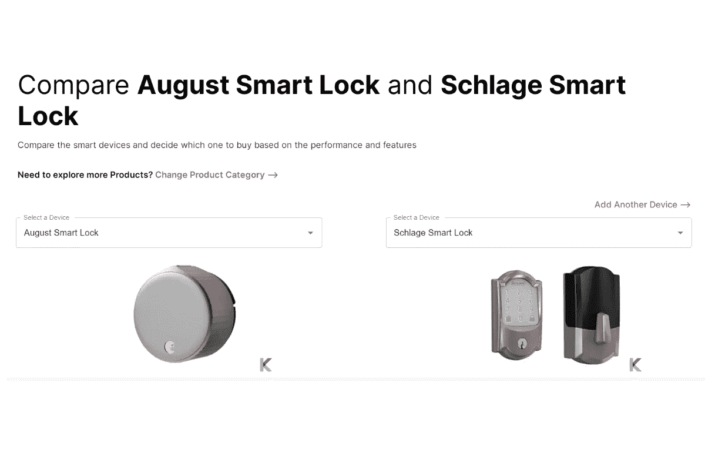

# 八月 Wi-Fi 智能锁第四代与西勒奇 Encode 智能锁

> 原文：<https://blog.devgenius.io/august-wi-fi-smart-lock-4th-generation-vs-schlage-encode-smart-lock-2c618ac6737c?source=collection_archive---------1----------------------->

你想通过使用智能门锁为你的家带来真正的便利吗？现在，你可以将门锁与智能手机配对，只需一个语音命令，就可以监控、解锁和锁上门。有时候，你的目的可能不同。因此，为每个人找到最佳选择是不同的。

有些人可能会寻找智能功能，而有些人会寻找调度和用户代码限制。在众多的智能门锁中，我为你评测了两种不同的门锁。在对比这两把锁的时候，我发现了智能设备对比工具。所以，我能够利用它获得正确的信息。以下是你需要了解的八月无线智能锁和西勒奇编码智能锁。

八月 Wi-Fi 智能锁第四代与西勒奇 Encode 智能锁

***在这篇文章中，你会学到；***

*   什么是“八月 Wi-Fi 智能锁”和“西勒奇编码智能锁？”
*   August Wi-Fi 智能锁和西勒奇 Encode 智能锁的利弊
*   使用智能设备比较工具比较 August 和西勒奇 Encode 智能锁的功能？
*   如何安装 August Wi-Fi 智能锁&西勒奇 Encode 智能锁？
*   价格比较
*   哪款智能锁最适合你？

**检查你的八月智能锁的兼容性**

如果您想检查 August lock 以及任何智能家居设备与您的智能家居系统的兼容性，您可以找到[智能家居兼容性检查器](https://play.google.com/store/apps/details?id=com.knovik.canda)来轻松检查智能家居系统兼容性。

此外，如果你有自己的 Siri，那么你可以很容易地检查智能家居设备与 Siri 的兼容性。而且，不仅仅是谷歌 Siri 兼容性，你还可以检查设备与 Alexa 和谷歌助手的兼容性。

对于 Android 用户

[下载智能检查器](https://play.google.com/store/apps/details?id=com.knovik.canda)

对于 iPhone 用户

[下载智能检查器](https://apps.apple.com/us/app/canda-compatibility-checker/id1630339464)

此外，您可以简单地扫描这个二维码来下载这个智能检查器。

此外，您可能会找到我们的[Canda——智能家居设备兼容性检查器](https://kodmy.com/canda-by-kodmy/)文章，以了解关于 Canda 智能检查器应用程序的更多信息。

# 什么是“八月 Wi-Fi 智能锁”和“西勒奇编码智能锁？”

八月 Wi-Fi 智能锁第四代

August Wi-Fi 智能锁第四代是一款便捷的智能锁，小巧的框架中包含大量功能。它包括一个门感应开关传感器和一个改装的奥古斯特锁。它功能强大，易于安装，比之前的 8 月小 45%。此外，您可以获得无限制的用户访问和无钥匙进入代码。

快一点！ [***从亚马逊获得 8 月 Wi-Fi 智能锁 4 代***](https://amzn.to/3AFXDZv) 。

西勒奇编码智能锁

[西勒奇编码智能锁](https://kodmy.com/smart-lock-for-smart-life/#Schlage%20Encode)是一款支持 Wifi 的智能锁，集成了环形摄像头和亚马逊钥匙。不要担心额外的附件。你需要的只是西勒奇家居应用或亚马逊应用来管理你的智能门锁。此外，它有一个防指纹和电容式触摸屏来锁定和解锁您的门。

此外，还有更多类型的智能锁，如环智能锁，耶鲁智能锁，巢智能锁，等等。现在你对这两种智能锁有了一些基本的了解。所以，我们深入研究。

快一点！ [***从亚马逊***](https://amzn.to/3CHQHLW) 获得西勒奇编码智能锁。

**设计**

August WiFi 智能锁和西勒奇 Encode 智能锁根据其功能有两种不同的外观。August Wi-Fi 智能锁第四代旨在安装在您现有的锁舌上，旨在完全取代您现有的锁舌。它还有一个非常友好的圆盘形设计。如果你想锁门或开门，你可以使用现有的插销钥匙或智能手机。它明显小于上一代产品。此外，它有银色或哑光黑色。

智能工具对比[8 月 Wi-Fi 智能锁第四代与西勒奇 Encode 智能锁]

与旧款相比，这款西勒奇智能锁提供了更多的功能。你喜欢用哪个？—密码还是钥匙？它是使用两种选项来锁门和开锁的能力。有一个额外的锁定和解锁选项会很好。此外，它有几种颜色和两种不同的风格。

August lock 有更多选择，它让智能门锁更像是你智能家居的一部分。它提供了令人敬畏的功能，如接近自动锁定和门感。你喜欢这些特点在一起。此外，它是英国和迪拜最好的 Wi-Fi 智能锁。

**App**

奥古斯特有一个应用程序来做所有的事情。它还可以与苹果 HomeKit、Alexa 和谷歌助手一起工作，没有任何不好的东西。如果你更喜欢苹果设备，你可以很容易地选择八月智能锁，因为西勒奇不支持[苹果 HomeKit](https://kodmy.com/apple-homekit/) 。您可以使用 August 的手机应用程序或语音命令来锁定和解锁您的门。此外，这种智能锁可以与三星、SimpliSafe 和罗技的家庭安全平台集成。当你不在家时，你可以使用 August App 来检测你的门是否关闭的真实情况。是的。你可以不用钥匙就能自动开门。

西勒奇编码与亚马逊集成，你将能够连接你的戒指设备，如[门铃](https://kodmy.com/ring-video-doorbell-3-plus/)。因此，您可以使用 Ring 应用程序锁定和解锁您的西勒奇。如果你想使用亚马逊钥匙应用程序，你可以将你的虚拟钥匙分发给任何客人。此外，你还可以使用西勒奇主页应用程序。所以它没有特定的应用程序。

# August Wi-Fi 智能锁和西勒奇 Encode 智能锁的利弊

选择适合自己的设备时，比较优势和劣势更重要。幸运的是，我可以使用上面提到的智能工具来比较这些利弊。以下是八月无线智能锁和西勒奇编码智能锁的一些优点和缺点。

*   **八月 Wi-Fi 智能锁**

*   **西勒奇编码智能锁**

# 使用智能设备比较工具比较 August Wi-Fi 智能锁和西勒奇 Encode 智能锁的功能？

对比 8 月 Wi-Fi 智能锁第四代和西勒奇 Encode 智能锁[对比工具]

这两种智能锁有一些相同的功能，但不是全部。我比较了这两款设备的几个不同之处。使用智能工具，我可以比较所有的特征，比如最好的价格、品牌、颜色、可访问性特征、特殊特征、尺寸等等。这是为您选择合适设备的一个非常简单的方法。以下是使用最佳智能比较工具对 August Wi-Fi 智能锁和西勒奇 Encode 智能锁进行的简单功能比较。

# 如何安装 August Wi-Fi 智能锁&西勒奇 Encode 智能锁？

## August Wi-Fi 智能锁

八月 Wi-Fi 智能锁安装简单。如果你有另一个 August 设备，你应该已经有一个移动应用程序了。但是，如果这是第一台设备，您需要下载并创建一个帐户。这里有一些你想遵循的步骤。

**第一步** —打开八月 App

**第二步** -点击菜单中的设置设备

**第三步** -选择设置您的智能锁，然后从列表中选择 Wi-Fi 智能锁

**第四步**——按照说明扫描二维码。

**第五步** -按照屏幕上的安装说明安装 August 智能锁

## 西勒奇编码智能锁

西勒奇编码的安装过程也很容易，但比八月更难。首先，你需要下载移动应用程序，然后创建一个帐户。下载应用程序后，请验证您的电子邮件地址。

**第一步** -取下您的旧锁，然后使用随附的 2 颗螺钉安装闩锁组件

**第二步** -使用安装板和螺栓将外部键盘安装到门上

**第三步** -将键盘数据线连接至内部饰框电缆

**第四步** -将键盘的尾端滑入室内饰框的中心

**第五步** -将锁眼盖安装到安装板上，然后安装 4 节 AA 电池

**第六步** -锁安装好后，按照屏幕上的指示扫描二维码

**第七步** -按下配对按钮，将锁连接到您的 Wi-Fi

**第八步** -从列表中选择您的 SSID，然后输入密码

# 价格比较

# 哪款智能锁最适合你？

如果你正在为你的家寻找最好的智能门锁，我推荐 August Wi-Fi 智能锁，因为它可以与谷歌助手、Alexa 和苹果 HomeKit 配合使用。它也有充分的理由考虑这种智能锁，例如易用性、多平台支持、强大的第三方集成等等。您不需要附加网桥，因为它已经嵌入了 Wi-Fi。还有，西勒奇 Encode 智能锁比 August 智能锁贵一点。然而，如果你更多的是在亚马逊上，西勒奇的亚马逊钥匙计划是非常好的。然后，你可以用西勒奇编码智能插销。

*更多内容尽在*[*blog . dev genius . io*](http://blog.devgenius.io)*。*