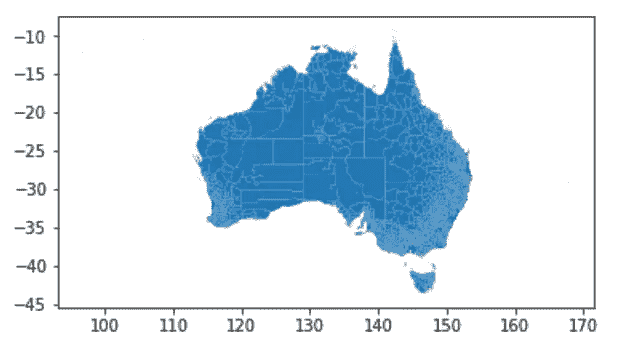

# 澳大利亚 2021 年人口普查。加载数据并将其显示在地图上

> 原文：<https://blog.devgenius.io/australian-census-2021-loading-data-and-showing-it-on-a-map-192dd0b49d00?source=collection_archive---------7----------------------->


安妮·斯普拉特在 [Unsplash](https://unsplash.com?utm_source=medium&utm_medium=referral) 上的照片

去年我们进行了一次澳大利亚人口普查，现在可以从澳大利亚统计局的网站上下载一个新的数据集。

当我处理之前的 2016 年人口普查数据时，我希望改进旧方法的几个缺点:

*   显示普查数据中的任何指标
*   允许使用位置名称在指定区域放大地图
*   显示郊区轮廓及其名称
*   使用人口普查指标计算给定统计区域的人口占总统计区域人口的百分比，例如在希腊出生的人数
*   将地图导出到文件，以便以 PDF 或 JPEG 格式与其他人共享

# 从 ABS 网站加载数据

最新的 2021 年人口普查数据包可以从 https://www.abs.gov.au/census/find-census-data/datapacks[下载](https://www.abs.gov.au/census/find-census-data/datapacks)


人口普查数据包下载

选择人口普查年份和统计区域 1 (SA1)地理。SA1 是最小的统计区域。sa1 一般人口在 200 到 800 人，平均人口在 400 人左右。

除了人口普查数据，我们还需要下载 SHP 文件格式的 SA1 和郊区的地理形状

https://www . ABS . gov . au/statistics/standards/Australia n-statistical-geography-standard-asgs-edition-3/jul 2021-jun 2026/access-and-downloads/digital-boundary-files


SA1 几何下载


郊区几何图形下载

# 将普查元数据加载到 Pandas 数据框架中

普查数据包包含 XLSX 文件格式的 Excel 电子表格。该文件包含两个电子表格，其中包含关于人口普查数据表和每个表中的列的详细信息。可以使用 openpyxl 库将数据加载到 Pandas 中。要安装 run:

```
!pip install openpyxl
```

现在，我们可以将元数据加载到数据框中:

census _ cells _ df“Long”列包含对普查指标的详细描述。让我们获取所有包含“人员”的指标:

```
census_cells_df[census_cells_df.Long.str.contains("Persons")]
```


普查元数据

例如，指标“总人数”位于数据包文件“G01”中。

# 加载统计区域 1 和郊区几何

要将 SHP 文件加载到地理数据框中，请运行:

我也在添加调用*。to_crs(crs=4326)* 将坐标参考系统设置为 WGS 84。如下图所示，它包含了整个澳大利亚的几何图形:



SA1 几何


郊区几何图形

# 地图的边界框坐标

通常，我们希望显示城市、城镇或城市内区域的人口普查数据。这可以通过定义边界框来完成。它是一个矩形，以十进制的纬度和经度来指定区域的北、南、西、东边界。

您可以通过浏览地图来获取它们，但我发现更简单的方法是指定我想要包含的位置，然后构建一个包含所有这些位置的边界框。例如，这里是郊区“新南威尔士州 Engadine”、“新南威尔士州戈登”、“新南威尔士州曼利”和“新南威尔士州梅里兰兹”的边界框:


可以使用 OSMNX 库从 OpenStreetMap 加载位置形状。为什么选择 OpenStreetMap？它提供了更多的位置类型，例如一些“非官方”的地区名称，如悉尼的“内西部”或整个城市的轮廓。人口普查数据只包括郊区和 SA1 地区。

以下代码将返回位置列表的边界框:

以下是生成的边界框:

```
{'north': -33.7428152,
 'south': -34.0795039,
 'west': 150.9625496,
 'east': 151.307459}
```

# 加载人口普查数据表

每个普查数据文件都以 CSV 格式存储。我们可以通过传递数据表名将其加载到数据框中，如“G03”:


G03 数据表中的 Total_Total 指标

# 通用地图渲染功能

因为为不同的度量和位置生成地图是相似的，所以我决定实现一个函数，该函数将根据人口普查度量、白色郊区轮廓和郊区标签对区域进行着色。您也可以指定地图边界框的位置。

下面是一个使用此函数显示几个郊区并将它们的形状区域用于色阶的示例:


带有郊区轮廓的渲染地图

# 悉尼人口密度图

现在，通过访问人口普查数据和地图渲染功能，我们可以通过将 SA1 人口(数据表 G03，列 **Total_Total** )除以其面积(来自几何 SHP 文件的 **AREASQKM21** )来创建人口密度地图。

```
pop_area_sa_df = load_census_table("G03")
pop_area_sa_df["population_density"] = pop_area_sa_df.Total_Total / pop_area_sa_df.AREASQKM21
```

和渲染贴图:


悉尼人口密度

我决定对显示的郊区标签的数量进行限制，否则您将无法看到实际的地图。

# 简化人口普查地图逻辑

看起来不错，但是其他指标呢？我懒得去查 metric 在哪个数据表里面，键入 title。让代码为我们做这些工作。我们可以使用元数据填充标题并查找度量文件名:

现在我们只需要一个公制的长名字(**中位数 _ 总数 _ 家庭 _ 收入 _ 每周**)和位置列表就可以得到一张地图。只用一行代码:-)

```
show_census_data("Median_total_family_income_weekly", ["Gordon, NSW", "Parramatta, NSW", "Manly, NSW", "Engadine, NSW"])
```


一些指标，如每周家庭收入，可以用作彩色地图的值，但其他指标，如某个国家的出生人数，只有在我们将该数字与统计区域的总人口进行比较时才有意义。这就是为什么我添加了一个额外的布尔参数**relative _ to _ total _ population。**设置为 true 时，将创建一个数据框列，其中包含人口占区域人口的百分比。

例如，metric PERSONS_Greece_Total 的可视化显示出生在希腊的人的百分比:

```
show_census_data("PERSONS_Greece_Total", ["Gordon, NSW", "Parramatta, NSW", "Manly, NSW", "Engadine, NSW"], relative_to_total_population=True)
```


悉尼出生在希腊的人的百分比

想尝试其他指标吗？去 Kaggle 笔记本实验:

[](https://www.kaggle.com/code/maxim75/australian-census-2021) [## 澳大利亚 2021 年人口普查

### 使用 Kaggle 笔记本探索和运行机器学习代码|使用来自多个数据源的数据

www.kaggle.com](https://www.kaggle.com/code/maxim75/australian-census-2021)