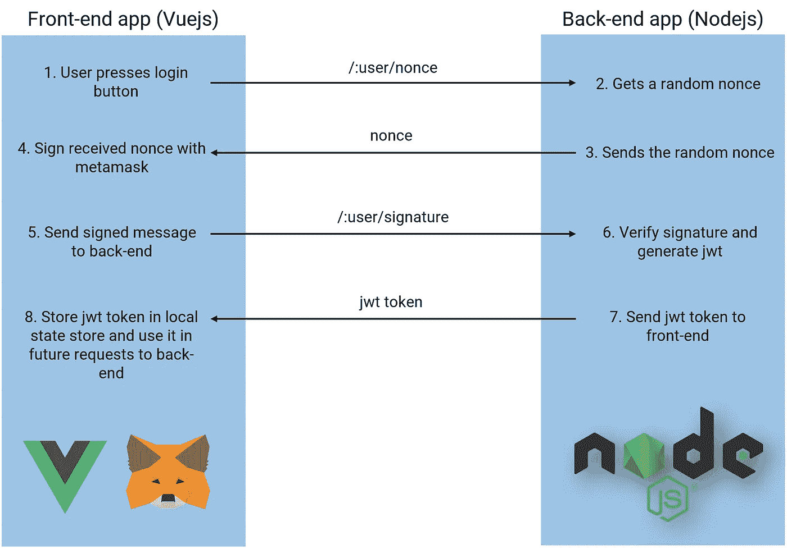
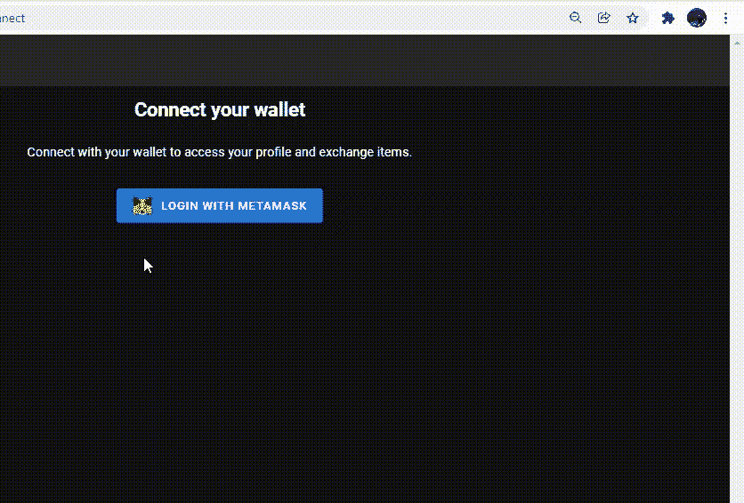

# 使用 metamask 和 nodejs 向您的 web 应用程序验证用户

> 原文：<https://blog.devgenius.io/authenticating-users-to-your-web-app-using-metamask-and-nodejs-e920e45e358?source=collection_archive---------1----------------------->

包含代码片段的分步指南，用于实现 web3 登录流程。


背景图片来自[像素](https://www.pexels.com/pt-br/foto/fotografia-aerea-de-pinheiros-na-montanha-9754/?utm_content=attributionCopyText&utm_medium=referral&utm_source=pexels)中的[创意波动率](https://www.pexels.com/pt-br/@creative-vix?utm_content=attributionCopyText&utm_medium=referral&utm_source=pexels)

因此，您正在构建一个 web3 web 应用程序，现在到了可怕的部分，您需要对用户进行身份验证，并确保您的一些服务路径只有在正确的身份验证后才能访问。别担心，你无意中找到了正确的文章。

在本文中，我们将生成并使用 jwt (json web 令牌)来允许用户访问 nodejs 中受保护的路由，这需要对用户进行身份验证(比如更新他们自己的配置文件细节)。不同之处在于，用户不再提供用户名和密码，而是只使用元掩码钱包进行身份验证。以下是我们将使用的技术:

*   我们后端/api 的 Nodejs。
*   用于生成 jwt 令牌的 Passportjs。
*   前端登录的元掩码。
*   Vuejs 和 Nuxtjs 用于我们的前端(您也应该能够将此代码转换为其他框架，如 React)。

为了使本文简短，我不会深入讨论下面提到的一些主题(例如脚本编程、客户端状态管理、执行 http 请求、将 nodejs 连接到数据库等等)，本文应该作为任何开发人员在他们的应用程序中快速实现 web3 jwt 身份验证流程的快速分步指南。

# 认证流程

身份验证流程如下:



根据定义，随机数是在加密通信中只能使用一次的任意数字。在本文中，我们将使用以下代码在 javascript 中生成随机随机数:

```
nonce = Math.floor(Math.random() * 1000000);
```

此外，如果用户是第一次登录该平台，我们将通过将他添加到我们的用户数据库并自动为他分配一个随机数来自动注册他。

# 前端设置

在我的例子中，我创建了下面的 vue 组件，它将具有上面提到的所有必需的逻辑:


如果用户没有安装元掩码，它会要求用户先安装它:


模板 html 代码(使用 Vuejs 和 Nuxtjs)如下所示:

与核心相关的 javascript 代码如下。注意，在这段代码中，我们使用 [axios](https://axios-http.com/docs/intro) 来执行 http 请求，使用 [vuex](https://vuex.vuejs.org/) 来本地管理 web 应用程序中的状态。

在我们的本地应用 vuex 状态下，当调用 metamask/ethereum getter 时，我们执行以下操作:

```
ethereum: state => { if(process.client) { return window.ethereum } }
```

完整的脚本代码包括这个 Vue 组件的其他提到的方法可以在[这里](https://gist.github.com/duartefdias/b2d1557a35a0bec6329d3f54e1771f5e)找到。

# 后端设置

在后端，我们在 Nodejs 中实现了以下路由:

上述文件的完整代码和其他路径可以在[这里](https://gist.github.com/duartefdias/0a1467e7f788a1ca261d2b1e02596783)找到。

您还需要为 passportjs 创建一个设置，如下所示:

JWT_SECRET 是一个将用于解密 JWT 令牌的字符串。可以是你想要的任何东西。

# 用户体验

假设您正确地实现了上述设置，您现在应该有一个类似于下面的用户登录流:



您可以将 metamask 中显示的消息自定义为您想要的任何内容。只要确保完整的字符串(message + nonce)在前端和后端是相同的。

前端应用程序现在将拥有一个 jwt 令牌，它可以将这个令牌附加到任何 http 请求中，以访问受保护的 api 路由。

# 在节点中创建受保护的路由

您可以像这样轻松地创建受保护的路由:

在本例中，在运行任何路由代码之前，路由将使用 passportjs 中间件来验证所提供的 jwt 令牌是否有效。否则，它将向用户返回一条未经授权的消息。

# 结论

本文是一篇简短实用的指南，介绍了如何在应用程序中快速实现 web3 jwt 认证流程。如果你遇到困难，或者想进一步了解上面提到的一些话题，我建议你查阅以下资源:

*   [Metamask 开发者文档](https://docs.metamask.io/guide/)
*   [使用元掩码创建基本的分散式应用](https://docs.metamask.io/guide/create-dapp.html#project-setup)
*   [使用 express 创建 nodejs 应用程序](https://expressjs.com/en/starter/generator.html)
*   [创建数据库模式并使用 Mongoose 访问 MongoDB 数据库](https://mongoosejs.com/docs/)
*   [使用 passport-jwt 库生成 jwt 令牌](http://www.passportjs.org/packages/passport-jwt/)
*   [使用 Nuxtjs 创建前端应用](https://nuxtjs.org/docs/get-started/installation)
*   [使用 axios 执行 http 请求](https://axios-http.com/docs/intro)
*   [使用 Vuex 管理前端应用的本地状态](https://nuxtjs.org/docs/directory-structure/store/)

编码快乐！