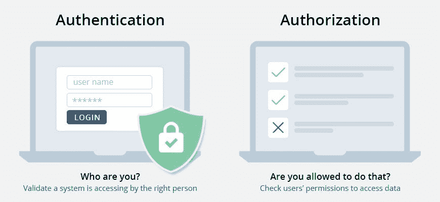

# 认证和授权

> 原文：<https://blog.devgenius.io/authentication-authorization-873426cdb591?source=collection_archive---------16----------------------->

# 介绍

今天我将讨论两个最重要的话题。认证和授权。听起来很像吧😄！！相信我，这是我遇到过的最令人困惑的话题。

## 认证:

身份验证是关于验证您的凭据，如用户名/用户 ID 和密码，以验证您的身份。简单地确认你自己的身份或验证你是谁的过程。例如，这就像你用你的密码和用户名登录你的机器。如果这些是正确的，瓦拉😃你上车。

## 身份验证的类型:

*   **单因素认证:**最简单的认证方式，只需要一个密码就可以授权用户访问特定系统。单因素身份认证最常见的例子是登录凭据，它只需要用户名和密码。
*   **双因素认证:这是一个两步验证过程，不仅需要用户名和密码，还需要只有用户知道的东西，以确保额外的安全级别。又称“2FA”。因此**

*为什么我们需要双重身份认证？*

如果有人知道你的电子邮件地址，他或她只需猜测你的密码就可以进入你的账户。这就是为什么使用不常见的，难以猜测的密码是很重要的，尤其是对于你的电子邮件帐户。

例如，当我们在启用两个因素的情况下登录我们的 google 帐户时，google 会向我们发送登录新设备的代码。

*   **多因素认证:**最先进的系统认证方式。有两种以上的认证方式。方式/选项基于我们在安全性上创建的安全性级别。最好的部分是所有的因素都是相互独立的。通常用于金融机构、银行和执法机构。最好的例子就是手机银行的使用。我们必须用一把钥匙进入仪表板，然后用另一把钥匙进行交易。

身份验证有多种方式。其中流行的是简单的电子邮件认证、社交认证。

**授权**

授权是确定您是否被授权访问资源的过程。简单来说，就是谁是特定资源的正确用户的问题。

让我们假设这样一个场景，我们的系统中有一个学生和一个老师。因此，两者都可以用他们的证书进行认证，但他们有不同的角色，学生可以提交作业，教师可以检查和评论，但反之则不行。所以这个过程我们称之为授权。*通过我们的作业管理系统(HMS)。*

**需要记住的注意事项:**授权只有在认证之后才会出现。

可以通过为角色指定具有相关权限的角色来完成授权。我们可以简单地理解为*基于角色的认证*

**什么是基于角色的认证**

也可以称为基于角色的访问控制(RBAC ),是根据用户的角色分配权限的思想。用于系统的细粒度控制和可管理方法。*那么谁在工作呢？*它的声音其实很简单，就像上面 HMS 的例子。有两个角色:学生和老师。因为这些是我们的系统所具有的角色，所以它们拥有简单而容易的权限来对我们的系统做一些事情。

例如，让学生将有权限上传作业，检查已检查的作业，也可以编辑他们上传的作业。然后对方老师会把权限作为作业中的评语(comment)，反馈给学生。现在作为学生，你只能上传作业，编辑作业。

例如 if(has permission(' comment '))console . log(' hello teacher ')

或者更简单

例如，role === "student" && console.log(“在为时已晚之前上传您的主页”)

令人困惑，

 [## 什么是基于角色的访问控制(RBAC)？示例、优势等

### 在我们的信息基础系列《数据保护 101》中了解基于角色的访问控制(RBAC)

digitalguardian.com](https://digitalguardian.com/blog/what-role-based-access-control-rbac-examples-benefits-and-more) 

**社交认证**

是一种单点登录形式，使用脸书、Twitter 或 Google 等社交网络服务的现有信息登录第三方网站，而不是专门为该网站创建新的登录帐户。这也称为 OAuth 过程。

听起来令人困惑😃。请记住，OAuth 只提供 accessToken，它包括电子邮件、姓名和除密码之外的其他可共享信息。例如，Google accessId 有 given_name、display_name 电子邮件等，而 facebook 有不同级别的权限，需要定义为 loggedInPermission = {'email '，' public_profile')}。

**注意要记住:** *在 social auth 或 OAuth 中没有任何种类的注册/注册用户方法。对于 OAuth，两种登录/注册方法是相同的，只是服务器处理的方式不同。*

**总结**

尽管这两个术语经常结合在一起使用，但它们具有完全不同的概念和含义。如果身份验证是您的身份，那么授权就是您可以访问和修改的内容。简单地说，认证就是确定某人是否是他所声称的那个人。另一方面，授权决定了他访问资源的权利

结论认证过程

向我所有的导师们大声疾呼*罗山永航*、*萨宾·马哈尔詹*、*比沙尔·马哈尔詹*、*沙尔贝什沃·达斯·卡帕利*以及所有的 *ITGlance 家族*

阅读更多！！

 [## 身份验证和授权的区别

### 在安全性方面，这两个术语经常结合在一起使用，尤其是在涉及到获取…

www.differencebetween.net](http://www.differencebetween.net/technology/difference-between-authentication-and-authorization/)