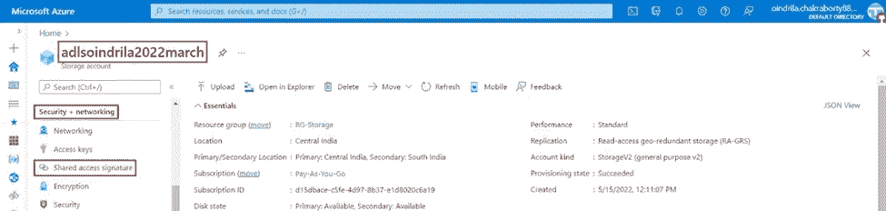

# Azure 数据湖存储 Gen2 中的“身份验证”

> 原文：<https://blog.devgenius.io/authentication-in-azure-data-lake-storage-gen2-d5bc9c7ac4bc?source=collection_archive---------10----------------------->

# Azure Data Lake Storage Gen2 中的“身份验证”是什么

***保护数据******非授权访问*** 是一个 ***大问题*** 对于大多数人来说 ***当把*** 移到 ***云*** 时。 ***天蓝存储账号提供了****不同的安全层，其中 ***包括功能******限制访问******数据*** 和*启用访问****用户*** ******三个*** 主要 ***方式**认证******数据***天蓝色存储账号**** 都是——****

1.  ***存储账户密钥*** 。
2.  ***共享访问签名***(SAS)***连同******相关特性*** ，称为*。*
3.  ****认证 Azure Blob******队列存储使用 Azure Active Directory 认证***(***Azure AD***)。*

# *在 Azure Data Lake Storage Gen 2 中使用“存储帐户访问密钥”进行身份验证*

****对于每一个*** 存储账户，都有 ***两个存储账户访问键*** 。这些 ***两个键*** 可以从 ***不同的客户端库******Azure Powershell******Azure CLI******微软 Azure 存储浏览器****

****存储账户访问密钥*** 是 ***用作 ***密码******访问****Azure 存储账户*** 。 ***如果*** 这些 ***键*** 被 ***与任何*其他用户 ***他们*** 被****完全访问*** 到 ***Azure 存储账户****读*** ， ***写*** ， ***改变******数据*** ， ***创建******容器******************

***两个存储账户的访问键*** 可以通过 ***显示*** 下面的 ***方式***—

*   ***第一步*** - ***打开******蔚蓝数据湖存储 Gen 2 账号******adlsoindrila 2022 March***。 ***点击 ***菜单上的******访问键*** ，从 ***左侧菜单*****安全+联网*********

**

*   ****第二步***——可以看出，****键******键 1******键 2******都是由 ***天蓝色*** 生成的。 ***对于每一个*** 按键，都有一个 ***连接字符串******关联*** 。 ***连接字符串由 ***的*** 名称**的【数据湖】存储 Gen2 账号******adlsoindrila 2022 March***】组成，并且， ***各自的键*** 也被*嵌入**中********

**

****使用*******存储账户访问密钥*** 是对****的旧方式执行认证*** 。此 ***认证*** 是 ***无更多推荐*** 由 ***微软*** 到 ***使用*** 在 ***生产环境*** 。***

**H 在****中，哪些*** 能够 ***导致*** 一个 ***可能的安全风险如果******密钥*** 曾经被***

******举例*** : ***如果*** 一个 ***管理员*** 在一个 ***公司*** ，****访问******账户存储密钥*** ， ***叶*****为此， ***键需要*** 将 ***改为*** ，并且， ***新键需要*** 将 ***与 ***共享*** 所有*** 员工** 的****

******使*** 使 ***发生*** ，it ***需要****确保******所有******客户端应用****公司使用******key 1*【T31 ***当******时机一到******重新生成******按键*** 为 ***任何理由*** ，就像-个 ***政策存在于公司内部*** 重新生成 *******怀疑*** 认为*已经被 ***攻陷******首先重新生成******key 2***，然后 ***使 ***然后重新生成******key 1***。 ***这种方式既可以将*******重新生成****。*******************

****

*****点击 ***上的*** 链接*** 到 ***重新生成*** ***两个******键*** 。链接如上图所示。**

**

# *在 Azure Data Lake Storage Gen 2 中使用“共享访问签名”进行身份验证*

****It*** 是*一个 ***好主意*** 要 ***要*** 要 ***原理*** 要 ***最少特权*** ，也就是说，要 ***只给用户******应用* ***提供******存储账号访问键*** 是 ***不是*** 一个 ***大方法*** 到 ***实现******原理*** 。 ***还有*** 是 ***的另一种类型****令牌*** 即可以通过 ***提供*** 给 ***用户*** 和 ***应用*** 给 ***实现*********

**一个 ***共享访问签名*** ( ***SAS*** )一个 ***字符串*** 那个 ***包含*** 一个 ***安全令牌*** ， ***哪个*** 可以将*附加到一个 ***URL*** ***共享访问签名***(***SAS***)就是 ***通常把*** 简称为 ***SAS 令牌*** 。一个 ***共享权限签名***(***SAS***)***允许******指定权限*** 和一个 ***范围*** 时间 为哪个***

*****非常*重要 ***谨慎*** 与 ***共享访问签名***(***SAS***)***令牌 URL***，因为， ***这些 URL***将 ***委托*例如:如果一个 ***共享访问签名***(***SAS***)***令牌 URL*** 被 ***传递给******一个人*** ，并且，那个人 ***转发***********

****C ***创建共享访问签名(SAS)字符串***—****

*******第一步*** - ***打开******蔚蓝数据湖存储 Gen 2 账号******adlsoindrila 2022 March***。 ***点击 ***菜单上的*** 选项******共享权限签名*** ，从 ***左侧菜单*****安全+联网**********

********

*******第二步*** -到 ***创建*** 一个 ***共享访问签名***(***SAS***)***字符串*** 即 ***包含*** 一个*****提供*********

*   *********步骤 2.1***-**-*-*-**-**-*选择*-**-**-*服务*-**，对**-**-**-*访问*-**需要**-*-*-**。
    ***举例*** : ***访问*** 需要 ***给定*** 到***Blob******文件******服务*** 。******

************

*   *********第 2.2 步***-**-*第二步*-**，**-*选择*-**上哪一级**-*-*-**-*选择服务*-*-*-**需要**- ****举例*** : ***访问*** 需要将 ***赋予*** 到 ***单个对象层次*** 。***********

**

*   ****第 2.3 步***-**-*第三步*** ， ***选择*** ***其中 ***中的*** 可用*** ***操作*** 将 ***允许******对****执行***** *****列表****所有******允许操作*** -
    ***1。*** ***改为
    2。写
    3。删除
    4。列表
    5。增加
    6。创建
    7。更新
    8。流程
    举例*** : ***只有******读******权限*** 才能 ***给出*** 。*******

**

****确保******单选按钮*** 为 ***启用删除版本*** 为 ***选中*** 为 ***属性******Blob 版本化权限*** 。*

**

*   ****步骤 2.4***-**-*第四*** ，**，*提供******开始日期*** / ***时间*/**， ***到期日期*** / ***时间*** 任意一个 ***时区*** ， *****示例*** :共享访问签名*(***SAS***)***字符串*** 将 ***有效期在 2022 年 5 月 16 日 12:33:30***和***16 日之间*******

****

*   *****步骤 2.5***-**-*第五*** ，提供一个 ***特定的 IP 地址*** ，或者，一个 ***范围******的 IP 地址*** 。 ***允许权限**上的*选择的 ***服务*** 将 ***限制*** 到所提供的 ***IP 地址*** ，或者， ***范围*** 的 ***IP 地址*** 。所以， ***任何请求*** 到 ***选中的服务*** ，也就是 ***未到来*** 从 ***提供的 IP 地址*** ，或者， ***范围内******的 IP 地址*** ，都会被
    ***举例*** : ***访问*** 将 ***只赋予*** 到 ***的 IP 地址-*** ******。***.*.* * **T96。******

********

*   *******步骤 2.6***-**-*第六*** ， ***选择*** 如果 ***只有*******要求*** ，或者 ***两者都有
    ***举例***:*****【HTTPS】和 HTTP******单选按钮*** 以便既********HTTP************

**********

*   ********步骤 2.7***-**-*选择***-**-*默认选中 radio buton*-**-**-*基本(默认)*-**-**-*属性*-**-**-*首选路由层*-**。*****

**********

*   ********步骤 2.8***-**-*It***是 ***已知*** 即 ***对于每一个存储账户*** ，都有 ***两个存储账户访问键*** 。 ***第七个*** ， ***选择*** ***中的任意一个*存储账户访问键。 ***共享访问签名***(***SAS***)***令牌*** 将 ***与*** 绑定 ***选择*** ***存储账户访问密钥*** 。 ***存储账号访问键******其中*** 会 ***不会*** 会 ***很快会*** 变够， ***应该*** 被 ***选中*** ，因为， ***如果*
    ***举例*** : ***选择******key 1******下拉选项*** 。*********

******

*   ******步骤 2.9******最后******点击*** 上的 ***生成 SAS 并连接字符串******按钮*** 。***

******

******第三步***-**-***， ***两个服务*** ， ***Blob*** ， ***文件*** 被 ***选中*** ， ***SAS URL 字符串*** 为 ***Blob 服务*******

********

*******一件事*** 到 ***注意*** 就是 ***SAS Token 的 ***值*** 以问号*** ( ***)开头？*** )，因为， ***这个值*** 会将 追加到 ***结束*** 的 ***允许请求*** 到 ***选定服务*** 。****

******一旦******SAS 令牌*** 已经被 ***生成了*** ，那么 ***就应该*** 被**和 ***安全地保存在某个地方*** ，因为，这些*****

******H ***ow 检测无效共享访问签名***(***SAS***)-***Azure 不跟踪 ***共享访问签名***(***SAS***)***令牌******一旦生成*** 所以，唯一能让 ***失效*** 一个 ***共享访问签名***(***SAS***)***令牌****失效的办法，就是在 ***重新生成*** 存储账户访问密钥，即**********

***这样一来， ***当*** 有人 ***尝试*** 对 ***使用******无效*** ***SAS 令牌******Azure***将 ***尝试 ****比******多了一个*** 那就是在*******SAS 令牌*** 被 ***创建*** 时使用的。 然后 ***比较********签名*** 到 ***什么*** 是 ***通过了*** 中的 ***发送了无效的 SAS 令牌*** 将*****

****W ***帽子是存储访问策略***——如果 ***SAS 令牌*** 是 ***用过的*** ，那么 ***最好是*** 到 ***用过的*** 它在 ***中与存储访问策略*** 配合使用。一个 ***存储的访问策略*** 是一个 ***集合**的约束条件，可以被**(***SAS***)多个共享访问签名。*********

****一个*存储的访问策略是在一个 ***资源容器*** 上 ***定义的*** ，就像— ***Blob 容器*** ， ***表*** ， ***队列*** ，或者，*****

*********存储的访问策略*** 是由*****以及******开始日期*** 和 ***结束日期*** 。********

*********存储访问策略*** ***允许****创建*** 一个 ***组******权限*** ， ***重用*** 那些 ***与***********

*******存储的访问策略*** 是 ***真正有用的**是*****访问*** 到 ***SAS 令牌*** 即 ***引用它*** ，因为， ***SAS 令牌*** 是 ***只是*** 一个所以， ***除非*** 要么是*SAS 令牌 ***过期*** ，要么是 ***存储账户访问密钥*** 是 ***重新生成的*** 即 ***使用的*** 到**但是，如果 ***SAS 令牌将*** 引用到一个***存储的访问策略中，那么 ***或者******存储的访问策略*** 可以被 ***删除*** ，或者 ***其过期时间*** 也可以*********

******使用******存储访问策略*** 是 ***推荐方式*** 使用 ***共享访问签名*** 。***

******从安全角度看*** 、 ***共享访问签名*** ( ***SAS*** )比****存储账户访问密钥*** 。但是，从 ***维护的角度来看****到 ***更新 SAS 令牌都超过了****处*，*。********

# *****在 Azure 数据湖存储 Gen2 中使用“Azure Active Directory”(AD)进行身份验证*****

********Azure Active Directory***(***AD***)是一个 ***企业身份提供者*** ，本质上是 ***提供身份即服务***(***IDaaS***)。 ***使用 Azure 活动目录***(***AD***)意味着 ***访问*** 的 ***Azure 存储帐户*** 可以将 ***授予*** 到 ***Azure 活动目录*** (*****

*******Azure Active Directory***(***AD***)是 ***全球可用的*** 从 ***几乎任何设备*** ，像- ***Windows 机*** ， ***Linux 机*** ，****

*********Azure Active Directory***(***AD***)***身份*** 意思是 ***用户*** ， ***群组*** ，或者说， ***应用原理*** 。******

> *********应用原理*** 是一个 ***应用*** 即 ***在***Azure Active Directory***(***AD***)中注册*。这个 ***在***Azure Active Directory***(***AD***)中给******应用*** 一个 ***标识符*。这个*标识符可以被 ***分配给 ***角色**Azure 活动目录***(*)***存储帐户*** ，以便 ***访问******************

**一个 ***基于角色的访问控制***(***【RBAC】***)可以被 ***分配*** 给一个 ***Azure 身份*** 处于 ***订阅级别*** 给 ***授予访问权限*** 给 ***举例*** : ***所有******存储账户内****认购*** 将 ***拥有******权限*** 。 ***基于角色的访问控制***(***【RBAC】***)可以在*资源组级 ***分配*** ，或者在*******存储账户级******

******第一步***-**-*类型*** " ***azure 活动目录*** "在 ***全局搜索栏*** 中 ***首页******Azure 门户****点击* 上 ***第一个结果******

******

******第二步***-**-*It**是*** 见过的***Azure Active Directory***(***AD***)***服务*** 可以 ***使用******

******

******点击*** 上的 ***用户******菜单选项*** 。***

******第三步***-**-*创建用户*-**-*新建*** ***用户*** 可以通过 ***添加*** 通过 ***点击*** 上的 ***新建用户 ****密码******其他设置****用户*** 可以从*管理 ***这里*** 。************

**

****信息相关*** 到 ***用户的签到*** 可以被 ***看到*** 通过 ***点击*** 上的 ***签到日志******下的*链接***

**

****信息相关*** 到 ***操作日志*** 可以通过 ***点击*** 上的 ***审计日志******下的******活动******类别****

**

****返回*** 和 ***点击 ***组上的******菜单选项*** 。****

****第四步***-**-*创建群组*-**-*新建群组*-**可以通过**-*添加*-**通过**-*点击*-**上的**--**-**-*链接 ***内每组******多个用户*** 都可以通过 ***添加*** 。******

**

****如果****的访问策略是 ***定义的*** 在一个**组**中，那么 ***所有*****内的***组*** 将****

*******返回*** 和 ***点击*** 上的 ***App 注册******菜单选择*** 。****

*******第五步-*** ***注册申请*** - ***申请*** 可以 ***注册*** 到 ***创建服务委托人*** 通过 ***点击*** 上的 ***新建注册****链接*********

********

****A***Azure Active Directory 的优点***(***AD***)—****

*******【A】******真实影响****使用******Azure Active Directory***(*)***认证*** 那是 ***凭证**********

********示例*** : ***有*** 是一个 ***web 应用*** ， ***运行*** 在 ***Azure App 服务*** ， ***其中*** 需要*****

********B)*** 在这种情况下，****存储账户访问密钥*** 被 ***需要******存储在 ***配置文件*** 中。 ***从*** 一个 ***的安全角度来看*** ，有 ***的应用使用****的存储帐户访问密钥是*。***********

********更有可能是*** ，一个 ***共享访问签名***(***SAS***)被 ***需要*** 被 ***存储*** 即每次 ***被*更新 ***从 ***的*** 维护点查看****到 ***更新 SAS 令牌全部结束******处*** 容易出错*****耗时*************

********使用 Azure Active Directory***(***AD***)***认证*** 到 ***认证******授权应用*** 到 ***访问 Azure 存储帐户********