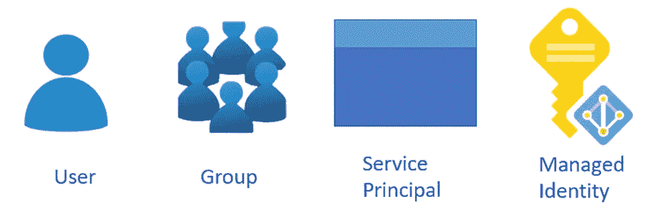
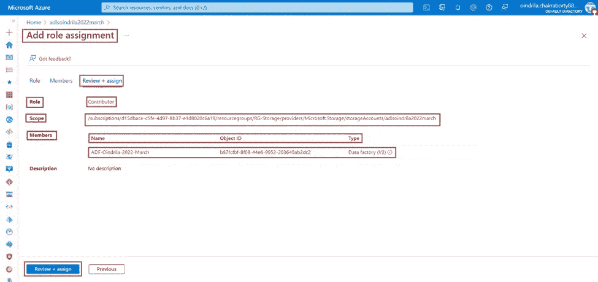

# 在 Azure 数据湖存储 Gen2 中使用“Azure 基于角色的访问控制”(Azure RBAC)进行授权

> 原文：<https://blog.devgenius.io/authorization-using-azure-role-based-access-control-azure-rbac-in-azure-data-lake-storage-gen2-fb086e1ca4d2?source=collection_archive---------6----------------------->

# Azure 数据湖存储 Gen2 中的访问控制模型介绍

***数据湖存储 Gen2 支持******以下******授权******机制***—

***A)基于角色的访问控制*** *(* ***蔚蓝 RBAC****)*-***蔚蓝 RBAC 授予******粗粒度******访问*** 到 ***存储账户数据*** ，喜欢-

B) ***访问控制列表***(***ACL***)-***ACL 授予*** " ***细粒度*** " ***访问*** ，如- ***写访问*** 到

***既有******授权******机制*** ，即 ***蔚蓝*** 和***ACL******要求***

> ****共享访问密钥** **向**用户**或**应用授予访问权限**，而不要求**在**Azure Active Directory**(**Azure AD**)中拥有**身份**。**与**这**两种形式**的**认证**，**蔚蓝 RBAC** 和**ACL**对**没有影响**。**

# **什么是基于角色的访问控制(Azure RBAC)**

*****访问管理*** 为 ***云资源*** 为 ***关键功能*** 为任意 ***组织*** 即 ***使用****云*** 。 ***Azure 基于角色的访问控制***(***Azure RBAC***)***帮助******管理***—****

*   **其中****用户*** 拥有 ***权限*** 【到 Azure 资源***
*   ***那些“ ***用户******能用那些 Azure 资源做什么******
*   ***什么" ***地区*** "用户*"拥有 ***权限*** "才能****

****下面是 ***的例子*****的一些场景 ***可以用*** ***基于角色的访问控制***(***Azure RBAC***)来完成******

*   *******允许一个用户*** 到 ***管理*** 中的 ***虚拟机**订阅*** 和另一个用户 ***管理*** 到 ***管理*******
*   *******允许******DBA 组*** 到 ***管理******SQL 数据库*** 中的 ***订阅*** 。****
*   *******允许******用户****管理* ***所有****资源*** 在 ***资源组*** 中，如 ***虚拟机******网站*********

*******允许******应用******访问*** ***所有******资源*** 在一个 ***资源组*** 中。****

# ****Azure 基于角色的访问控制(Azure RBAC)如何工作****

*******方式******控制*** ***访问******Azure 资源使用******Azure 基于角色的访问控制***(***Azure RBAC***)是对 ***赋值这就是 ***如何******权限*** 被 ***强制执行*** 。一个 ***角色分配******由******以下三个要素*——*********

******A)*** ***安全负责人***-A***安全负责人*** 是一个 ***对象*** 即 ***代表******用户*** ， ***组*** ， ***服务负责人******

***一个“ ***角色*** ”可以被 ***赋值***中的任何一个*安全委托人。********

********

*******B)角色定义***-A)***角色定义*** 是一个 ***权限集合*** 。它通常只是将 ***称为******角色*** 。一个“*”***列出了****的动作*** 即可以被 ***执行的*** ，比如——“***读作*** ， ***写成*** ， ***删除 ***角色*** “可以是 ***高层*** ，比如——***拥有者*** ”，或者，可以是 ***具体的*** ，比如——***虚拟机阅读器*** ”。**********

> ****内置角色***-**-*天蓝色*** 有 ***几个******内置角色*** 即可以将 ***用到*** 。例-***虚拟机******角色允许******用户******创建******管理******虚拟机*** 。
> ***如果****内置角色****不满足******组织*的**** *，那么 ***Azure Admin*** 的**

*****Azure***Data Actions***thanenable***to******Access***to***Data in***an***Object*例- ***如果*** 一个 ***用户**有 ***读******数据访问*** 到一个 ***存储账户*** ，那么那个 ***用户*************

****

*****C)范围***-**-*范围*** 是 ***集合资源******即******访问******适用于*** 。 ***当*** 一个 ***角色*** 被 ***赋值*** 时，这个 ***动作******被*** 允许，那个 ***角色*** 可以被 ***进一步******重要的是****理解******范围*** 以便 ***Azure Admin*** 能够 ***授予******安全主*** 【公正主】 ***由******限制范围******Azure Admin***可以 ***限制******资源*** 处于 ***风险*********

> ******范围级别**—**天蓝色**中**可能**到**在**四个级别**指定一个**范围****
> 
> ******1.管理组
> 2。订阅
> 3。资源组
> 4。资源******
> 
> ******“**作用域**是以一种“**”**关系**构成的**。**层次**的每一级**使得**范围**更加具体**。**有可能**在**范围**的这些**级**中的任意**级**给**分配**角色**。**选择的****等级****决定了****角色****应用**的广泛程度。**下级****继承**上级**的**角色权限**。******************

****

# **使用基于角色的访问控制的 Azure 角色分配(Azure RBAC)**

**一个 ***角色分配*** 是 ***流程**附加*** 一个 ***角色定义******到*** 一个 ***用户*** ， ***组 ***托管标识***“at a****范围*** ”为 ***目的******授予******权限*** 。******

*   *****访问*** 是 ***授予*** 通过 ***创建******角色分配*** 。**
*   *****访问*** 是 ***撤销*** 由 ***删除******角色分配*** 。**

**下面的 ***图显示的是*** 一个 ***的例子*** 一个 ***的角色分配*** 。在 ***例*** ， ***【营销】******组*** 已被 ***分配******投稿人******角色*** 为 ***医药-销售*****这个 ***是指*** 即 ***用户**营销******集团*** 可以 ***创建*** 或 ***管理******任何一个 *Azure 资源****用户*** 做 ***不做*** ***有******接入***【to】***资源******外************

**

*就是 ***可能的*** 给 ***分配******角色******使用******Azure 门户******Azure CLI****

> ***组**中的传递性角色分配-**角色分配**对于**组****来说是**传递性**这意味着**如果 a**用户**是一个**组**的**成员**并且**是一个****组** 那个有一个**角色分配**，那么那个**用户**就会**有**角色分配中的**权限**。*

**

> ***多重角色分配** - **蔚蓝 RBAC** 是一个**加法模型**。所以，**如果**a**用户**有**多个****重叠的角色分配**，那么该**用户**的**有效权限**就是**角色分配**的**总和**。*
> 
> *下图**显示了一个**多角色分配**的**和**示例**。在**的例子**中，一个**用户**被**授予**，**贡献者**，**角色**在**订阅**，**范围**，而**读者**，**角色**在**资源组**投稿人****权限****读者****权限**的**总和**为**有效****投稿人****角色**为**订阅****范围**。**因此**，在这种情况下，“**读者**”**角色分配**对**没有影响**。***

**

# *Azure 使用基于角色的访问控制拒绝分配(Azure RBAC)*

****以前的******天青 RBAC******曾是******只允许模型******同******没有否定*** ，但是， ***现在******天青 RBAC****

*一个“ ***否定赋值***”***定义****一组动作******即*** 即 ***不允许******即*** 即 ***一个“ ***服务主体*** ”，或者，一个“ ***托管身份*** ”在一个 ***特定******范围*** ”为 ***目的******拒绝访问*** 。 换句话说，****阻止******用户******执行指定的******动作******即使*** ***否定赋值*** 【取】 ***优先******优先于******角色赋值*** 。*******

# **Azure 基于角色的访问控制(Azure RBAC)如何确定用户是否有权访问 Azure 资源**

***后面的***是高级步骤******【天蓝色】RBAC******使用******判断是否******用户******有******权限*这些 ***步骤适用于******Azure 资源管理器*** 或 ***数据平面服务******与******Azure RBAC***。*****

******第一步*** -一个 ***用户*** ，或者，一个 ***服务主体******获取一个******令牌******为******

***“ ***令牌***“***包括***“***用户的组成员身份***”(***包括***“***过渡组成员身份*** )。***

******第二步***-***用户******使*** 成为***REST API******调用******Azure 资源管理器******

******第三步***-**-*Azure 资源管理器***-**-*检索所有*-**-**-*角色分配*-**-**-*拒绝分配*-**-**--**应用于--**-*关注******

******第四步***-**-*如果*** 一个 ***否定赋值*** 是 ***应用于******关注******Azure 资源*** ， ******否则*** ， ***评价*** ， ***继续*** 。******

*****第五步***-***Azure 资源管理器******缩小范围******角色分配******即*** 应用于 *****决定了什么******角色******用户******有*** 为 ***关注******蔚蓝资源*** 。****

*****第六步***-***Azure 资源管理器******决定了******动作******API******调用******是否包含在 ***角色中********

*****如果******角色******包括******动作******即有******通配符***(**** ****同理*** ，*****减法*** 是 ***完成*** 为任意的 ***数据动作*** 。********

*   ****有效管理权限=动作—动作****
*   ****有效数据权限= Data actions—not Data actions****

******第七步*** - ***如果******用户******没有******角色******有******动作******at*** ***否则*** ， ***任何******条件*** 都是 ***求值*** 。***

******第 8 步***-**-*如果******角色分配******包括******条件*** ，那些是*。 ***否则*** ， ***访问*** “是 ***允许*** ”。****

*******第九步***-**-*如果****"则 ***符合*** ， ***访问*** "则 ***允许*** "。 ***否则*** ， ***访问*** ， ***不允许*** 。*****

*****下图中的*是 ***的 ***汇总****评估逻辑****--******

********

# ****添加和查看 Azure Data Lake Storage Gen2 实例中的角色权限****

****在每一个 ***Azure 资源*** ，例如 ***Azure 数据湖存储 Gen2*** ，都有一个*特性叫做 ***【访问控制(IAM)*** 。***IAM******站*** 为 ***身份和权限管理*** 。 ***使用*** 本 ***特性******角色权限******应用于******关注******蔚蓝资源*** 可以 ***添加*** ，以及*****

*******给 ***分配*** 一个 ***角色******贡献者*** 关于 ***蔚蓝数据湖存储 Gen2*** 实例*adlsoindrila 2022 March********

************步骤 1*** - ***打开*** ***Azure 数据湖存储 Gen2*** 实例“***adlsoindrila 2022 March***”。 ***点击*******链接*** 。**********

**************

**********步骤 2 -*** ***点击******+添加******按钮*** ，随后， ***点击******添加角色分配******链接*** ，或者， ***点击**********

**************

**********第三步***-**-******添加*** ***角色分配******页面*** ， ***下******角色***********

**********角色******会根据******具体的******资源*****角色分配*** *****角色******可用*** 作 ***储帐*** 与 ***不同*** 比 ***角色******可用*** 作************

******

******第四步*** - ***选择******投稿人******角色*** 从 ***选项*** ， ***点击*** 上的 ***下一个******按钮*** 。***

******

******步骤 5***-**-******成员******标签*** ， ***选择*** 单选按钮***托管标识******为 ****然后*** ， ***点击 ***上的******+选择成员******为*** 属性******成员***********

***第六步***-**-******打开刀片******选择托管标识*** ， ***选择******适当的******订阅****

**

****选定*******托管标识******托管标识******信息*** 为 ***蔚蓝数据工厂*** 实例***ADF-Oindrila-2022-3 月*** 为**

****

*****选择******后显示******托管标识******信息*** 为***Azure Data Factory***实例***ADF-Oindrila-2022-3 月*** *******点击 ***上的******按钮*** 。*********

**

****现在*** ， ***托管标识 ***Azure 数据工厂*** 实例***ADF-Oindrila-2022-3 月*** 被 ***选中*** 作为 ***成员 ****然后******点击*** 上的 ***审核+分配******按钮*** 。********

***下一个******审核如果******以下信息关于******角色分配*** 是 ***正确*** ，或者， ***不是****审核+分配******页签*****

*   ***角色*** 【待分配】*。*
*   ****范围******其中******角色*** ”是被 ***赋值*** 。*
*   ****托管标识******信息**Azure 数据工厂*** 实例***ADF-Oindrila-2022-3 月*** 。*

****最后******点击*** 上的 ***审核+分配******按钮*** 。*

**

*到 ***验证******角色****投稿人 ***是否正确分配 ***Azure 数据湖存储 Gen2*** 实例***adlsindrila 2022 March****** ***安全负责人******执行******以下步骤***—**

****第一步***-**-*打开*** ***蔚蓝数据湖存储 Gen2*** 实例“***adlsoindrila 2022 March***”。 ***点击******【IAM】******链接*** 。*

**

****第二步-*** ***点击******角色分配******选项卡*** 。 ***所有******角色分配******上******蔚蓝数据湖存储 Gen2*** 实例***adlsoindrila 2022 March***均 ***显示*** -*

**