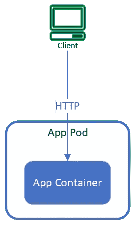
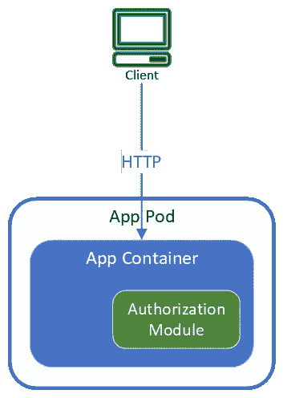
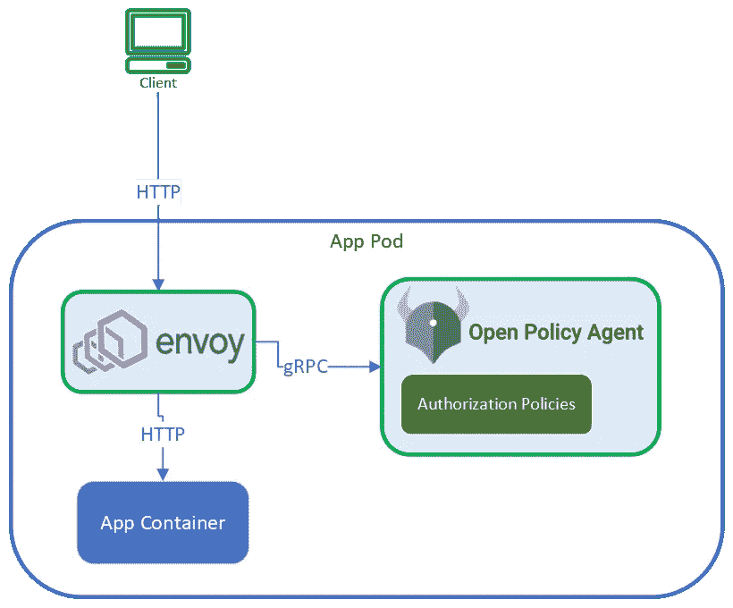
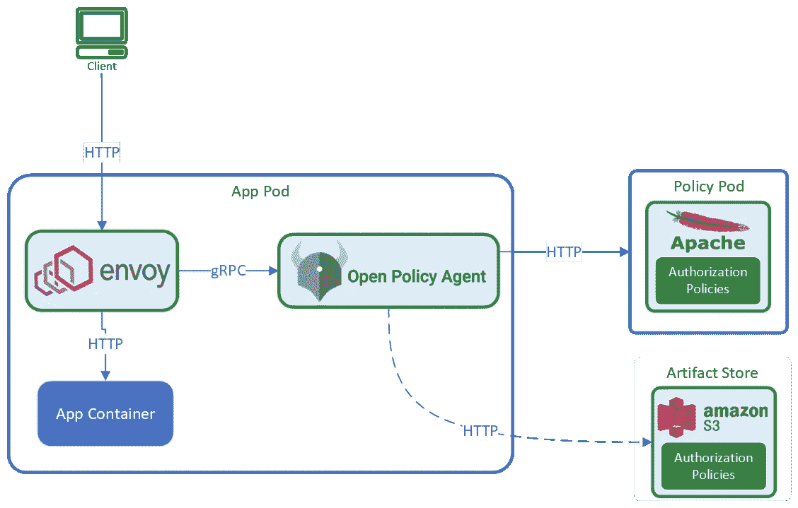

# 使用具有网关和边车模式的 OPA(开放策略代理)进行授权

> 原文：<https://blog.devgenius.io/authorization-using-opa-open-policy-agent-with-gateway-and-sidecar-pattern-3bc906dc3b33?source=collection_archive---------0----------------------->

保护应用程序非常重要。很多时候，保护应用程序成为事后的想法，因为应用程序开发团队专注于实现业务特性。商业用户对新特性的加入感到兴奋。然而，他们不会总是注意到应用程序团队为保护应用程序所做的艰苦工作。

当涉及到保护服务时，有两个重要的术语:(1)认证和(2)授权

[**认证**](https://en.wikipedia.org/wiki/Authentication) :一种断言用户身份的方式。当用户通过身份验证后，应用程序就会知道他们是谁。

[**授权**](https://en.wikipedia.org/wiki/Authorization) **:** 这个阶段发生在用户被认证之后。这是一种断言经过身份验证的用户拥有适当级别的访问权限/特权来操作服务的方式。

这篇博客是关于**授权**，以及我们如何使用 [OPA(开放策略代理)](https://www.openpolicyagent.org/)来保护 [**Kubernetes**](https://kubernetes.io/) 平台中的应用程序。这篇博客假设你已经知道 OPA 的好处，以及*策略作为代码*如何帮助改进服务的操作、审计、治理等。

# 紧密耦合授权

当开发人员构建并发布一个应用程序时，最简单的应用程序托管形式如下所示。

未经授权的应用程序

该应用程序没有任何授权，任何经过身份验证的人都可以访问它。很明显，不够安全，保安都在嚷嚷！开发人员选择他们所选择的框架或编程语言中最好的，并在他们的代码中实现授权逻辑。因此，现在应用程序托管看起来如下所示:

代码中嵌入了授权的应用程序

太好了！这个应用程序是安全的，每个人，包括安全人员，都很高兴。商业最终在生产中得到他们的特征。

这种方法在处理整体应用程序时非常有用。然而，在基于微服务的环境中，事情变得困难和复杂。一些挑战包括:

*   业务应用程序代码与安全代码紧密耦合。更改业务功能可能会意外更改安全策略。
*   授权逻辑在每个微服务中以不同的方式实现。随着开发人员移动团队，他们将不得不学习实现。
*   根据需要，微服务将用不同的语言编写 Scala、Go、Java、NodeJS、.Net，Python 等。当来自安全的需求到来时，同样的事情必须在每个微服务中实现多次。
*   随着关注点转移到运行时检测或预防，即更动态的测试，安全审计成为一项具有挑战性的任务，因此成本更高。
*   跨微服务的授权策略的关联非常困难
*   …以及更多

鉴于企业总是希望将特性推送到客户的生产环境中，紧密耦合的授权方法可能会减慢特性从开发人员的机器到生产环境的交付。

# 从应用程序代码中分离授权策略

这就是 OPA 拯救团队的地方。授权策略从代码中提取出来，使用 OPA 策略语言编写，并存储在减压阀文件中。应用代码具有*零*授权逻辑，并且仅具有与业务特征相关的代码。所有授权都委托给 OPA 服务。应用程序托管看起来如下所示:

特使和 OPA 保护的应用程序

这里，两个集装箱作为辅助集装箱添加到箱中(即边车模式)。它们拦截所有到应用程序容器的流量，只允许授权的流量到达应用程序容器(即网关模式)。

[Envoy](https://www.envoyproxy.io/) 是为云原生应用设计的开源边缘和服务代理，与 OPA 类似，也是 CNCF 支持的项目。

Envoy 将拦截所有到达应用程序容器的流量，并使用 gRPC 调用 OPA 容器。OPA 容器内置了已编译的应用程序策略，它将使用传入负载中的信息(例如，JWT 令牌、已验证的 id、报头、主体等)来提供决策。如果决定是“允许”，那么代理将允许流量到达应用容器。如果决定是“拒绝”，那么特使将阻止该请求，并用 403(未授权)响应代码进行响应。

这种方法有很多好处:

*   授权策略在应用程序代码之外，在它们自己的 Git 存储库中。
*   应用程序开发人员不能错误地更改策略代码，将服务置于风险之中。
*   不管应用代码是用什么语言编写的，微服务的所有策略都是用 OPA 的 rego 语言编写的。
*   安全审计和治理变得更加容易。安全评估越来越靠左，静态代码分析会发现漏洞。
*   可以更放心地推出应用功能。默认情况下，缺少适当的策略将会拒绝对新功能的访问。因此，从开发者的机器到产品的更快的旅程。

# 将授权策略从应用基础架构中分离出来

既然授权策略已经分离，我们都在享受好处，但是属于*应用*和*授权策略*的基础设施仍然存在耦合。这本身不是一个大问题。但这意味着，每当策略发生变化时，我们还必须部署整体基础架构组件，即应用程序单元。在容器化或 Kubernetes 环境中，容器的重启是正常的，应用程序必须(我重复一遍，必须)被设计为处理重启。如果应用程序对重启很敏感，那么我冒昧地说，这是考虑不周或者开发人员太懒了。

然而，我们仍然可以改进托管模式，并进一步将策略基础架构与应用程序代码分离。在这种情况下，托管模式可能如下所示:

通过 Envoy 保护应用程序，通过远程策略保护 OPA

这里遵循相同的侧车和网关模式。特使将拦截所有流量，OPA 将提供决定。根据决定，要么允许请求到达应用程序，要么用 403 响应代码响应客户端。

在这种模式中，策略不是嵌入在 OPA sidecar 中，而是远程发布，例如 [Apache httpd server](https://httpd.apache.org/) ，AWS S3，GCP bucket，Nexus repository，Artifactory 等。OPA 服务将缓存捆绑包，并使用捆绑包的 [ETag](https://en.wikipedia.org/wiki/HTTP_ETag) 定期检查更新的策略捆绑包。即使远程服务关闭，OPA 服务也能继续正常运行。

这种方法的一些优点:

*   应用基础设施不知道策略变化，即使非云原生或重启敏感的应用也使用 OPA。
*   平台级、跨应用程序等策略的捆绑和角色扮演将变得更加容易

# 摘要

上面的博客关注的是基于 HTTP 的流量，但是同样的模式也可以应用于 gRPC 和 TCP 流量。上述模式也可以在 Kubernetes 之外实现，但可能不像在 Kubernetes 中那样容易。

https://gitlab.com/cloud.yantra.oss/opa-gateway-sidecar[的代码库展示了上述模式。](https://gitlab.com/cloud.yantra.oss/opa-gateway-sidecar)

在以后的博客中，我还将展示:

*   如何在 Kubernetes 集群中使用 OPA 保护 [Apache Kafka](https://kafka.apache.org/) 和 [Apache Pulsar](https://pulsar.apache.org/) 。
*   如何根据 OPA 策略有选择地呈现客户端 UI