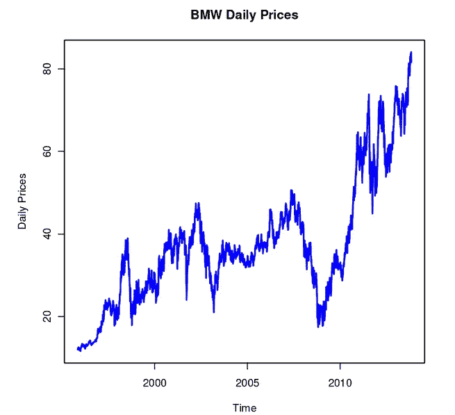
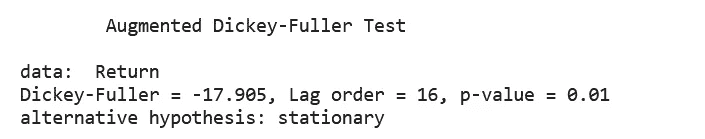
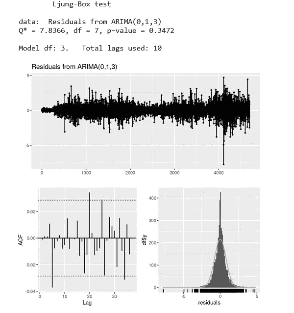

# 带 R 的股票价格的自动 ARIMA 和手动 ARIMA 模型

> 原文：<https://blog.devgenius.io/auto-arima-and-manual-arima-models-for-stock-prices-with-r-829bee0420f4?source=collection_archive---------1----------------------->

AR、MA、ARMA、ARIMA 和 Auto-ARIMA 模型

尼克·崇在 [Unsplash](https://unsplash.com?utm_source=medium&utm_medium=referral) 上的照片

你可以从 GitHub 下载[数据](https://github.com/riqbal-k/Data)，从 Kaggle 下载 [Jupyter 笔记本。](https://www.kaggle.com/code/robinaz/univariate-time-series-models-with-r/edit)

U nivaraite 时间序列模型是一种规范，旨在仅使用金融变量自身的过去值以及误差项的当前值和过去值中提供的信息来建模和预测金融变量。自回归综合移动平均(ARIMA)模型是时间序列模型的一个重要类别。

有两种**方法**对你的数据应用 ARIMA 模型。在这篇文章中，你将学习如何将**手动- ARIMA** 和**自动-ARIMA** 模型应用于宝马的每日股票价格。

> 我的**博客** [**关于单变量时间序列模型**](/univariate-time-series-models-for-stock-prices-with-stata-a16ad30d538b) **的介绍可以在这里找到。**

# 温柔的介绍

在 AR(p)模型中，使用变量先验值的线性组合来预测感兴趣的变量。与 AR()模型中预测变量的过去值相比，MA(q)模型在类似回归的模型中使用过去的预测误差。ARMA(p，q)模型可以组合形成自回归移动平均(ARMA)模型。

ARIMA (p，d，q)是自回归综合移动平均模型的缩写。该模型是为处理非平稳数据而创建的，这是 ARMA (p，q)和 ARIMA (p，d，q)之间的主要区别。

# 1.选择您自己的模型

## Box-Jenkins 方法-构建您自己的自回归模型:

估计 ARIMA 模型的第一个系统方法是由 Box 和 Jenkins 在 1976 年提出的。他们采取了一个三步走的、现实的、实用的策略。

手动应用 ARIMA 模型涉及以下步骤:

## **1。识别**

㈠分析时间序列，看它是否稳定，如果不稳定，需要多少差异才能使它稳定。

(二)使用图形技术来确定应收账款和应付账款的顺序(绘制一段时间内的数据以及 acf 和 pacf)。

> 不要忘记使用 ADF 测试和 KPSS 来检查平稳性，以及使用 Ljung-Box 统计来寻找自相关性。

## 2.估计

(I)描述 Arima(p，d，q)模型并计算其参数。根据不同的型号，这可以通过使用**最小二乘法**或另一种叫做**最大似然法**的方法来完成。

㈡利用 AIC 或 BIC 等信息标准寻找更好的模式。

## 3.诊断检验

(I)检查模型的拟合度，以确保它准确描述了您的数据。残差应该具有恒定的均值和方差，是同方差的，并且通过绘制残差的 ACF 是不相关的。

(二)如果残差不是正态分布，将你的新息分布改为**学生的 *t*** 。

(iii)一旦残差看起来像白噪声，计算预测。

# 2.使用自动 ARIMA 自动选择模型

**Hyndman-Khandakar 算法- AutoARIMA 建模**

[**Hyndman** 和 **Khandakar** (](https://www.jstatsoft.org/article/view/v027i03) 2008)结合前面的思想，得到一个健壮的、广泛适用的自动预测算法。所涉及的步骤总结如下。

## **1。应用合适的模型**

**对于每个系列，应用所有合适的型号。**优化每种情况下模型的参数。

## 2.使用 AIC 选择模型

根据 AIC 选择最好的模型。p 和 q 的值然后通过在差分数据 d 次后最小化 AICc 来选择。该算法通过逐步搜索来导航模型空间，而不是考虑 p 和 q 的每个潜在配对。

## **3。h-提前步骤预测**

使用最佳模型(具有优化的参数)根据需要提前生成点预测。

# 在 R-Manual -ARIMA 车型中的应用

安装并加载必要的库:

设置您的工作目录并上传您的数据。

BMW 数据集的头值

宝马数据集的尾值

创建时间图，以检查趋势和对时间序列数据的基本理解。

宝马的股票价格数据显示出积极的趋势以及显著的上下波动。这说明数据不是静止的。

# 静态测试

虽然从宝马价格的时间序列图中可以明显看出数据不是平稳的。我们仍然需要应用**增广的 Dicky Fuller** 检验或 **Phillips-Perron 单位根**检验进行平稳性检验。

平稳测试的假设:

当 p 值> 0.05 时，我们无法拒绝零假设。所以数据不是静止的。

PHP 单位根测试也证实了数据是平稳的。

# 自相关测试

现在我们将创建 **ACF** 和 **PACF** 图来确定 AR(p)和 MA(q)模型的顺序。我们还将应用 **Ljung 盒测试**来检测自相关。

对于股票价格，前 35 个滞后期的自相关性是显著的。

对于 PACF 图，自相关仅在第一个和第三个滞后时有意义。

自相关测试的假设:

作为金融中的 p 值< 0.05, reject the null hypothesis of no autocorrelation.

# Calculate Stationary Time Series

Now we will convert the non-stationary time series into a stationary time series by finding the first difference or simply calculating the financial returns.

> **，连续复利回报更为常见。这就是为什么我们将首先计算对数差。**

我们的财务回报只是弱平稳的，图表中可见的尖峰是异常值或极值。
无论我们对非平稳金融序列应用何种阶差——一阶、二阶或更高阶——它将始终保持弱平稳。
因此，我们只考虑第一个区别。

我们可以通过应用 ADF 检验来确认我们的数据是平稳的。

由于 p 值< 0.05 , we reject the null hypothesis. Our data is stationary at 5% significance level.

## **ACF 和 PACF 图确定了 AR(p)和 MA(q)的顺序**

Return 系列的 ACF 图看起来比 Prices 好很多。ACF 在滞后 1 时显著。二阶、三阶和一些高阶滞后也稍微重要。我们从估计 MA(1)模型开始。

> **MA 值由 ACF 图决定**

PACF 的前两次滞后与 18 次、26 次和 27 次滞后相比意义重大。我们可以从 AR(1)模型开始。

> **通过 PACF 图确定的 AR 值**

因为 p 值< 0.05, reject the null hypothesis of no autocorrelation.

# Estimation of AR, MA,ARMA and ARIMA Models

## Fit AR(1) Model

We will use arima() function from “tseries” package.

The coefficient of AR(1) model is **0.0432** 为正且显著。我们也可以为 AR(1)模型的残差绘制 ACF 图和 PACF 图。

## AR(1)的残差必须是白噪声

我们现在将寻找残差中白噪声的存在，这是良好拟合的标志。
也就是说，如果拟合模型是准确的，则不能获得关于潜在过程的额外知识。

## 拟合 MA(1)模型

我们将使用“tseries”包中的 arima()函数。

MA(1)模型的系数为 **0.0481** ，为正且显著。我们也可以为 MA(1)模型的残差绘制 ACF 图和 PACF 图。

## 对于 MA(1)，残差必须是白噪声

## 拟合 ARMA(1)模型

当我们估计 ARMA (1，1)模型时，我们观察到 AR(1)模型的系数为-0.2772，这表明今天和昨天的股票价格之间存在显著的负相关关系。MA(1)模型的系数为 0.3284。

## ARMA(1，1)残差

## 适合 ARIMA(1)模型

我们可以用 arima (p，d，q)来拟合股票价格和收益序列。为了应用 ARIMA 模型，时间序列不一定是平稳的。

AR(1)具有正的系数值，MA(1)具有负的系数值。

> ***d = 2*的顺序，因为我已经计算了一阶差分，并对平稳序列应用了 arima 模型。****

## *ARIMA 残差(1，1，1)*

**

# *型号选择*

*在实践中，从自相关函数中确定合适的模型排序可能极具挑战性。*

*一种更简单的方法是选择降低**信息标准**重要性的模型阶数。阿凯克(1974)的信息准则( **AIC** )、施瓦茨(1978)的贝叶斯信息准则( **BIC** )和汉南·奎因准则( **HQIC** )是三个最常用的信息准则。*

**

*ARIMA (1，1，1)具有最小的 AIC 和 BIC 值。*

> ***我们可以从下面的列表中估算出各种各样的 ARIMA 车型:***

**

# *自 ARIMA 模型在 R 估计中的应用*

*使用**自动 ARIMA** 优于**手动 ARIMA** 模型的好处是，我们可以在非平稳序列上拟合自动 ARIMA 模型，而不用担心 *p，d，*和 *q.*
的顺序。在选择模型时，它使用通过试验各种 p，q 和 d 值组合产生的 AIC(阿凯克信息标准)和 BIC(贝叶斯信息标准)值。*

*自动 ARIMA 模型适合各种 ARIMA(p，d，q)模型，以便选择最佳模型。*

**

*ARIMA (0，1，3)模型被自动选为具有最小 AIC 值的最佳模型。*

**

## *ARIMA 残差(1，1)*

**

# *用自 ARIMA 模型进行预测*

*现在，自动 ARIMA 模型预测已经实现。预测是为未来 5 天生成的。*

**

*我已经计划了未来 300 天的预测。*

**

# *ARIMA 和自动 ARIMA 模型的样本外估计*

*我估计了完整数据集上的 ARIMA 模型。但是，出于强制和模型比较的目的，将数据分成训练集和测试集是很重要的。*

# ***结论***

*虽然有了自动 ARIMA 模型，我们可以绕过各种步骤。为了更好地理解，知道如何手动实现 ARIMA 模型是很重要的。*

# *参考*

*布鲁克斯，克里斯。金融计量经济学导论。第四版。剑桥大学出版社。2019.*

*Hyndman，R. J .，& Khandakar，Y. (2008 年)。自动时间序列预测:R. *统计软件杂志*， *27* (1)，1–22 的预测包。*

*[齐沃特](https://www.google.com/search?sxsrf=ALiCzsayTNs9JTN1lnhK-lYSImKGKmibRg:1665934602238&q=Eric+Zivot&stick=H4sIAAAAAAAAAOPgE-LVT9c3NEw2LMhNMrDMUIJw0wxyUwoqCgy0ZLKTrfST8vOz9cuLMktKUvPiy_OLsq0SS0sy8osWsXK5FmUmK0RlluWX7GBl3MXOxMEAAJsVnbFTAAAA&sa=X&ved=2ahUKEwi6wr2BiuX6AhWVM8AKHUF5AbsQmxMoAHoECFMQAg)，E. 2023。*计算金融与金融计量经济学导论*。*