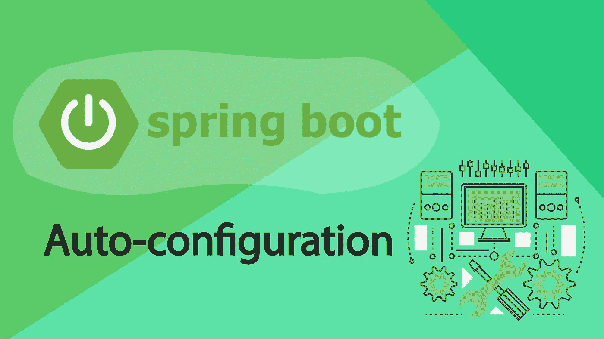
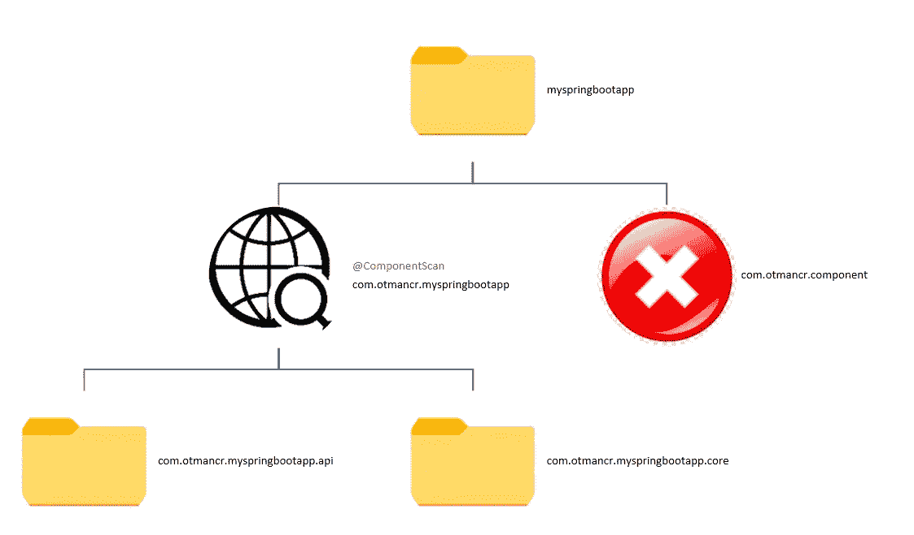
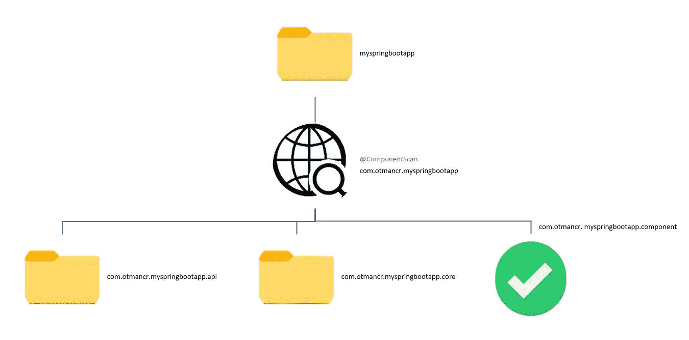
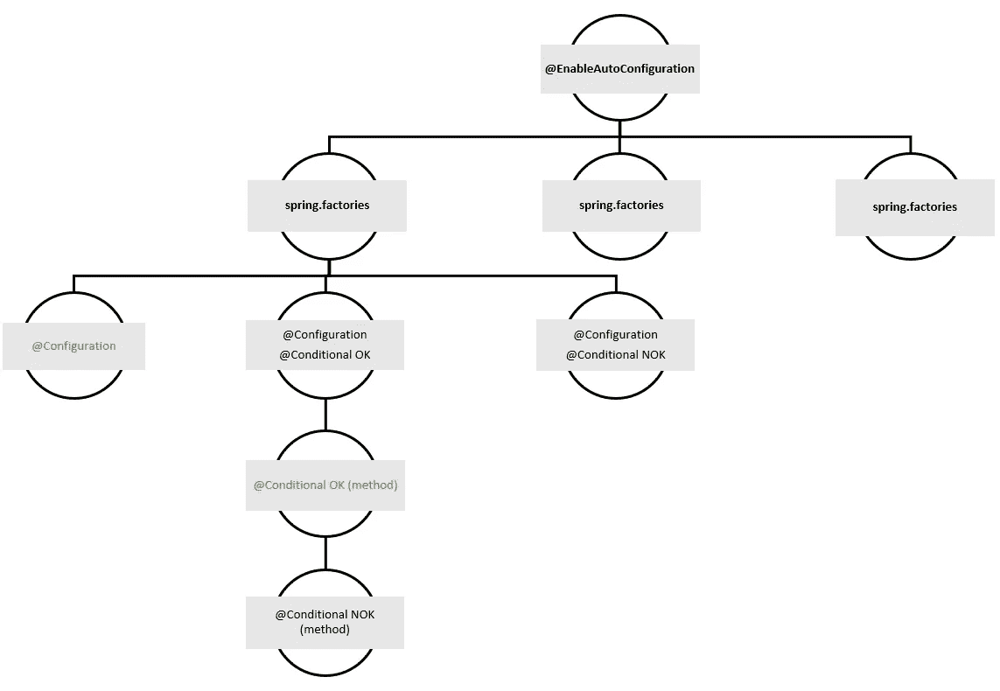
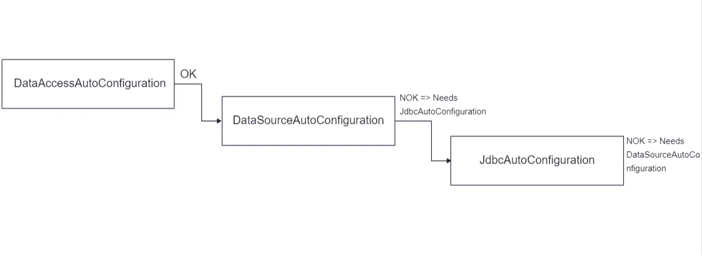

# Spring Boot 自动配置

> 原文：<https://blog.devgenius.io/auto-configuration-with-spring-boot-29a45d1f6869?source=collection_archive---------10----------------------->



Spring Boot 不仅仅是一个应用程序生成器。它是一个可以让你进行超编程的工具；因此，避免编写不必要的代码，快速开始，最重要的是，关注应用程序的业务需求，同时保持非常灵活并尊重用户的选择。

今天，Spring Boot 代表了 **Spring 栈**的一个非常重要的部分，它之所以被强调是因为它是其他 **Spring 框架**的入口点。

在这篇文章中，我将介绍由“[夏羽·尼科尔](https://twitter.com/snicoll)”和“[布莱恩·克洛泽尔](https://twitter.com/bclozel)”主持的大学“掌握 Spring Boot 的超能力”的概况。

# 与 Spring Boot 的基本应用

一个基本的应用如下。

这里的 **@SpringBootApplication** 相当于:

*   @SpringBootConfiguration
*   @启用自动配置
*   @ComponentScan

## **@ComponentScan**

允许您扫描主包(包含配置类的包)和子包中的所有组件和派生组件。它将获取任何由 **@Service** 、 **@RestController** 、 **@Configuration** 、 **@Controller** 、 **@Repository** 等标注的内容。

为了防止某些组件被扫描，例如下面的情况，最好创建包含配置类的主目录，在下面，我们将添加应用程序的所有组件。



在这种情况下，Stéphane 建议:“如果你把你的 Spring Boot 应用程序放在一个专用的包中，并在这个结构中添加你的组件，Spring Boot 将有一个一致的默认行为，它可以在其他情况下做出正确的决定。(通常在测试中)”

# 启动时自动配置

**基本配置**

自动配置是一个配置类(注释为 *@Configuration* ),它不会被扫描，而是列在一个特殊的文件中(**META-INF/spring . factories**)

通过启用自动配置，Spring Boot 将尝试根据应用程序中定义的依赖关系来配置应用程序。

例如，如果在类路径中有一个对 **HSQLDB** 的引用，并且没有建立连接的 Bean，Spring Boot 将能够配置一个内存中的数据库。

此外，还可以添加您自己的自动配置。例如，我们有一个特定的库。你所要做的就是在**META-INF/spring . factories .**中添加配置文件的路径

```
org.springframework.boot.autoconfigure.EnableAutoConfiguration=\myspringbootapp.otmancr.autoconfigurations.MyAutoConfig
```

到目前为止，我们已经看到了两种类型的配置，用户 bean 和自配置 bean。

*   **@ComponentScan :** 用户配置。
*   **@ enable Auto configuration:**自动配置。

两点:

*   我们无法确定在哪种情况下我们可以贡献 Beans。
*   由于首先处理用户定义的任何内容，自动配置将覆盖用户配置。

> 在这种情况下，我们如何尊重为应用程序做出的决定？

## 条件框架

Spring 4 带来了条件框架。这是不使用户配置过载的解决方案。

这由条件注释具体化:

*   **@ ConditionalOnMissingBean**仅在 Bean 不存在时应用此定义，反过来是 **@ConditionalOnBean。**
*   **@ ConditionalOnMissingClass**仅当类不在类路径中时才应用此配置，反之亦然@**conditionalongclass**。
*   **@ ConditionalOnWebApplication**是 web 应用时适用，反过来是**@ ConditionalOnNotWebApplication。**

条件求值的顺序是从最快到最慢(这不是声明的顺序)。

定义如下:

1.  @ ConditionalOnClass
2.  @ ConditionalOnMissingClass
3.  @ ConditionalOnRessource
4.  @ConditionalOnJava
5.  @ConditionalOnWebApplication
6.  @ ConditionalOnNotWebApplication
7.  @ConditionalOnJndi
8.  @ConditionalOnProperty
9.  @ ConditionalOnExpression
10.  @ ConditionalOnSingleCandidate
11.  @ ConditionalOnBean
12.  @ ConditionalOnMissingBean

这些条件可以在类和方法级别上声明，放在类上的条件首先被评估。

也可以创建自己的条件，Spring Boot 提供了一个基类， **SpringbootCondition** ，它允许你提供一个报告(在这种情况下，调试模式必须是活动的)来帮助用户诊断加载的类。

# 结论



**@ enable auto configuration**将获取所有`spring.factories`文件，`spring.factories`将列出所有 auto-conf，每个 autoConf 包含注释。

如果它只包含**@配置**并且所有条件都有效，则执行它。第二步是对方法上的**@条件**的验证。

## **要避免的陷阱**

1.  自动配置类的排序

例如，如果使用此订单验证 Beans，我们在创建它们时会遇到问题。



要解决这个问题→之前/之后自动确认

*   @ auto configure after(JDBC auto configuration . class)data access configuration
*   @ auto configure before(JDBC auto configuration . class)数据源配置
*   JDBC 自动配置

2.**conditional class**用在了错误的地方，运行时爆炸→将条件放在配置类上，以避免加载类。

由于类级别的条件已经过验证，Boot 将尝试加载这个 Bean。因此出现了运行时异常，即 Gson 库丢失的情况。

由于没有验证类级别的条件，所以在没有 Gson 库的情况下，Boot 不会更改 Bean。

3.由于用户配置和自动配置分两个阶段进行验证，因此用户配置类无法检测 Bean 是否丢失，因此无法使用这些条件。