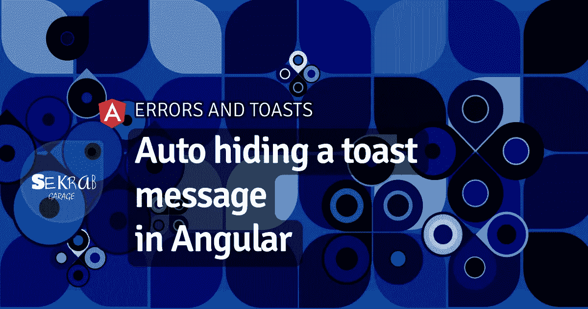

# 自动隐藏有角度的祝酒辞

> 原文：<https://blog.devgenius.io/auto-hiding-a-toast-message-in-angular-54f886ad6129?source=collection_archive---------6----------------------->

## 错误和干杯



以前我们建立了一个服务来通过产生一个 toast 消息来[处理我们的 UI 错误，今天我们增强了 toast 的行为，超时和自动隐藏。](https://garage.sekrab.com/posts/catching-and-displaying-ui-errors-with-toast-messages-in-angular)

# 超时设置

超时是可变的，但是您不想考虑它，所以我们创建一些打包的选项来定义最常见的超时。让我们从超时的属性开始，看看如何处理它。

```
export interface IToast {
  text?: string;
  css?: string; 
  extracss?: string;
  buttons?: IToastButton[];
  timeout?: number; // new for timeout to hide
}@Injectable({ providedIn: 'root' })
export class Toast {
  // ...

  // keep track of timeout
  private isCancled: Subscription; // change default to have default 5 seconds delay
  private defaultOptions: IToast = {
    // ...
    timeout: 5000,
  }; Show(code: string, options?: IToast) {
    // we need to hide before we show in case consecutive show events
    // this will reset the timer
    this.Hide();

    // ...

    // timeout and hide
    this.isCanceled = timer(_options.timeout).subscribe(() => {
      this.Hide();
    });

  }
  Hide() {
    // reset the timer
    // in case of showing two consecutive messages or user clicks dismiss 
    if (this.isCanceled) {
      this.isCanceled.unsubscribe();
    }
    this.toast.next(null);
  }
```

这个想法是基本的；创建一个计时器超时，并取消(或重置)显示前，或当用户点击解散计时器。用法很简单，但可以增强(超时是可选的):

`this.toast.ShowSuccess('INVALID_VALUE', {timeout: 1000});`

代替传递显式超时，我们希望拥有 times 的**选项，主要有三种: **short，long，never** 。我们可以将超时重新定义为一个`enum`:**

```
// toast model
export enum EnumTimeout {
  Short = 4000, // 4 seconds
  Long = 20000, // 20 seconds
  Never = -1, // forever
}export interface IToast {
  // ... redefine
  timeout?: EnumTimeout; // new for timeout to hide
}// state service
@Injectable({ providedIn: 'root' })
export class Toast {
  // ...
  // we can set to the default to "short" or any number
  private defaultOptions: IToast = {
   // ...
   timeout: EnumTimeout.Short, // or you can use Config value
  }; Show(code: string, options?: IToast) {
    // ...
    // if timeout, timeout and hide
    if (_options.timeout > EnumTimeout.Never) {
      this.isCanceled = timer(_options.timeout).subscribe(() => {
        this.Hide();
      });
    }
  }
  //...
}
```

要使用它，我们可以将它作为一个数字或一个`enum`来传递:

`this.toast.Show('SomeCode', {timeout: EnumTimeout.Never});`

现在来谈谈 UX 问题。

# 为什么要藏起来，藏多久

*snackbars* 的材料指南允许一条消息出现在前一条消息之上(在 z 方向)。当用户关闭当前消息时，它下面的旧消息仍然存在。**这在用户体验方面有很大的缺陷**。小吃店和面包店意味着**即时和上下文的注意力抓取器**。展示一个陈旧的是很吵的。这就是为什么我选择了上面的实现，它允许一次一条消息，被更新的消息覆盖。

我们应该仔细考虑向用户显示什么信息，何时显示，显示多长时间。否则，敬酒的价值，就是敬酒！**一般规则是，如果有其他视觉提示，信息应该简短。**这也意味着成功的手术很少需要举杯庆祝。

以下是你可能会同意的食谱:

## 提交时表单字段无效

当用户点击提交一个带有无效字段的表单时，一个很快消失的**快速通知**就足够了，因为表单字段已经有了视觉指示。当屏幕大小不适合所有表单字段，并且无效字段位于视窗上方时，这很有帮助。

## 没有视觉反应的成功动作

想想脸书的分享行动，创建的帖子并没有直观地更新时间轴。一条简短甜蜜的祝酒辞，加上一个查看帖子的动作，是最理想的。

## 系统生成的带有视觉提示的消息

当收到电子邮件或互动的推送通知时，页面上的另一个元素也会更新，在这种情况下，贝尔图标、**一个简短且可行的祝酒词**可能是正确的答案、**一个不祝酒词**也可能是另一种方式，想想桌面 Twitter 通知。

## 系统生成的消息没有视觉提示

当一个 PWA 站点有了新版本，想要邀请用户“更新”时，或者一个新用户被提示“订阅”一份时事通讯时，**一个带有动作**的冗长的拒绝消息听起来是正确的。决定因素是消息有多紧急，它可能是一个粘性消息。

这些上下文很少会妨碍展示，有时页面的刷新会消除任何遗留问题，一条祝酒词会打断注意力，而不是抓住它。现在考虑以下情况。

## 陈旧页面需要操作

当页面打开时间过长，**授权用户超时**时，当用户点击任何需要授权的动作时，**重定向到登录页面**，**并显示简短的原因提示**。

## 带有可选操作的陈旧页面

然而，如果**授权是可选的**，并且用户可以注册或登录，那么 **toast 消息应该具有动作按钮**，并且**不应该消失**，除非用户取消它，或者另一个 toast 覆盖它。

## 服务器使进程超时

当服务器由于未知原因长时间拒绝完成一个进程时，**错误提示最好告诉用户进程没有通过**。用户可能已经离开屏幕一段时间了(可能他们认为网站太害羞了，在他们看的时候不敢做自己的事情😏).

## API 404 错误

一般的 API 404 错误也需要**逗留**，因为没有其他视觉提示来指示它们，但是如果页面重定向，就不需要显示任何消息。

# 动画

最后要添加的是动画。动画的主要成分是让烤面包片先出现，进入视野，停留，隐藏，然后消失。有多种方法可以做到这一点，下面是一些方法:

## 1.在不移除元素的情况下制作动画

第一个也是最直接的方法是放弃烤面包的条件存在，只让它潜入视口的底部。这是为了避免在元素被 Angular 移除后不得不在 DOM 中隐藏元素。

CSS 动画看起来像这样:

```
.toast {
  /* ...  remember the bottom: 10px */
  /*by default is should be out of view*/
  /* calculate 100% of layer height plus the margin from bottom */
  transform: translateY(calc(100% + @space));
  transition: transform 0.2s ease-in-out;
}
.toast.inview {
  /*transition back to 0*/
  transform: translateY(0);
}
```

在我们的状态和 toast 模型中，我们为可见性添加了一个新的属性。我们用**缺省值 false** 初始化我们的状态，并更新该属性，而不是使状态无效:

```
// toast model
export interface IToast {
  // ...
  visible?: boolean;
}// state
@Injectable({ providedIn: 'root' })
export class Toast { // ... 
  private defaultOptions: IToast = {
    // ...
    // add default visible false
    visible: false
  }; // set upon initialization
  constructor() {
    this.toast.next(this.defaultOptions);
  }
  Show(code: string, options?: IToast) {
    // ...
    // update visible to true
    this.toast.next({ ..._options, text: message, visible: true });

    // ... timeout and hide
  }
  Hide() {
    // ...
    // reset with all current values
    this.toast.next({ ...this.toast.getValue(), visible: false });
 }
}
```

最后，在组件模板中，我们添加了`inview`条件类:

```
<ng-container *ngIf="toastState.toast$ | async as toast">
  <div 
    [class.inview]="toast.visible"
    class="{{toast.css}} {{toast.extracss}}">
    ...
  </div>
</ng-container>
```

## 2.以编程方式隐藏

我们也可以制作动画，然后在移除元素之前观察动画的结尾([animation end](https://developer.mozilla.org/en-US/docs/Web/API/HTMLElement/animationend_event))。这有点扭曲，但是如果你坚持在完成后**移除吐司元素，这比动画包便宜。**

在 toast 状态下，使用上面添加的相同属性`visible`:

```
// toast state
@Injectable({ providedIn: 'root' })
export class Toast {
  // ...
  Show(code: string, options?: IToast): void {
    // completely remove when new message comes in
    this.Remove();

    // ... 
    this.toast.next({ ..._options, text: message, visible: true });

    // ... timeout and Hide
  }

  // make two distinct functions
  Hide() { // this is hide by adding state only and letting component do the rest (animationend)
    this.toast.next({ ...this.toast.getValue(), visible: false });
  }

  Remove() {
    if(this.isCanceled) {
      this.isCanceled.unsubscribe();
    }
    // this removes the element
    this.toast.next(null);
  }
}
```

在我们的`css`中，我们添加了动画序列:

```
.toast {
  /*...*/

  /*add animation immediately*/
  animation: toast-in .2s ease-in-out;
}
/*add outview animation*/
.toast.outview {
  animation: toast-out 0.1s ease-in-out;
  animation-fill-mode: forwards;
}@keyframes toast-in {
    0% {
        transform: translateY(calc(100% + 10px);
    }
    100% {
        transform: translateY(0);
    }
}@keyframes toast-out {
    0% {
        transform: translateY(0);
    } 100% {
        transform: translateY(calc(100% + 10px));
    }
}
```

最后，在我们的组件中，我们做了扭转，观察`animationend`移除吐司。

```
@Component({
    selector: 'gr-toast',
    template: `
    <ng-container *ngIf="toastState.toast$ | async as toast">
    <!-- here add outview when toast is invisible, then watch animationend -->
      <div [class.outview]="!toast.visible" (animationend)="doRemove($event)"
      class="{{ toast.css}} {{toast.extracss}}">
        <div class="text">{{toast.text }}</div>
        <div class="buttons" *ngIf="toast.buttons.length">
            <button *ngFor="let button of toast.buttons"
            [class]="button.css"
            (click)="button.click($event)" >{{button.text}}</button>
        </div> </div>
    </ng-container>
    `,
    changeDetection: ChangeDetectionStrategy.OnPush,
    styleUrls: ['./toast.less'],
})
export class ToastPartialComponent {
    constructor(public toastState: Toast) {
    }
    // on animation end, remove element
    doRemove(e: AnimationEvent) {
        if (e.animationName === 'toast-out') {
            this.toastState.Remove();
        }
    }
}
```

长得丑？是的，所以如果我们真的想删除元素，我们的另一个选择是一个巨大的样板文件，称为角动画包。

## 3.角度动画包

Angular 的动画包神奇地处理了这个问题。

> *我试图找到代码，但是我不太明白 ngIf 被忽略直到动画结束的机制。你能找到兔子吗？请在评论中告诉我。*

首先撤销上面的操作，将动画包添加到根目录。css 应该不再有任何动画，状态应该简单地显示和隐藏(不需要`visible`属性)。然后在组件中，我们添加以下内容:

```
@Component({
  selector: 'gr-toast',
  template: `
  <ng-container *ngIf="toastState.stateItem$ | async as toast">
    <div @toastHideTrigger class="{{ toast.css}} {{toast.extracss}}" >
      The only change is @toastHideTrigger 
      ...
  </ng-container>
  `,
  // add animations
  animations: [
    trigger('toastHideTrigger', [
      transition(':enter', [
        // add transform to place it beneath viewport
        style({ transform: 'translateY(calc(100% + 10px))' }),
        animate('0.2s ease-in', style({transform: 'translateY(0)' })),
      ]),
      transition(':leave', [
        animate('0.2s ease-out', style({transform: 'translateY(calc(100% + 10px))'  }))
      ])
    ]),
  ]
})
// ...
```

你可能会有偏好，比如在 angular 中使用动画包，我看不出有什么附加价值。我喜欢的方法是简单的，把它放在页面上，永远不要删除。

## 轻微的增强

你可能注意到了我们在显示之前隐藏了**，变化如此之快，以至于显示新消息的动画并没有开始。为了解决这个问题，我们可以将节目延迟几毫秒，以确保动画开始播放。在我们的`Show`法中:**

```
// Show method, wait milliseconds before you apply
// play a bit with the timer to get the result you desire
timer(100).subscribe(() => {
  // add visible: true if you are using the first or second method
  this.toast.next({ ..._options, text: message  });
});
```

当我们使用第二种(扭曲的)方法时，这个效果是最完美的。因为这是唯一一个两个连续的消息，强制删除第一个没有动画，这是理想的行为。

看看 [StackBlitz](https://stackblitz.com/edit/angular-error-toast?file=src/app/app.component.html) 上的结果。

# 基于 RxJS 的状态管理

如果你正在跟进，我不久前在 Angular 中介绍了基于 RxJS 的状态管理。这个烤面包器可以如下利用它:

```
// to replace state with our State Service
// first, extend the StateService of IToast
export class Toast extends StateService<IToast> {

  // then remove the internal observable
  // private toast: BehaviorSubject<IToast | null> = new BehaviorSubject(null);
  // toast$: Observable<IToast | null> = this.toast.asObservable();

  constructor() {
    // call super
    super();
    // set initial state
    this.SetState(this.defaultOptions);
  } // ...
  Show(code: string, options?: IToast) {
    // ... 
    // use state instead of this
    // this.toast.next({ ..._options, text: message });
    this.SetState({ ..._options, text: message });
  }
  Hide() {
    // ...
    // use state instead
    // this.toast.next(null);
    this.RemoveState();

    // or update state
    this.UpdateState({ visible: false });
  }
}
```

模板现在应该看`toastState.stateItem$`，而不是`toastState.toast$`。

这是所有的乡亲。你找到兔子了吗？让我知道。

# 资源

*   [StackBlitz 项目](https://stackblitz.com/edit/angular-error-toast)
*   [角度动画:进入和离开别名](https://angular.io/guide/transition-and-triggers#enter-and-leave-aliases)
*   [HTML 动画结束事件](https://developer.mozilla.org/en-US/docs/Web/API/HTMLElement/animationend_event)

## 控制台系列

*   [为 console.log 编写一个包装器以更好地控制 JavaScript，第一部分](https://medium.com/@aayyash/writing-a-wrapper-for-console-log-for-better-control-in-javascript-part-i-9bbd238fb9ad)
*   [为 console.log 编写一个包装器，以便更好地控制 Angular，第二部分](/writing-a-wrapper-for-console-log-for-better-control-in-angular-part-ii-5b09b65af2c5)
*   [捕捉和处理角度误差](https://medium.com/@aayyash/catching-and-handling-errors-in-angular-3ac6b95853ba)
*   [用 toast 消息捕获并显示 UI 错误](/catching-and-displaying-ui-errors-with-toast-messages-in-angular-db06f2605a6d)
*   [自动隐藏有角度的祝酒辞](https://medium.com/@aayyash/auto-hiding-a-toast-message-in-angular-54f886ad6129)