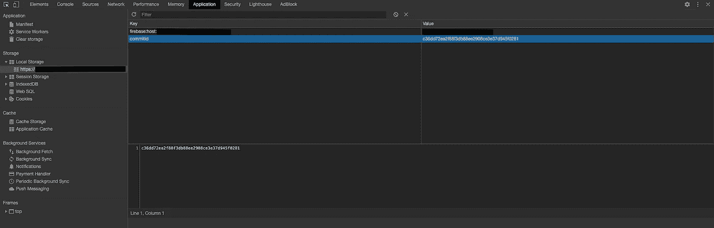

# 使用 Angular 9 和 firebase 部署后自动重新加载客户端

> 原文：<https://blog.devgenius.io/auto-reload-client-side-after-deployment-with-angular-9-and-firebase-e2a9a5d8e9fb?source=collection_archive---------6----------------------->

我相信，在频繁部署到生产环境的 Angular 应用程序中，每个人都面临的一个常见问题是用户对浏览器的硬刷新。我在网上遇到过几个解决方案，但是我想到了一个更简单的解决方案，那就是我现在正在使用的堆栈。因此，如果你正在使用 GitHub (CI/CD)，Firebase 函数，Firebase 实时数据库和 Angular 作为你的堆栈，那么系好安全带，因为它会变得像 ctrl+c，ctrl+v 一样简单。😁

让我们将整个过程分成几个步骤:

1.  部署时触发一个函数，在实时数据库中存储一个新的提交 id。
2.  在一个主服务中编写一段代码，检查数据库中的提交 id 是否与浏览器中存储的 id 相匹配。

让我们首先从向 deploy.yml 文件的。github/workflows 将触发您的 firebase 功能。
您需要在 jobs/deploy-dev/steps:下添加的行是-

最后，您的 deploydev.yml 应该如下所示:

一旦我们完成了这一部分，我们已经成功地确保在我们的部署过程中，一个 firebase 函数将被触发。现在我们需要确保 firebase 函数确实将 GitHub 生成的提交 id 写入我们的 firebase 实时数据库。我们将从编写函数文件开始:

我们上面的简单函数检查在部署期间发送的请求体的类型，并获取秘密的惟一 github.sha，并将其用作提交 id。不要忘记将它添加到 firebase 函数的索引文件中:

部署后，我们应该会在实时数据库的根节点下看到一个 *commitid* 集合，看起来应该是这样的:

太好了！现在我们也在向数据库写入数据。剩下的就是在客户端读取它，并通过比较提交 id 来确保浏览器是最新部署的。我们将在任何主要服务中添加我们的代码片段。如果没有，可以在中创建一个，方法是转到项目目录的根目录并运行:

> *ng 生成服务系统*

在您的主服务文件中，您应该添加如下代码片段:

一旦添加，这应该弹出一个基本的警告给用户，询问他们是否要重新加载浏览器。您的最终文件应该如下所示:

你们都完了！现在，每当你部署一个新版本的应用程序时，所有的浏览器都会看到一个警告，要求它们重新加载，或者通知它们有一个新的版本。你也可以在浏览器的本地存储中看到这个提交 id，方法是进入你的 Chrome 开发者工具，在 Application:

