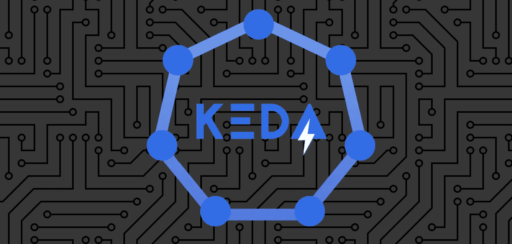

# 自动缩放+ Kubernetes = KEDA —第 1 部分

> 原文：<https://blog.devgenius.io/auto-scaling-kubernetes-keda-part-1-d7638d67ea17?source=collection_archive---------2----------------------->

*本文的先决条件— Kubernetes 知识。*

如果您是开发人员或 devops 导出人员，那么您肯定会面临创建自动缩放作业的任务。

一个典型的**用例**是当你有一个文件存储时，你需要在新文件到达时立即处理它，为此你需要运行并行作业。如果你只有一份工作，那就不够快。如果你主持一个以上的工作，那么它可能太昂贵，因为他们将是闲置和消耗资源。

## 所以困境就是“*快&贵*”vs“*慢&便宜*”。

这就是 Kubernetes，特别是 KEDA 可以帮助你的地方。

> **KEDA** 是一个基于 [Kubernetes](https://kubernetes.io/) 的事件驱动自动缩放器。使用 KEDA，您可以根据需要处理的事件数量来扩展 Kubernetes 中的任何容器。

简化的架构:

(1) **触发器** → **定标器** (2) → **运行工作** (3)

对这一特定用例的解释:

(1)一个事件(一个新文件到达)和你的应用程序，知道这一点，把一个项目，包含关于文件的细节，放入一个队列——Azure Store 队列，或 AWS SQS 队列，或 Apache Kafka 主题。一个来自 KEDA 的**触发器**轮询队列并启动。

(2)一个来自 KEDA 的**定标员**根据各种条件，可以推出更多的 then job。

(3)一个或多个**任务**将执行你的业务逻辑。KEDA 确保它们是从同一个 docker 映像克隆而来的。如果没有更多的消息要处理，KEDA 会停止你的工作，你不会使用任何资源。

**外卖**:

*   如果你正在使用 Kubernetes，你肯定应该熟悉 KEDA；
*   该解决方案与供应商无关；
*   它可以节省资源和金钱。

在接下来的[中，第二部分](https://egris.medium.com/auto-scaling-kubernetes-keda-part-2-72fb3fc21c27)将解释一个实现，它将使用 KEDA 的自动伸缩和 Azure 功能作为作业，托管在 docker 中，运行在 Kubernetes 集群中。