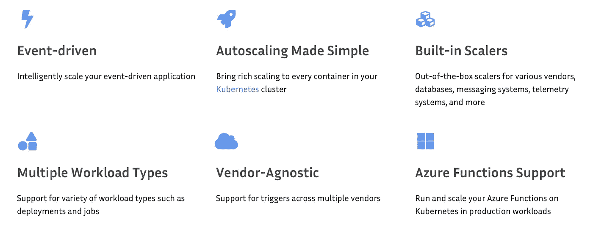
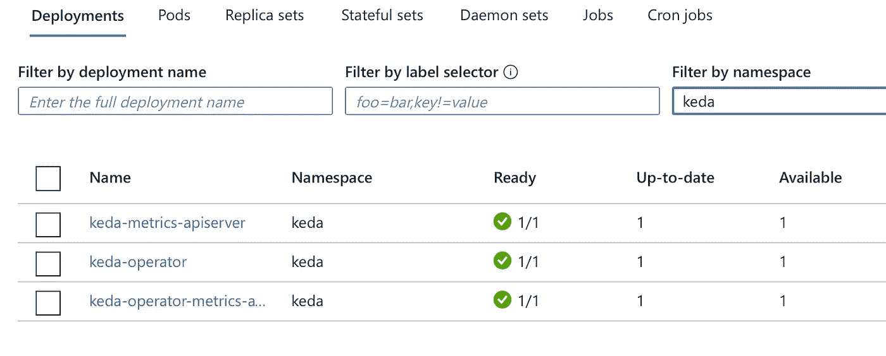

# 自动缩放+ Kubernetes = KEDA —第 2 部分

> 原文：<https://blog.devgenius.io/auto-scaling-kubernetes-keda-part-2-72fb3fc21c27?source=collection_archive---------5----------------------->



*本文必备——Kubernetes、Azure 函数 App、Docker 知识*

在[第一部分](https://medium.com/dev-genius/auto-scaling-kubernetes-keda-part-1-d7638d67ea17)中，我已经解释了 KEDA 的高层想法。在这一部分，我们将看到实际的实现。

**用例**

有一个 web 应用程序，它从终端用户上传文件，并把它们放在云存储中。目标是以最小的延迟处理这些文件。为此，我们希望作业能够根据队列大小进行伸缩。

**组件**

*   获取用户输入(文件)的 Web 应用程序
*   Azure Blob 存储用于保存文件
*   Kubernetes 与 KEDA 集群(真的，2.0 版)
*   Azure Function App 作为一个作业，托管在 Kubernetes 集群中，处理来自存储的文件
*   存放 docker 图像的容器注册表

在这种情况下，web 应用程序的实现并不重要。下面重点说一下 azure 功能 app。

## 你可以使用这个 github repo 来获得所有的细节。

1.  **安装**

一旦有了 Kubernetes 集群，就必须确保安装了 KEDA。这很简单——只要遵循这里的官方指南[就行了](https://keda.sh/docs/2.0/deploy/)。

最后，您将拥有 Kubernetes 名称空间“keda”和几个部署。



**2。作业启动**

选择 Azure Function App 作为执行框架的主要原因是:

*   效率——您不需要关心编码队列迭代——峰值、读取等；
*   灵活性——您可以在 Kubernetes 集群中将其作为 docker 容器运行，或者直接在 Azure 平台上运行。

```
func init --worker-runtime dotnet --docker
func new -n Demo -l C#
```

更新文件 Demo.cs 以指示连接字符串的存储位置(参数**连接**):

```
[FunctionName("Demo")]
        public static void Run([QueueTrigger("myqueue-items", Connection = "AzureWebJobsStorage")]string myQueueItem, ILogger log)
        {
            log.LogInformation($"C# Queue trigger function processed: {myQueueItem}");
        }
```

如果您正确配置了 **local.settings.json** ，并将一条消息添加到您的队列“myqueue-items”中，那么您可以通过从命令行启动它来测试您的函数:

```
func start
```

**3。准备码头工人图像**

docker 映像将用于托管我们之前创建的 Azure function 应用程序。

```
docker build -t <your registry name>/demo-keda .
```

“demo-keda”是图像的名称。

并将其发送到注册表:

```
docker push <your registry name>/demo-keda:latest
```

**4。准备 Kubernetes**

您可以通过以下命令为名称空间“demo”创建部署文件“deploy.yaml”。

```
func kubernetes deploy --name demo-keda --namespace demo \
  --image-name <your registry name>/demo-keda:latest --dry-run > deploy.yaml
```

要将作业部署到 kubernetes 集群:

```
kubectl apply -f deploy.yaml
```

**重要的**！如果您使用 KEDA 2.0 版，请更新部署文件(ScaledObject 一节):

```
apiVersion: keda.sh/v1alpha1
kind: ScaledObject
metadata:
  name: demo-keda
  namespace: demo
spec:
  scaleTargetRef:
    name: demo-keda
  cooldownPeriod:  180
  minReplicaCount: 0
  maxReplicaCount: 2
  advanced:
    restoreToOriginalReplicaCount: true
  triggers:
  - type: azure-queue
    metadata:
      connectionFromEnv: AzureWebJobsStorage
      queueName: myqueue-items
      queueLength: '1'
```

**5。测试和监控**

最初，在您的名称空间“demo”中，活动窗格的数量应该为 0。

如果您启动该命令，您可以开始监控由 KEDA 创建的窗格，如果您开始快速向队列添加消息:

```
kubectl get pods -w -n demo
```

**6。故障排除**

如果您的工作没有扩展，那么排除 KEDA 故障是有意义的。

为此，我们需要来自 pod“keda-operator-*”的日志。

要查找要从中获取日志的所需 pod 的名称，请执行以下操作:

```
kubectl get pods -n keda
```

要获取 KEDA 缩放日志:

```
kubectl logs <keda operator pod name> -n keda
```