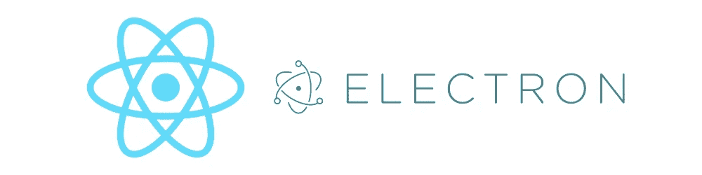
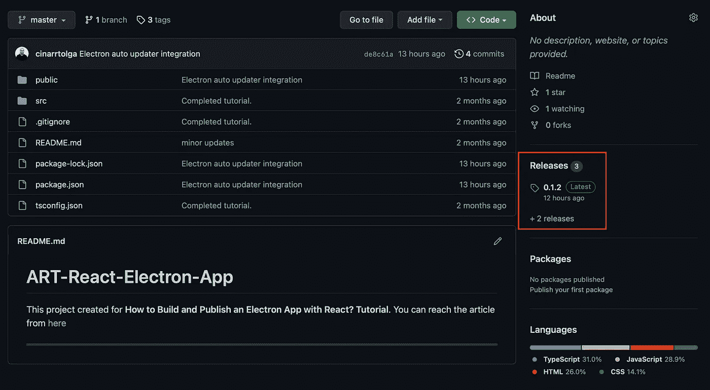
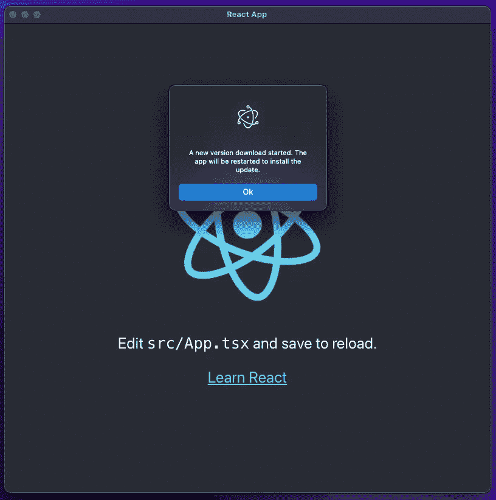
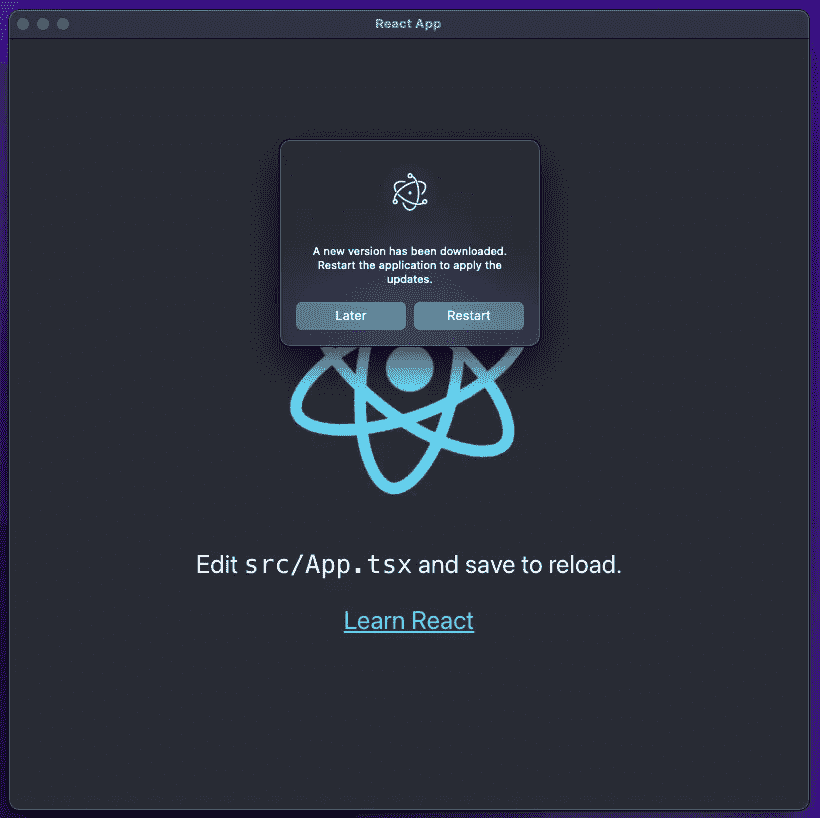

# React 电子应用程序的自动更新程序|教程

> 原文：<https://blog.devgenius.io/auto-updater-for-react-electron-app-tutorial-18b1a6db08bd?source=collection_archive---------0----------------------->

大家好，

在上一篇文章中，我试图解释**“如何用 React 构建和发布一个电子 app？”**如果你还没看过，你可以在这里找到[。](/how-to-build-and-publish-an-electron-app-with-react-tutorial-971e1d9d27ce)

在本文中，我将继续从事相同的项目。我要集成电子自动更新器。如果你已经有一个电子项目，那么你可以跳过上一篇文章，从这篇文章继续。



在开始开发之前，我想解释一下流程。通过自动更新，该应用程序将每 10 分钟检查一次来自 Github 的更新。*(我用了 10 分钟，但有可能改变它。)*如果有新版本，应用程序将下载更新的版本，并通过对话框等待用户的确认，如果用户批准，应用程序将更新并重新启动。

让我们开始开发吧！

作为第一步，我通过下面的命令将**电子更新器**库安装到项目中。有些版本可能会抛出 404 错误。正因为如此，我更倾向于使用版本 ***4.6.5*** *。*本库希望您的系统中有 **GH_TOKEN** 环境变量。

```
npm i electron-updater@4.6.5
```

然后为了能够收听和下载更新，我必须在 **electron.js** 中做一些改动。作为第一个改变，我在文件的顶部定义了**自动更新器**对象。*(GitHub electron.js/Line 4)*

```
const { autoUpdater } = require(“electron-updater”);
```

正如我前面提到的，该应用程序将每 10 分钟检查一次更新，我为此使用了 **setInterval** 方法。我在文件的顶部将我的实例定义为 null。*(GitHub electron.js/Line 6)*

```
let updateInterval = null;
```

我将其定义为 null，因为该方法应该在应用程序启动时开始检查更新，在更新下载/安装过程中，应用程序应该停止检查新的更新，直到该过程完成。要开始检查更新，我必须做以下更改。

*之前:*

```
app.whenReady().then(createWindow);
```

*之后(GitHub electron.js/Line 30 到第 33 行):*

```
app.whenReady().then(() => { createWindow(); **updateInterval = setInterval(() => autoUpdater.checkForUpdates(), 600000);**});
```

更改后，应用程序能够检查更新。现在，我必须对更新流程管理进行一些更新。此时，我将使用两个不同的事件。使用更多是可能的，但是对于本教程，这两个就足够了。要查看所有事件，可使用[链接](https://www.electronjs.org/docs/latest/api/auto-updater#events)。

*   *更新识别*
*   *更新下载*

让我们从更新识别继续。我对更新识别事件使用了下面的代码块。基本上，当一个新的更新可用时，应用程序会显示一个信息对话框。如果您不想显示对话框，您需要更改粗体部分。如果您想使用像教程一样的对话框，您必须像下面这样更新第一行，并将对话框对象包含到 electron.js 中。

*之前:*

```
const { app, BrowserWindow } = require(‘electron’);
```

(GitHub electron.js/Line 1)之后*:*

```
const { app, BrowserWindow**, dialog** } = require(‘electron’);
```

*然后(GitHub electron.js/Line 47 到 57 行):*

```
autoUpdater.on("update-available", (_event, releaseNotes, releaseName) => { **const dialogOpts = {** **type: 'info',** **buttons: ['Ok'],** **title: 'Update Available',** **message: process.platform === 'win32' ? releaseNotes : releaseName,** **detail: 'A new version download started. The app will be restarted to install the update.'** **};** **dialog.showMessageBox(dialogOpts);** 
  ** updateInterval = null;**});
```

最后一步，我将通知用户下载完成的情况。为了能够做到这一点，我使用了以下事件。当下载完成时，系统触发以下事件，并且该事件显示类似于前一事件的信息对话框。但这一次，系统会听取答案，如果用户点击重启，系统会更新应用程序并重启它。在事件中可以编写不同的场景。为了能够做到这一点，应该改变粗体部分。*(GitHub electron.js/Line 59 到第 70 行)*

```
autoUpdater.on(“update-downloaded”, (_event, releaseNotes, releaseName) => { **const dialogOpts = {** **type: ‘info’,** **buttons: [‘Restart’, ‘Later’],** **title: ‘Application Update’,** **message: process.platform === ‘win32’ ? releaseNotes : releaseName,** **detail: ‘A new version has been downloaded. Restart the application to apply the updates.’** **};** **dialog.showMessageBox(dialogOpts).then((returnValue) => {** **if (returnValue.response === 0) autoUpdater.quitAndInstall()** **});**});
```

在开始测试之前，我有一些小的改动。在第一篇文章中，我在 *package.json* 文件中添加了一个构建部分。我必须在构建部分添加几个新字段。更新后的代码应该如下所示。*(GitHub package.json/Line 54 到 56 线)*

```
“build”: { **“appId”: “tutorial.reactElectron”,** **“productName”: “React Electron App Tutorial”,** **“copyright”: “Cinarrtolga”,** “mac”: { “publish”: { “provider”: “github”, “owner”: “cinarrtolga”, “repo”: “ART-React-Electron-App” } }, “win”: { “publish”: { “provider”: “github”, “owner”: “cinarrtolga”, “repo”: “ART-React-Electron-App” } }, “files”: [ “build/**/*”, “node_modules/**/*” ], “publish”: { “provider”: “github”, “owner”: “cinarrtolga” }}
```

现在，该应用程序已准备好进行测试。提醒一下，如果你尝试使用私有库，那么你应该在 *package.json.* 中有一个 github 访问令牌，我在[之前的](/how-to-build-and-publish-an-electron-app-with-react-tutorial-971e1d9d27ce)教程中提到过。此外，在您的环境变量中，您应该有与 **GH_TOKEN** 变量名相同的标记。 **GH_TOKEN** 变量对于公共存储库也是必需的。

为了能够测试更新功能，我在 Github 上发布了 **V0.1.2** 和 **V0.1.3** ，然后将 **V0.1.2** 下载到我的本地机器上，希望看到更新弹出窗口。



**截图一:**更新包 **(V0.1.2)**

**更新可用**事件看起来像:



**截图二:**更新-可用事件。

**更新下载**事件看起来像:



**截图 3:** 更新-下载事件。

在所有的改变之后，如果应用程序以一个白色的空白屏幕开始，那么下面的方法调用应该被更新。

*(GitHub electron.js/Line 21)之前:*

```
win.loadURL(startUrl);
```

*(GitHub electron.js/Line 22)之后:*

```
win.loadURL(‘file:///’ + __dirname + “/index.html”);
```

此外，如果您尝试在本地测试自动更新程序，它可能不会工作。为了能够在本地运行它，项目应该有 **dev-app-update.yml** 并且 electron.js 应该有如下的条件。*(下面的代码只是一个例子。* [*本项目*](https://github.com/cinarrtolga/ART-React-Electron-App) *不包括它。)*

```
if (isDevEnv) {
      autoUpdater.updateConfigPath = path.join(__dirname, 'dev-app-update.yml');
}
```

可以创建许多不同的更新场景。为了分享这个过程的基本信息，我试着创建一个简单的。[这里的](https://github.com/cinarrtolga/ART-React-Electron-App)是教程更新后的源代码。希望这能有所帮助。:)

如有任何补充或错误信息，请联系我。