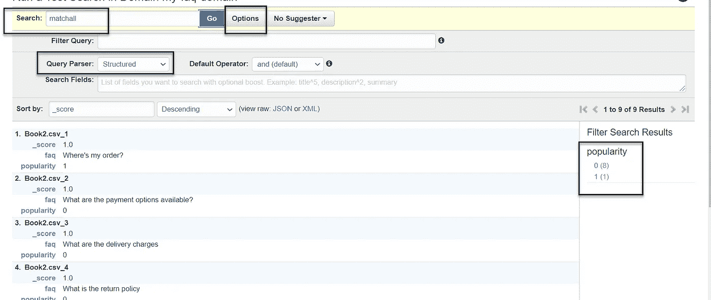
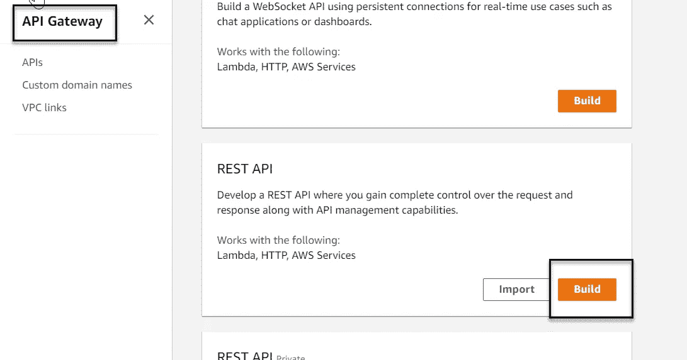
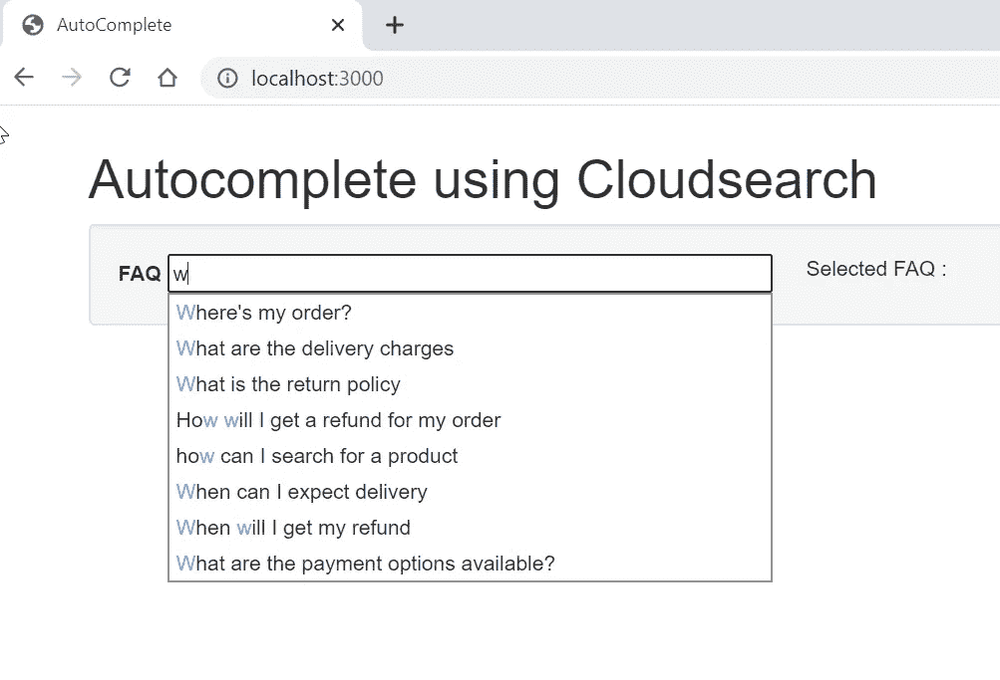
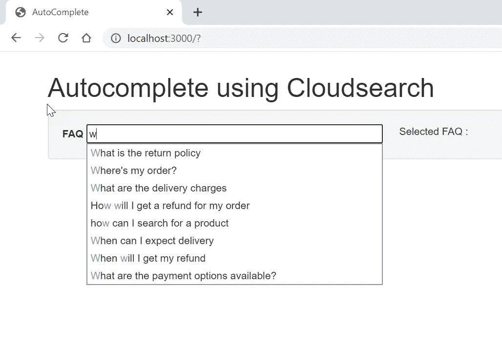

# 使用 Amazon CloudSearch 自动完成

> 原文：<https://blog.devgenius.io/autocomplete-with-amazon-cloudsearch-8503b606c90d?source=collection_archive---------6----------------------->

在 [Unsplash](https://unsplash.com?utm_source=medium&utm_medium=referral) 上由 [Austin Distel](https://unsplash.com/@austindistel?utm_source=medium&utm_medium=referral) 拍摄的照片

你好！首先，让我们稍微讨论一下什么是 CloudSearch，然后让我们继续讨论一个示例实现。

## 亚马逊云搜索

这是一项简单、可扩展、经济高效、高性能的托管服务，是 web 或移动应用中搜索解决方案的首选服务。

它的设置和管理相当简单。它与 Amazon Api 网关服务直接集成，这使得它很容易作为端点公开。

## 使用案例

我们想为 FAQ 建立一个自动完成的功能，根据受欢迎程度来显示它们。为此，我们使用了一个 csv，它有一个 FAQ 列表和一个预定义的流行度。根据用户的选择，我们将提高该问题的受欢迎程度，使其在列表中不断上升。

## 实施

让我们看看我们的 csv。我有 10 个问题和一个预定义的流行度。

## **让我们在云搜索上创建我们的域名**

我选择了最小的实例类型和最低的复制数量。根据您的需求增加或选择默认值，因为 CloudSearch 会根据数据量和流量自动增加或减少。

选择我们用来分析数据的同一个文件

索引字段是自动识别的(如下所示)。它们可以根据需要进行编辑。例如，您可以选择不“返回”搜索结果中的属性字段，或者选择不根据“常见问题”字段对结果进行“排序”，因为我们将根据“受欢迎程度”进行排序。

您可以将访问策略留空，因为我们稍后会添加它们。

确认所有的更改，域将被创建。

状态将保持“正在加载”一段时间。这通常也会随着未来的所有变化而发生。

创建完成后，继续上传您的文档

在上传文档时，您可以下载批处理生成的文件来查看正在上传的 json。

您会注意到，仪表板上可搜索文档的数量现在增加到了 9 个

**运行样本搜索:**

你会注意到很多事情。
1。每个文档(条目)都有一个定义的分数。分数根据查询(部分或完整)和条目的查询数量而变化。这是由 CloudSearch 内部定义的

2.您可以根据受欢迎程度进行筛选(在右侧)

3.默认排序基于该分数，并且是降序。

然而，这是一个简单的查询。我们也可以做一个**‘结构化**’查询。让我们现在试试。使用' matchall '返回所有文档

基于不同的查询解析器，这里有很多运行搜索查询的选项。

您的云搜索服务现已准备就绪。让我们继续创建其他组件

## 创建 Api 网关集成来公开您的搜索端点

如果你需要更多关于 Api Gateway 的信息，请查看这篇 文章。

在创建 api 之前，创建一个角色来提供对 Api 网关服务的访问，以访问 CloudSearch

**转到 IAM 仪表板**，使用下图创建一个新角色。

在示例中选择 API Gateway

在随后的“策略”和“标记”屏幕中，使用默认值创建一个角色。然后提供角色名称并创建角色

现在，您已经有了一个可以在 api gateway 中使用的角色，请将它添加到 CloudSearch 的“访问策略”部分，以便您的 api 可以访问“搜索”和“建议”选项。

这需要一些时间。等待策略部分从“正在处理”变为“活动”

**让我们从 api 网关创建开始**

创建名为/getfaqs 的资源并启用 CORS。我们需要它来从我们的 webapp 访问 api。

使用以下配置在资源内创建一个 get 方法

现在，在将 api 部署到一个阶段之前，我们将对其进行一些更改。
我们将更改“方法请求”和“集成请求”部分。

在方法请求部分，添加这些查询参数并更改“请求验证器”

在“集成请求”部分，添加以下参数和值

继续并部署 api

现在，使用下面的 curl 测试您的 api。你会看到你所有的结果。

***curl—location—request GET ' https://{ unique-id }。execute-api.us-east-1.amazonaws.com/dev/getfaqs?q = match all&q . parser = structured&size = 10 '***

## Lambda 来更新 FAQ 被选中时的流行度。

让我们用 Python 3.8 创建一个 lambda。转到“权限”选项卡，打开与 lambda 关联的角色

> *获取λ的代码* [**此处**](https://github.com/rohitsharma23/cloudsearch-lambda-function) **。**代码搜索特定的文档，然后将其流行度更新 1。

复制这个角色的 arn，**在 CloudSearch** 仪表板中添加权限，这样我们就可以在 CloudSearch 中搜索和更新文档。更新文档的参数是“cloudsearch:document”

现在让我们继续为您的 lambda 创建一个 api 网关端点。创建一个 POST 方法/updatepopularity 并将其连接到您的 lambda，如下所示。记得在你的 api 上启用 CORS。当您第一次创建它时或以后从“操作”中创建它。

继续部署 api。使用下面的卷曲来测试它。

**curl-location-request POST ' https://{ unique-id }。execute-api.us-east-1.amazonaws.com/dev/updatepopularity' \**

**—header ' Content-Type:application/JSON ' \**

**—data-raw“{ FAQ”:“我的订单在哪里？" }'**

如果你在 CloudSearch 仪表板上搜索 faq，你会看到受欢迎程度增加了一个。

# 前端组件

> 你可以在这里找到代码****。****

****这是一个简单的节点应用程序，使用 jquery 来迎合下拉菜单及其功能，如过滤，高亮显示等。一旦 FAQ 被选中，它的受欢迎程度会随着对 lambda 的 POST 调用而增加。****

****我们对搜索和更新调用使用不同的端点。****

****当我开始在我的下拉列表中输入时，它显示了一个按受欢迎程度降序排列的列表(请记住，由于我们之前的测试,“我的订单在哪里”目前的受欢迎程度为 2)。对于匹配值，它们按照上传的顺序排列。****

********

****现在，让我们继续选择“什么是退货政策”问题几次(准确地说是 3 次，将其放在顶部)****

********

****这是这样做的结果。这个问题是现在最热门的问题。****

********

******因此，你已经成功地根据受欢迎程度将你的答案排在了最前面。当你继续输入 I 并突出显示选项(蓝色)时，还有实时过滤功能。如果你的 js 不支持的话，你也可以点击搜索每一个完整的单词来进行实时过滤。你也可以通过这个来提供答案。******

****总之，我选择了 CloudSearch api，因为它速度很快，扩展性很强。这是一个非常可靠的搜索服务。****