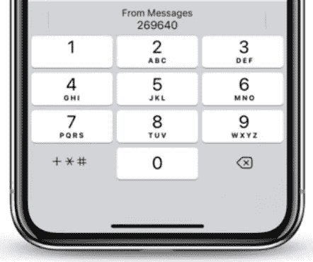

# 在 iOS 中自动填充 OTP 代码

> 原文：<https://blog.devgenius.io/autofill-otp-code-in-ios-9d10ad382240?source=collection_archive---------4----------------------->

HTML 元素有很多我们没有用到的属性，也许我们根本不知道所有的属性:)。表单输入中一个有用的属性是`auto-complete="*one-time-code”*` *。*

在大多数网站中，用户可以使用一次性密码登录。当你收到 OTP 码的时候，离开浏览器去消息里看 OTP 码实在是太无聊了。

现在，我要告诉你一个在 iOS 键盘中显示 OTP 代码的方法，如下图。



**如何实现这个功能？**

首先，您应该在您的输入上设置`*auto-complete=”one-time-code”*` ，如下所示:

```
<input type="tel" name="otp-code" auto-complete="one-time-code" />
```

现在，是时候更新你的短信了。你的短信里应该有`"code”`这个词。

例如:`Code: 123456 is your verification code`