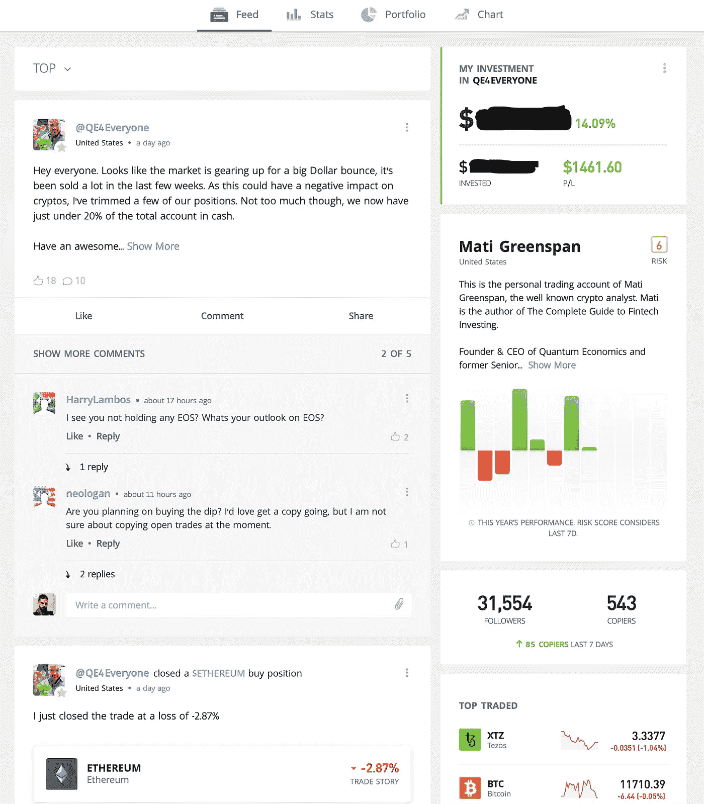
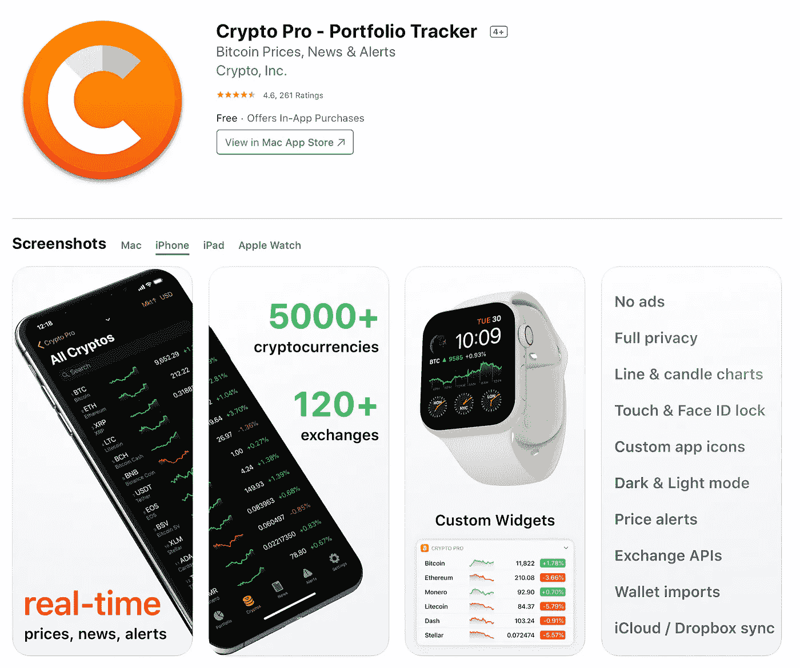
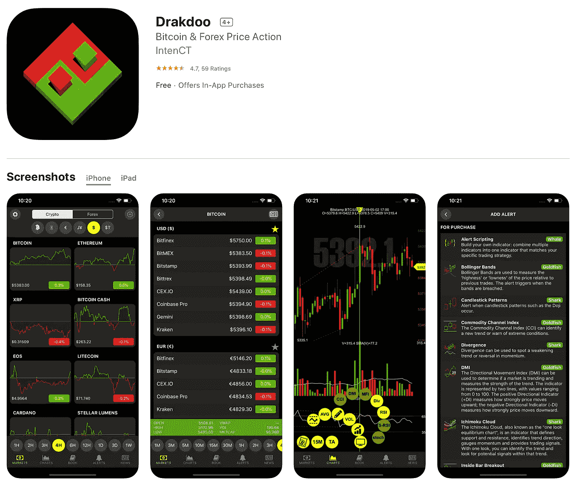
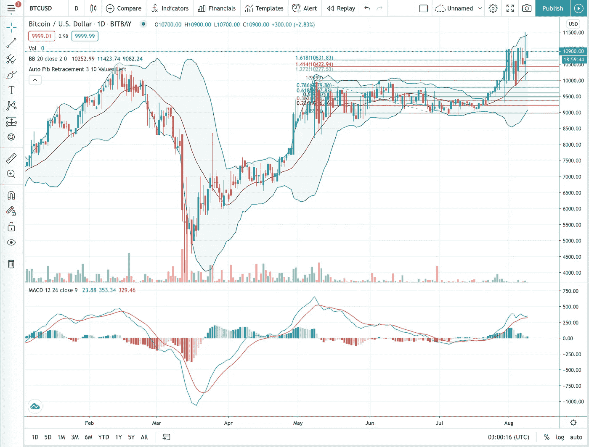

# 零代码自动加密和比特币交易

> 原文：<https://blog.devgenius.io/automate-crypto-and-bitcoin-trading-with-zero-code-577fb699b7b7?source=collection_archive---------6----------------------->

## **TL；博士**

本文的目的是提供一种通过 Web 或 iOS/Android 应用程序 [**eToro**](https://etoro.tw/31tDQMm) 实现加密货币交易自动化的方法。eToro，直接取自网站的“关于我”页面:

> *“通过提供对创新投资工具的便捷访问，为 140 多个国家/地区的数百万用户提供支持，同时提供一个引人入胜的合作交易社区的附加价值”*。

## 好吧，但是到底是什么？

简单来说，eToro 是一个加密货币交易平台，允许您的“复制交易者”自动将相同比例的资金交易到您的“复制交易者”刚刚购买/出售的硬币中。所以，如果你复制的交易者只是把他们资金的 10%投入#btc，你也一样。还有一个相当大的社区——有交易者统计页面，其中包括过去一年左右每个交易者的完整背景(图表和一切)。从而为您提供信息，让您在知情的情况下决定复制谁。

## 我该追随谁？

这篇文章不是为了说服你复制我复制的交易者，但是如果你想知道我选择了谁，我复制交易者:[**qe4 每个人，马体格林斯潘**](https://www.etoro.com/people/qe4everyone) **。**马体是交易员、投资者、分析师、顾问、教授、公司创始人和特许投资组合经理。马体在他的 [**推特**](https://twitter.com/MatiGreenspan?ref_src=twsrc%5Egoogle%7Ctwcamp%5Eserp%7Ctwgr%5Eauthor) 页面上发布**固执己见的**话题，吸引了 30000 多名粉丝。如下图所示，他今年为我做得相当不错。几个月前我开始跟踪马体。

在 eToro 上复制交易商(马体)仪表板

## 使用 eToro 的步骤:

1.  使用此链接注册并创建一个帐户，您将获得 50 美元！[https://etoro.tw/2DRum5h](https://etoro.tw/2DRum5h)
2.  连接您的银行-无需在钱包之间转账-直接在应用程序中与银行进行转账。
3.  转入你能轻松交易的金额——我相信你至少需要 1000 美元来模仿一个交易者。
4.  真的是这样。你可以随时查看你的仪表盘，回复你的交易员发布的评论，继续查看其他硬币，并向你的小组提出建议，但在这一点上你可以放手了。

# 为什么我转向自动交易

虽然我不在金融技术或华尔街类型的行业工作，但我是一名数据工程师(当适合我时，我也是数据科学家)，当谈到构建程序来“做”某事时，我并不陌生。然而，当谈到加密时，我会第一个承认加密策略的数量很多，并且为了成功，每天都要注意加密交易。

知道了对日常关注的高需求和存在的大量交易策略(通常称为指标)，我做了任何全职工作狂都会做的事情，寻找一个更简单的解决方案。在这一过程中，我尝试了几种方法:

1.  建立了一个机器人来购买和出售时，某些价格/指标得到满足
2.  订阅了几个基于提醒的应用程序，以便在交易时获得手动通知
3.  最终决定对 [**eToro**](https://etoro.tw/31tDQMm) 采取完全自动化且不干涉的方法

## 让我解释一下为什么 1 和 2 会导致 3

不要误解我的意思，第一和第二种选择可能会成功。我读到过许多人走了这些路，并且为他们成功了。

**我在选择 1 时面临的问题是:**

*   我真的相信这段代码可以管理超过 100 美元的资金吗？我应该使用哪些策略/指标(在下面的第二个问题中列出了这些问题的更多信息)？如果市场崩溃了，我应该放什么代码进去，以确保我不会失去一切？

**我在选择#2 时面临的问题是:**

*   决定在买卖中使用哪些策略/指标；我经常问这样的问题:“当 4 小时布林线[向下交叉时，我应该买入吗？我应该等到均线](https://www.bollingerbands.com)[和均线](https://www.investopedia.com/terms/e/ema.asp)交叉时再买吗？我应该使用哪个均线周期？我应该换成 6 小时制吗？我应该只在多个指标被触发时交易吗？”还有更多。如此优柔寡断会导致恐慌买卖，老实说，这对任何交易者来说都是一个可怕的特征。

我发现了几个很棒的应用程序，我仍然每月订阅，但它们占用我的时间少得多，这在不经意间，让我在这一点上更加理智。我发现了一些非常酷的应用程序:

[**Crypto Pro:**](https://cryptopro.app)

我相信我一年大概付了 50 美元？别引用我的话。但是您可以在交易所级别设置警报触发器，您可以设置价格触发器，以便在达到特定价格时向您发出警报。我相信，你可以从其他交易所添加你自己的加密金额，crypto pro 会跟踪你的余额。你可以查看任何硬币的几种不同类型的指标，这在移动应用程序上非常棒——图表真的可以定制。还有更多选择——这是一个很棒的应用程序。向建造它的人致敬。

iOS 上的 Crypto Pro 应用

[**Drakdoo**](https://www.drakdoo.com) :

这个应用程序也绝对令人惊讶——它提供每个指标的警报。因此，如果你想知道 BTC 布林线是什么时候在 bittrex 上被挤压的，你可以。假设你想知道任何硬币的均线何时从你选择的交易所穿过，你也可以这么做。我相信你需要的是“鲸鱼账户”级别，我觉得是~ 20 美元一个月。不管怎样，这都是一款非常棒的应用。对建造这座建筑的人们充满了爱。我几乎要自己建立一个非常基本的指示器触发程序，直到我意识到有人已经建立了它，它太棒了。

Drakdoo iOS 应用程序

## 我一直使用的其他很酷的加密工具

*   [**比特币基地**](https://www.coinbase.com/join/bade_1v) : **点击这个链接，你会得到 10 美元。对于 coinbase，我百感交集。iOS 小工具很棒，它很容易安排每月购买，它很友好，很容易发送到不同的钱包。没有指标，只有几个硬币可供选择，当大抛售发生时，你就没有运气了，因为应用程序会崩溃，因为它有一次又一次。但这对开始有好处。非常好用。**
*   **比特币基地 Pro:** 越野车。甚至不会告诉你用那个。但它是 coinbase 的扩展版——有更多的硬币。但在大鲸活动期间还是会坠毁。去别的地方。
*   [**Bittrex**](https://bittrex.com/Account/Register?referralCode=15U-JC2-CP5) :点击此链接并使用推荐代码: **15U-JC2-CP5** 你将获得你所有交易的 10%！我只是喜欢 bittrex。这是我在 2016 年左右使用的第一个加密交易平台，它让我感觉很好。它不是最大的平台，但它运行良好。有一个很好的 iOS 应用程序，它是一个整体非常安全的平台。
*   [**CoinMarketCap**](https://coinmarketcap.com)**:**这是一个非常棒的应用程序，可以显示几乎所有硬币的价格变动和历史价格。所有硬币的高级分析视图。
*   [**交易视图**](https://www.tradingview.com) :一个真正可视化你的指标的好方法。你可以使用免费版本，并查看多达 3 个我认为，指标。帮助你决定何时买入/卖出的好方法。这是我制作的一个图表示例:

交易视图 btc 仪表板

# 结论

有许多伟大的战略，甚至更多的工具来运用这些战略。 [**eToro**](https://etoro.tw/2DRum5h) 是我使用的交易工具和策略，是一个加密货币交易平台，可以让你复制交易者的交易，从而使你的交易自动化。eToro 将你从日内交易或任何你选择遵循的交易策略中解放出来，所以你可以用你的时间做更多的事情。“更聪明地工作，而不是更努力地工作”这句话从未如此适用。复制正确的交易者，让你的钱让你赚钱。

干杯！

