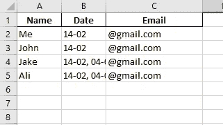

# 自动通过电子邮件发送作者列表中的随机引用

> 原文：<https://blog.devgenius.io/automate-emailing-a-random-quote-from-a-list-of-authors-7cf4a31c1f3b?source=collection_archive---------13----------------------->

## 从你最喜欢的作家那里随机引用一段话开始你的一天


图片由 [@freestocks](https://unsplash.com/@freestocks) 提供

我们很多人都是以一杯咖啡开始新的一天，所以为什么不加点味道呢——这是我们最喜欢的作家的一句随机引用。在这篇文章中，我将解释如何使用 Python 每天给你自己和你的朋友发送一封随机报价的电子邮件。

以下是步骤:

1.  导入包
2.  定义最喜欢的作者列表
3.  在函数中从列表中生成随机引用
4.  发送电子邮件
5.  如何自动化这项任务

1.  **导入包:**

```
import pandas as pd
import datetime
import smtplib
from email.message import EmailMessage
import random
from quote import quote
```

**2。定义最喜欢的作者列表**

```
mylist = ["leo tolstoy", "simon sinek", "Paulo Coelho", "Stephen Covey", "Tony Robbins", "Mark Twain", "Fyodor Dostoevsky", "Lao Tzu", "Sun Tzu"]
```

你可以在这里摆弄列表。你可以删除和添加你喜欢的作者。

**3。在函数**中从列表中生成随机报价

```
def quote_generate():

    search = random.choice(mylist)
    result = quote(search, limit=1)df = pd.DataFrame(result)

    return dfquote_result = quote_generate()
```

在这一步中，我们创建了函数并将信息保存在一个变量中。

**4。发送邮件**

```
def sendEmail(to, sub, msg):
    print(f"email to {to} \nsend with subject: {sub}\n message: {msg}")
    email = EmailMessage()
    email['from'] = 'Reda Aldahan'
    email['to'] = f"{to}"
    email['subject'] = f'{sub}'email.set_content(f'{msg}')with smtplib.SMTP(host='smtp.gmail.com', port=587) as smtp:
        smtp.ehlo()
        smtp.starttls()
        smtp.login('[your_Email@gmail.com](mailto:your_Email@gmail.com)','your password')
        smtp.send_message(email)
        print("Email send")
    pass
if __name__ == "__main__":
    df = pd.read_excel("data.xlsx")
    print(df)
    today = datetime.datetime.now().strftime("%d-%m")
    #print(type(today))
    update = []
    td =  datetime.datetime.now().strftime("%d-%m")
    #print(yearnow)
    for index, item in df.iterrows():
        #print(index,item['birthday'])
        #print(type(bday))
        if td not in str(item["Date"]): 
            sendEmail(item['Email'] , "Happy QUOTE "+item["Name"], "Your Quote Today: '" + quote_result.iloc[0][2] + "' By " + quote_result.iloc[0][0])
            update.append(index)
    for i in update:
        dt = df.loc[i, 'Date']
        #print(yr)
        df.loc[i,'Date'] = f"{td}, {dt}"
        #print((df.loc[i, 'Year'])
    #print(df)
    df.to_excel("data.xlsx", index=False)
```

在这一步中，我们转到一个名为“data”的 excel 文件，并为电子邮件带来一些信息，它们是:

a.收件人的姓名

b.日期；如果此人今天已经收到报价，并希望添加更多的人并运行代码，此人将不会收到报价

c.收件人电子邮件



这就是它应该看起来的样子

如果收件人当天没有收到报价，将会发送电子邮件。excel 表中的日期列将更新为今天的日期，因此您可以添加更多的人并立即重新运行代码，那些没有收到报价的人将会收到报价。

**5。如何自动完成这项任务**

只需点击一个按钮就可以轻松运行这些代码，但是如果机器可以为您完成这些工作，又何苦呢。

a.您可以使用任务计划程序。这里有一篇文森特·塔坦的文章解释如何做到这一点。点击[此处](https://towardsdatascience.com/automate-your-python-scripts-with-task-scheduler-661d0a40b279)查看文章。

b.使用 Python 库:调度。点击[此处](https://pypi.org/project/schedule/)阅读更多信息。

结尾:

完整的代码和 excel 表格可以在这里找到[。](https://github.com/RedaAldahan/Python-Fun/blob/04660cf21e96b66d9d359cb4b00f7b36d9c655e3/Quote_Authors/Quote_From_Authors.py)

享受你的报价+你的咖啡！