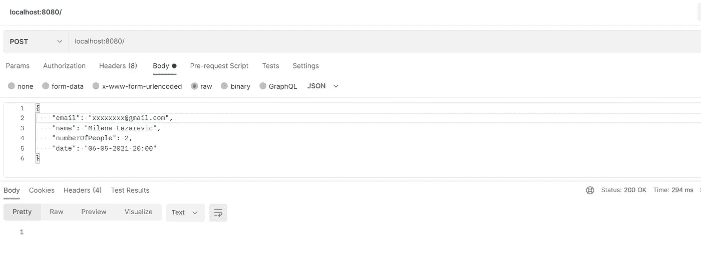
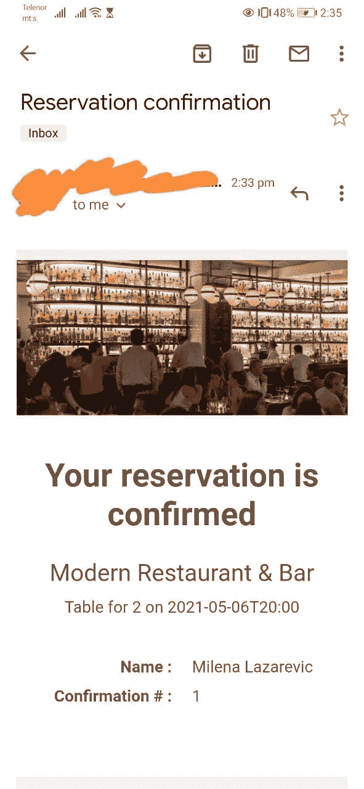

# 使用 Spring 应用程序事件和 Apache FreeMarker 自动化电子邮件

> 原文：<https://blog.devgenius.io/automate-emails-using-spring-application-events-apache-freemarker-eeccf0c56b75?source=collection_archive---------2----------------------->

## 使用 FreeMarker 模板引擎发送包含动态 HTML 内容的电子邮件


照片由[HalGatewood.com](https://unsplash.com/@halacious?utm_source=medium&utm_medium=referral)在 [Unsplash](https://unsplash.com?utm_source=medium&utm_medium=referral) 上拍摄

# 介绍

在编程中，事件是由软件处理的动作。事件可以通过不同的方式触发，例如，用户点击按钮或系统本身都可以触发事件。要点是，应用程序需要监听这样的活动或特定事件，然后对其做出反应并以某种方式处理它。

在 Spring 框架中，其中一个中心接口是`ApplicationContext`，它能够向注册的侦听器发布事件。Spring Framework 还提供了发送电子邮件的抽象，负责底层资源处理，Spring Boot 有一个启动模块和自动配置。

在本文中，我们将建立一个示例，它将利用 Spring 发布和监听事件的能力，在每次顾客在餐馆预订时，使用 [Apache FreeMarker 模板引擎](https://freemarker.apache.org/)发送包含动态 HTML 内容的电子邮件。

# 属国

Spring Boot 为 Java Mail Sender 和 FreeMarker 提供了 starter 模块，我们的第一步是将它们添加到我们的`gradle.build`或`pom.xml`文件中，或者使用 Spring Initializer 快速生成一个项目。

```
implementation 'org.springframework.boot:spring-boot-starter-freemarker'
implementation 'org.springframework.boot:spring-boot-starter-mail'
```

# 配置

由于我们正在使用`spring-boot-starter-mail`，Spring Boot 将自动配置`JavaMailSender` bean，并使它可供我们注入。我们可以使用`spring.mail`名称空间中可用的配置项对其进行进一步配置。

```
spring.mail.username= #email which will be used to send emails from 
spring.mail.password= #password
spring.mail.port=587
spring.mail.host=smtp.gmail.com
spring.mail.properties.mail.smtp.auth=true
spring.mail.properties.mail.smtp.starttls.enable=true
```

在这个示例项目中，我将使用 Gmail 作为 SMTP(简单邮件传输协议)服务器，所以我用我的用户名/密码和 Gmail 的服务器详细信息对它进行了配置。如果你愿意，你可以使用 [Outlook](https://support.microsoft.com/en-us/office/pop-imap-and-smtp-settings-for-outlook-com-d088b986-291d-42b8-9564-9c414e2aa040) 。

*请注意，如果您在 Google 帐户上启用了 2FA，将会出现验证错误。在这种情况下，您需要生成一个* [*应用程序密码*](https://support.google.com/accounts/answer/185833?hl=en) *，并使用它代替您在* `*application.properties*` *文件中的常规密码，以便您的应用程序能够访问您的 Gmail 帐户。*

# 春季活动

我们项目的目标是向进行预订的客户发送一封包含预订详细信息的确认电子邮件。因此，每次创建预订时，应用程序都需要监听，然后通过发送电子邮件来响应事件。

让我们创建一个简单的`ReservationCreated` 事件。然后传递给`super()`的`Object source`是事件发生的实际对象，基本上是事件的来源。

注意，你不需要扩展`ApplicationEvent`，**你也可以像发布事件一样发布对象，**除了，当我们发布的对象不是一个`ApplicationEvent`时，它会被 Spring 自动包装在一个`PayloadApplicationEvent` 中。

现在我们需要一个监听事件发生的监听器:

稍后，我们将在`onReservationCreated`事件监听器中实现一些逻辑来处理实际的事件。

# JavaMailSender 和 Apache FreeMarker

Spring Boot 将为我们提供封装 FreeMarker 配置设置的`JavaMailSender` bean 和 Apache FreeMarker `Configuration` bean，并用作模板加载服务。

让我们创建`EmailService`，在这里我们将加载模板，准备并发送电子邮件。FreeMarker 有一个`processTemplateIntoString`方法，它将使用给定的模型处理指定的模板。然后我们可以使用`setText(String text, boolean html)`来设置加工好的模板。

我用 [beefree.io](https://beefree.io/templates/free/) 下载 HTML 邮件模板，放在项目结构的`*templates*`文件夹中，命名为`reservation-confirmation.ftl`，模板中使用的图片在`static/images`文件夹中。在模板内部，我们可以在相应的地方使用`**${**reservation.numberOfPeople**}**` 或者`**${**reservation.name**}**` 来引用模型。

# 把所有的放在一起

有了`EmailService`，现在让我们实现`onRegistrationCreated`监听器来使用`EmailService`并发送电子邮件。

我们检索`*reservation*` *，*发生事件的源对象，创建将在 FreeMarker 模板中引用的模型，打包并发送电子邮件。

*注意，我们的事件监听器方法也有* `*@Async*` *注释，因为我希望事件处理在另一个线程中发生。记住，为了使用* `*@Async*` *，我们必须将* `*@EnableAsync*` *放到* `*@SpringBootApplication*` *类上。*

剩下唯一要做的就是发布事件。为此，我们在将`Reservation`源对象保存到数据库时，注入`ApplicationEventPublisher`并发布`ReservationCreatedEvent`。

我们来测试一下。



提出预订请求



收到的邮件截图

如果你得到了`SunCertPathBuilderException: unable to find valid certification path to requested target`，请确保在测试你的应用程序时禁用你的杀毒软件。不要在请求中使用随机电子邮件，因为它实际上会从您在`application.properties`文件中使用的电子邮件地址作为`*fromEmail*` 地址发送电子邮件。

# 额外小费

Spring 提供的另一个优点是，通过使用`@TransactionalEventListener(phase= TransactionPhase.*AFTER_COMMIT*)`而不是`@EventListener`注释，可以将监听器绑定到事务。因为在我们的示例中，事件是通过将预订数据保存到数据库来触发的，如果该事务由于某种原因回滚或不成功，我们不希望发布该事件。在我以前的文章中阅读更多关于 Spring 的事务。

[](https://medium.com/codex/spring-transactional-and-exceptions-46ef031c75fb) [## Spring @事务性和异常

### 我了解到回滚只有在抛出的异常是未检查的异常时才会发生。了解如何配置它…

medium.com](https://medium.com/codex/spring-transactional-and-exceptions-46ef031c75fb) 

在这种情况下，我们可以将事件监听器绑定到特定的`TransactionPhase`，并且只在成功提交时发布事件。下面是可以传递给`@TransactionalEventListener`的额外枚举常量

*   `**AFTER_COMMIT**`**——提交成功后触发事件**
*   **`**AFTER_COMPLETION**` -交易完成后触发事件**
*   **`**AFTER_ROLLBACK**` -如果事务已经回滚，则触发事件**
*   **`**BEFORE_COMMIT**` -事务提交前触发事件**

***这个示例项目的源代码可以在*[*GitHub*](https://github.com/Milena92/events-freemarker-demo)*上找到。***

**订阅[时事通讯](https://mailchi.mp/001b22443b39/newsletter)，直接在你的收件箱里接收未来的文章。**

# **接下来阅读:**

**[](https://medium.com/javarevisited/make-your-life-easier-with-mapstruct-lombok-14225f207191) [## 使用 MapStruct & Lombok 让您的生活更轻松

### 加快开发速度，摆脱样板代码

medium.com](https://medium.com/javarevisited/make-your-life-easier-with-mapstruct-lombok-14225f207191) [](https://medium.com/javarevisited/spring-boot-mongodb-searching-and-pagination-1a6c1802024a) [## Spring Boot 和 MongoDB:搜索和分页

### 使用 MongoTemplate 在 Spring Boot 应用程序中实现搜索和分页

medium.com](https://medium.com/javarevisited/spring-boot-mongodb-searching-and-pagination-1a6c1802024a)**