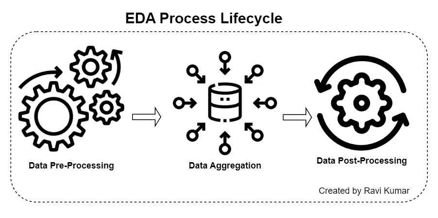
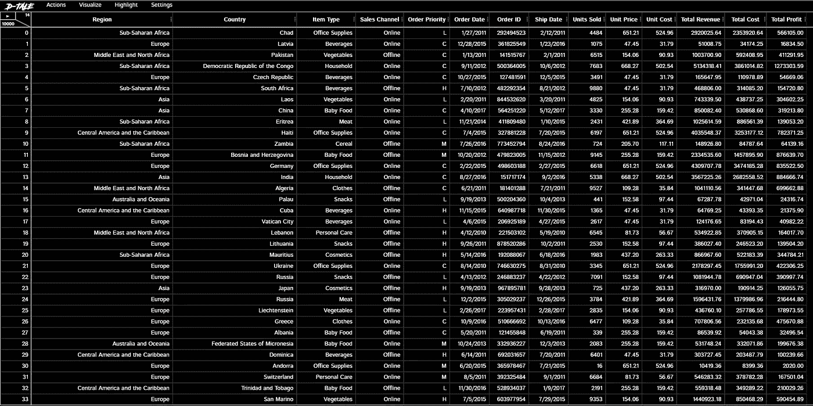
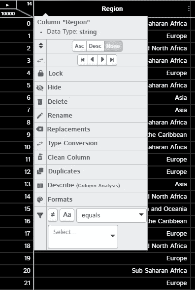
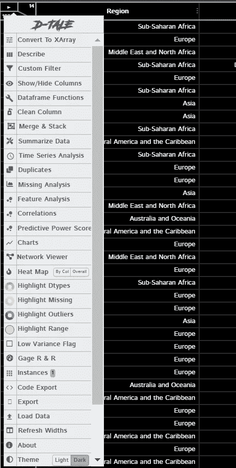
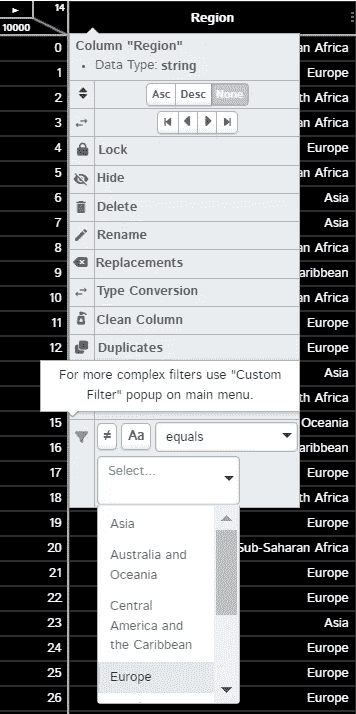
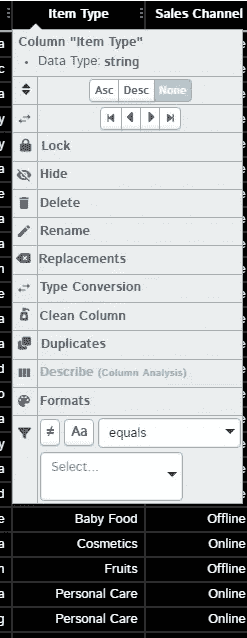
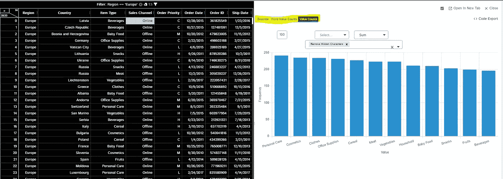
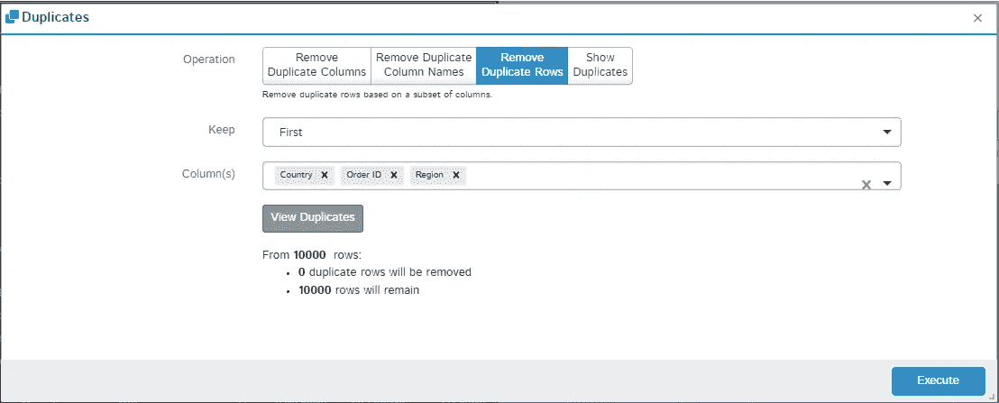
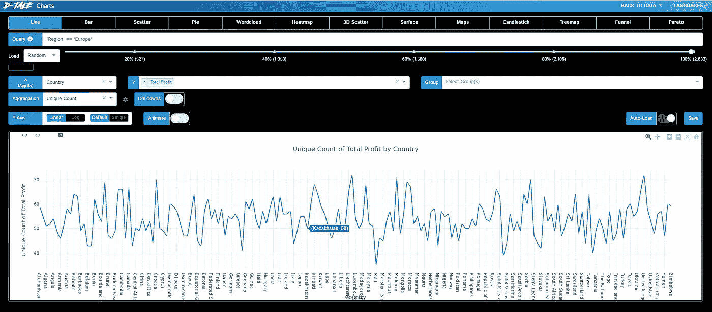

# 自动化整个 EDA📊按 D-Tale

> 原文：<https://blog.devgenius.io/automate-entire-eda-by-d-tale-f81d054d926d?source=collection_archive---------6----------------------->

在本帖中，我们将关注如何通过简单的点击实现 EDA(探索性数据分析)过程的自动化。

**目录:**

*   ***什么是 EDA？***
*   ***EDA 自动化解决方案:“D-tale”***
*   ***调校***
*   ***如何使用 D-tale？***
*   ***结论***

## ***什么是 EDA 和 EDA 生命周期？***

简而言之，EDA 是数据分析生命周期中最重要和最基本的部分，它可以帮助您了解更多关于数据的信息，数据是如何分布的，以及离群值是如何影响数据点的。

**EDA 生命周期:**



由拉维·库马尔创作

1.  **数据预处理:**

*   在这一步中，主要关注的是通过删除一些列、删除异常值、重命名列以及删除多个列中多余的字符串(如果需要)来清理数据
*   使用的一些著名的熊猫函数有[**data frame . rename**](https://pandas.pydata.org/docs/reference/api/pandas.DataFrame.rename.html)()[**data frame . drop()**](https://pandas.pydata.org/docs/reference/api/pandas.DataFrame.drop.html)等。，要了解更多关于不同功能的信息，请参考此 [URL](https://realpython.com/python-data-cleaning-numpy-pandas/) 或此[文档](https://devdocs.io/pandas~0.25-dataframe/)

2.**数据汇总:**

*   在这里，数据按照最终需求在某个级别进行分组

*示例*:

```
DataFrame.groupby(['A']).agg({'B' : 'count'})
```

3.**数据后处理:**

*   这一部分主要是在你需要训练一个机器或深度学习模型时完成的，你创建两个变量 X，y，然后进行训练和测试分割

*示例*:

```
X = df['a', 'c']
y =df['b']

#train and test split
X_train, X_test, y_train, y_test = train_test_split(X, y, test_size=1/4,random_state=0)
```

## ***EDA 自动化解决方案:***[***D-tale***](https://pypi.org/project/dtale/)

*如果你在[文档](https://pypi.org/project/dtale/)中读到 D-tale，你会知道 D-Tale 结合了 Flask 后端和 React 前端，给你带来了一种简单的方式来查看&分析 Pandas 数据结构。它与 ipython 笔记本& python/ipython 终端无缝集成。目前，该工具支持 Pandas 对象，如 DataFrame、Series、MultiIndex、DatetimeIndex & RangeIndex。*

*让我们不要浪费更多的时间，从 D-tale 的实现开始。*

## *设置*

*安装 d-tale 包(当我写这篇文章时，D-tale 的最新版本是 D-tale 2.9.0):*

```
*pip install dtale*
```

*完成安装后，使用下面的代码创建一个实例，并在浏览器的一个新标签中启动，URL 为“[http://{ YOUR _ PC _ NAME }:40000/dtale/main/1](http://lapsz5963:40000/dtale/main/1)”。*

```
*import dtale
import pandas as pd

data = pd.read_csv("x.csv")
d = dtale.show(data)
d.open_browser()*
```

***注意**:如果 open_browser()没有在你的系统中打开一个新标签页，你可以使用下面的命令来检查你正在运行的实例的 URL。*

```
*print(d._main_url)*
```

## *如何使用 D-tale？*

*   *一旦使用上面的命令(d.open_browser())加载数据集，它将弹出一个新的选项卡，其中包含加载的数据集。*

**

*加载的数据集*

*   *您可以选择任何列，然后单击顶部面板上的选项，如隐藏、删除、重命名、转换数据类型、格式化，以及基于任何值过滤列(具有 Excel 外观的交互式 python)*

**

*   *如果您选择 14 & 100000 中间最左上方的箭头，您将会发现很多我们在 python 中经常使用的选项，用于了解有关数据的更多信息，如描述列、检查重复项、删除一些列、找出缺失值、绘制多个图、查找相关性以及在不同级别聚合数据*

**

*   *让我们举一个例子，检查上述功能*

1.  ***过滤所有只针对欧洲的数据帧***

**

*仅过滤“欧洲”*

*2.**描述“项目类型”列**(您可以在描述、单词值计数和值计数之间切换)*

****

*描述“项目类型”*

***注意** : *您将获得数字列的所有与四分位数相关的数据、平均值、众数等，而不是分类列。**

*3.**删除基于多列的重复行***

**

*删除行方向的重复项*

*4.**为国家和总销售额绘制一个简单的折线图***

**

*Plotly 图*

***注意** : *你有多种选择可以探索(把这个当成作业)**

## *结论*

*这篇文章指导你如何设置和开始使用 D-tale，现在就看你的好奇心了，找出这个工具的一些惊人的用例。*

*[**更多关于我:**](https://linktr.ee/ravikumar10593)*

*我是一名数据科学爱好者🌺，学习和探索数学、商业和技术如何帮助我们在数据科学领域做出更好的决策。*

***想看更多**:[*https://medium.com/@ravikumar10593/*](https://medium.com/@ravikumar10593/)*

***找到我的所有句柄**:[*https://linktr.ee/ravikumar10593*](https://linktr.ee/ravikumar10593)*

> *如果这篇文章对你有所帮助，别忘了关注、喜欢并分享给你的朋友👍快乐学习！！*